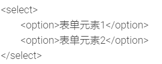

# HTML基础

### 一、基本标签

1. 分类：

   > - 单标签：仅由一个标签组成的标签（如：` `或` `）
   > - 双标签：由两个标签组成的标签（如：`<html>`HTML文档`</html>`）

2. HTML基本结构标签

   |      标签名       |    定义    |                           说明                           |
   | :---------------: | :--------: | :------------------------------------------------------: |
   |  `<html></html>`  |  HTML标签  |             页面中最大的标签，我们称为根标签             |
   |  `<head></head>`  | 文档的头部 |       注意在head标签中我们必须要设置的标签是title        |
   | `<title></title>` | 文档的标题 |               让页面拥有一个自己的网页标题               |
   |  `<body></body>`  | 文档的主体 | 元素包含文档的所有内容，页面内容基本上都是放到body里面的 |

3. HTML分段标签

   |          标签名           |                             语义                             |
   | :-----------------------: | :----------------------------------------------------------: |
   | `<h1></h1>` ~ `<h6></h6>` | 标题标签。一共有六级，并且重要性依次递减。 加了标题标签的文字，会单独作为一行并加粗 |
   |         `

`         |   段落标签。把html文档分成若干的段落，段落后会添加一个空行   |
   |       ` 或 `       |                换行标签。会将html文档强制换行                |

4. HTML文本格式化标签

   |  语义  |              标签              |                   说明                    |
   | :----: | :----------------------------: | :---------------------------------------: |
   |  加粗  | `<strong></strong>`或`<b></b>` |  更推荐使用<strong>标签加粗，语义更强烈   |
   |  倾斜  |     `<em></em>`或`<i></i>`     |  更推荐使用<em>标签添加倾斜，语义更强烈   |
   | 删除线 |    `<del></del>`或`<s></s>`    | 更推荐使用<del>标签添加删除线，语义更强烈 |
   | 下划线 |    `<ins></ins>`或`<u></u>`    | 更推荐使用<ins>标签添加下划线，语义更强烈 |

5. HTML布局标签

   | 语义 |      标签       |                             说明                             |
   | :--: | :-------------: | :----------------------------------------------------------: |
   |  无  |  `

`  | div标签没有语义，是用来布局的，一行只能放一个div标签，可以理解为一个大盒子 |
   |  无  | `` | span标签没有语义，是用来布局的，一行可以放多个span标签，可以理解为一个小盒子 |

6. HTML图像标签：``

   >  属性：
   >
   > |  属性  |  属性值  |                  说明                  |
   > | :----: | :------: | :------------------------------------: |
   > |  src   | 图片路径 |                必须属性                |
   > |  alt   |   文本   |   替换文本，图片不能显示时的提示文字   |
   > | title  |   文本   | 提示文本，鼠标停留在图像上时的提示文字 |
   > | width  |   像素   |              设置图像宽度              |
   > | height |   像素   |              设置图像高度              |
   > | border |   像素   |           设置图像边框的粗细           |
   >
   > Note：
   >
   > 1. 属性添加到img之后
   > 2. 属性之间没有先后顺序
   > 3. 属性采取键值对的格式，即key = "value"，属性 = “属性值”
   > 4. 修改宽度和高度时，只需修改其中一个即可，剩下一个会等比例修改

7. HTML超链接标签：``

   > 属性：
   >
   > |  属性  |                            属性值                            |                            说明                             |
   > | :----: | :----------------------------------------------------------: | :---------------------------------------------------------: |
   > |  href  | 指定链接目标的url地址 外部链接的语法要求：必须以http://开头 内部链接：文件夹中的html文件名 空链接：#  下载链接：待下载的文件名  锚点链接：点击链接快速定位到页面的某个位置 阻止链接跳转：javascript:; |                       用于创建超链接                        |
   > | target | _self：在当前页面打开链接  _blank：创建一个新页面打开链接 | 用于指定链接页面的打开方式， 若不指定则以_self作为默认值 |
   >
   > 格式：`<a href = "待链接的url地址"> 网页元素 </a>`
   >
   > 锚点链接的使用
   >
   > 1. 给待链接的网页元素添加一个链接：`<a href="#标记"> 网页元素 </a>`
   > 2. 给待跳转至的网页元素的标签中添加一个属性：`id=“标记”`

8. HTML5的语义化标签 —— 代替原有滥用的div标签

   |    标签     |                       语义                        |
   | :---------: | :-----------------------------------------------: |
   | `<header>`  |                     头部标签                      |
   |   `<nav>`   |                     导航标签                      |
   | `<article>` |                     内容标签                      |
   | `<section>` | 定义文档的某个区域（相当于以前div装内容的小盒子） |
   |  `<aside>`  |                    侧边栏标签                     |
   | `<footer>`  |                     尾部标签                      |

   

9. HTML5新增多媒体标签

   > * 视频标签：`<video src="文件地址" controls="controls"></video>`
   >
   >   
   >
   > * 音频标签：`<audio src="文件地址" controls="controls"></audio>`
   >
   >   

### 二、特殊字符

| 特殊字符 |   描述   | 字符的代码 |
| :------: | :------: | :--------: |
|          |  空格符  |  `&nbsp;`  |
|    <     |  小于号  |   `&it;`   |
|    >     |  大于号  |   `$gt;`   |
|    &     |   和号   |  `&amp;`   |
|    ￥    |  人民币  |  `&yen;`   |
|    ©     |   版权   |  `&copy;`  |
|    ®     | 注册商标 |  `&reg;`   |
|   ­°C    |  摄氏度  |  `&deg;`   |
|    ±     |  正负号  | `&plusmn;` |
|    ×     |   乘号   | `&times;`  |
|    ÷     |   除号   | `&divede;` |
|    ²     |   平方   |  `&sup2;`  |
|    ³     |   立方   |  `&sup3;`  |

### 三、表格

1. 表格使用到的标签

   |      语义      |       标签        |                说明                 |
   | :------------: | :---------------: | :---------------------------------: |
   |    定义表格    | `<table></table>` |          最外层嵌套的标签           |
   |  定义表格头部  | `<thead></thead>` | 表格结构标签，必须嵌套在table标签中 |
   |  定义表格主体  | `<tbody></tbody>` | 表格结构标签，必须嵌套在table标签中 |
   |     定义行     |    `<tr></tr>`    |        必须嵌套在table标签中        |
   |   定义单元格   |    `<td></td>`    |         必须嵌套在tr标签中          |
   | 定义表头单元格 |    `<th></th>`    |     会让填入的数据居中加粗显示      |

2. 表格的属性：在table标签中使用（一般不会使用HTML来定义表格的格式，而是使用CSS来设定）

   |   属性名    |          属性值           |                    描述                     |
   | :---------: | :-----------------------: | :-----------------------------------------: |
   |    align    |    left、center、right    |       规定表格相对周围元素的对齐方式        |
   |   border    | 1（有边框）或""（无边框） |     规定表格单元是否拥有边框，默认为“”      |
   | cellpadding |          像素值           | 规定单元边沿与其内容之间的空白，默认为1像素 |
   | cellspacing |          像素值           |      规定单元格之间的空白，默认为2像素      |
   |    width    |      像素值或百分比       |               规定表格的宽度                |
   |   height    |          像素值           |               规定表格的高度                |

3. 示例：

   ~~~html
   <table align="center" border="1" cellspacing="0" cellpadding = "10">
       <thead>
           <tr>
               <th>集数</th>
               <th>单集标题</th>
           </tr>
       </thead>
       <tbody>
           <tr>
               <td>第1集</td>
               <td><a href="#Episode_01"> 网球社“丘比特”</a></td>
           </tr>
           <tr>
               <td>第2集</td>
               <td><a href="#Episode_02"> 电影社“禊”</a></td>
           </tr>
           <tr>    
               <td>第3集</td>
               <td><a href="#Episode_03"> 自行车同好会 向日葵</a></td>
           </tr>
       </tbody>
       </table>
   ~~~

   

4. 合并单元格

   > 1. 合并单元格的方式（属性）—— 作用与td标签上：
   >
   >    > 跨行合并：rowspan = “合并单元格的个数”
   >    > 跨列合并：colspan = “合并单元格的个数”
   >
   > 2. 目标单元格：
   >
   >    > 跨行合并：则目标单元格为待合并单元格中最上侧的单元格
   >    >
   >    > 跨列合并：则目标单元格为待合并单元格中最左侧的单元格
   >
   > 3. 合并的步骤：
   >
   >    > 1. 确定是跨行还是跨列
   >    > 2. 找到目标单元格，将合并单元格的属性添加到目标单元格的属性中
   >    > 3. 删除多余的单元格

### 四、列表

1. 作用：用来布局

2. 无序列表标签：

   |     语义     |    标签     |                         说明                         |
   | :----------: | :---------: | :--------------------------------------------------: |
   | 定义无序列表 | `<ul></ul>` | ur标签中只能嵌套li标签，其它所有的数据元素都不能使用 |
   |  定义列表项  | `<li></li>` |         相当于一个容器，里面可以嵌套任何内容         |

   > 去掉li前面的小圆点：给li添加属性—— list-style: none

3. 有序列表标签：

   |     语义     |    标签     |                         说明                         |
   | :----------: | :---------: | :--------------------------------------------------: |
   | 定义有序列表 | `<ol></ol>` | or标签中只能嵌套li标签，其它所有的数据元素都不能使用 |
   |  定义列表项  | `<li></li>` |         相当于一个容器，里面可以嵌套任何内容         |

4. 自定义列表标签：应用于一个大哥带着一群小弟的场景（dt和dd是兄弟关系）

   |       语义       |    标签     |                           说明                           |
   | :--------------: | :---------: | :------------------------------------------------------: |
   |  定义自定义列表  | `<dl></dl>` | dl标签中只能嵌套dt和dd标签，其它所有的数据元素都不能使用 |
   | 定义“大哥”列表项 | `<dt></dt>` |             每个自定义列表可以含有多个dt标签             |
   | 定义“小弟”列表项 | `<dd></dd>` |             每个自定义列表可以含有多个dd标签             |

### 五、表单

1. 作用：收集用户信息

2. 组成：

   > * 表单域：包含表单元素的区域
   >
   > * 表单控件（也称表单元素）：按钮、方框等让用户填入信息的“道具”
   >
   > * 提示信息：文字提示

3. 表单域：实现用户信息的收集和传递，即将用户输入提交给后台

   > 1. 标签：`<form></form>`
   >
   > 2. 属性：
   >
   >    |  属性  |  属性值  |                       作用                       |
   >    | :----: | :------: | :----------------------------------------------: |
   >    | action | url地址  | 用于指定接受并处理表单数据的服务器程序的url地址  |
   >    | method | get/post |  用于设置表单数据的提交方式，其取值为get或post   |
   >    |  name  |   名称   | 用于指定表单的名称，以区分同一页面中的多个表单域 |

4. 表单元素

   |     语义     |                             标签                             |                             说明                             |
   | :----------: | :----------------------------------------------------------: | :----------------------------------------------------------: |
   | 输入表单元素 |                  `<input type = "属性值"/>`                  |            通过设置不同的属性值设置不同的表单控键            |
   | 下拉表单元素 |  | `<select>`中至少包含一个`<option> ` 在`<option>`中添加属性`select = "selected"`， 可设置当前项为默认选项 |
   |  文本域元素  |                   `<textarea></textarea>`                    | 可以读入很多内容的文本框 属性： cols = “每行显示字符数” rows = “显示的行数” 注： 一般使用CSS来改变文本域大小 |

   > ==input表单==
   >
   > * type属性的属性值
   >
   >   |  属性值  |                             描述                             |
   >   | :------: | :----------------------------------------------------------: |
   >   |  button  |       定义可点击按钮（多数情况下，用于通过JS启动脚本）       |
   >   | checkbox |         定义复选框（所有选项必须要有相同的name属性）         |
   >   |   file   |             定义输入字段和“浏览”按钮，供文件上传             |
   >   |  hidden  |                      定义隐藏的输入字段                      |
   >   |  image   |                    定义图像形式的提示按钮                    |
   >   | password |             定义密码字段。该字段中的字符被掩码。             |
   >   |  radio   |        定义单选按钮（所有选项必须要有相同的name属性）        |
   >   |  reset   |         定义重置按钮。重置按钮会清除表单中的所有数据         |
   >   |  submit  |        定义提交按钮。提交按钮会把表单数据发送到服务器        |
   >   |   text   | 定义单行的输入字段，用户可在其中输入文本。默认宽度为20个字符 |
   >
   >   > HTML5新增type属性值：
   >   >
   >   > | 属性值 |            描述             |
   >   > | :----: | :-------------------------: |
   >   > | email  | 限制用户输入必须为Email类型 |
   >   > |  url   |  限制用户输入必须为URL类型  |
   >   > |  date  | 限制用户输入必须为日期类型  |
   >   > |  time  | 限制用户输入必须为时间类型  |
   >   > | month  |  限制用户输入必须为月类型   |
   >   > |  week  |  限制用户输入必须为周类型   |
   >   > | number | 限制用户输入必须为数字类型  |
   >   > |  tel   |          手机号码           |
   >   > | search |           搜索框            |
   >   > | color  |    生成一个颜色选择表单     |
   >
   > * 其它属性：
   >
   >   |   属性    |    属性值    |                             描述                             |
   >   | :-------: | :----------: | :----------------------------------------------------------: |
   >   |   name    | 由用户自定义 |                     定义input元素的名称                      |
   >   |   value   | 由用户自定义 |                      规定input元素的值                       |
   >   |  checked  |   checked    | 规定此input元素首次加载时应当被选中（主要使用在单选按钮和复选框） |
   >   | maxlength |    正整数    |                规定输入字段中的字符的最大长度                |
   >
   >   > name和value是每个表单元素都有的属性值，主要给后台人员使用
   >
   >   > HTML5新增的表单属性：
   >   >
   >   > |      属性       |    值     |                             说明                             |
   >   > | :-------------: | :-------: | :----------------------------------------------------------: |
   >   > |    required     | required  |               表单拥有该属性说明其内容不能为空               |
   >   > | **placeholder** | 提示文本  |              表单的提示信息，存在默认值将不显示              |
   >   > |    autofocus    | autofocus |         自动聚焦属性，页面加载完成将自动聚焦到此表单         |
   >   > |  autocomplete   |  off/on   | 键入时i，浏览器会给予之前键入过的值，显示出应该在字段中填写的选项 默认为打开状态 需要放在表单内，同时加上name属性，同时成功提交 |
   >   > |  **multiple**   | multiple  |                       可以多选文件提交                       |
   
5. `<label>`标签：通常在表单中使用

   > 1. 作用：`<label>`标签用于绑定一个表单元素，当点击<label>标签内的文本时，浏览器就会自动将焦点（光标）转到或者选择对应的表单元素上，用来增加用户体验
   >
   > 2. 语法：
   >
   >    ~~~html
   >    <!-- 在label标签中使用for属性设置一个标记值，再在对应的表单元素添加一个id属性，其值为for中设计的标记值 -->
   >    <label for="sex">男</label>
   >    <input type = "radio" name = "SEX" id = "sex"/>
   >    ~~~
   >
   >    > 关键：lable标签的for属性与相关元素的id属性相同
   >

### 六、Emment语法

* 快速生成HTML结构的Emment语法

  |          HTML结构           |                        Emment语法                         |   示例    |                           生成内容                           |
  | :-------------------------: | :-------------------------------------------------------: | :-------: | :----------------------------------------------------------: |
  |          生成标签           |                直接输入标签名，在按下tab键                |    div    |                        ` 

`                        |
  |      生成多个相同标签       |               在标签名后面加上*和待生成数目               |   div*3   |     `

` `  

 ` ` 

`      |
  |    生成带有父子级的标签     |                       父标签>子标签                       |   ul>li   |           `<ul>`     ` <li></li>`   `</ul> `           |
  |    生成带有兄弟级的标签     |                       标签+兄弟标签                       |   div+p   |                `  

 ` ` 

`                |
  |     生成带有类名的标签      | 在标签名后加上.类名  （若不写标签名则默认生成div标签） |  p.demo   |                   `  

`                   |
  |    生成带有id名字的标签     | 在标签名后加上#id名  （若不写标签名则默认生成div标签） |   #two    |                   `  

`                   |
  | 如果生成的div类名是有顺序的 |  可以使用自增符号`$`  作用为使带有$​的为止从1开始自增   | .demo$*3  | `  

 ` ` 

` `  

` |
  |     在标签内部书写内容      |            可以在标签名后面用{}将书写内容包含             | h1{title} |                      ` <h1>title</h1>`                       |

* 快速生成CSS样式的Emment语法

  > 用Emment生成CSS样式基本采取简写形式（一般取首字母）即可

  示例：

  1. 比如w200，再按下tab，可以生成`width: 200px`
  2. 比如lh26，再按下tab，可以生成`line-height: 26px`
  3. 比如tac，再按下tab，可以生成`text-align: center`
