# HTTP基础

### --目录

| 章节                           | 目录                                                         |
| ------------------------------ | ------------------------------------------------------------ |
| 【一】了解Web及网络基础        | --[TCP/IP](#TCP/IP)   --[DNS](#DNS)    --[URL和URI](#URL和URI) |
| 【二】简单的HTTP协议           | --[Cookie](#Cookie)   --[请求方式](#请求方式)                |
| 【三】HTTP报文中的HTTP信息     | --[HTTP报文格式](#HTTP报文格式)                              |
| 【四】HTTP状态码               | --[HTTP状态码](#HTTP状态码)                                  |
| 【五】与HTTP协作的Web服务器    | --[代理](#代理)   --[网关](#网关)   --[隧道](#隧道)          |
| 【六】HTTP首部                 | --[通用首部字段](#通用首部字段)   --[请求首部字段](#请求首部字段)   --[响应首部字段](#响应首部字段)   --[实体首部字段](#实体首部字段) |
| 【七】确保Web安全的HTTPS       | --[对称加密与非对称加密](#对称加密与非对称加密)   --[数字签名](#数字签名)   --[数字证书](#数字证书)   --[HTTPS加密机制](#HTTPS加密机制) |
| 【八】确定访问用户的认证       | --[认证方式](#认证方式)                                      |
| 【九】基于HTTP的功能的追加协议 | --[Ajax](#Ajax)  --[Comet](#Comet)  --[SPDY ](#SPDY)  --[WebSocket](#WebSocket)   --[WebDAV](#WebDAV) |
| 【十】构建Web内容的技术        | ~                                                            |
| 【十一】Web的攻击技术          |                                                              |

### 一、了解Web及网络基础

* 使用HTTP协议访问Web：

  > Web使用一种名为HTTP的协议作为规范，完成从客户端到服务器端等一系列运作流程，而协议是指规则的约定。可以说，Web是建立在HTTP协议上通信的。

* 网络基础TCP/IP

  1. HTTP属于TCP/IP协议族的一个子集

  2. TCP/IP可以粗略的理解为是指与互联网关联的协议集合起来的总称

  3. TCP/IP的分层管理

     > * 应用层：决定了向用户提供应用服务是通信的活动（HTTP协议属于该层）
     >
     > * 传输层：对上层应用层提供处于网络连接中两台计算机之间的数据传输
     >
     >   > 传输层的两个协议：TCP（传输控制协议）和UDP（用户数据报协议）
     >
     > * 网络层：用来处理在网络上流动的数据包
     >
     >   > 规定了通过怎样的路径（传输路线）到达对方计算机，并把数据包传送给对方。
     >   >
     >   > 简单来说就是在众多传输路线选项内选择一条传输路线
     >
     > * 链路层：用来处理连接网络的硬件部分

  4. TCP/IP通信传输流

     > 
     >
     > 利用TCP/IP协议族进行网络通信时，会通过分层的方式与对方通信。发送端从应用层往下走，每经过一层必定会打上一个该层专属的首部信息；接收端会从链路层往上走，每经过一层时会把对应的首部消去。

  5. 与HTTP关系密切的协议：IP、TCP和DNS的说明

     * 负责传输的IP协议

       > IP协议位于网络层，作用是把各种数据包传送给对方。
       >
       > 其中为了保证数据正确传送至对方需要满足各类条件，其中最重要的两个条件是——IP地址和MAC地址
       >
       > **IP地址**：指明了结点被分配的地址（可变换）
       >
       > **MAC地址**：网卡所属的固定地址（基本不变）
       >
       > 而IP协议可以使用ARP协议传输数据
       >
       > **ARP协议**：根据通信方的IP地址查出下一个路由器的MAC地址
       >
       > 也就是说大致的原理是这样的：通信的双方往往在通信时需要将数据进行多次中转。在进行中转时，会利用下一站的中转设备的MAC地址来搜索下一个中转目标
       >
       > 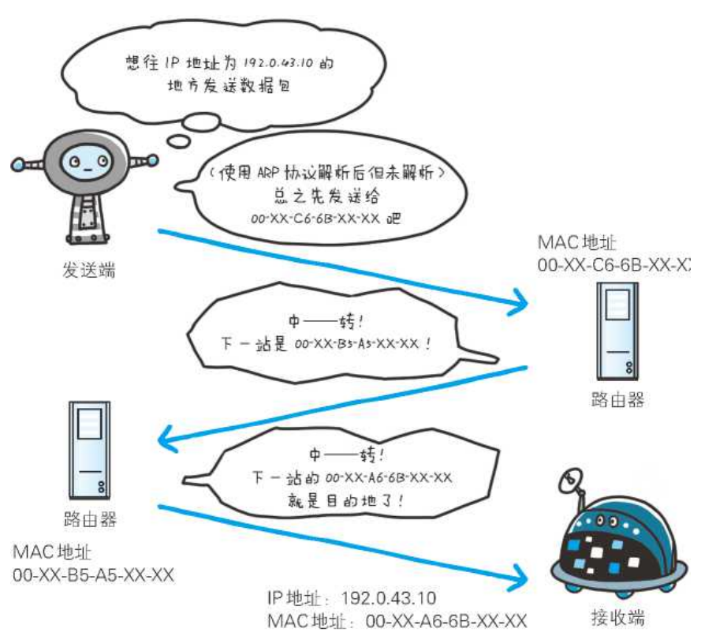

     * 确保可靠性的TCP协议

       > TCP协议位于传输层，提供可靠的字节流服务[^注4]，简单来说就是TCP协议为了更容易传送大数据把数据分割，而且TCP协议能够确认数据是否送达对方
       >
       > 为了确保数据能到达目标，TCP协议采用了三次握手的策略。在握手过程中，会使用到TCP的标志——SYN和ACK
       >
       > 
       >
       > 若在握手过程中某个阶段莫名中断，TCP协议会再次以相同的顺序发送相同的数据包
       
     * 负责域名解析的DNS服务
     
       > DNS服务和HTTP一样是位于应用层的协议，它提供域名到IP地址间的解析服务
       >
       > 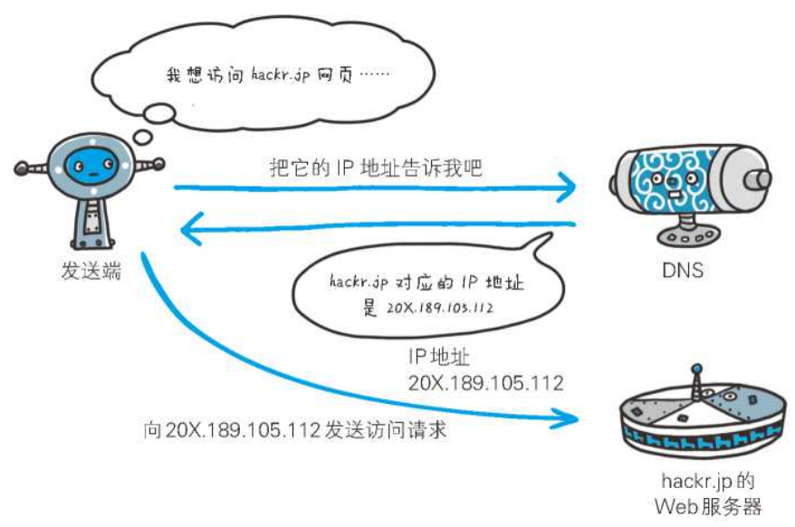
     
     * 以上介绍的各种协议与HTTP协议之间的关系
     
       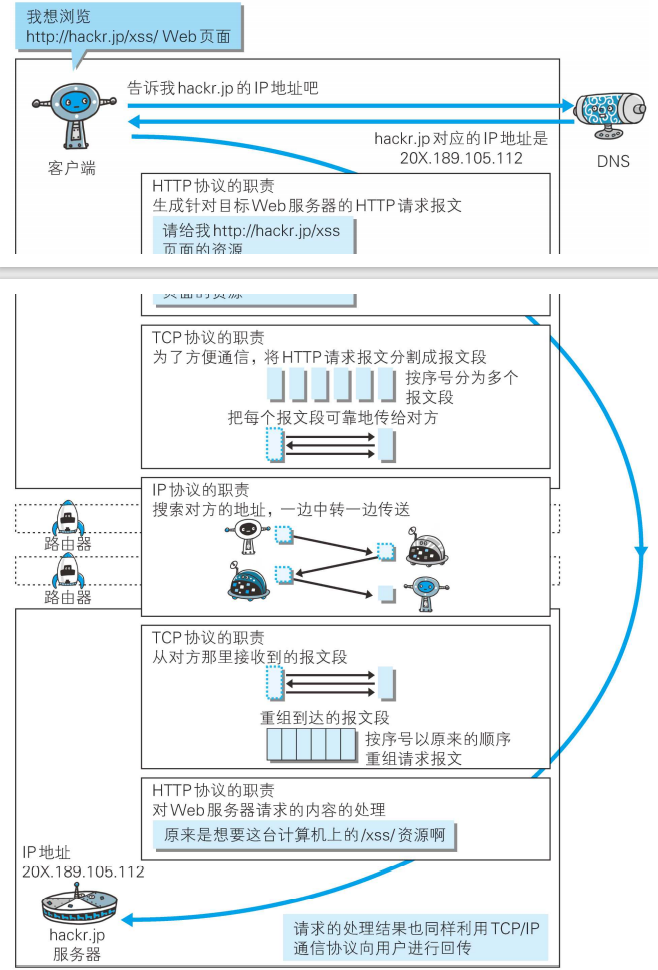
     
     * URL和URI
     
       > **URL（统一资源定位符）**：访问Web页面需要输入的网址）[^注2]
       >
       > **URI（统一资源定位符）**：由某个协议方案表示的资源的定位标识符
       >
       > 
       >
       > > 带层次的文件路径：指定服务器上的文件路径来定位特指的资源
       >>
       > > 查询字符串：针对已指定的文件路径内的资源，使用查询字符串传递任意参数进行查询
       > >
       > > 片段标识符：标记处以获取资源中的子资源

### 二、简单的HTTP协议

1. 作用：用于客户端与服务端之间的通信。

2. 通信的流程：请求和响应的交换

   > 客户端发送请求给服务端，服务端收到请求后回复响应

3. HTTP是一种无状态协议，其本身并不保留之前一切的请求或响应报文的信息

4. 持久连接节省通信量

   在HTTP协议的初始版本中，每进行一次HTTP通信就要断开一次TCP连接，且服务器只有得到了响应之后才能发送下一个请求

   而在HTTP/1.1中给出了持久连接的方法（所有默认的连接都是持久连接）

   > 1. 特点：只要任意一端没有明确提出断开连接（四次挥手），则保持TCP连接状态
   > 2. 方式：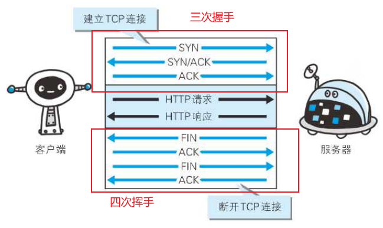
   > 3. 管线化：不用等待服务器响应之前的请求亦可发送下一个请求

5. 使用Cookie的状态管理

   HTTP是无状态协议，这导致了其无法更具之前的状态进行本次的请求处理。

   为了解决这个问题，于是引入的Cookie技术。

   > Cookie技术：通过在请求和响应报文中写入Cookie信息[^注9]来控制客户端的状态。
   >
   > 说明：
   >
   > 1. 服务器首次接收客户端信息时，会在响应报文的首部字段保存一个名为Set-Cookie的数据
   >
   > 2. 客户端收到响应后，会保存Cookie的值到本地。下次再次发起请求时，会自动在报文中加入Cookie的值
   >
   >    
   >
   > 3. 服务器收到客户端发送过来的Cookie后，回去对比服务器上的记录，从而得到之前的状态信息
   >
   >    

6. 请求方式

   > 1. 介绍：请求方式用来告知服务器浏览器请求的意图
   >
   > 2. 位置：位于请求报文请求行的第一个参数
   >
   > 3. 分类
   >
   >    > **GET**：获取资源。用来请求访问已被URI识别的资源
   >    >
   >    > **POST**：传输实体主体（请求体中的数据）。
   >    >
   >    > PUT：传输文件（请求体中的数据），保存至URI指定的位置
   >    >
   >    > HEAD：类似于GET，但只获取响应报文首部。用于确认URI的有效性及资源更新的日期时间等
   >    >
   >    > DELETE：删除URI中指定的资源
   >    >
   >    > OPTIONS：查询针对请求URI指定的资源支持的请求方式
   >    >
   >    > TARCE：追踪路径
   >    >
   >    > 
   >    >
   >    > CONNECT：要求用隧道协议连接代理，即在于服务器通信时，实现用隧道协议进行TCP通信

### 三、HTTP报文中的HTTP信息

1. HTTP报文是用于HTTP协议交互的信息，分为请求报文和响应报文两种。

   
   
   通常，不一定要有报文主体。
   
   > 请求报文：
   >
   > ---
   >
   > 响应报文：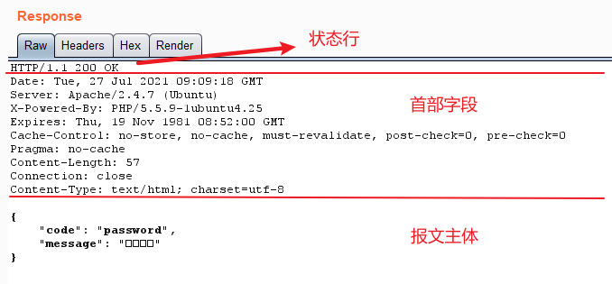
   
2. 编码提升传输速率

   1. 报文主体和实体主体的差异

      * 报文（message）

        是HTTP通信中的基本单位，由8位组字节流组成，通过HTTP通信传输

      * 实体（entity）

        作为请求或响应的有效载荷数据被传输，其内容由实体首部和实体主体组成

      > 通常，报文主体等于实体主体，只有当传输中进行编码操作时，实体主体的内容发生变化，才会导致其于报文主体产生差异

   2. 压缩传输的内容编码

      内容编码是指应用在实体内容上的编码格式。即将实体内容在传输过程中进行压缩，压缩的内容再由客户端进行解码

      > 常用的内容编码：
      >
      > * gzip（GNU zip）
      > * compress（UNIX系统的标准压缩）
      > * deflate（zlib）
      > * identity（不进行编码）

   3. 分割发送的分块传输编码

      在HTTP通信过程中，请求的编码实体资源全部传输完成之前，浏览器无法显示请求页面

      所以在传输大容量数据时，可以通过把数据分割为多块，能够让浏览器逐步显示页面

   4. 传输多种数据的多部分对象集合

      在上传文件时，文件的内容，不仅仅是一些字符串，还有可能是一些图片，字符，音乐二进制等混杂的内容，这就需要使用多部分对象集合才能完成传输
      
      > 通过设置`Content-type`来实现传输多部分对象集合，且在其每个部分类型中都可以含有首部字段
      >
      > * `multipart/form-data`：在Web表单上传时使用
      >
      >   
      >
      > * `multipart/byteranges`：在状态码206响应报文包含了多少个范围的内容时用
      >
      >   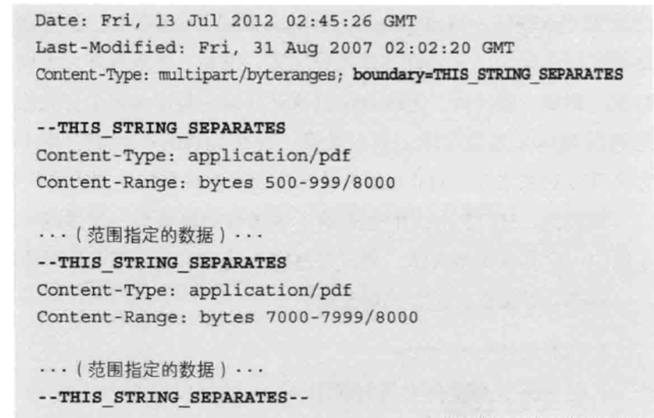
      >
      > > `burndary`字符串：划分多部份对象集合指明的各类实体，在使用时要在每一个字符串之前插入`--`标记，在最后一个字符串之后加上`--`标记作为结束
      
   5. 获取部分内容的范围请求
   
      在从服务器上获取资源时，因为网络中断等问题，会导致资源传输中断，如果重新下载的话，将导致之前已经下载完成的资源浪费，为了解决这个问题，需要一种可恢复的机制。所谓恢复是指能从之前下载中断处恢复下载。
   
      > 要实现该功能需要指定下载的实体范围。像这样，指定范围发送的请求叫做范围请求
      >
      > 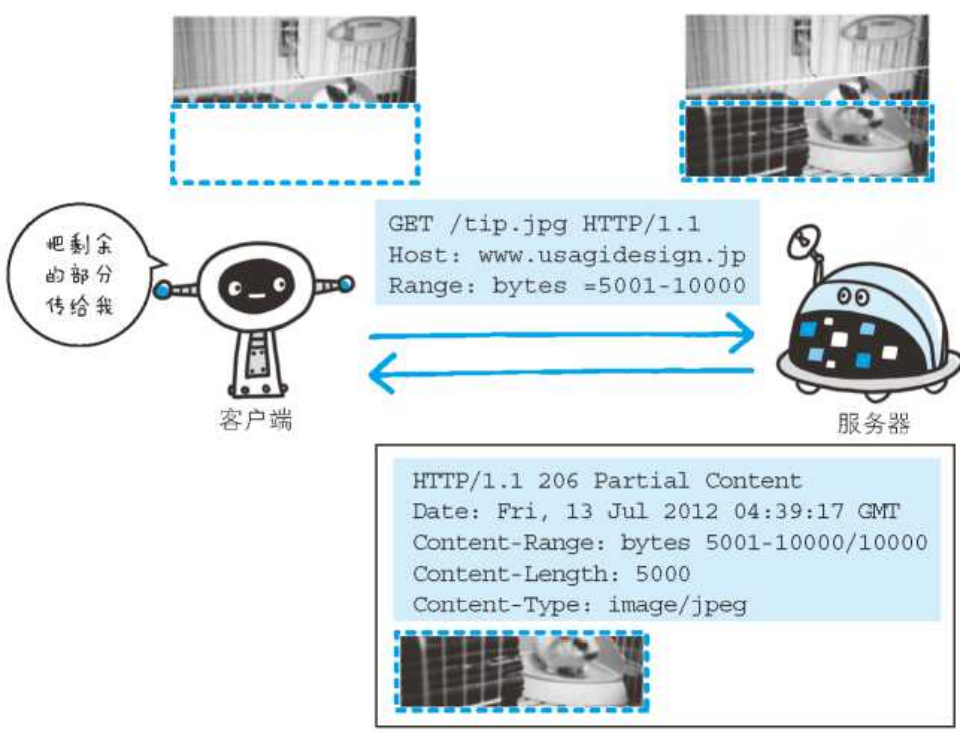
      >
      > 执行范围请求时，会用到首部字段Range来指定资源的byte范围。如——
      >
      > > `Range: bytes=5001-10000`：下载5001~10000字节
      > >
      > > `Range: bytes=5001-`：下载5001之后的所有字节
      > >
      > > `Range: bytes=-3000, 5000-7000`：下载从一开始到3000字节和5000~7000字节
      >
      > 若指定范围有效，服务器会返回状态码为`206 Partial Content`的响应报文和范围内的实体内容
      >
      > 否则，服务器会返回状态码为`206 OK`的响应报文和完整的实体内容
   
   6. 内容协商返回最合适的内容
   
      1. 内容协商机制：指客户端和服务端就响应的资源内容进行交涉，提供给客户端最为合适的资源。
   
      2. 判断基准
   
         > * Accept
         > * Accpet-Charset
         > * Accpet-Encoding
         > * Accpet-Language
         > * Content-Language
   
      3. 类型
   
         > 1. 服务器协商：由服务器端进行内容协商，以请求的首部字段为参考，在服务器端自动处理。
         > 2. 客户端协商：由客户端进行内容协商的方式。用户从浏览器显示 的可选项列表中手动选择；还可以利用 JavaScript 脚本在 Web 页面上自动进行上述选择。
         > 3. 透明协商：是服务器驱动和客户端驱动的结合体，是由服务器 端和客户端各自进行内容协商的一种方法。

### 四、HTTP状态码

1. 作用：描述返回的请求结果

2. 组成：数字 + 原因短语

3. 类别：

   |      | 类别                             | 原因短语                   |
   | :--- | -------------------------------- | -------------------------- |
   | 1XX  | Information（信息性状态码）      | 接收的请求正在处理         |
   | 2XX  | Success（成功状态码）            | 请求正常处理完毕           |
   | 3XX  | Redirection（重定向状态码）      | 需要进行附加操作以完成请求 |
   | 4XX  | Client Error（客户端错误状态码） | 服务器无法处理请求         |
   | 5XX  | Server Error（服务端错误状态码） | 服务器处理请求出错         |

   > 1. 2XX 成功
   >
   >    > 200 OK：从客户端发来的请求在服务器端被正常处理
   >    >
   >    > > 请求已正常处理
   >    >
   >    > 204 Not Content：服务器接收的请求已被成功处理，但在返回的报文中不含实体的主体部分
   >    >
   >    > > 请求处理成功，但没有资源返回
   >    >
   >    > 206 Partial Content：服务器成功执行了客户端发来的范围请求
   >    >
   >    > > 成功处理范围请求，已对某一部分资源进行处理
   >
   > 2. 3XX 重定向
   >
   >    > 301 Moved Permanently：永久性重定向，请求的资源已被永久的移动到新URI
   >    >
   >    > > 资源的URI已更新，今后任何新的请求都应使用新的URI代替
   >    >
   >    > 302 Found：临时性重定向，请求的资源已被移动到新的URI，希望用户本次能够使用新的URI访问
   >    >
   >    > > 资源的URI已更新，但这只是临时性的，应还需保留原有的URI
   >    > >
   >    > > 302禁止使用GET进行重定向，但是实际使用的时候大家并不遵守
   >    >
   >    > 303 See Other：请求对应的资源存储在另一个新的URI，需使用GET方法定向获取请求的资源
   >    >
   >    > > 资源的URI已更新，只能使用GET方法访问新资源
   >    >
   >    > 304 Not Modified：服务器收到了客户端发送的附带条件的请求，且允许请求的资源，但是条件未满足
   >    >
   >    > > 资源已找到，但未符合条件（304虽被划分在3XX中，但与重定向没有关系）
   >    >
   >    > 307 Temporary Redirect：与302有着相同的含义，但必须使用GET请求重定向
   >
   > 3. 4XX客户端错误
   >
   >    > 400 Bad Request：请求报文中存在语法错误，要求修改内容后再进行发送
   >    >
   >    > > 服务器无法理解请求报文
   >    >
   >    > 401 Unauthorized：请求要求用户的身份认证
   >    >
   >    > > 
   >    >
   >    > 403 Forbidden：服务器理解请求客户端的请求，但是拒绝执行此请求
   >    >
   >    > > 服务器的访问遭到拒绝，可能是权限不够等一系列原因
   >    >
   >    > 404 Not Found：服务器上无法找到请求的资源
   >    >
   >    > >  除此之外，也可以再服务器端拒绝请求且不想说明理由时用
   >
   > 4. 5XX 服务器错误
   >
   >    > 500 Internal Server Error：服务器再执行请求时发生了错误，也有可能时Web应用存在的bug或某些临时故障
   >    >
   >    > > 服务器内部资源出错
   >    >
   >    > 503 Service Unavailable：服务器正处于超负载或者正在进行维护，现在无法处理请求
   >
   > 5. Note：
   >
   >    > 状态码和状况不一致的清空也经常会遇到，有时候Web程序内部发生错误就会导致这种情况

### 五、与HTTP协作的Web服务器

1. 一台虚拟主机可以寄存多个不同的主机名和域名的Web网站，在解析域名之后，他们访问的IP地址会相同。所以在发送HTTP请求时，必须在Host首部内完成指定主机名或域名的URL

2. 通信数据转发程序：代理、网关、隧道

   在HTTP通信时，除了客户端与服务器之外，还有一些用于通信数据转发的应用程序。

   **代理**

   > 办理服务器与客户端“中间人”的角色，接收由客户端发送的请求并转发给服务器，同时接收服务器返回的响应并转发给客户端、
   >
   > 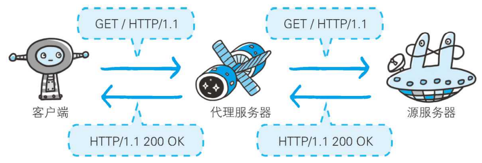
   >
   > 使用场景：利用缓存技术减少网络带宽的流量；组织内部针对特定网站的访问控制；获取访问日志等
   >
   > 种类：
   >
   > > 缓存代理：转发响应时，会将资源的副本保存至代理服务器。当代理再次收到相同的资源请求时，就不再从源服务器处获取资源，而是直接将缓存的资源返回
   > >
   > > 透明代理：转发报文时，不对报文做任何修改的代理。反之，就是非透明代理

   **网关**

   > 网关的工作机制与代理服务器十分相似，而网关能使通信线路上的服务器提供非HTTP协议的服务
   >
   > 
   >
   > 使用场景：由HTTP请求转化为其它协议通信；提高通信的安全性（在客户端与网关的通信线路上加密）

   **隧道**

   > 隧道可按要求建立起一条与其它服务器的通信线路，然后可以使用SSL等加密手段解进行通信
   >
   > 而隧道本身不会去解析HTTP请求，即加密后的请求将保持原样地传递给客户端和服务器
   >
   > 
   >
   > 使用场景：和远距离服务器进行安全通信

3. 保存资源的缓存

   > 1. 缓存：磁盘内保存的资源副本
   > 2. 目的：可以利用缓存避免多次从服务器上获取相同的资源
   > 3. 有效期限说明：即使存在缓存，每次使用时也需要判定缓存是否过期。若没有过期，则可以使用；若已经过期，则需要向服务器确认缓存的有效性。若缓存已经失效，则需要再向服务器获取“新”的资源
   > 4. 分类：客户端的缓存、缓存代理服务器的缓存

### 六、HTTP首部

####    ①、HTTP报文格式

---

【请求报文】

【响应报文】

#### ②、HTTP首部字段

1. HTTP首部字段结构：`首部字段名 = 单个字段值 或 ,分隔的字段值列表`

2. 首部字段类型

   > * 通用首部字段（General Header Fields）
   > * 请求首部字段（Request Header Fields）
   > * 响应首部字段（Response Header Fields）
   > * 实体首部字段（Entity Header Fields）

3. HTTP/1.1 首部字段一览

   * 通用首部字段

   | 首部字段名                  | 说明                       |
   | --------------------------- | -------------------------- |
   | [Cache-Control](#Gen01)     | 控制缓存的行为             |
   | [Connection](#Gen02)        | 逐跳首部、连接的管理       |
   | [Date](#Gen03)              | 创建报文的日期时间         |
   | [Pragma](#Gen04)            | 报文指令                   |
   | [Trailer](#Gen05)           | 报文末端的首部一览         |
   | [Transfer-Encoding](#Gen06) | 指定报文主题的传输编码方式 |
   | [Upgrade](#Gen07)           | 升级为其它协议             |
   | [Via](#Gen08)               | 代理服务器的相关信息       |
   | [Warning](#Gen09)           | 错误通知                   |

   * 请求首部字段

   | 首部字段名                    | 说明                                          |
   | ----------------------------- | --------------------------------------------- |
   | [Accpet](#Req01)              | 用户代理可处理的媒体类型                      |
   | [Accpet-Charset](#Req02)      | 优先的字符集                                  |
   | [Accpet-Encoding](#Req03)     | 优先的内容编码                                |
   | [Accept-Language](#Req04)     | 优先的语言（自然语言）                        |
   | [Authorization](#Req05)       | Web认证信息                                   |
   | [Expect](#Req06)              | 期待服务器的特定行为                          |
   | [From](#Req07)                | 用户的电子邮箱地址                            |
   | [Host](#Req08)                | 请求资源所在的服务器                          |
   | [If-Match](#Req09)            | 比较实体标记（ETag）                          |
   | [If-Modified-Since](#Req10)   | 比较资源的更新时间                            |
   | [If-None-Match](#Req11)       | 比较实体标记（与If-Match相反）                |
   | [If-Range](#Req12)            | 资源未更新是发送实体Byte的范围请求            |
   | [If-Unmodified-Since](#Req13) | 比较资源的更新时间（与If-Modified-Since相反） |
   | [Max-Forwards](#Req14)        | 最大传输逐跳数                                |
   | [Proxy-Authorization](#Req15) | 代理服务器要求客户端的认证信息                |
   | [Range](#Req16)               | 实体的字节范围要求                            |
   | [Referer](#Req17)             | 上一个打开网址的URI                           |
   | [TE](#Req18)                  | 传输编码的优先级                              |
   | [User-Agent](#Req19)          | HTTP客户端程序的信息                          |
   
   * 响应首部字段
   
   | 首部字段名                   | 说明                         |
   | ---------------------------- | ---------------------------- |
   | [Accept-Ranges](#Res01)      | 是否接收字节范围请求         |
   | [Age](#Res02)                | 推算资源创建经过的时间       |
   | [Etag](#Res03)               | 资源的匹配信息               |
   | [Location](#Res04)           | 令客户端重定向至指定的URI    |
   | [Proxy-Authenticate](#Res05) | 代理服务器对客户端的认证信息 |
   | [Retry-After](#Res06)        | 对再次发起请求的时机要求     |
   | [Server](#Res07)             | HTTP服务器的安装信息         |
   | [Vary](#Res08)               | 代理服务器缓存的管理信息     |
   | [WWW-Authenticate](#Res09)   | 服务器对客户端的认证信息     |
   
   * 实体首部字段
   
   | 首部字段名                 | 说明                         |
   | -------------------------- | ---------------------------- |
   | [Allow](#Ent01)            | 资源可支持的HTTP方法         |
   | [Content-Encoding](#Ent02) | 实体主题使用的编码方式       |
   | [Content-Language](#Ent03) | 实体主体的自然语言           |
   | [Content-Length](#Ent04)   | 实体主体的大小（单位：字节） |
   | [Content-Location](#Ent05) | 代替对应资源的URI            |
   | [Content-MD5](#Ent06)      | 实体主体的报文摘要           |
   | [Content-Range](#Ent07)    | 实体主体的位置范围           |
   | [Content-Type](#Ent08)     | 实体主体的媒体类型           |
   | [Expires](#Ent09)          | 实体主体过期的日期时间       |
   | [Last-Modified](#Ent10)    | 资源的最后修改日期时间       |
   
#### ③、通用首部字段详解

   * Cache-Control：控制缓存服务器对服务端和客户端的缓存行为。指令参数可选，通过`,`分隔
   
     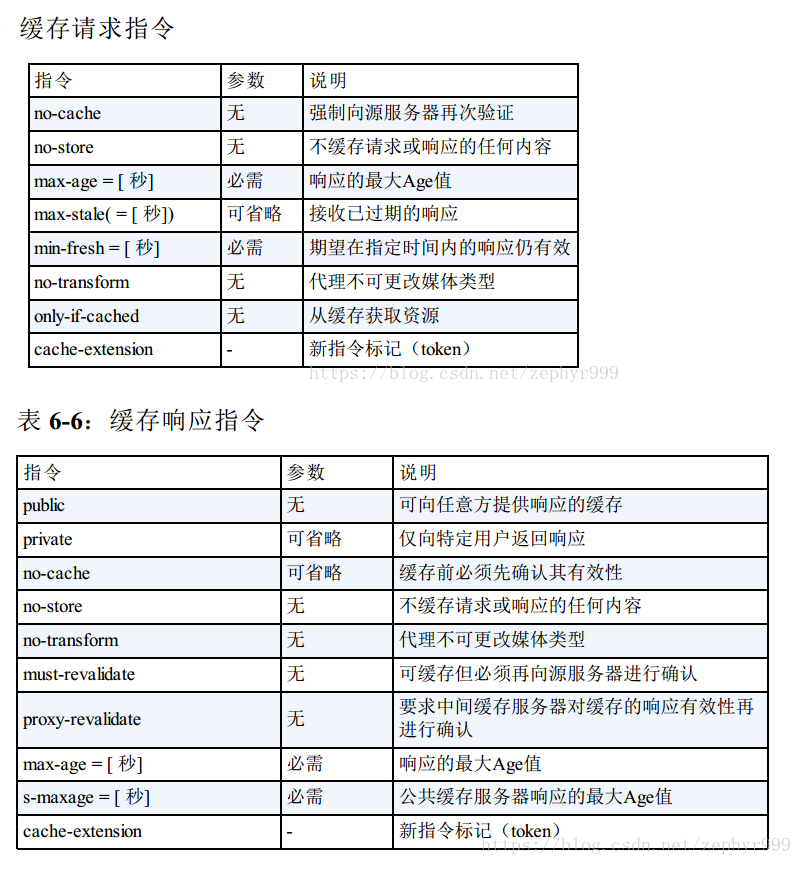

   > `public`：表示其它用户也可以利用缓存
   >
   > `private`：表示只有特定用户可以利用缓存
   >
   > ---
   >
   > `no-chche`：客户端发出该指令，表示不利用缓存，直接从服务器获取资源
   >
   > `no-chche[=Location]`：服务器发出该指令，表示缓存服务器不再获取缓存
   >
   > ​											 若指定了参数，表示指定参数的客户端不能从缓存服务器获取缓存
   >
   > 简单来说，`no-cache`表示使用和缓存前需确认资源的有效性
   >
   > ---
   >
   > `no-store`：报文中存在机密信息，将不进行缓存~注意与no-chche的区别~
   >
   > ---
   >
   > `s-maxage`：与`max-age`功能相同，但是只适用于代理，且优先级比`max-age`高
   >
   > `max-age`：比较缓存资源的缓存时间与指定时间，并作出相应操作
   >
   > 
   >
   > ---
   >
   > `min-fresh`：客户端发出指令，要求服务器返回至少还未过指定时间的缓存资源
   >
   > ---
   >
   > `max-stale`：若不指定参数，则接收任意时间已过期的缓存；若指定参数，则资源只要是在指定时间内，则会获取缓存
   >
   > ---
   >
   > `only-if-cashed`：客户端向缓存服务器获取资源，缓存服务器不重新加载缓存，也不判断资源的有效性。若本地缓存无响应，则返回`504 Gateway Timeout`
   >
   > ---
   >
   > `must-revalidate`：缓存服务器会再次向源服务器确认即将返回的响应缓存是否有效，若无法连通源服务器，将返回504状态码
   >
   > ---
   >
   > `proxy-revalidate`：要求所有的缓存服务器在接收到客户端带有该指令的请求返回响应前，必须再次确认缓存的有效性
   >
   > ---
   >
   >  `no-transform`：规定缓存不能改变实体主体的媒体类型，防止缓存或代理压缩图片
   >
   > ---
   >
   > [Cache-Control扩展]([Cache-Control扩展中的cache-extension token到底是什么？_Cap220590的博客-CSDN博客](https://blog.csdn.net/Cap220590/article/details/106317802))

* Connection：控制不再转发给代理的首部字段 + 管理持久连接

  1. 控制不再转发给代理的首部字段：`Connection: 不再转发的首部字段名`
  2. 开启持久连接：`Connection: keep-Alive` （在HTTP/1.1之前使用）
  3. 关闭持久连接：`Connection: Close`

* Date：表明创建HTTP报文的时间

  在HTTP/1.1中的格式：`Date: Tue, 03 Jul 2012 04:40:59 GMT`

* Pragma：作为HTTP/1.0向后兼容而定义

  使用方法：要求代理服务器不返回缓存的资源

  ~~~http
  Cache-Control: no-cache
  Prama: no-cache
  ~~~

* Trailer：事先说明在报文主体后记录了哪些首部字段，可应用在HTTP/1.1版本分块传输编码时

* Transfer-Encoding：规定了传输报文主体采用的编码方式，在HTTP/1.1的传输编码方式仅对分块传输编码有效

* Upgrade：用于检测HTTP协议及其它协议是否可以使用更高的版本进行通信，其参数值为一个完全不同的通信协议

  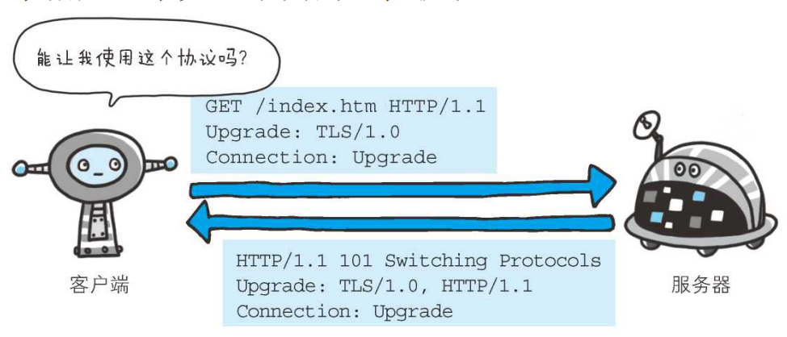

* Via：为了追踪客户端与服务器之间的请求和响应报文的传输路径，每当经过代理服务器或网关时，会在Via中附加该服务器的信息

  

  > 因为Via是为了获取传输路径，所以通常会与[TRACE方法](#tarce)一起使用

* Warning：告知用户一些与缓存相关的问题的警告

  格式：`Warning: 警告码 警告的主机:端口 "警告内容" [日期时间]`

  示例：`Warning: 113 gw.hackr.jp:8080 "Heuristic expiration" Tue,03`

  警告码：（注：警告码对应的警告内容仅供参考）

  | 警告码 | 警告内容                                         | 说明                                       |
  | ------ | ------------------------------------------------ | ------------------------------------------ |
  | 110    | Response is state（响应已过期）                  | 代理返回已过期的资源                       |
  | 111    | Revalidation failed（再验证失败）                | 代理再验证资源有效性时失败                 |
  | 112    | Disconnection operation（断开链接操作）          | 代理与互联网连接被故意切断                 |
  | 113    | Heuristic expiration（试探性过期）               | 响应的使用期限超过24小时                   |
  | 199    | Miscellaneous warning（杂项警告）                | 任意的警告内容                             |
  | 214    | Transformation applied（使用了转换）             | 代理对内容编码或媒体类型等执行了某些处理时 |
  | 299    | Miscellaneous persistent warning（持久杂项警告） | 任意的警告内容                             |

#### ④、请求首部字段详解

* Accept：告知服务器用户代理能够处理的媒体类型及媒体类型的相对优先级

  1. 格式：使用`type/subtype`的形式指定多种媒体类型，其间使用`,`分隔。权重加载媒体类型的后面使用`;`分隔

  2. 权重：其值在0~1之间，且精确到小数位后三位

  3. 示例：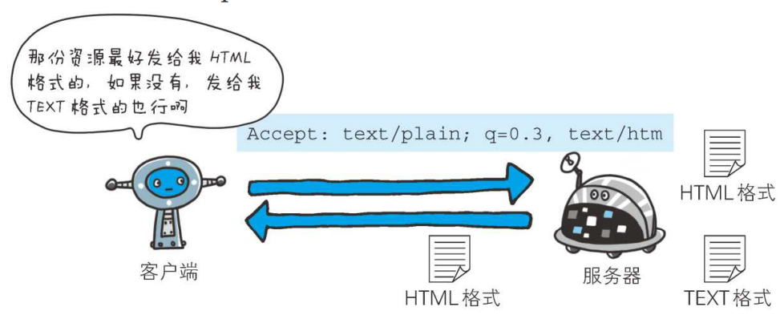

  4. 媒体类型：

     > * 文本文件：text/html, text/plain, text/css, …
     > * 图片文件：image/jpeg, image/gif, application/xml,  …
     > * 视频文件：video/mpeg, video/quicktime, …
     > * 应用程序使用的二进制文件：application/octet-stream, application/zip, …

* Accpet-Charset：告知服务器用户代理能够处理的字符集类型及字符集的相对优先级

  用法同`Accpet`，只不过字符集直接使用即可，不用更改为`type/subtype`的形式

* Accept-Encoding：告知服务器用户代理值传递内容编码及内容编码的优先顺序

  1. 用法同`Accpet`，只不过内容编码直接使用即可，不用更改为`type/subtype`的形式

  2. 常见的内容编码：

     > * **gzip**：由文件压缩程序gzip生成的编码格式
     >
     >   采用Lempel-Ziv算法（LZ77）及32位循环冗余校验（CRC）
     >
     > * **compress**：由UNIX文件压缩程序compress生成的编码格式
     >
     >   采用Lempel-Ziv-Welch算法（LZW）
     >
     > * **deflate**：组合使用zlib格式（RFC1950）及由deflate压缩算法（RFC1951）生成的编码格式
     >
     > * **identity**：不执行压缩或不会变化的默认压缩格式

* Accpet-Language：告知服务器用户代理能够处理的自然语言集，以及自然语言集的相对优先级

  示例：`Accept-Language: zh-cn,zh;q=0.7,en-us,en;q=0.3`

* Authorization：告知服务器用户代理的认证信息

* Expect：告知服务器期望出现某种特定的行为

  > 用法：`Except: 100- continue`
  >
  > 等待状态码100响应的客户端在发送请求时，需要指定此字段

* From：告知服务器使用用户代理的用户的电子邮箱地址

* Host：告知服务器，请求的资源所处的互联网主机名和端口号，参数为请求的资源所处的主机名，若没有设定可以给定空值

  一般用在一个IP使用不同端口配置多台服务器的情况

---

**条件请求字段（IF-xxx）**

> 服务器接收到附带条件的请求后，只有在判断指定条件为真时，才会执行请求

* If-Match：只有当If-Match字段值跟[Etag](#etag)值匹配时，服务器才会接受请求
* If-Modified-Since：参数为一个日期时间，若在指定的日期时间后，资源发生了更新，服务器会接受请求；反之，返回`304 Not Modified`的响应
* If-None-Match：只有当If-Match字段值跟Etag（实体字段）值不一致时，服务器才会接受请求
* If-Range：告知服务器Range字段值（时间或ETag值），若与请求的资源（时间或ETag值）相一致，则作为范围请求处理，否则返回全部资源
* If-Unmodified-Since：参数为一个日期时间，若在指定的日期时间后，资源未发生更新，服务器会接受请求；反之，返回`412 Precondition Failed`的响应

---

* Max-Forwards：限制转发次数

  其值在每次转发后减1，且在为0时返回响应

  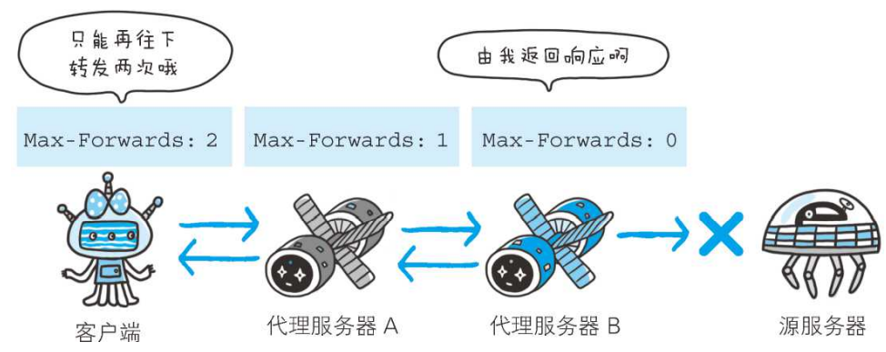

* Proxy-Authorization：告知服务器认证所需要的信息

* Range：告知服务器获取资源的范围，在处理完成后，返回`206 Partial Content`的响应；若无法处理该请求，则会返回全部的资源，并返回`200 OK`的响应

* Referer：告知服务器请求的原始资源的URL，即跳转之前资源的URL值

* TE：告知服务器，客户端能够处理的传输编码方式及其优先级

* User-Agent：告知服务器创建请求的浏览器和用户代理名称等信息

#### ⑤、响应首部字段详解

* Accpet-Ranges：在可处理范围请求的时候，返回字节范围；否则，返回`none`

* Age：告知客户端，源服务器在多久之前创建了响应

* Etag：告知客户端资源的Etag值

  > Etag：是实体标签(Entity Tag)的缩写，在资源的各个生命周期中，它都具有不同的值，用于标识出资源的状态。服务器会为每份资源分配对应的Etag，当资源更新时，Etag的值也会更新。

* Location：配合重定向使用，提供重定向的URI

* Proxy-Authenticate：把代理服务器所要求的认证信息发送给客户端

* Retry-After：告知客户端应该在多久之后再次发送请求，其值可以是具体的日期时间，也可以是对应的秒数

* Server：告知客户端当前服务器上按照的HTTP服务器应用程序的信息

* Vary：对缓存进行控制，要求代理服务器只能按照指定的自然语言返回数据，若对应的自然语言没有缓存，则需要代理服务器重新获取资源

* WWW-Authenticate：告知客户端适用于访问请求URI所指定资源的认证方案。（在`401 Unauthorized`响应中，必定会出写该字段）

#### ⑥、实体首部字段详解

* Allow：用于通知客户端能够支持Request-URI指定资源的所有HTTP方法

  

* Content-Encoding：告知客户端服务器对实体的主体部分选用的[内容编码方式](#encode)

* Content-Language：告知客户端实体主体使用的自然语言

* Content-Length：告知客户端实体主体部分的大小（字节数）

* Content-Location：给出与报文主体部分相对应的URI

* Content-MD5：由MD5算法生成的值，用于检查报文主体部分在传输过程中是否保持完整，以及确认传输到达

  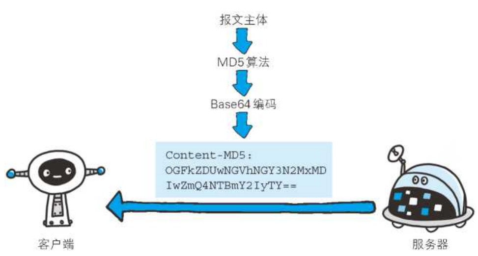

* Content-Range：针对范围请求，告知客户端作为响应返回的实体的哪个部分符合范围请求

* Content-Type：说明了实体主体内对象的媒体类型

  **==Content-type: text/html; charset=utf-8==**：解决中文乱码问题

* Expires：告知资源的失效日期，资源失效后，再请求该资源缓存服务器将向源服务器发起请求，但优先级比[max-age](#max-age)低

* Last-Modified：指明资源最后修改时间

#### ⑦、为Cookie服务的首部字段详解

* Set-Cookie：服务器开始管理客户端状态时所使用的Cookie信息，为**首部响应字段**

  属性说明

  | 属性         | 说明                                                         |
  | ------------ | ------------------------------------------------------------ |
  | NAME=VALUE   | 必须项。赋予Cookie的名称和其值                               |
  | expires=DATE | Cookie的有效期（若不指定则有效期至浏览器关闭）               |
  | path=PATH    | 将服务器上的文件目录作为Cookie的适用对象（若不指定则默认为当前目录） |
  | domain=域名  | 作为Cookie适用对象的域名（若不指定则为创建Cookie服务器域名） |
  | Secure       | 仅在HTTPS安全通信时才会发送Cookie                            |
  | HttpOnly     | 使Cookie不能被Javascript脚本访问                             |

  实例：`Set-Cookie: status=enable; expires=Tue, 05 2011 07:26:31; secure; HttpOnly`

* Cookie：告知服务器，客户端想获得HTTP状态管理支持，将包含从该服务器接受到的Cookie，为**请求首部字段**

  实例：`Cookie: status=enable`（NAME=VALUE）

#### ⑧、其它首部字段

* X-Frame-Options：控制网站内容在其它Web网站的Frame标签内的显示问题，为了放置劫持攻击c

  X-Frame-Option有两个可指定的字段值：DENY与SAMEORIGIN

  > DENY：拒绝
  >
  > SAMEORIGIN：仅同源域名下的页面匹配时许可

* X-Forwarded-For：为了让服务器获取访问用户的真实IP（部署代理服务器并不能绕开探查），为**请求首部字段**

  X-Forwarded-For的值不管经过了多少代理服务器（代理服务器不拦截修改），始终为访问用户的真实IP
  
  [参考教程](https://blog.csdn.net/zyhmz/article/details/82505344?ops_request_misc=%7B%22request%5Fid%22%3A%22162739100416780261921030%22%2C%22scm%22%3A%2220140713.130102334..%22%7D&request_id=162739100416780261921030&biz_id=0&utm_medium=distribute.pc_search_result.none-task-blog-2~all~sobaiduend~default-1-82505344.first_rank_v2_pc_rank_v29&utm_term=x-forwarded-for&spm=1018.2226.3001.4187)
  
* X-XSS-Protection：控制浏览器XSS防护机制的开关，为**响应首部字段**

  X-XSS-Protection有两个可指定的字段值：0 或 1

  > 0 ：将XSS过滤设置为无效状态
  >
  > 1 ：将XSS过滤设置为有效状态

* DNT（Do Not Track）：拒绝个人信息被收集，是表示拒绝被精准广告追踪的一种方式，为**请求首部字段**

  DNT有两个可指定的字段值：0 或 1

  > 0 ：同意被追踪
  >
  > 1 ：拒绝被追踪

* P3P：利用P3P技术，可以让Web网站上的个人隐私变成一种仅供程序可理解的方式，达到保护用户隐私的目的，为**响应首部字段**

  > 操作步骤：
  >
  > 1. 创建P3P隐私
  > 2. 创建P3P隐私对照文件后，保存命名在/w3c.p3p.xml
  > 3. 从P3P隐私中新建Compact policies后，输出到HTTP响应中

  [P3P的详细规范](https://www.w3.org/TR/P3P/)

~X-前缀用来指示非标准参数，后被废除~

### 七、确保Web安全的HTTPS

#### ①、HTTPS概述
1. 背景：在HTTP协议中存在信息窃听或身份伪装等安全问题，为了有效地防止这些问题的出现，HTTPS诞生了。

2. 简介：HTTPS，全称Hypertext Transfer Protocol Secure，译为超文本传输安全协议。简单来说HTTPS协议就是HTTP加上加密处理和认证以及完整性保护后的产物，可以理解为是HTTP的安全版。

   > HTTP + 加密 + 认证 + 完整性保护 = HTTPS
   > 

3. HTTP的弊端与HTTPS的改进措施

   | HTTP的缺点           | 危害                 | HTTPS改进措施                    |
   | -------------------- | -------------------- | -------------------------------- |
   | 通信使用明文         | 内容可能被窃听       | ==加密HTTP的通信内容==           |
   | 不验证通信方身份     | 可能遭遇伪装         | 查明通信方的证书                 |
   | 无法证明报文的完整性 | 通信内容可能会被篡改 | 通信内容的加密保证了报文的完整性 |

4. 原理：HTTPS并非是一种新协议，只是将HTTP通信接口部分用SSL[^注1]和TLS协议替代而已。通常HTTP直接与TCP通信，而使用SSL时，会演变为先与SSL通信，再由SSL和TCP通信。使用了SSL之后，HTTP就拥有了HTTPS的加密、证书、完整性保护这些功能。
   

#### ②、预备知识

1. 对称加密：加密和解密使用同一个密钥

   > 1. 原理：数据可以通过 <u>密钥 + 加密算法</u> 生成密文，密文通过 <u>密钥 + 解密算法</u> 生成数据
   > 2. 弊端：任何人都可以使用密钥进行加密和解密操作，如果密钥在传输的过程中被窃取，加密将不再安全

2. 非对称加密：加密需要使用一组密钥对

   > 1. 密钥对：一对公钥和私钥，私钥存储在本地，公钥可以向通信的另一方公开
   >
   > 2. 原理：公钥加密的内容可以通过 <u>私钥 + 解密算法</u> 进行解密，私钥加密的内容可以通过 <u>公钥 + 解密算法</u> 进行解密
   >
   > 3. 传输步骤（B → A）：
   >
   >    > 1. A使用明文传输公钥给B
   >    > 2. B将数据使用公钥加密传给A
   >    > 3. A通过私钥解密，得到数据
   >
   > 4. 弊端：非对称加密只允许单向加密传输数据，且其效率比对称加密要低很多。更重要的一点是，在进行非对称加密通信时，并不能确定客户端A收到的公钥为服务器B所传输的

3. 数字签名：让所有人知道文件是私钥持有人创建的

   > 1. 原理：通过 <u>私钥 + 签名算法</u> 对文件进行签名，得到数字签名（一串字符串）。将字符串、公钥与被签名的文件一起发送给数据接收方，接收方可以通过 <u>公钥 + 数字签名 + 验证算法</u> 判断文件是否为私钥持有人公开的，且是否被更改（因为文件本身作为验证算法的参数）
   >    
   >    
   >    【注：消息摘要密文就是数字签名。且因为私钥不可知，其在公钥确定的情况下，具有完整性[^注3]】
   > 2. 弊端：在传输带有签名的数据时，并不能确认公钥是否被篡改

4. 数字证书：发证机构（CA）签发的证书

   > 1. 作用：证明公钥是属于公钥所有人的，且不能被篡改
   >    
   > 2. 原理：需要使用时，需向认证机构（CA）申请证书，而所有的浏览器都内置了全球各大CA的验证机制，即拥有CA的公钥。数字证书上的数字签名为CA的数字签名，所以可以通过验证数字证书上的数字签名确定数字证书的完整性[^注3]，进而确定数字证书上公钥数据的完整性。

#### ③、HTTPS加密机制

1. 加密方式：混合加密机制（对称加密 + 非对称加密）

2. 加密步骤

   > 1. 客户端向服务器请求公钥
   > 2. 服务器向CA机构申请证书，并通过证书将公钥传递给客户端
   > 3. 客户端通过证书验证公钥的正确性，并随机生成一个字符串作为之后与服务器进行对称加密通信的密钥
   >  4. 客户端将生成的密钥利用从服务器获取的公钥进行非对称加密，并将密文传输给服务器
   >  5. 服务器获取客户端传输来的密文后，利用私钥进行解密，获取密钥，利用这个密钥与客户端进行对称加密通信

3. 详解：

   > 1. HTTPS加密可以理解为使用一个**绝对安全的密钥**进行对称加密通信
   > 2. 为了保证密钥的绝对安全，需要让客户端随机生成密钥，并使用非对称加密的方式将密钥传输给服务器，而非对称加密的安全性是建立在服务器传输过来的**公钥的完整性**[^注3]上
   > 3. 为了保证公钥的完整性，则需要服务器向CA机构申请证书，并利用证书确保公钥的完整性
   >
   > **图示：**
   > 

4. 注释

[^注1]:
#### ④、HTTPS的安全通信机制

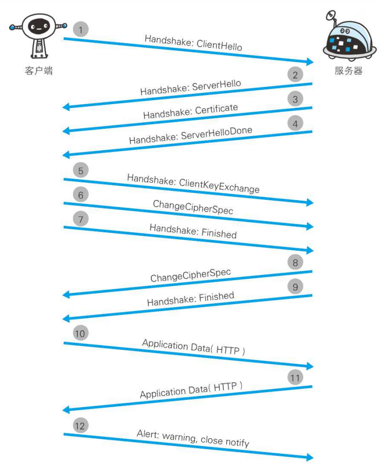

1. 客户端通过发送Client Hello报文开始SSL通信，报文中包含客户端支持的SSL的指定版本、加密组件列表
2. 服务器可进行SSL通信时，会以Server Hello报文作为应答。报文中包含SSL版本以及加密组件（根据1中的内容筛选出来的）
3. 发送Certificate报文，包含**第一次非对称加密通信的密钥**
4. 最后服务器发送Server Hello Done报文通知客户端，最初阶段的SSL握手协商部分结束
5. SSL第一次握手结束后，客户端以Client Key Exchange报文作为回应，该报文中包含之后**对称加密通信的密钥**Pre-mastersecret，且该报文已经采取3中获取的密钥进行加密
6. 客户端发送Change Cipher Spec报文，提示服务器，之后的报文会采取以Pre-mastersecret密钥进行加密的对称加密通信
7. 客户端发送Finished报文，包含连接至今全部报文的整体校验值。这次握手协商是否能够成功，要以服务器是否能过够正确解密报文作为判定标准
8. 服务器同样发送Change Cipher Spec报文
9. 服务区同样发送Finished报文
10. **客户端与服务器的Finished报文交换完毕后，SSL连接就算建立完成**，之后的通信会受到SSL的保护，至此以后开始进行应用层协议的通信，即发送HTTP请求
11. 应用层协议通信，服务器返回HTTP响应
12. 最后由客户端断开连接。断开连接时，发送close_notify报文，上图做了一些省略，此步之后在发送TCP FIN报文来关闭与TCP的通信

### 八、确定访问用户的认证

1. 认证：通过核对信息确定登录者的身份

2. HTTP使用的认证方式：

   > * BASIC认证：基本认证
   >
   >   
   >
   >   弊端：
   >
   >   > 1. 虽然使用Base64方式进行编码，但这不是加密处理，可以使用明文解码，并不安全
   >   > 2. 在进行了一次BASIC认证之后，无法实现认证注销操作
   >
   > * DIGEST认证：摘要认证
   >
   >   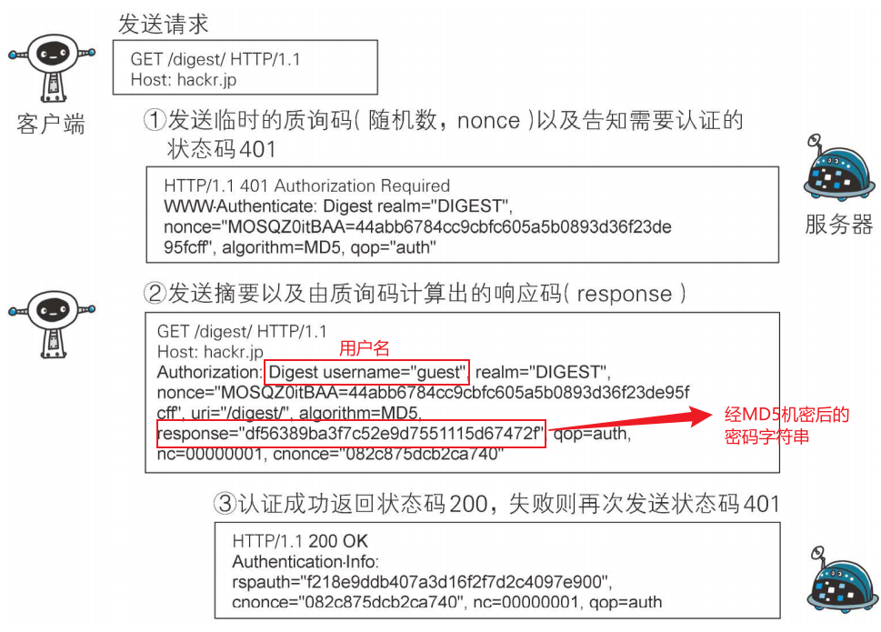
   >
   >   > DISEST认证相较于BASIC认证提供了防止密码被窃听的保护机制，但并不存在防止用户伪装的保护机制
   >
   > * SSL客户端认证：借由HTTPS的客户端证书完成认证
   >
   >   > 为完成此次认证，必须事先将客户端证书分发给客户端，且客户端需要安装此证书
   >
   >   1. 收到认证请求，服务器发送Certificate Request 报文，要求客户端提供证书
   >   2. 用户选择待发送的证书后，客户端会把证书信息以Client Certificate 报文方式发送给服务器
   >   3. 服务器在验证客户端证书验证通过后，获取证书上的公钥，开启HTTPS加密通信
   >
   > * FormBase认证：基于表单认证
   >
   >   客户端会向服务器上的Web应用程序发送登录信息（Credential），按登录信息的验证结果验证
   >
   >   > 认证多半为基于表单的认证
   >
   >   > 基于表单认证的标准规范尚未有定论，一般会使用Cookie来管理Session（会话）
   >   >
   >   > 鉴于HTTP是无状态协议，之前已经认证成功的用户状态无法通过协议层面保存下来，因此会**使用Cookie来管理Session**来弥补HTTP协议中不存在状态管理的功能
   >   >
   >   > 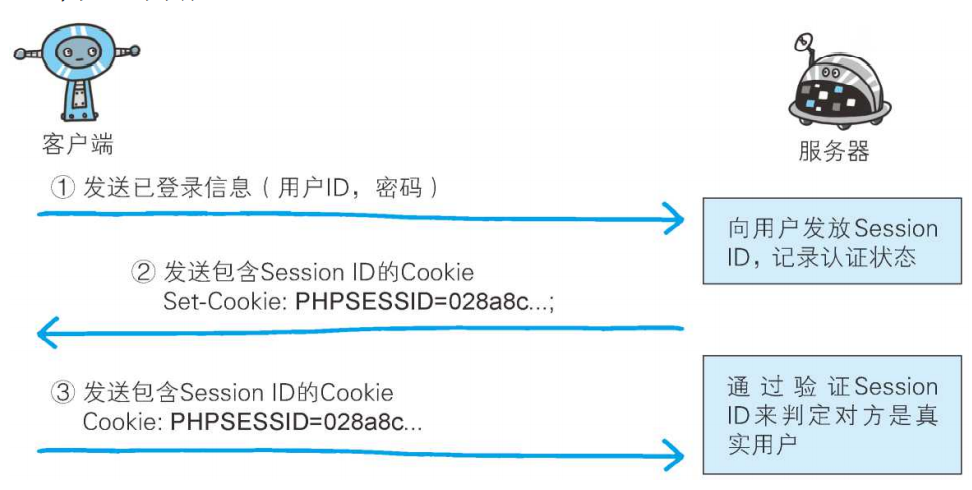

3. 小知识：密码保存的加盐（salt）处理

   在保存密码时，有一种安全的保存方法，就是利用密码加盐的方式增加额外信息，在使用散列函数计算出散列值后保存。

   > 密码加盐：由服务器随机生成一个足够长的字符串，添加到原密码字符串的前后任意一个位置，当成散列值。这样做很大程度上减少了密码的特征，使攻击者很难利用密码特征库进行破解

### 九、基于HTTP的功能的追加协议

1. 背景设计与功能：虽然HTTP协议简单便捷，但是随着时代的发展，其功能使用上捉襟见肘的疲态已经凸显。为了更好地适应时代的发展，创建了一些基于HTTP的新协议，在原有基础上添加了新的功能

2. 消除HTTP性能瓶颈的SPDY协议与其它提高易用性的技术

   > 1. Google在2010年发布了SPDY，其研发目标旨在解决HTTP的性能瓶颈，缩短Web页面的加载时间（50%）
   >
   > 2. [SPDY - The Chromium Projects](http://www.chromium.org/spdy)
   >
   > 3. HTTP的瓶颈：为了实现在网站上保存内容的实时更新
   >
   >    > * 一条连接上只能发送一个请求
   >    > * 请求只能从客户端开始，且客户端不可以接收除响应以外的指令
   >    > * 首部字段未经压缩就发送，导致首部信息越多延迟越长
   >    > * 每次互相发送冗长的首部造成浪费较多
   >    > * 可选任意多的压缩格式，非强制压缩发送
   >    >
   >    > 
   >
   > 4. Ajax[^注5]的解决方法：从已加载完毕的Web页面上发送请求，只更新局部页面
   >
   >    > 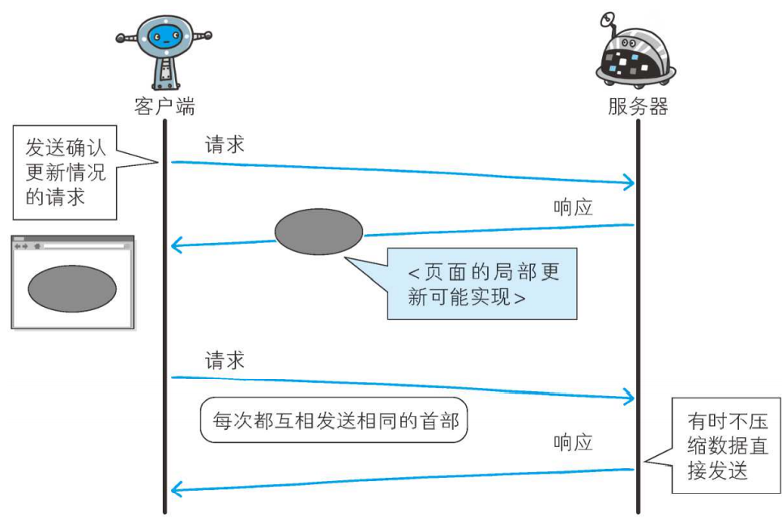
   >
   > 5. Comet的解决办法：一旦服务端有内容更新，Comet不会让请求等待，而是直接给客户端返回相应，从而模拟实现服务器向客户端推送的功能
   >
   >    > 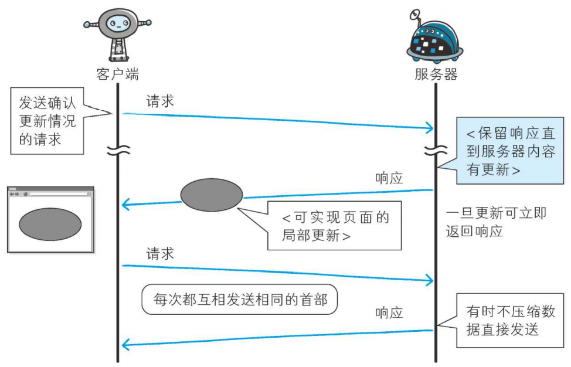
   >
   > 6. **SPDY**：对服务器进行根本性的改善，进行了一些协议层面上的改动
   >
   >    > SPNY并没有完全改写HTTP协议，而是在TCP/IP的应用层和传输层之间通过新加会话层的形式运作。同时，考虑到安全性问题，SPNY规定通信中使用SSL。
   >    >
   >    > 
   >    >
   >    > 使用SPDY后，HTTP协议额外获得以下功能
   >    >
   >    > * 多路复用流：单一的TCP连接可以无限制的处理多个HTTP请求
   >    > * 赋予请求优先级：解决因带宽低而导致响应变慢的问题
   >    > * 压缩HTTP首部：减少通信传输的字节数
   >    > * 推送功能：支持服务器主动向客户端推送数据
   >    > * 服务器提示功能：服务器主动提示客户端请求所需的资源，可以在资源已缓存等情况下，避免不必要请求的发送
   >
   > 7. SPNY的弊端：SPNY的实质是将单个域名的通信多路复用，所以当一个Web网站使用多个域名下的资源，改善效果就会受到限制

3. 使用浏览器进行全双工通信的WebSocket

   > 1. 设计与功能：WebSocket是Web浏览器与Web服务器之间全双工[^注6]通信标准，允许服务端主动向客户端推送数据。在WebSocket API中，浏览器和服务器只需要完成一次握手，两者之间就直接可以创建持久性的连接，并进行双向数据传输。
   >
   > 2. WebSocket是建立在HTTP基础上的协议，因此连接的发起方必须是客户端。但是一旦确立WebSocket通信连接，无论是客户端还是服务端，任意一方都能向另一方发送报文
   >
   > 3. 特点：
   >
   >    > * 推送功能：支持服务器向客户端推送数据
   >    > * 减少通信量：只要建立起WebSocket连接，就能够一直保持连接的状态，且WebSocket的首部信息很少
   >
   > 4. 握手
   >
   >    > * 握手·请求：使用HTTP的`Upgrade`首部字段，告知服务器通信协议发送改变
   >    >
   >    >   ~~~HTTP
   >    >   GET /chat HTTP/1.1
   >    >   Host: server.example.com
   >    >   Upgrade: websocket	
   >    >   Connection: Upgrade
   >    >   Sec-WebSocket-Key: dGhlIHNhbXBsZSBub25jZQ==
   >    >   Origin: http://example.com
   >    >   Sec-WebSocket-Protocol: chat, superchat
   >    >   Sec-WebSocket-Version: 13
   >    >   ~~~
   >    >
   >    >   > Sec-WebSocket-Key：握手过程中必不可少的键值
   >    >   >
   >    >   > Sec-WebSocket-Protocol：字段内记录使用的子协议
   >    >
   >    > * 握手·响应：对于握手的请求，返回101状态码进行相应
   >    >
   >    >   ~~~http
   >    >   HTTP/1.1 101 Switching Protocols
   >    >   Upgrade: websocket
   >    >   Connection: Upgrade
   >    >   Sec-WebSocket-Accept: s3pPLMBiTxaQ9kYGzzhZRbK+xOo=
   >    >   Sec-WebSocket-Protocol: chat
   >    >   ~~~
   >    >
   >    >   > Sec-WebSocket-Accept：由请求中的Sec-WebSocket-Key生成
   >
   > 5. 握手成功后，通信将不再使用HTTP的数据帧，而采用WebSocket独立的数据帧
   >
   >    
   >
   > 6. WebSocket API：Javascript可调用由W3C标准制定的”The WebSocket API“内提供的WebSocket程序接口，实现、WebSocket协议下的全双工通信

4. Web服务器管理文件的WebDAV

   > 1. 简介：WebDAV是一个可对Web服务器上的内容直接进行文件复制、编辑等操作的分布式管理系统
   >
   > 2. 功能：创建、删除、文件创建者管理、文件编辑过程中禁止其它用户内容覆盖的枷锁功能、对文件内容修改的版本控制功能
   >
   > 3. 针对服务器上的资源，WebDAV新增了一些概念
   >
   >    > * 集合（Collection）：是一种统一管理多个资源的概念，以集合为单位可进行各种操作，也可实现类似集合的集合这样的叠加
   >    > * 资源（Resource）：把文件或集合称为资源
   >    > * 属性（Property）：定义资源的属性，定义以`名称 = 值`的格式执行
   >    > * 锁（Lock）：把文件设置成无法编辑的状态，多人同时编辑时，可防止在同一时间进行内容写入
   >
   > 4. WebDAV新增的方法：
   >
   >    > **PROPFIND**：获取属性
   >    >
   >    > **PROPPATCH**：修改属性
   >    >
   >    > **MKCOL**：创建集合
   >    >
   >    > **COPY**：复制资源及属性
   >    >
   >    > **MOVE**：移动资源
   >    >
   >    > **LOCK**：资源加锁
   >    >
   >    > **UNLOCK** ：资源解锁
   >
   > 5. WebDAV新增的状态码：
   >
   >    > **102 Processing**：可正常处理请求，但是目前时处理中的状态
   >    >
   >    > **207 Multi-Status**：存在多种状态
   >    >
   >    > **422 Unprocessible Entity**：格式正确，但内容有误
   >    >
   >    > **423 Locked**：资源已被加锁
   >    >
   >    > **424 Failed Dependency**：处理与某请求关联的请求失败，因此不再维持依赖关系
   >    >
   >    > **507 Insufficient Storage**：保存空间不足

### 十、构建Web内容的技术

1. HTML：超文本标记语言，平时我们看到的Web页面几乎全由HTML构建。在HTML文档经过浏览器解析、渲染后，就是我们看到的Web页面

2. CSS：层叠样式表，让结构（HTML）与样式（CSS）相分离。通过指定HTML元素或特定的属性作为选择器来限定样式的应用范围

3. 动态HTML：通过调用客户端脚本语言Javascript，实现对HTML的Web页面的动态改造。利用DOM[^注7]指定欲发生变化的HTML元素，DOM中存在各种函数，可查阅HTML中的各个元素。

4. Web应用：通过Web功能提供的应用程序

5. CGI：通用网关接口，是指Web服务器在接收到客户端发送过来的请求后转发给程序的一组机制。使用CGI的程序叫做CGI程序，通常使用Perl、PHP、Ruby、C等编程语言编写而成

   

6. Java Servlet：是一种能在服务器上创建动态内容的程序，使用Java语言实现的一个接口。Servlet的运行环境叫做Web容器或Servlet容器。而Servlet常驻内存，在每次请求时，可启动相对进程级别更为轻量的Servlet，提高程序的执行效率。

   >  随着CGI的普及，每次请求都要启动新的CGI程序的CGI运行机制变成了性能瓶颈，所以就出现了像Servlet这种可直接在Web服务器上运行的程序
   >
   > 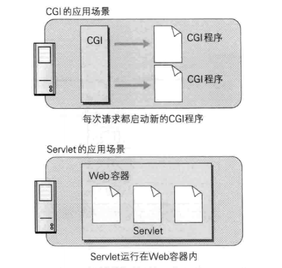

7. XML：可扩展标记语言，是一种可按应用目标进行扩展的通用标记语言，旨在使互联网数据共享变得更容易。相较于HTML[^注8]，XML对数据的记录做了特殊处理，使它可以通过语法分析器（Parser）的解析功能更容易对数据进行读取。而XML这种更容易复用数据的性质，往往被用在两个不同应用之间的交换数据格式化

8. RSS/Atom：RSS（简易信息聚合）和Atom都是发布新闻或博客日志等更新信息文档的格式的总称，二者都用到了XML

9. JSON（Javascript Object Notation）是一种以Javascript（ECMAScript）的对象表示法为基础的轻量级数据标记语言，能够处理false/null/true/对象/数字/数组/字符串，这7种类型。且JSON的字符串形式能够被Javascript轻易地读入

### 十一、Web攻击技术

### -- 注释

[^注1 ]:将大数据分割以报文段为单位的数据表进行管理
[^注2 ]:协议方案名+服务器地址（平时我们只输入服务器地址也可以访问是因为浏览器会自动帮我们输入协议方案名）
[^注3]:  完整性：没有被篡改或被篡改之后会被察觉
[^注4]: 安全套接层：是独立于HTTP的协议，是当今应用最广泛的网络安全技术
[^注5]: Ajax：全称“异步Javascript与XML技术”，是一种利用Javascript和DOM以达到局部Web页面替换加载的异步通信手段
[^注6]: 全双工（Full Duplex）是通讯传输的一个术语。通信允许数据在两个方向上同时传输，它在能力上相当于两个单工通信方式的结合。全双工指可以同时（瞬时）进行信号的双向传输（A→B且B→A）。指A→B的同时B→A，是瞬时同步的。
[^注7]: DOM：用以操作HTML文档和XML文档的API（应用编程接口），可使用DOM将HTML内的元素当作对象操作
[^注8]: HMTL的样式一旦改变，要读取数据内容也会变得相对困难。可见，HTML为了保持数据的正确读取，不适合用来记录数据结构
[^注9]: 详见[PHP进阶](./PHP进阶.md)-会话技术-Cookie技术

