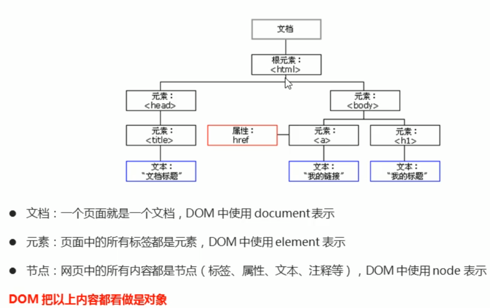

# Javascript基础

### 一、基础概念

1. JS是一种运行在客户端的脚本语言

2. JS的组成：ECMAScript（JS语法）、DOM（页面文档对象模型）、BOM（浏览器对象模型）

3. JS的书写位置：行内（直接在元素属性时设置）、内嵌（在<head>中创建的
~~~

##### -- 日期对象：Date

~~~javascript

~~~

##### -- 数组对象：Array

> 1. 创建：
>
>    ~~~javascript
>    var arr_01 = new Array(2)                // 创建一个有两个空元素的数组
>    var arr_02 = new Array(2, 5, 8)          // 创建一个内含2，5，8三个元素的数组
>    ~~~
>
> 2. 方法:
>
>    | 作用                                            | 方法                                                         | 参数                                                         |
>    | :---------------------------------------------- | :----------------------------------------------------------- | ------------------------------------------------------------ |
>    | 判断是否为数组                                  | Array.isArray(obj)  【等效于：obj instanceof Array】      | obj：需要检测的值                                            |
>    | 在数组末尾添加元素， 返回新数组的length属性  | arr.push(element1, …, elementN)                              | element：被添加到数组末尾的元素                              |
>    | 在数组头部添加元素， 返回新数组的length属性 | arr.unshift(element1, …, elementN)                           | element：被添加到数组末尾的元素                              |
>    | 删除数组的最后一个元素， 返回其删除的元素    | arr.pop( )                                                   | 无                                                           |
>    | 删除数组头部的第一个元素， 返回其删除的元素 | arr.shift( )                                                 | 无                                                           |
>    | 翻转数组 ， 且会修改原数组的值               | arr.reverse( )                                               | 无                                                           |
>    | 数组排序                                        | arr.sort([compareFunction])                                  | compareFunction[可选]：  用来指定按某种顺序进行排列的函数  默认按照各个字符的Unicode位点排序 |
>    | 返回字符串中是数据的索引号 【从头到尾】         | arr.indexOf(searchValue[, fromIndex])                        | earchValue：待查找字符串的值  fromIndex[可选]：开始查找的位置 |
>    | 返回字符串中是数据的索引号 【从尾到头】         | arr.lastindexOf(searchValue[, fromIndex])                    | earchValue：待查找字符串的值  fromIndex[可选]：开始查找的位置 |
>    | 返回数组的字符串形式                            | arr.toString( )  如：[0,1,2,3] -> '0,1,2,3'               | 无                                                           |
>    | 返回使用分隔符转换的字符串                      | arr.join([separator])                                        | separator[可选]：指定的分隔符  默认为`,`                  |
>    | 返回拼接的多个数组 ， 但不会修改原数组的值  | var new_arr = old_arr.concat (value1[, value2[, …[, valueN]]]) | value：拼接的数组或值                                        |
>    | 返回数组的子数组                                | arr.slice([begin[, end]])                                    | begin：开始提取字符的位置（索引值）  end[可选]：结束位置的索引值  默认提取值末尾 |
>    | 修改数组段 ， 且会修改原数组的值            | arr.splice(start[, deleteCount[, item1[, item2[, ...]]]])    | start：指定修改的开始位置  deleteCount[可选]：表示要移除的数组元素的个数  item[可选]：要在start位置添加的元素 |
>
> 3. 纯数字数组的排序方法：
>
>    ~~~javascript
>    // 纯数字数组的升序排序
>    arr.sort(
>        function (a, b) {
>            return a - b
>        }
>    )
>    // 纯数字数组的降序排序
>    arr.sort(
>        function (a, b) {
>            return b - a
>        }
>    )
>    ~~~

##### -- 字符串对象

> * 不可变性：字符串里面的值不可变，若是对这个值进行修改，则会重新开辟一段内存，存储新的数据，并把字符串的变量指向新开辟的地址，原有地址中值并不会销毁。所以字符串中所有的方法，都不会修改字符串本身，而是重新生成一个字符串
>
> * 方法：
>
>   |                  作用                   |                            方法                            |                             参数                             |
>   | :-------------------------------------: | :--------------------------------------------------------: | :----------------------------------------------------------: |
>   | 返回字符串中是数据的 索引号【从头到尾】 |           str.indexOf(searchValue[, fromIndex])            | searchValue：待查找字符串的值  fromIndex[可选]：开始查找的位置 |
>   | 返回字符串中是数据的 索引号【从尾到头】 |         str.lastindexOf(searchValue[, fromIndex])          | searchValue：待查找字符串的值  fromIndex[可选]：开始查找的位置 |
>   |          返回拼接的多个字符串           | str.concat(str2, [,…strN])  【等效于：str+str2+…+strN】 |            str2, [,…strN]：需要连接到str的字符串             |
>   |            返回字符串的子集             |                str.substr(start[, length])                 | start：开始提取字符的位置（索引值）  length[可选]：提取的字符数（默认提取值末尾） |
>   |            返回字符串的子串             |             str.slice(beginIndex[, endIndex])              | beginIndex：开始提取字符的位置（索引值）  endIndex[可选]：结束位置的索引值 （默认提取值末尾） |
>   |          返回指定位置上的字符           |       str.charAt(index)  【等效于：str[index]】        |                   index：返回字符的索引值                    |
>   |      返回指定位置上字符的 ASCII码       |                   str.charCodeAt(index)                    |                   index：返回字符的索引值                    |
>   |         返回替换后字符串中的 值         |    str.replace(regexp\|\|substr, newSubStr\|\|function)    | regexp：正则表达式对象或者其字面量  substr：被替换的字符串  newSubStr：替换的匹配部分的字符串  function：函数的返回值作为newSubStr的值 |
>   |           将字符串转化为数组            |                      str.split(limit)                      |                        limit：分隔符                         |

### 三、DOM

#### ① - 介绍

1. 简介：文档对象模型，是处理可扩展标记语言的标准编程接口

2. 作用：可以通过这些DOM接口改变网页的内容、结构和样式

3. DOM树：

   

4. Script标签的位置：因为为我们文档页面是从上往下加载，所以先得载入标签，在通过DOM修改。故script标签写在修饰的标签下面、body标签的内部

#### ② - DOM元素

1. 获取元素：

   > - 使用id获取标签：[document.getElementById(id)](https://developer.mozilla.org/zh-CN/docs/Web/API/Document/getElementById)
   > - 使用标签名获取标签：[baseElement.getElementsByTagName(name)    ](https://developer.mozilla.org/zh-CN/docs/Web/API/Document/getElementsByTagName)  →  baseElement：标签的父元素
   > - 使用类名获取标签（H5）：[document.getElementsByClassName(name)](https://developer.mozilla.org/zh-CN/docs/Web/API/Document/getElementsByClassName)
   > - 获取第一个指定选择器的对象（H5）：[document.querySelector(selectors)](https://developer.mozilla.org/zh-CN/docs/Web/API/Document/querySelector)
   > - 获取所有指定选择器的对象（H5）：[document.querySelectorAll(selectors)](https://developer.mozilla.org/zh-CN/docs/Web/API/Document/querySelectorAll)
   > - 获取body标签：[document.body](https://developer.mozilla.org/zh-CN/docs/Web/API/Document/body)
   > - 获取html标签：[document.documentElement](https://developer.mozilla.org/zh-CN/docs/Web/API/Document/documentElement)

2. 操作元素

   > * 获取元素内容：可读写
   >
   >   > - 获取从标签起始位置到最终位置的内容（不识别HTML标签且会去除换行和空格）：[element.innerText](https://developer.mozilla.org/zh-CN/docs/Web/API/HTMLElement/innerText)
   >   > - 获取从标签起始位置到最终位置的内容（识别HTML标签且不会去除换行和空格）：[element.innerHTML](https://developer.mozilla.org/zh-CN/docs/Web/API/Element/innerHTML)
   >
   > *  获取元素属性：不可以操作自定义属性
   >
   >   > - 通过【元素.属性】的方式可以获取属性值：适用于样式较少的情况
   >   > - 在CSS中设置预定修改的样式类，通过【元素.className（class为保留字，故不能直接使用class）】的方式修改类名，若要保留原先的类名，则使用多类名选择器的方法，在原先类名的后方添加类名：适用于样式较多的情况
   >
   > * 操作元素属性：保存和使用一些数据
   >
   >   > - 设置自定义属性：直接在标签里面使用自定义的属性名即可
   >   > - 获取元素指定属性：[Element.getAttribute(attributeName)](https://developer.mozilla.org/zh-CN/docs/Web/API/Element/getAttribute)
   >   > - H5新增的获取元素指定属性方法：标签.dataset.自定义属性名
   >   > - 修改或设定元素指定属性：[Element.setAttribute(name, value)](https://developer.mozilla.org/zh-CN/docs/Web/API/Element/setAttribute)
   >   > - 移除元素指定属性：[Element.removeAttribute(attributeName)](https://developer.mozilla.org/zh-CN/docs/Web/API/Element/removeAttribute)
   >
   > * Note：
   >
   >   > * 自定义属性：程序员为了方便操作自己给标签设定的属性值，而有H5的新规定：自定义属性需要以data-开头
   >   >
   >   > \> dataset：一个以data-开头的所有属性（自定义属性）的集合
   >   >
   >   > \> 若自定义属性名data-后接的属性名含有短横线(-)，则需要将(除data外的)用短横线连结的内容使用驼峰命名法来获取
   >   >
   >   > ​	如：data-list-index-name   >>   dataset.listIndexName

#### ③ - 节点

- 节点概述：DOM树中的所有节点均可以通过JS进行访问，所有HTML元素（节点）均可被修改，也可以创建和删除

- 节点属性：nodeType（节点类型）、nodeName（节点名称）、nodeValue（节点值）

- 节点类型：【主要】元素节点、属性节点、文本节点

- 节点的层级关系：父子兄层级关系（参考[DOM树](#DOMTree)）

- 节点介绍：

  |                             节点                             |                             代码                             |
  | :----------------------------------------------------------: | :----------------------------------------------------------: |
  |               返回指定的节点在DOM树中的父节点                | [Node.parentNode](https://developer.mozilla.org/zh-CN/docs/Web/API/Node/parentNode) |
  | 返回包含指定节点的子节点的集合  （包含元素节点和文本节点[如：换行]等等，故不常用） | [Node.childNodes](https://developer.mozilla.org/zh-CN/docs/Web/API/Node/childNodes) |
  | 返回包含指定节点的子元素节点的集合  （非标准，但是常用）  |                        Node.children                         |
  |                  返回指定节点的第一个子节点                  | [Node.firstChild](https://developer.mozilla.org/zh-CN/docs/Web/API/Node/firstChild) |
  |                 返回指定节点的最后一个子节点                 | [Node.lastChild](https://developer.mozilla.org/zh-CN/docs/Web/API/Node/lastChild) |
  |                返回指定节点的第一个子元素节点                |                    Node.firstElementChild                    |
  |               返回指定节点的最后一个子元素节点               |                    Node.lastElementChild                     |
  |                 返回指定节点的上一个兄弟节点                 | [Node.previousSibling](https://developer.mozilla.org/zh-CN/docs/Web/API/Node/previousSibling) |
  |                 返回指定节点的下一个兄弟节点                 | [Node.nextSibling](https://developer.mozilla.org/zh-CN/docs/Web/API/Node/nextSibling) |
  |               返回指定节点的上一个兄弟元素节点               |                 Node.previousElementSibling                  |
  |               返回指定节点的下一个兄弟元素节点               |                   Node.nextElementSibling                    |

  > 因为兼容性原因，我们在开发中一般使用Node.Children[0]和Node.Children[Node.length - 1]来获取第一个和最后一个子元素节点

* 节点操作

  > - 创建节点：[Document.createElement(tagName[, options\])](https://developer.mozilla.org/zh-CN/docs/Web/API/Document/createElement)   >> 创建之后还需要添加节点
  >
  > - 添加节点（从父结点的所有子节点后追加节点）：[parentNode.appendChild(aChild)](https://developer.mozilla.org/zh-CN/docs/Web/API/Node/appendChild)
  >
  > - 添加节点（从父结点的指定子节点前插入节点）：[parentNode.insertBefore(newNode, referenceNode)](https://developer.mozilla.org/zh-CN/docs/Web/API/Node/insertBefore)
  >
  > - 删除节点：[parentNode.removeChild(child)](https://developer.mozilla.org/zh-CN/docs/Web/API/Node/removeChild)
  >
  > - 克隆节点：[Node.cloneNode(deep)](https://developer.mozilla.org/zh-CN/docs/Web/API/Node/cloneNode)
  >
  >   \> deep为空或为false：浅拷贝。只克隆节点本身，不克隆里面的子节点
  >
  >   \> deep为true：深度拷贝。复制节点本身以及里面所有的子节点

* 创建标签：

  > \>> 方法一：使用`parentNode.innerHTML`将标签直接添加至父结点下 
  >
  > 例：`parentNode.innerHTML=”<a href='#'>添加的链接</a>“`
  >
  > Note：创建多个标签可通过拼接数组可提高效率
  >
  > \>> 方法二：使用`document.createElement()`创建标签，再将标签添加至父结点下
  >
  > 例：`var newEle = document.createElement('a')`   >>   `parentNode.appendChild(newEle)`

### 四、事件

#### ① - 事件基础

> - 事件三要素：事件源、事件类型、事件处理程序
> - 事件源：触发事件的对象
>
> - 事件类型：触发事件的动作 —— 如：鼠标点击、鼠标经过、按下键盘等
>
> - 事件处理程序：触发事件后执行的操作
>
> - 执行事件的步骤：
>
>   > 1. 获取事件源
>   > 2. 注册事件
>   > 3. 添加事件处理程序

#### ② - 注册事件

> - 传统方式：事件源.事件类型 = function( ){ }
>
> \> 唯一性：同一个元素同一个事件只能设置一个处理函数，最后设置的处理函数将覆盖前面注册的处理函数
>
> - 方法监听[注册方式](https://developer.mozilla.org/zh-CN/docs/Web/API/EventTarget/addEventListener)：EventTarget.addEventListener(type, listener[, useCapture\])
>
> \> 同一个元素同一个事件可以注册多个监听器，按注册顺序执行
>
> \> type类型：[事件参考](https://developer.mozilla.org/zh-CN/docs/Web/Events) 【最常用：click — 点击，使用时要加引号】

#### ③ - 删除事件

> - 传统方式：事件源.事件类型 = none
> - 方法监听[删除方式](https://developer.mozilla.org/zh-CN/docs/Web/API/EventTarget/removeEventListener) ： EventTarget.removeEventListener(type, listener[, useCapture\])
>
>  \> 该方法使用时第二个参数为函数名，故方法监听注册方式中不能最好不要使用匿名函数

#### ④ - DOM的事件流

> * 事件流：事件的传播过程
> * 三个阶段：
>   1. 捕获阶段：事件从Document（根结点）逐层向下传递，直到Dom树的根结点
>   2. 当前目标阶段：事件源处理
>   3. 冒泡阶段：事件从Dom树的根结点逐层向上传递，直到Document（根结点）
> * 作用：根据设置方法监听注册方式的useCapture参数可以设定处理事件流的阶段，根据阶段不同可以设置发生一次事件，不同的事件源处理的顺序

#### ⑤ - 事件对象

> * 事件对象：存储事件相关数据
>
> * 定义方式：—— 一般命名为event、evt、e
>
>   > 1. 传统方式：放在监听函数的( )内
>   > 2. 方法监听注册方式：再放在监听函数的( )内
>
> * 获取方式：直接通过名称获取
>
> * 事件对象的常见属性和方法
>
>   【鼠标事件】
>
>   |  鼠标事件   |     触发条件     |
>   | :---------: | :--------------: |
>   |   onclick   |     鼠标单击     |
>   | onmouseover |     鼠标经过     |
>   | onmouseout  |     鼠标移开     |
>   |   onfocus   |     获得焦点     |
>   |   onblur    |     失去焦点     |
>   | contextmenu | 唤起鼠标右键菜单 |
>   | selectstart |   鼠标开始选中   |
>   | onmousemove |     鼠标移动     |
>   |  onmouseup  |     鼠标弹起     |
>   | onmousedown |     鼠标按下     |
>
>   > 传统方式定义事件：事件名前加on
>   >
>   > 方法监听事件：事件名前无需加on
>
>   【鼠标事件对象】
>
>   | 鼠标事件对象 |                 说明                  |
>   | :----------: | :-----------------------------------: |
>   |  e.clientX   | 返回鼠标相对于浏览器窗口可视区的X坐标 |
>   |  e.clientY   | 返回鼠标相对于浏览器窗口可视区的Y坐标 |
>   |   e.pageX    |     返回鼠标相对于页面文档的X坐标     |
>   |   e.pageY    |     返回鼠标相对于页面文档的Y坐标     |
>   |  e.screenX   |     返回鼠标相对于电脑屏幕的X坐标     |
>   |  e.screenY   |     返回鼠标相对于电脑屏幕的Y坐标     |
>
>   ---
>
>   【键盘事件】
>
>   |  键盘事件  |                           触发条件                           |
>   | :--------: | :----------------------------------------------------------: |
>   |  onkeyup   |                   某个键盘按键被松开时触发                   |
>   | onkeydown  |                   某个键盘按键被按下时触发                   |
>   | onkeypress | 某个键盘按键被按下时触发 （但是它不能识别功能键，比如ctrl、shift、箭头等） |
>
>   >  事件执行顺序：keydown-keypress-keyup
>
>   【键盘事件对象】
>
>   - keyCode：返回触发键盘事件键位的ASCII码值
>   - 使用onkeyup和onkeydown捕获的事件使用keyCode不会区分大小写，但是onkeypress会