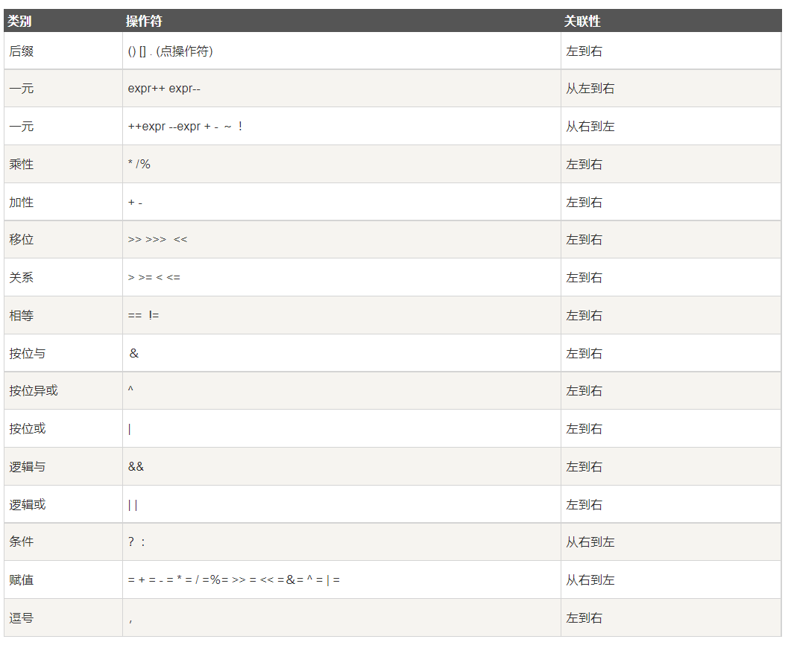

# Java基础

#### -- IDEA相关

~~~text
IDEA快捷键
> 复制一行代码并粘贴到此代码的后方：Ctrl + D
> 删除一行：Ctrl + Y
> 代码上移/下移：Alt + 上下键
> 生成代码：Alt + insert
> 导包/生成变量：Alt + Enter
> 代码块包围：Ctrl + Alt + t
> 查看源码：Ctrl + 鼠标点击（进入和回退：Ctrl + Alt + 左或右）
=======================================================================================================
IDEA代码模板
> main方法：psvm
--------------------------------
> 输出语句：sout
> 变量.sout：输出变量
> soutp：打印当前方法的形参
> soutm：打印方法的名字
> soutv：打印最近的变量
--------------------------------
> 普通递增for循环：fori
> 普通递减for循环：forr
> 增强for循环：iter 或者 变量.for
--------------------------------
> ifn：判断是否为空（if null）
> inn：判断是否不为空（if not null）
--------------------------------
> prsf：private static final
> psf：public static final
~~~

### 一、JAVA开发入门

1. JDK：是Sun公司提供的一套Java开发环境，包括Java编译器、Java运行工具、Java文档生成器、Java打包工具

2. Java运行机制：

   > 1. 使用编译器（javac.exe）编译`.java源文件`生成`.class字节码文件`
   >
   > 2. 通过java.exe启动Java虚拟机将`.class字节码文件`加载到内存中（类加载），然后虚拟机通过Java解析器对加载到内存中的Java类解析执行，得到计算机可以识别的`机器码文件`
   >
   >    > 因为Java虚拟机的存在，使Java可以跨平台运行（每个系统的虚拟机不同）
   >
   > 3. `机器码文件`在计算机上运行并显示结果

3. Java语言内置了多线程控制，可使用户程序并发执行

### 二、Java编程基础

1. 编写Java代码必须声明一个类，然后在类中编写实现业务需求

   ~~~text
   [修饰符] class 类名{
       程序代码
   }
   ~~~

2. 想将一串太长的字符串分行书写，需要用`+`将两个字符串连接起来（在`+`出断行）

3. 书写规范：

   > 包名：小写
   >
   > 类、接口名：大驼峰
   >
   > 常量：大写 + 下划线
   >
   > 变量：小驼峰

#### ① - [数据类型](https://www.runoob.com/java/java-basic-datatypes.html)

> **注意点**
>
> 1. 如果给long类型的变量所赋的值超过了int类型的数据范围，需要在后面加上字母L
>
>    `long num = 2200000000L`
>
> 2. 小数默认为double值，如果为float变量赋值，需要在所赋的值后加上字符F
>
>    `float pi = 3.1415926F`
>
> ---
>
> **变量类型转换**（类比于倒水，溢出就需要使用强制类型转换）
>
> 1. 自动类型转换：将类型范围较小的变量赋值给类型范围较大的变量时，会进行自动类型转换
>
>    byte,short,char → int → long → float → double 
>
> 2. 强制类型转换：将类型范围较大的变量赋值给类型范围较小的变量时，就需要进行强制类型转换
>
>    `(目标类型)待转换的值`
>
> 3. 表达式类型自动提升：在进行表达式计算时，可能会发生自动类型转换
>
>    > byte、short、char（取ASCII码值）会自动提示至int
>
> ---
>
> **常量**
>
> 1. 定义：`final 常量类型 常量名 [= 初始值]`
> 2. 常量在定义的时候可以不赋值，但是只能赋值一次
>
> ---
>
> **类型默认值**
>
> | **数据类型**           | **默认值** |
> | :--------------------- | :--------- |
> | byte                   | 0          |
> | short                  | 0          |
> | int                    | 0          |
> | long                   | 0L         |
> | float                  | 0.0f       |
> | double                 | 0.0d       |
> | char                   | 'u0000'    |
> | String (or any object) | null       |
> | boolean                | false      |

#### ② - 运算符

> **算数运算符**
>
> 取模（%）运算结果的正负取决于被除数的符号而与除数的符号无关
>
> ---
>
> **赋值运算符**
>
> 使用赋值运算符时，强制转换会自动完成，没有强制转换不会报错
>
> ---
>
> **比较运算符**
>
> ---
>
> **逻辑运算符**
>
> 短路与(&&)：真值和与(&)一致，但是还有一个其它的特性
>
> `A && B` → `A ? B : false`
>
> 短路或(||)：真值和或(|)一致，但是还有一个其它的特性
>
> `A || B` → `A ? true : B`
>
> ---
>
> **位运算符**
>
> `>>>`：无符号右移
>
> ---
>
> **条件运算符**（三目运算符）
>
> ---
>
> **instanceof运算符**：用于检查对象是否为一个特定类型（类或接口）
>
> #TODO

 优先级从上往下降低

#### ③ - 结构语句

>  Java的结构语句与C一致

#### ④ - 数组

> 1. 定义：
>
>    ~~~text
>    数据类型[] 数组名 = new 数组类型[数组长度];
>    数据类型[] 数组名 = new 数组类型[]{数组元素1, 数组元素2, …};
>    数据类型[] 数组名 = {数组元素1, 数组元素2, …};
>    ~~~
>
> 2. 访问：`数组名[角标]`
>
> 3. 遍历：使用for循环
>
>    可以使用普通的for循环搭配length方法使用，也可以使用增强for循环

### 三、面向对象

