# MySQL基础

### 一、基本概念

#### ①、数据库

1. 数据库（Database）是按照数据结构来组织、存储和管理数据的建立在计算机设备上的仓库（==存储数据的仓库==）

2. 分类：

   > 【基于数据存储形式】
   >
   > 网络数据库：类似于云存储
   >
   > 层级数据库：通过定向有序树来存储
   >
   > ==关系数据库==：建立在关系模型上的数据库

   >【基于存储介质】
   >
   >==关系型数据库==：存储在磁盘中
   >
   >非关系型数据库：存储在内存中

#### ②、关系型数据库

1. 基本概念：关系型数据库是建立在关系模型上的数据库。

   > 关系模型：由关系数据结构、关系操作集合、关系完整性约束
   >
   > * 关系数据结构：指的是数据以什么方式来存储，数据是以一种二维表的形式来存储
   >
   > * 关系操作集合：如何来关联和管理对应的存储数据，即SQL指令
   >
   > * 关系完整性约束：数据内部由对应的关联关系，数据与数据之间也有对应的关联关系
   >
   >   > 表内约束：表的每一列只能存放对应的数据
   >   >
   >   > 表间约束：自然界各实体都是有着对应的关联关系（外键）

2. 常见的关系型数据库：

   >* 小型关系型数据库：Microsoft Access 、SQLite
   >
   >* 中型关系型数据库：SQL Server、==Mysql==
   >* 大型关系型数据库：Oracle、DB2

#### ③、SQL介绍

1. 基本概念：结构化查询语言(Structured Query Language)，简称SQL，是一种专门为关系型数据库而设计的编程语言。

2. 分类：

   > 1. 数据查询语言（DQL）：用来从表中查询数据，代表指令：select
   > 2. 数据操作语言（DML）：用来写数据，即增、删、改，代表指令：insert、update、delete
   > 3. 事物处理语言（TPL）：专门用于事物安全处理，主要是与transaction有关的操作
   > 4. 数据控制语言（DCL）：专门用于权限管理，代表指令：grant、revoke
   > 5. 数据定义语言（DDL）：用于结构管理，代表指令：create、drop

#### ④、Mysql介绍

1. 基本概念：

   > 1. Mysql是一个关系型数据库管理系统
   > 2. Mysql开源免费
   > 3. Mysql中用到的指令就是SQL
   > 4. Mysql是一种C/S结构，即客户端/服务端

2. 启动和停止Mysql服务

   > * 服务端对应的软件：Mysqld .exe
   >
   > * 在cmd命令行窗口下使用：
   >
   >   > `net start 服务名 `：开启服务（服务名为mysql）
   >   >
   >   > `net stop 服务名`：关闭服务
   >
   > * 通过系统服务方式：
   >
   >   > 找到mysql启用或关闭服务

3. 登录和退出Mysql系统

   > * 客户端对应的软件：mysql.exe
   >
   > * 通过客户端与服务器进行连接认证，就可以进行操作
   >
   >   > 连接认证基本语法：`mysql -h主机地址 -P端口号 -u用户名 -p密码`
   >   >
   >   > 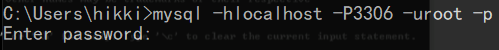
   >   >
   >   > 退出语法：使用SQL指令（任选其一）
   >   >
   >   > > 1. `exit;`
   >   > > 2. `\q`
   >   > > 3. `quit;`

4. Mysql服务端架构

   > Mysql服务端架构由以下几层构成：
   >
   > 1. 【最外层】数据库管理系统（DBMS）：专门管理服务器端的所有内容
   > 2. 【第二层】数据库（DB）：专门用于存储数据的仓库（多个）
   > 3. 【第三层】二维数据表（Table）：专门用于存储具体实体的数据
   > 4. 【第四层】字段（Field）：实际存储单元，具体存储某种类型的数据、

5. 数据库中常用的关键字：

   > row：行
   >
   > column：列

6. mysql中的语句结束符

   > `;`与`/g `：显示数据时，字段在最上方，下面显示数据
   >
   > `/G`：显示数据时，字段在最左侧，而数据在右侧横向排列
   
7. mysql中的记录长度限制：mysql规定，记录长度总长度不能超过65535个字节（不是字符）

8. 注释：

   > * 单行注释：`-- 注释内容`
   >
   > * 单行注释：`# 注释内容`
   >
   > * 多行注释：`/*注释内容*/`
   >
   > * 内联注释：`/*!注释内容*/`
   >
   >   > 当`!`后面所接的数据库版本号时，当实际的版本等于或是高于那个字符串，应用程序就会将注释内容解释为SQL，否则就会当做注释来处理。默认的，当没有接版本号时，是会执行里面的内容的。

### 二、SQL基本操作

#### ①、库操作

1. 创建数据库：`create database 数据库名字 [库选项]`

   > 库选项：
   >
   > 1. 字符集：`charset 字符集;`，代表着当前数据库下的所有表存储的数据默认指定的的字符集。若不设置，则采用安装DBMS时设定的字符集
   > 2. 校对集：`collate 校对集;`

   > 1. 创建的数据库数据，会以文件夹的形式存储在mysql/data目录下
   >
   > 2. 系统默认自带的数据库：
   >
   >    > 1. information_schema：保存数据库所有的结构信息
   >    > 2. mysql：核心数据库，存储权限关系
   >    > 3. performance_schema：效率库
   >    > 4. test：测试的空库
   >
   > 3. 数据库文件夹中会有一个.opt文件，保存库选项

2. 显示数据库：

   > 1. 显示所有数据库：`show databases;`
   >
   > 2. 显示部分数据库：`show databases like 匹配模式;`
   >
   > >匹配模式：
   > >
   > >`_`：匹配当前位置单个字符
   > >
   > >`%`：匹配指定位置多个字符
   >
   > 3. 显示数据库创建语句：`show create database 数据库名字;`

3. 选择数据库：

   > * 数据存储在表中，表又存储在数据库中，如果要操作数据，必须要进入到数据库中，所以需要选择数据库
   > * 基本语法：`use 数据库名字;`

4. 修改数据库的字符集（一旦修改成功，那么对应的.opt文件中的数据将会被修改）：

   > 基本语法：`alter database 数据库名字 charset [= ]要修改为的字符集;`

5. 删除数据库（删除数据库成功，则mysql/data目录下的数据库对应的文件夹也将被删除）

   > 基本语法：`drop database 数据库名字;`

#### ②、表操作

1. 普通的创建数据表

   > 1. 基本语法：`create table 表名(字段名 字段类型[字段属性], 字段名 字段类型[字段属性], …)[表选项];`
   >
   > 2. 将表放入到对应数据库下的方法：
   >
   >    > 1. `create table 数据库名 表名(字段名 字段类型[字段属性], 字段名 字段类型[字段属性], …)[表选项];`
   >    > 2. 在创建数据表之前，先选择（use）数据库
   >
   > 3. 表选项：（与数据库选项类似）
   >
   >    > 1. engine：存储引擎，默认为innodb（5.5之前默认为mylsam）
   >    > 2. charset：字符集（级别比数据库高）
   >    > 3. collate：校对集（级别比数据库高）
   >
   >    > 设置的格式为：`engine 选择的存储引擎 charset 选择的字符集 collate 选择的校对集;`[^注1]
   >    >
   >    > [^注1]:可以任选一项或者选择任意项进行修改

2. 通过复制已有表结构的方式创建数据表

   >1. 基本语法：`create table 新表名 like 模板表名;`
   >
   >2. 通过`数据库名.数据表名`的方式，可以指定模板表为其它数据库中的表

> 每当一个数据表创建就会在其对应的数据库下（文件夹内）创建一些文件
>
> .frm文件：结构文件，来自于innodb存储引擎。而innodb存储引擎所有的数据都存储在外部（mysql/data文件夹）的ibdata文件中

3. 显示数据表

   > 查看所有表：`show tables;`
   >
   > 匹配显示表：`show tables like 匹配模式`

4. 显示表结构（三种方式结果相同）

   > * `describe 表名`
   > * `desc 表名`
   > * `show columns form 表名 `

   >显示的结果：
   >
   >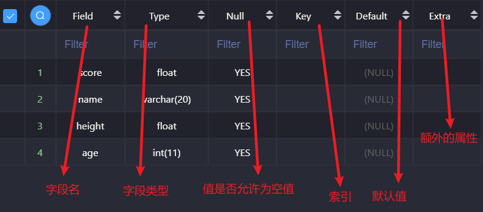

5. 显示表的创建语句

   > 基本语法：`show create table 表名;`

6. 修改表结构

   > 1. 修改表名：`rename table 旧表名 to 新表名;`
   >
   >    数据库表名的命名规则：取数据库的前两个字母加下划线加在表名的前面
   >
   > 2. 修改表选项：`alter table 表名 表选项 选项值;`
   >
   > 3. 新增字段：`alter table 表名 add[ column] 新字段名 列类型[ 列属性][ 位置];`
   >
   >    > 位置：[可选选项] ，默认为加到表尾，但是可以设置为以下插入位置
   >    >
   >    > 1. `first`：插入到表头
   >    > 2. `after 字段名`：放到选择的字段之后
   >
   > 4. 修改字段名：`alter table 表名 change 旧字段名 新字段名 字段类型[ 列属性][ 新位置];`[^注2]
   >
   >    [^注2]:修改字段名必须重新设置字段类型
   >
   > 5. 修改字段类型（属性）：`alter table 表名 modify 字段名 新类型[ 新属性][ 新位置];`
   >
   > 6. 删除字段：`alter table 表名 drop 字段名;`

7. 删除表结构

   > `drop table 表名1[, 表名2, …];`

#### ③、数据操作

1. 插入操作：将数据以SQL的形式插入到指定的数据表（字段）里面

   > 基本语法：`insert into 表名[(字段列表)] value(对应的值列表)`
   >
   > > 注意：
   > >
   > > 1. 值列表不一定与表结构完全一致，但是若不一致，则需要设置字段列表与其一一对应
   > >
   > > 2. 若设置了字段列表，相当于对表中指定字段插入数据；而不设置字段列表，相当于对表中所有字段插入数据，且必须保证值列表与表结构完全一致

2. 查询操作

   > * 查询表中的所有字段：`select * from 表名`
   >
   > * 查询表中的部分字段：`select 字段列表 from 表名`
   >
   >   > 若需要查询多个字段，则字段列表使用`,`分隔
   >
   > * 简单的条件查询：`select 字段列表/* from 表名 where 字段名 = 值`[^注3]
   >
   >   [^注3]:在mysql中`=`代表判断相等，不存在`==`的说法

3. 删除操作

   > 基本语法：`delete from 表名 [where 条件] `
   >
   > > 若不加`where`条件设置，则代表删除表中的全部数据

4. 更新操作：修改某条记录中的部分字段数据

   > 基本语法：`update 表名 from 字段名 = 新值 [where 条件]`
   >
   > > 若不加`where`条件设置，则代表更新表中的全部字段数据，所以更新数据通常会伴随条件

### 三、字符集

1. 字符编码：每个字符在计算机中对应的二进制码

2. 字符集：一种字符编码的集合（规范）

   > 常见的字符集：==ASCII==、GB2312（简中专用）、BIG5（繁体专用）、==Unicode==

3. 字符集出错的原因：

   > 用户是通过mysql.exe操作mysqld.exe，而真正的SQL执行由mysqld.exe来做。如果mysqld.exe没有获取到mysql.exe使用的字符集，则会将mysql.exe 传来的数据按照mysqld.exe默认的字符集进行操作，导致字符集矛盾出错。

4. 字符集出错的解决方案：mysql.exe将自己使用的字符集告知mysqld.exe

   > 基本语法：`set names 字符集`
   >
   > 深层原理：
   >
   > > `set names 字符集`等价于：[^注4]
   > >
   > > 1. `set character_set_client = 字符集` ：为了让服务器识别客户端传来的数据
   > > 2. `set character_set_results = 字符集` ：为了更好地帮助服务器和客户端进行字符集的转换
   > > 3. `set character_set_connection = 字符集` ：为了告诉客户端服务端所返回数据的字符集
   >
   > [^注4]:connection只是为了更方便的让客户端与服务器进行数据转化而设置的，如果只改变client和results也能解决字符集出错的问题

   >知识补充：
   >
   >1. mysql.exe和mysqld.exe之间的处理关系分为三层：
   >
   >> 1. 客户端（mysql.exe）传入数据给服务器 （mysqld.exe）：client => character_set_client
   >> 2. 服务端返回数据给客户端：server => character_set_results
   >> 3. 客户端与服务端之间的连接：connection => character_set_connection
   >
   >2. 我们可以通过指令：` SHOW variables like 'character_set%'; `  查看系统保存的三种关系处理字符集
   >
   >   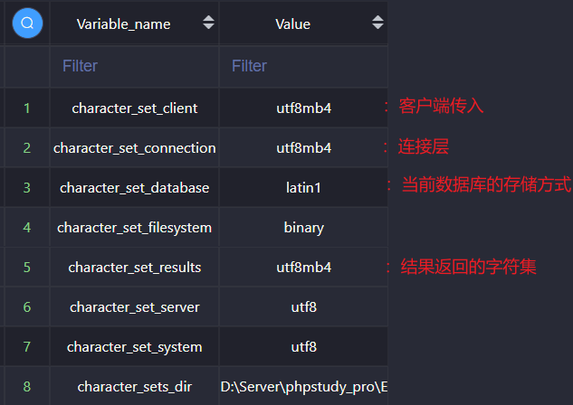
   >
   >3. 我们可以通过指令：`set 变量名 = 值`修改服务器变量

### 四、列类型与列属性

#### ①、列类型（字段类型）

##### （A）整型

> 分类：
>
> * ==tinyint==：迷你整型，采用一个字节存储（-128 ~127）
> * smallint：小整型，采用两个字节存储
> * mediumint：中整型，采用三个字节存储
> * ==int==：标准整型，采用四个字节存储（-2147483648~2147483647）
> * bigint：大整型，采用八个字节存储

> Note：
>
> 1.  无符号整型设定：在类型名之后加上`unsigned`属性，加上后，数据会从0开始存储
>
> 2. 显示长度：数据（整型）在进行数据显示的时候最长可以达到的位数，注意`-`也占一位
>
>    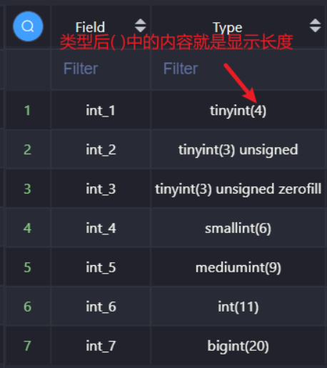
>
> 3. 直接在类型名之后加上( )，可以直接设定整型的显示长度。显示长度可以任意设定。若数据超出了指定长度但是没有超出数据规定的范围，则不会有影响。数据长度只有在设置`zerofill`属性时有用 —— 对不够长度的数据进行补充。
>
> 4. 在类型名之后加上`zerofill`属性，会自动给类型加上`unsigned`属性，并从左侧开始填充，直到满足显示长度。若是在填充0之前已经超出长度，则不会进行处理

##### （B）小数型

> 分类：
>
> * 浮点型：精度类型，是一种有可能丢失精度的数据类型（尤其是在超出存储范围的时候）。存储单元有一部分用来存储数据，另一部分用来存储指数。
>
> > 分类：
> >
> > 1. float：单精度类型，系统提供4个字节来存储数据，表示的范围大约为10^38，精度在7位以内。
> >
> >    > 基本语法：
> >    >
> >    > 1. `float`：直接使用，表示不指定小数位的浮点数
> >    >
> >    > 2. `float(M, D)`：表示一个存储M个有效数字，其中小数部分占D位
> >    >
> >    >    如：float(5,2) => 整数部分为3位，小数部分为2位的浮点数
> >
> > 2. double：双精度类型，系统提供8个字节来存储数据，表示的范围大约为10^308，精度在15位以内。
>
> > Note：
> >
> > 1. 用户不能输入数据直接超过指定的整数部分长度，但如果是系统自动进位导致数据直接超过指定的整数部分长度，将不会有任何影响
> > 2. 浮点数可以用e计数法（科学计数法）表示：A`e`B = A * 10^{B}
> > 3. 应用：保存那些数量特别大，大到可以不那么精确的数据
>
> * 定点数（decimal）：能够保证整数部分数据精确的小数类型[^注5]。系统会自动根据存储的数据分配存储空间——每大概9个数就会分配四个字节来存储，同时整数部分和小数部分是分开的。
>
>   [^注5]:因为超出长度的部分要四舍五入，所以小数部分可能不精确
>
>   > `Decimal(M, D)`：M代表总长度，最长不超过65位。D代表小数部分长度，最长不超过30位。
>
> > Note：
> >
> > 1. 用户不能输入数据直接超过指定的整数部分长度，且如果是系统自动进位导致数据直接超过指定的整数部分长度，系统将会报错
> > 2. 应用：涉及到钱等一系列要求精确性的实体

##### （C）日期时间类型

> 日期类型：date
>
> * 系统使用三个字节来存储数据，数据的格式为：`YYYY-mm-dd`
>
>   能表示的范围在`1000-01-01 ~ 9999-12-12`，初始值为`0000-00-00`

> 时间类型：time
>
> * 系统使用三个字节来存储数据，数据的格式为：`HH:ii:ss`
>
>   能表示的范围在`-838:59:59 ~ 838:59:59`
>
> * 在输入时间类型时，在时间的前面加上任意天数，则获取到的时间会加上天数*24小时
>
>   `5 12:12:12`=>`132:12:12`
>
> * 用处：表示时间区间，而不是特定时间点

> 日期时间类型：datetime
>
> * 系统使用八个字节存储数据，数据的格式为`YY-mm-dd HH:ii:ss`
>
> * 能表示的范围在`1000-01-01 00:00:00 ~ 9999-12-12 23:59:59`，初始值为`0000-00-00 00:00:00`

> 时间戳类型：timestamp
>
> * mysql中的时间戳与PHP中的格式有所不同，它的格式依然为`YY-mm-dd HH:ii:ss`
>
> * 这一个记录有任意数据发生修改时，时间戳类型会自动转换为当前的时间
>
> * 实质：通过时间戳存储时间，但是输出的时间仍然为`YY-mm-dd HH:ii:ss`格式
>
>   > 1. 在存储时间戳数据时，先将本地时区时间转换为UTC时区时间，再将UTC时区时间转换为INT格式的毫秒值(使用UNIX_TIMESTAMP函数)，然后存放到数据库中。
>   > 2. 在读取时间戳数据时，先将INT格式的毫秒值转换为UTC时区时间(使用FROM_UNIXTIME函数)，然后再转换为本地时区时间，最后返回给客户端。

> 年类型：year
>
> * 系统使用一个字节存储数据
>
> * 能表示的范围在`1900 ~ 2155`
>
> * 数据插入的格式：
>
>   1. 两位数：
>
>      > 当输入的值<=69时，存储的年份为20+输入数据
>      >
>      > 当输入的值>=70时，存储的年份为19+输入数据
>
>   2. 四位数：`1900 ~ 2155`的任意年份

> ​    ==在mysql配合PHP使用时，因为mysql中有十分强大的时间处理函数，若以mysql中一般不需要使用日期时间类型保存时间，而是使用整型保存对应PHP中的时间戳==

##### （D）字符串类型

> char：指定长度后，系统会分配指定大小的空间用于存储数据，不会因为数据而改变所需要的空间
>
> * 基本语法：`char(L)`，L代表字符数（中文与英文字符都为1），L的范围为0~255

>varchar：指定长度后，系统会根据实际存储的数据来计算分配合适的空间，需保证数据不超出指定的长度
>
>* 基本语法：`varchar(L)`，L代表字符数，L的长度理论值为0到65535（因为mysql中记录长度的最大值为65535个字节，所以要L一般达不到理论值）
>
>* > 如果采用utf-8存储，最多只能存储21844个字符
>  >
>  > 如果采用gbk存储，最多只能存储32766个字符
>
>* 每个varchar数据产生后，系统会在其后面增加1~2个字节的额外开销用于记录varchar保存数据的长度，所以实际存储数据的字符数不会达到65535。若存储的字符数小于127，则会增加1个字节用于记录varchar保存数据的长度，否则，需要增加2个字节的开销
>
>* varchar与char数据存储的对比：（假设以utf-8的标准存储数据，每个字符占3个字节）
>
> | 存储数据 | char(2) | varchar(2) | char所占字节 | varchar所占字节 |
> | -------- | ------- | ---------- | ------------ | --------------- |
> | A        | A       | A          | 2 * 3 = 6    | 1 * 3 + 1 = 4   |
> | AB       | AB      | AB         | 2 * 3 = 6    | 2 * 3 + 1 = 7   |
>
>  （char的查找效率比varchar高，但只高了一点点）

> text：文本类型
>
> * 分类：
>
>   > tinytext：系统使用一个字节来保存（数据所在的位置），实际能够存储的数据（字符数）为：2^8 + 1
>   >
>   > text：系统使用两个字节来保存，实际能够存储的数据为：2^16 + 2
>   >
>   > mediumtext：系统使用三个字节来保存，实际能够存储的数据为：2^24 + 3
>   >
>   > longtext：系统使用三个字节来保存，实际能够存储的数据为：2^32 + 4
>
> * Note：
>
>   > 1. 在选择对应的存储文本的时候，不用刻意的取选择text类型，系统会自动根据存储的数据长度来选择合适的文本类型
>   > 2. 在选择字符存储时，若数据超过255字符，则一定选择text类型存储

> enum：枚举类型（单选）
>
> * 定义：在数据插入前，先设定几个选项，这几个选项中的其中一个就是可能最终出现的结果。所以枚举类型有规范数据的作用，若不再设定值中的数据，不能输入。
> * 实例：性别（男、女、保密）
>
> * 基本语法：`enum('数据值1', '数据值2', …)` 
>
> * 系统提供了1~2个字节来存储枚举数据，通过计算enum列举的具体值来选择实际的存储空间。如果值列表在255以内，则采用1个字节保存，若大于255而小于65535，则采用2个字节保存。
>
> * 存储原理：在系统设定枚举类型的时候，会给每一个元素定义一个下标（从1开始）。实际上字段上存储的值并不是真正的字符串，而是对应的下标数值。那么，在数据插入的时候，就可以使用数值来进行插入。
>
> * 枚举的意义：
>
>   > 1. 规范数据
>   > 2. 节省存储空间

> set：集合类型（复选）
>
> * 定义：类似于枚举类型，但是可以同时保存多个选项
>
> * 实例：爱好（篮球、足球、羽毛球、网球、乒乓球）
>
> * 基本语法：`set('数据值1', '数据值2')`
>
> * 系统提供了多个字节来存储集合数据，但是系统会自动计算来选择具体存储单元。如果使用1个字节，则set最多只能有8个选项；如果使用2个字节，则set最多只能有16个选项；如果使用3个字节，则set最多只能有24个选项；如果使用8个字节，则set最多只能有64个选项。
>
> * 存储原理：使用二进制位来进行控制，1表示该选项被选中，0表示该选项未被选中，且系统在最后会将最终获得的二进制数前后颠倒再进行存储。实际上字段上存储的值并不是真正的字符串，而是对应的下标数值，则在数据插入的时候，就可以使用数值来进行插入。
>
> * 集合的意义：
>
>   > 1. 规范数据
>   > 2. 节省存储空间

#### ②、列属性（字段属性）

##### （A）简单属性

1. Null属性：如果对应的值为yes，表示该字段可以为空；反之，则代表不能为空。

   > 若不对Null属性进行设定，则Null属性的值为yes。
   >
   > 若想要字段不可以为空，则需要在列属性中增加`NOT NULL`

2. Default属性：默认值，若用户背不进行数据的插入，则将字段值设置为默认值，通常的默认值为Null

   > 默认值另一种使用方式：显示的告知字段使用默认值 —— 在进行数据插入的时候，对使用默认值的字段值直接使用default
   >
   > `insert into 表名(使用默认值的字段) value(default)`

3. Comment：列描述，专门用于给开发人员进行维护的一个注释说明

   > 基本语法：设置列属性为`comment '字段描述';`
   >
   > 查看comment：`show create table 表名`

##### （B）主键

1. 概念：（primary key）在一张表中有且只有一个字段，里面的值具有唯一性，可以唯一标识这条记录

2. 创建：

   > * 随表创建
   >
   >   > * 方案一：直接在需要当作主键的字段之后添加`primary key`属性来确定主键
   >   >
   >   >   ~~~mysql
   >   >   create table 表名(
   >   >   	字段名 字段类型 primary key
   >   >   )charset utf8;
   >   >   ~~~
   >   >
   >   > * 方案二：在所有字段之后增加primarty key选项：`primarty key(字段信息)`
   >   >
   >   >   ~~~mysql
   >   >   create table 表名(
   >   >   	字段名 字段类型 [字段属性],
   >   >       primary key(主键名)
   >   >   )charset utf8;
   >   >   ~~~
   >
   > * 表后增加
   >
   >   > 基本语法：`alter table 表名 add primary key(主键名);`

3. 查看主键：

   > * 方案一：查看表结构
   >
   >   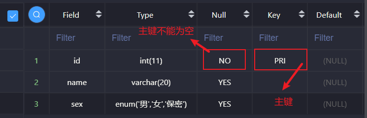
   >
   > * 方案二：查看表创建语句
   >
   >   

4. 删除主键

   > 基本语法:`alter table 表名 drop primary key`
   >
   > Note：删除掉主键，但是Null属性不会改变

5. 复合主键

   > 基本语法：`alter table 表名 add primary key(主键1, 主键2, 主键3, …);`

6. 主键约束：

   > 1. 当前字段数据不能为空
   > 2. 当前字段数据不能与其它数据重复

7. 主键分类（了解）：

   > 业务主键：主键所在字段具有业务意义
   >
   > 逻辑主键：自然增长的整型（应用广泛）

##### （C）自增长

1. 概念：（auto_increment），当给定某个字段该属性之后，该列的数据在没有指定确定数据的情况下，系统会根据之前已经存在的数据进行自动增加后，填充数据，通常自动增长应用于逻辑主键。

2. 原理：

   > 1. 在系统中维护一组数据，用来保存当前使用了自动增长属性的字段，记住当前对应的数据值，再给定一个指定的步长。
   > 2. ==（触发条件）若用户在进行数据插入的时候，如果没有给定值（null）==，则系统会在原始值上加上步长变成新的数据填充到其中

3. 特性：

   > 1. 自增长一旦触发使用后，会自动的在表选项中增加一个选项`auto_increment`
   > 2. 因为自增长会添加到表选项中，所以一个表只能拥有一个自增长
   > 3. 如果数据插入中没有触发自增长，那自增长不会表现。且如果此次设定的值比自增长的值要大，那么下一次触发时，自增长会根据此次设定的值来递增步长
   > 4. 修改自增长的值`auto_increment`，必须大于当前自增长的值

4. 创建：添加一个列属性`auto_increment`

5. 修改：

   > 使用修改表结构来修改表选项中的`auto_increment`，其值表示自增长当前取到的值，下一次触发自增长，该值变为此次的值加上步长

6. 删除：

   > 修改字段属性，在字段属性之后不再保留`auto_increment`

7. 自增长的参数设定

   > 在系统中，有一组变量用来维护自增长的初始值和步长
   >
   > 可以使用如下语句来查看自增长初始变量：`show variables like 'auto_increment%'`
   >
   > 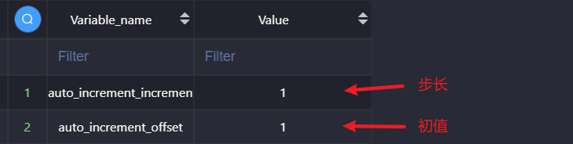
   >
   > 我们可以通过指令：`set 变量名 = 值`来修改自增长的步长和初值

##### （D）唯一键

1. 概念：（unique key）用来保证对应的字段中的数据唯一性 。  

2. 特性：

   > 1. 一张表中可以有多个唯一键
   > 2. 唯一键允许字段数据为NULL，且NULL可以为多个，因为它不参与比较
   > 3. 唯一键的效果：在不为空的情况下不允许重复
   > 4. 一般主键都是单一字段（逻辑主键），而其它要限制唯一性的内容使用唯一键处理

3. 创建：

   > 1. 直接在表字段之后增加唯一键标识符：`unique`
   > 2. 在所有的字段之后添加语句`unique key(字段列表)`
   > 3. 创建完表之后添加唯一键，使用：`alter table 表名 add unique key(字段列表)`

4. 查看：

   > 1. 唯一键是属性，可以通过查看表结构查看唯一键
   >
   > 2. 查看表创建语句：
   >
   >    

5. 删除：

   > 因为一个表中的唯一键有多个，所以在删除的时候需要指定特定的唯一键
   >
   > > 基本语法：`alter table 表名 drop index 唯一键名字;`
   > >
   > > Note：`index`是查询索引的关键字，而唯一键是索引的一种

6. 复合唯一键：

   > 基本语法：`alter table 表名 add unique key(唯一键1, 唯一键2, …);`

⑦、表关系：表与表之间（各实体之间）的关系，并通过这种关系设计表结构

1. 一对一：一张表中的一条记录与另一张表中最多有一条明确的关系

   > 1. 设计方案：两张表使用相同的主键即可
   > 2. 使用场景：在一张表中常用的信息经常去查询，而不常用的信息偶尔才会用到
   > 3. 解决方案：将两张表拆分，常见的放一张表，不常见的放另一张表

2. 一对多（多对一）：表A中一条记录在表B中可以匹配到多条记录，而表B中的记录在表A中有且只有一条记录与之匹配

   > 1. 设计方案：在`多关系`的表中维护一个字段，这个字段就是`一关系`的主键
   > 2. 使用场景举例：一个母亲有多个孩子，多个孩子有同一个母亲
   > 3. 解决方案：在每个孩子表中维护一个字段保存其对应母亲的信息

3. 多对多：一张表中一条记录在另外一张表中可以匹配到多条记录，反之亦然1. 

   > 1. 设计方案：设计第三张表维护两张表对应的联系
   > 2. 使用场景举例：一个老师教过多个学生，一个学生也有多个老师
   > 3. 解决方案：设计第三个表，保存老师和学生的对应关系。找一个老师对应的学生，可以通过第三个表查询；找一个学生对应的老师，也可以通过第三个表查询。也就相当于将多对多的关系，简化为两个多对一的关系。

### 五、SQL高级数据操作（P.S. 就是复杂一丢丢的数据操作）

#### ①、新增数据

1. 多数据插入：

   > 基本语法：`insert into 表名[(字段列表)] values(值列表), (值列表), …;`

2. 主键冲突：在有的表中，使用业务主键。但是在数据插入时，又不确定数据表中是否已经存在对应的主键。

   > 解决方案：替换原有会产生冲突的数据
   >
   > * 方案一：主键冲突更新
   >
   >   `insert into 表名 [(字段列表)] values(值列表) on duplicate update 字段 = 新值;`
   >
   > * 方案二：主键冲突替换 —— 效率比`insert`低
   >
   >   `replace into [(字段列表)] values(值列表);`

3. 蠕虫复制：一分为二，成倍增加。从已有的数据中获取数据，并且将获取到的数据插入到已有表中。

   > 基本语法：`insert into 表名 [(字段列表)] select * from 待复制的表`
   >
   > 使用场景：可以在短期之内快速增加表的数据量。从而测试表的压力，还可以通过大量数据来测试表的效率。
   >
   > > Note：
   > >
   > > 1. 可以自我复制，产生大量重复数据
   > > 2. 注意主键冲突的情况

#### ②、更新数据

> ​		在更新数据时，通常会伴有条件判断。但是有些时候，因为有大量重复数据，只使用条件判断并不能很好的完成任务。这时候，我们就可以使用`limit`来限制更新数据的数量
>
> ​		基本语法：`update 表名 from 字段名 = 新值 [where 条件] limit 数量`

#### ③、删除数据

> 1. 在删除数据时，通常会伴有条件判断。但是有些时候，因为有大量重复数据，只使用条件判断并不能很好的完成任务。这时候，我们就可以使用`limit`来限制删除数据的数量。
>
>    >  基本语法：`delete from 表名 [where 条件] limit 数量`
>
> 2. 在使用`delete`删除完所有数据时，无法重置自增长`auto_increment`。
>
>    > 解决方案：直接重置表（相当于先`drop`再`create`）
>    >
>    > 语法：`truncate 表名`

#### ④、查询数据

> 1. 完整的查询指令：[ ]外的内容为查询的主句；[ ]内的数据称为查询的五子句（顺序不能颠倒）
>
>    `select select选项 字段列表 from 数据源[ where 条件 gruop by 分组 having 条件 order by 排序 limit 限制]`
>
> 2. `select 选项`：系统该如何对待查询得到的结果
>
>    > 1. all：（默认）表示保存所有的记录
>    > 2. distinct：去重。即去除重复的记录（所有字段都相同），只保留一条。
>
> 3. `字段列表`：有时候需要从多张表中获取数据，在获取数据的时候，可能存在不同的表中有同名字段，最终只会保留一个
>
>    > 解决方法：将同名字段改为不同名的字段（取别名）
>    >
>    > 基本语法：`字段名 [as ]别名`[^ 注6]
>    >
>    > [^注6]:这个语句放在字段列表的位置，相当于给表中选定的字段取别名，最后显示的时候，将用别名显示数据
>
> 4. `from 数据源`：为前面的查询提供数据，而数据源只要求是一个符合二维表结构的数据即可。
>
>    >1. 单表数据：`from 表名`
>    >
>    >2. 多表数据（没有任何意义，要尽量避免）：`from 表1, 表2, …`，得到的结果是多张表的记录数相乘，字段数拼接
>    >
>    >   > 本质：求多张表的笛卡尔积 
>    >   >
>    >   > 笛卡尔积：假设集合A={a, b}，集合B={0, 1, 2}，则两个集合的笛卡尔积为{(a, 0), (a, 1), (a, 2), (b, 0), (b, 1), (b, 2)}
>    >
>    >3. 动态数据：因为数据源只要是一个符合二维表结构的数据，所以说可以是一个从表中查询出来的二维结果表（子查询）
>    >
>    >   > 基本语法：`from (select 字段列表 from 表) as 别名`
>    >   >
>    >   > Note：因为二维结果表不能被直接识别，所以要取别名
>
> 5. `where子句`：从数据表获取数据时，进行条件筛选
>
>    > 数据获取原理：针对表去对应的磁盘处逐条获取所有的记录
>    >
>    > where子句的作用：在从磁盘拿到数据的时候，进行条件判断。若符合，则保存到结果表中；若不符合，则舍弃。
>
> 6. `group by子句`：根据指定的字段将数据进行分组，分组是为了统计而不是查看
>
>    > 1. 在使用`group by子句`进行分组后，只会保留每组的第一条数据	
>    >
>    > 2. 基本语法：`group by 分组的条件`，即根据分组的条件，将条件相同的字段分为一组
>    >
>    > 3. 统计函数（聚合函数）：用在`gruop by`分组时，`where`不能使用
>    >
>    >    > * `count()`：统计每一组中的数量，如果统计的目标是字段，则为空的字段不在统计范围内。若指定参数为*，表示统计记录
>    >    > * `avg()`：求平均值
>    >    > * `sum()`：求和
>    >    > * `max()`：求最大值
>    >    > * `min()`：求最小值
>    >
>    >    >  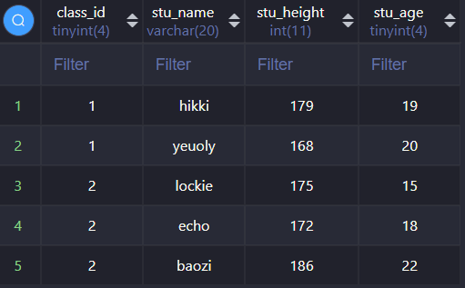
>    >    >
>    >    > 需求：按照班级统计每班人数、最大年龄、最矮身高、平均年龄。
>    >    >
>    >    > `SELECT class_id,COUNT(*),MAX(stu_age),MIN(stu_height),AVG(stu_age) FROM my_student GROUP BY class_id;`
>    >    >
>    >    > 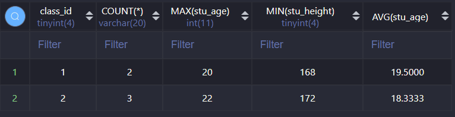
>    >
>    > 4. `group_concat()`：将分组中的指定字段合并，即字符串拼接（分隔符为`,`）
>    >
>    >    > 示例：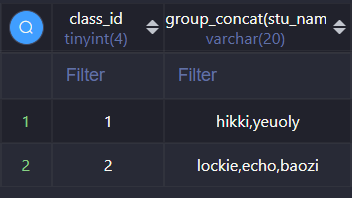
>    >
>    > 5. 多分组：将数组根据某个字段进行分组之后，对已经分组的数据再次进行分组
>    >
>    >    > 基本语法：`group by 字段1, 字段2`，表示先按照字段1进行分组，再按照字段2进行分组，以此类推
>    >
>    > 6. 分组排序
>    >
>    >    > 在mysql中，分组默认有排序的功能：按照分组字段进行排序，默认是升序
>    >    >
>    >    > 基本语法：`group by 字段1[asc|desc], 字段2[ascc|desc]`（asc：升序；desc：降序）
>    >
>    > 7. 回溯统计
>    >
>    >    > 当进行多分组后，往上统计的过程中，需要层层上报。我们将这种层层上报统计的过程称为回溯统计：每一次分组向上统计的过程都会产生一次新的统计数据，而且当前数据对应的分组字段为NULL。相当于在每一次分组统计完成后，都将产生一个NULL数据，记录分组统计的共同的数据。
>    >    >
>    >    > 基本语法：`group by 字段 [asc|desc] with rollup`	
>    >    >
>    >    > 实例：
>    >    >
>    >    > 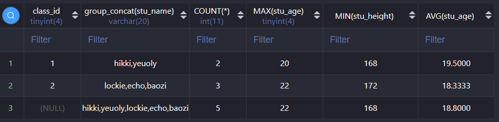
>
> 7. `having 子句`
>
>    > 1. `having子句`的本质和`where子句`一样，是用来进行数据条件的筛选
>    >
>    > 2. 特性：
>    >
>    >    > 1. `having子句`必须放在`group by子句`之后，可以针对分组统计的数据进行筛选，而 `where子句`不行
>    >    > 2. `where`是在内存中操作，只能使用字段名；而where之后的语句，是在内存中操作，可以使用别名
>    >    > 3. 所以`having`可以使用聚合函数和字段别名
>
> 8. `order by子句`（排序子句）
>
>    > 1. 概念：根据校对规则对数据进行排序
>    >
>    > 2. 基本语法：`order by 字段名（或数字） asc|desc`【asc(默认)：正序、desc：逆序】
>    >
>    >    > 数字等效于位于第n列的字段（从左到右从1开始递增）
>    >
>    > 3. 多字段排序（排序的优先级依次降低）：`order by 字段1 asc|desc, 字段2 asc|desc, …`
>
> 9. `limit 子句`（限制子句）
>
>    > 1. 概念：用来限制记录数量获取 
>    >
>    > 2. 使用场景：
>    >
>    >    > 1. 记录数限制：限制获取记录的数量
>    >    >
>    >    >    > 基本语法：`limit 数量 `
>    >    >    >
>    >    >    > Note：通常时使用最多的是`limit 1`
>    >    >
>    >    > 2. 分页：利用limit获取指定区间的数据
>    >    >
>    >    >    > 基本语法：`limit offset,length `
>    >    >    >
>    >    >    > Note：
>    >    >    >
>    >    >    > 1. offset：偏移量，即开始的位置，默认从0开始（从第offset + 1行开始输出）
>    >    >    > 2. length：长度，若剩余的数据不够填充长度，则只会取出剩余的数据

#### ⑤、运算符

> * 算术运算符：`+`、`-`、`*`、`/`、`%`
>
>   > 使用场景：用于结果运算（select字段中）
>   >
>   > Note：
>   >
>   > 1. 在mysql中，除法的运算结果为浮点数
>   > 2. 若除数为0，则返回null
>   > 3. 对null进行任何算数运算结果都为null
>
> * 比较运算符：`>`、`>=`、`<`、`<=`、`=`、`<>`
>
>   > Note:
>   >
>   > 1. 在mysql中没有`==`，`<=>`或`=`代表等于
>   > 2. 在mysql中，数据会自动转化为同类型再进行比较
>   > 3. 在mysql中，没有布尔值，0代表false，1代表true
>   >
>   > 特殊的比较运算符：`between A and B`  => 查找在[A, B]之间的数据且A必须小于B
>
> * 逻辑运算符：`and`、`or`、`not` => 与或非
>
> * in运算符：当为真的结果不止一个值，而是一个集合的时候，用来替代`=`
>
>   > 基本语法：`in (结果1, 结果2, 结果3, …)`，只要当前条件在结果集合中出现过，则返回1
>
> * is运算符：用来判断是否为空，如果对null数据进行其它操作，结果都将为0（null）
>
>   > 基本语法：`is null / is not null`
>
> * like运算符：进行字符串模糊匹配
>
>   > 基本语法：`like 匹配模式`
>   >
>   > 占位符：
>   >
>   > > * `_`：匹配单个字符
>   > > * `%`：匹配多个字符

### 六、查询

#### ①、联合查询

1. 基本概念：联合查询是可合并多个相似的选择查询结果集。简单来说，就是将多个表的查询结果组合到一起（纵向合并），需保证字段数保持不变

2. 应用场景：

   > 1. 将一张表中的不同结果通过多条查询语句得到的结果表合并到一起展示数据
   > 2. 【最常见】在数据量大的情况下，会对一个表进行分表操作，但是有需要对每张表进行数据统计，所以需要使用联合查询将数据存放到一起显示

3. 基本语法：

   > ~~~mysql
   > select 语句
   > union[ union选项]
   > select 语句;
   > ~~~
   >
   > * `union选项`：（与select选项基本一样）
   >   1. `distinct`：（默认）去重
   >   2. `all`：保存所有数据

4. Note：

   > 1. union理论上只要保证字段数一样，不要求每次拿到的数据对应的字段类型一致。且永远只保留第一个select语句对应的字段名（原则上还是需要让每个select语句的字段保持一致）
   > 2. 在联合查询中，若要使用`order by`，则对应的select语句需要使用`()`包裹
   > 3. `order by`语句只能出现一次且只能出现在最后一条SELECT语句中，并将应用于全部结果集

#### ②、连接查询

1. 基本概念：将多张表连在一起进行查询（会导致记录数行和字段数列发生改变）

2. 使用场景：在关系型数据库设计过程中，实体与实体之间（表与表之间）对应的表关系

3. 分类：

   > 1. 交叉连接（cross join）：
   >
   >    * 概念：求多张表的笛卡尔积，即结果表的记录数等于每张表的记录数的乘积、结果表的字段数等于每张表的字段数之和
   >    * 语法：`表1 cross join 表2;`
   >    * 应用：因为是产生笛卡尔积，基本上没有实际作用
   >    * 本质：与`from 表1, 表2`相同
   >
   > 2. 内连接（inner join）：
   >
   >    * 概念：有匹配条件限制的笛卡尔积
   >
   >    * 原理：
   >
   >      > 1. 从第一张表中取出一条记录，将其与另一张表中的所有记录进行匹配
   >      > 2. 匹配时附带匹配条件（匹配条件通常是表一的某个字段与表二的某个字段相等）
   >      > 3. 若匹配成功，则保留数据，继续向下匹配；若匹配失败，则直接向下匹配
   >      > 4. 直到第一张表中的所有记录，都与第二张表中的所有记录匹配过，则结束匹配
   >
   >    * 语法：`表1 [inner] join 表2 on 匹配条件;`
   >
   >    * Note：
   >
   >      > 1. 通常在表的设计中会出现同名字段，所以我们为了避免出现重名错误，使用`表名.字段名`，确保唯一性
   >      > 2. 如果条件中使用到对应的表名，而表名又比较长，可以使用表别名进行简化
   >
   >    * 应用：内连接通常是在对数据有精确要求的地方使用，必须保证两张表中都能进行数据匹配
   >
   > 3. 外连接（outer join）：
   >
   >    * 概念：先将一张表作为主表（主表中的记录都会被保留），然后根据条件去匹配另外的一张表（从表），从而得到目标数据
   >
   >    * 分类：
   >
   >      > 1. 左外连接（left join）：左表是主表，且结果表的主表数据在左侧
   >      > 2. 右外连接（right join）：右表是主表，且结果表的主表数据在右侧
   >
   >    * 原理：
   >
   >      1. 确定主表
   >      2. 拿主表的每一条记录去匹配从表
   >      3. 如果满足匹配条件，则保留；反之，则进行下一条数据的匹配
   >      4. 如果主表中的记录，在从表中一条记录都没有匹配成功，那么也要保留一条该记录。此时，从表对应的字段值为null
   >
   >    * 语法：
   >
   >      > 1. 左连接：`主表 left join 从表 on 连接条件;`
   >      > 2. 右连接：`从表 right join 主表 on 连接条件;`
   >
   >    * 应用：非常常见的获取数据的方式，作为数据获取对应主表以及其它数据（关联）
   >
   > 4. 【扩展】using关键字:
   >
   >    > * 作用：在连接查询语句中针对同名字段，使用using代替on关键字进行条件匹配
   >    >
   >    > * 原理：
   >    >
   >    >   > 1. 在连接查询时，使用on的地方用using代替
   >    >   > 2. 使用using关键字，针对使用同名字段的匹配，最终同名字段在结果表中只会保留一个，且会放到表的最前列
   >    >
   >    > * 语法：
   >    >
   >    >   `表1 [inner|left|right ]join 表2 using(同名字段列表);`

#### ③、子查询

1. 基本概念：（sub query）子查询是一种常用计算机语言SELECT-SQL中==嵌套查询下层的程序模块==。当一个查询是另一个查询的条件时，称之为子查询。简单来说，就是在一条select语句中，嵌入了另一条select语句，那么被嵌入的select语句被称为子查询语句。

   > 子查询可以独立存在，是一条完整的查询语句

2. 主查询：主要的查询对象，即第一条查询语句，确定了用户需要的数据源和已经具体要得到的字段信息

   > 1. 子查询是嵌入到主查询当中的
   > 2. 子查询是辅助主查询的，要么作为数据源，要么作为条件
   > 3. 需求决定主查询，而条件决定子查询

3. 分类：

   > 按功能分类：
   >
   > 1. 标量子查询：子查询返回的结果是一个数据（一行一列）【where子查询】
   >
   >    > 语法：`主查询 where 条件判断 =/<> (select 字段名 from 数据源 where 条件判断);`
   >    >
   >    > 案例：
   >    >
   >    > > 学生表中只能查到班级id，班级表中可以通过id查询到班级名字。现需要通过学生的姓名查询到对应的班级名字
   >    > >
   >    > > -> 思路：首先通过学生名字获取班级id（子表），再使用班级id获取班级名字（主表）。 
   >    > >
   >    > > `select * from my_class where class_id = (select class_id from my_student where stu_name = name)`
   >
   > 2. 列子查询：返回的结果是一列（一列多行）【where子查询】
   >
   >    > 语法：`主查询 where 条件 in (select 字段名 from 数据源);`
   >    >
   >    > 案例：
   >    >
   >    > > 学生表中只能查到班级id，班级表中可以通过id查询到班级名字。现需要查询已经添加了学生的班级表的名字
   >    > >
   >    > > ->思路：首先通过学生表，查询所有出现过的班级id，再通过班级表找出对应的名字
   >    > >
   >    > > `select name from my_class where class_id in (select class_id from my_student);`   
   >
   > 3. 行子查询：返回的结果是一行（一行多列）【where子查询】
   >
   >    > 行元素：行元素是指将多个字段使用`,`分隔，使用`()`包裹参与运算
   >    >
   >    > 语法：`主查询 where 条件行元素 = 行子查询`
   >    >
   >    > 案例：
   >    >
   >    > > 获取班级上年龄最大且身高最高的学生
   >    > >
   >    > > -> 思路：先求出班级年龄最大和身高最高的值，再找到对应的学生
   >    > >
   >    > > `select * from my_student where (stu_age,stu_height) = (select max(stu_age),max(stu_height) from my_student);`
   >    > >
   >    > > ->Note：
   >    > >
   >    > > 1. 构造行元素：`(stu_age, stu_height)`
   >    > > 2. 得到多字段：`max(stu_age),max(stu_height)`
   >
   > 4. 表子查询：返回的结果是多行多列【from数据源】
   >
   >    > 语法：`select 字段表 from 表子查询 as 别名 [where][group by][having][order by][limit];`
   >    >
   >    > 案例：
   >    >
   >    > > 获取每个班上身高最高的学生信息
   >    > >
   >    > > -> 思路：先将每个班身高的学生排在最前面，再对结果使用 `group by`，保留每组的第一个
   >    > >
   >    > > `select * from (select * from my_student order by stu_dent desc) as input group by class_id`
   >
   > 5. exists子查询：根据查询的结果进行判断。返回的结果是1或0，代替布尔值
   >
   >    > 案例：
   >    >
   >    > > 获取所有有学生存在的班级
   >    > >
   >    > > -> 思路：逐条取出class表中的数据，去student表中查询，看是否有对应结果与之匹配。若`exists()语句`括号中有内容，即找到了与之匹配的项，则会返回1，然后输出主表中的值
   >    > >
   >    > > `select * from my_class as c where exists(select stu_id from my_student as s where s.class_id = c.class_id)`

   > 按位置分类：
   >
   > 1. where子查询：子查询出现的位置在where条件中
   > 2. from子查询：子查询出现的位置在from数据源中（做数据源）

4. 子查询中用到的关键字

   > * `in`
   >
   >   > `主查询 where 条件 in (列子查询)`
   >
   > * `any`：表示任意一个
   >
   >   > `条件=any(列子查询)`等价于`条件in(列子查询)`
   >   >
   >   > `条件<>any(列子查询)`：列子查询内若有一个不等于条件，则返回1；若都等于条件，则返回0
   >
   > * `some`：与`any`完全一致
   >
   > * `all`：表示所有
   >
   >   > `条件=all(列子查询)`：条件等于列子查询中的所有结果
   >   >
   >   > `条件<>any(列子查询)`：条件不等于列子查询中的任意结果

### 七、数据的备份与还原

1. 整库数据备份：SQL数据备份，备份的结果都是SQL指令，且都是针对表的操作。

2. 在Mysql中提供了一个用来备份SQL的客户端：

3. 应用场景：是最常用的备份方式，即使被删库，使用SQL备份依然可以实现数据还原

4. 弊端：因为要备份数据结构，因此产生的备份文件特别大。因此不适合特大型的数据备份，也不适合数据交换频繁的数据库使用

5. 基本语法（在cmd环境下运行）：`mysqldump -hPup 数据库名字[表1[ 表2]] > 备份的文件路径`

6.  实例：

   ~~~test
   mysqldump -hlocalhost -P3306 -uroot -ppassword my_database my_student my_teacher >C:server/temp/01.sql
   ~~~

7. 数据的还原操作的方式：（因为备份文件都是针对表的操作，所以）

   > 1. `mysql -hPup 数据库 < 备份文件位置`（在cmd下执行）
   >
   >    ~~~test
   >    mysql -hlocalhost -P3306 -uroot -ppassword my_database < C:server/temp/01.sql	// 实操
   >    ~~~
   >
   > 2. `source 备份SQL文件位置`[^注7]（在mysql内部执行）
   >
   >    [^注7]:此条语句必须先进入到指定的数据库

### 八、用户权限管理

#### ①、用户管理

1. 介绍：mysql需要客户端进行连接认证才能进行服务器操作，需要用户信息。mysql中的所有用户信息，都是保存在mysql数据库下的user表中

2. Note：

   > 1. 在mysql中，对用户的管理中，是由host和user共同组成主键来区分用户
   >
   >    > host（-h）的本质：允许访问的客户端，是IP地址或主机地址
   >    >
   >    > user（-u）的本质：客户端登录用户的用户名

3. 操作指令

   > * 创建用户
   >
   >   > 方式一（不推荐）：使用root用户修改mysql下的user表中记录
   >   >
   >   > 方式二：`create user 用户 identified by 明文密码`
   >   >
   >   > > 用户 = "用户名"@"主机地址"[^注8]
   >   > >
   >   > > [^注8]:主机地址可以使用`%`表示所有地址
   >
   > * 删除用户
   >
   >   > 基本语法：`drop user 用户`
   >
   > * 修改用户密码
   >
   >   > 方式一：`set password for 用户 = password("新的明文密码");`
   >   >
   >   > 方式二：使用root用户更新mysql下的user表中记录
   >   >
   >   > `update mysql.user set password = password("新的明文密码") where user = "用户名" and host = "主机地址";`

#### ②、权限管理

1. 分类：

   > 1. 数据权限：增删改查（select/update/delete/insert）
   > 2. 结构权限：结构操作（create/drop）
   > 3. 管理权限：权限管理（create user/grant/revoke）

2. 操作指令

   > * 授予权限（`grant`）： 将权限授予给指定的用户
   >
   >   `grant 权限列表 on 数据库.表名 to 用户`
   >
   >   > 1. 权限列表：使用`,`分隔，且使用`all privileges` 代表全部权限
   >   >
   >   > 2. 数据库和表名可以使用*代替
   >
   > * 取消权限（`revoke`）：将权限从用户手中收回
   >
   >   `revoke 权限列表 on 数据库.表名 from 用户` 
   >
   > * 刷新权限（`flush`）：将权限操作的具体内容同步到表中
   >
   >   `flush privileges`
   >
   >   > 注：授予权限和取消权限生效并不需要刷新

#### ③、忘记了root用户密码的解决方案

> 1. 停止服务：`net stop mysql`
> 2. 启动服务器但是跳过权限：`mysqld.exe --skip-grant-talbes`，在执行了第2步操作后，任何客户端不需要任何客户信息都可以直接登录，而且是root权限
> 3. 直接使用`mysql`命令打开客户端修改root用户密码
> 4. 使用任务管理器，kill掉服务器（mysqld.exe）的进程
> 5. 重启服务：`net start mysql`

### 九、外键

1. 概念（foreign key）：表A中有一个字段（外键），其保存的值指向表B的主键。则称表A为从表，表B为主表

2. 基本操作：

   > * 增加外键
   >
   >   > 【方案一：在创建表的时候增加外键，类似主键】
   >   >
   >   > 基本语法：在字段后增加语句
   >   >
   >   > ~~~mysql
   >   > [constraint `外键名`]foreign key(外键字段) references 主表(主键);
   >   > ~~~
   >   >
   >   > 【方案二：在创建表后增加外键】
   >   >
   >   > 基本语法：
   >   >
   >   > ~~~mysql
   >   > alter table 从表 add [constraint `外键名`] foreign key(外键字段) references 主表(主键);
   >   > ~~~
   >
   >   > 实例：
   >   >
   >   > ~~~mysql
   >   > CREATE table my_foreign(
   >   >   id int PRIMARY KEY auto_increment,
   >   >   name varchar(10) not null,
   >   >   --关联班级表
   >   >   class_id int,
   >   >   --增加外键
   >   >   foreign key(class_id) references my_class(class_id)
   >   > )charset utf8;
   >   > ~~~
   >   >
   >   > 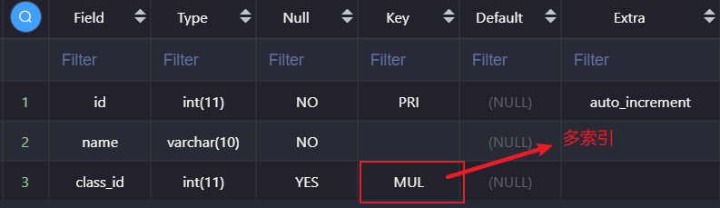
   >   >
   >   > MUL：多索引，外键本身是一个索引，还有求外键字段本身是一个索引
   >
   >   > 创建外键的基本要求：
   >   >
   >   > 1. 外键字段需保证与关联的主表的主键字段类型完全一致
   >   > 2. 外键字段需保证与关联的主表的主键字段基本类型也要相同
   >   > 3. 如果是在表后增加外键，对数据还要有一定的要求
   >   > 4. 外键只能使用innodb存储引擎
   >
   > * 修改&删除外键
   >
   >   > 1. 外键不允许修改，只能删除之后再增加
   >   > 2. 删除外键的基本语法：`alter table 从表 drop foreign key 外键名`
   >   > 3. 外键创建会自动增加一层索引，而外键删除只会删除自己。

3. 约束

   > 1. 定义：通过建立外键关系之后，对主表和从表都会有一定的数据约束效率。
   >
   > 2. 约束条件：
   >
   >    > 1. 从表不能插入主表不存在的数据（对从表的约束）
   >    > 2. 主表不能删除已被从表引入的数据（对主表的约束）
   >
   > 3. 在创建外键时可以对外键约束进行选择性操作，即设置约束模式：
   >
   >    > * 基本语法：`add foreign key(外键字段) references 主表(主键) on 约束模式`
   >    >
   >    > * 约束模式（设置对主表的约束）：
   >    >
   >    >   > 1. 严格模式（`district`）：（默认）违反约束条件中对主表的约束将不允许操作
   >    >   > 2. 级联模式（`cascade`）：主表数据变化，从表数据跟随变化
   >    >   > 3. 置空模式（`set null`）：如果从表中对应的外键字段允许为空，则主表数据变化，从表数据对应设置为空。
   >    >
   >    >   设置约束模式通常要配合删除使用
   >    >
   >    >   最常用的约束模式：`on update cascade on delete set null`，更新级联，删除置空
   >
   > 4. 作用：保证数据的完整性。
   >
   > 5. 弊端：外键的约束作用太过强大，导致数据在后台的不可控，是开发人员没有办法很好的把握数据（业务），所以外键较少被使用

### 十、视图

1. 本质：视图仅仅十用来查看存储在别处的数据的一种设施，其本身不包含数据，它的返回的数据都是从其它表中检索出来的。也就是说，视图的本质就是SQL语句，是为了简化复杂的SQL操作，而产生的虚拟表

2. 应用：一般将视图用于检索，而不用于更新

3. 创建视图：`create view 视图名字 as select指令`

4. 使用视图：因为视图本身是虚拟表，所以一些关于表的操作都适用于视图

   `select 字段列表 from 视图名字 [子句]; `

5. 修改视图：就是修改视图包含的select指令

   `alter view 视图名字 as 新的select指令`

6. 删除视图：

   `drop view 视图名字`

### 十一、事务处理

1. 概念：事物（transaction）是访问并可能更新数据库中各种数据项的一个程序执行单元。事物由事务开始（begin transaction）和事物结束（end transaction）之间执行的全体操作组成

2. 基本原理：mysql允许将事务统一进行管理（存储引擎：INNODB），将用户所做的操作暂时保存起来，不直接放到数据表中（更新），等到用户确认结果之后在进行操作。

   > 通常情况：
   >
   > 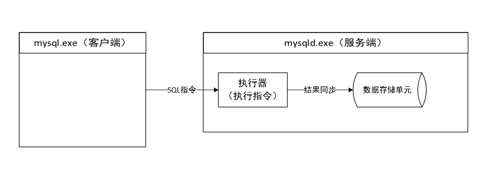
   >
   > 使用了事物处理之后：
   >
   > 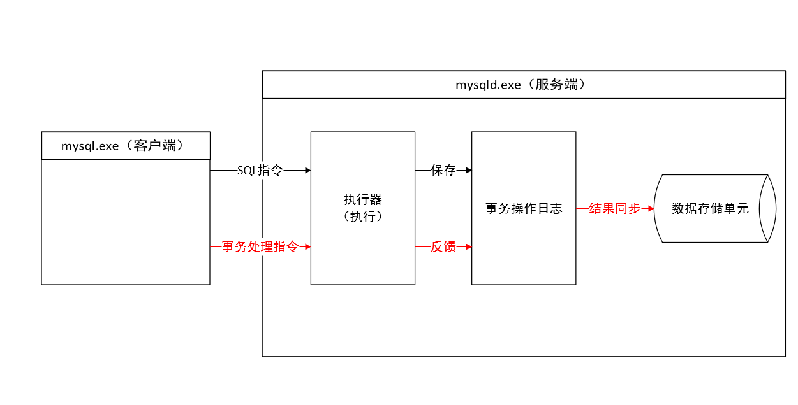

3. 分类

   >* 自动事务（autocommit）
   >
   >  1. 定义：当客户端发送一条SQL指令（写入指令：增删改）给服务器的时候，服务器在执行时，不用等待用户反馈结果，会自动将结果同步到数据表
   >
   >  2. 系统通过控制`autocommit`来开启和关闭自动事务
   >
   >  3. 一旦自动事务关闭，那么在服务器执行SQL指令后，需要用户使用指令手动同步。但是若在当前客户端上查看，则系统会根据日志表中的内容进行数据加工，而在其它的客户端则不会修改数据。
   >
   >     > 提交，将数据同步到数据表，事务也会被清空：`commit;`
   >     >
   >     > 回滚，清空事务，但不会同步：`rollback;`
   >
   >  4. 通常情况下，我们不会关闭自动事务
   >
   >* 手动事务：无论是开始、过程还是结束，都需要用户手动的发送事务操作指令来实现
   >
   >  > * 开启事务：从这条语句开始，之后的所有语句都不会写入数据表，而是保存在事务日志中
   >  >
   >  >   `start transaction;`
   >  >
   >  > * 事务处理：多个SQL写入指令构成
   >  >
   >  >   > 回滚点（savepoint）：类似于存档点
   >  >   >
   >  >   > 增加回滚点：`savepoint 回滚点名字;`
   >  >   >
   >  >   > 回到回滚点：`rollback to 回滚点名字;`
   >  >
   >  > * 事务提交：
   >  >
   >  >   确认提交：`commit;`
   >  >
   >  >   回滚操作：`rollback;`
   >  >
   >  >   提交完成后事务将结束

4. 事务的特性：

   > 1. **原子性（Atomicity）**：指事务是一个不可分割的工作单位，事务中的操作要么全部成功，要么全部失败。
   >
   >    > 事务从开启事务到提交事务，要么是所有的操作都成功，要么是所有的操作都失败
   >
   > 2. **一致性（Consistency）**：事务必须使数据库从一个一致性状态变换到另外一个一致性状态。
   >
   >    > 数据表中的数据修改，要么是所有操作一次性修改，要么是都不动
   >
   > 3. **隔离性（Isolation）**：多个用户并发访问数据库时，数据库为每一个用户开启的事务，不能被其他事务的操作数据所干扰，多个并发事务之间要相互隔离。
   >
   >    > 如果一个客户端在使用事务操作数据的时候，其它的客户端不能对该数据进行操作，必须等待。
   >    >
   >    > Note：
   >    >
   >    > > 如果在条件中使用了主键，那么系统会根据主键直接找到某条记录，那么系统只会隔离这条记录
   >    > >
   >    > > 如果系统通过全表检索（即没有使用主键），那么系统会检索表中的所有数据，那么系统会锁定这个表中的所有数据
   >
   > 4. **持久性（Durability）**：一个事务一旦被提交，它对数据库中数据的改变就是永久性的，接下来即使数据库发生故障也不应该对其有任何影响。
   >
   >    > 系统在提交完事务之后，不能再使用rollback返回之前的状态

### 十二、变量

1. 变量：mysql是一种编程语言，它需要变量来保存数据。在mysql中，很多的属性控制都是通过mysql固有的变量来实现的

2. 分类：

   > * 系统变量：系统内部定义的变量，针对所有的客户端都有效
   >
   >   查看系统变量：`show variables [like '变量名'];`
   >
   >   查询系统变量的数据值：`select @@变量名;`
   >
   >   修改系统变量：
   >
   >   > **会话修改**：只针对当前客户端当次连接有效
   >   >
   >   > `set 变量名 = 新值;`
   >   >
   >   > **全局修改**：针对所有的新客户端均有效，但是对正在连接的客户端无效（全局作用域）
   >   >
   >   > `set global 变量名 = 值;`   或  `set @@global.变量名 = 值;`
   >
   > * 会话变量：只针对当前用户当前客户端当次连接有效
   >
   >   > **定义**：`set @变量名 := 值`
   >   >
   >   > **作用域**：会话作用域 —— 在当前用户档次连接有效，且只要在本连接之中，任何位置都可以使用
   >   >
   >   > `:=`：mysql中专用的赋值符号
   >   >
   >   > **赋值**：
   >   >
   >   > > 赋值且查看结果：`select @变量1 := 字段1, @变量2 := 字段2, … form 数据表 where 条件;`[^注9]
   >   > >
   >   > > [^注9]: 每次只能挑选一条记录进行赋值
   >   > >
   >   > > 仅赋值不查看结果：`select 字段1, 字段2, … form 数据源 where 条件 into @变量1, @变量2, …;`
   >   >
   >   > **查看**：`select @变量名;`
   >
   > * 局部变量：
   >
   >   > 1. 局部变量使用`decalre`关键字声明
   >   > 2. 局部变量的作用域是局部作用域：只能在局部作用域内使用
   >   > 3. 局部变量`decalre`语句出现的位置一定是在begin和end之间（begin和end是在大型语句块中使用 —— 函数/存储过程/ 触发器）
   >   > 4. 声明语法：`daclare 变量名 数据类型 [属性];`

### 十三、流程结构（if、while）

1. if分支

   > * 基本语法：
   >
   >   > * 用在select查询当中，当作一种条件判断
   >   >
   >   >   `if(条件, 为真结果, 为假结果)`
   >   >
   >   > * 用在复杂的语句块中
   >   >
   >   >   ~~~mysql
   >   >   if 条件表达式 then
   >   >   	满足条件要执行的语句;
   >   >   End if;
   >   >   ~~~
   >
   > * 复合语法：
   >
   >   ~~~mysql
   >   if 条件表达式1 then
   >   	满足条件1要执行的语句;
   >   	[else 不满组条件1要执行的语句;]
   >   	[elseif 条件表达式2 then 满足条件2要执行的语句;]
   >   End if;
   >   ~~~

2. case分支（类比于switch-case语句）

   > * 基本语法：
   >
   >   ~~~mysql
   >   CASE var_name
   >   	WHEN var_value1 THEN 待执行的语句1;
   >   	[WHEN var_value2 THEN 待执行的语句2;]
   >   	[…]
   >   	ELSE 待执行的语句N;
   >   END CASE
   >   ~~~
   >
   > * 多条件判断（若一个条件为TRUE则结束语句）
   >
   >   ~~~mysql
   >   CASE
   >   	WHEN 条件1 THEN 待执行的语句1;
   >   	[WHEN 条件2 THEN 待执行的语句2;]
   >   	[…]
   >   	ELSE 待执行的语句N;
   >   END CASE
   >   ~~~

3. while循环

   > * 基本语法：
   >
   >   > ~~~mysql
   >   > while 条件 do
   >   > 	需要循环执行的代码;
   >   > end while;
   >   > ~~~
   >
   > * 循环控制
   >
   >   > 1. 结构标识符：为某些特定的结构命名，为了在某些地方使用名字
   >   >
   >   > 2. 循环控制：
   >   >
   >   >    > iterate：就是continue
   >   >    >
   >   >    > leave：就是break
   >   >
   >   > 3. 语法：
   >   >
   >   >    ~~~mysql	
   >   >    标识符:while 条件 do
   >   >    	if 条件判断 then
   >   >    		循环控制
   >   >    		iterate 标识符;
   >   >    		或
   >   >            leave 标识符;
   >   >         end if;
   >   >         循环体
   >   >    end while[标识符];
   >   >    ~~~

4. repeat循环（类比于do-while语句）

   > 基本语法：
   >
   > ~~~mysql
   > 标识符:REPEAT
   > 	循环体
   > UNTIL 条件判断
   > END REPEAT[标识符];
   > ~~~

### 十四、函数

1. 函数的调用：`select 函数名(实参列表);`

2. 常见的内置函数 

   > * 字符串函数
   >
   >   `char_length(字符串)`：返回字符串的字符数
   >
   >   `length(字符串)`：返回字符串的字节数
   >
   >   `concat(字符串1, 字符串2)`：连接字符串
   >
   >   `instr(字符串, 子串)`：返回子串在字符串中的位置，若没找到则返回0
   >
   >   `lcase(字符串)`：全部小写
   >
   >   `left(字符串, 指定位置)`：从左侧截取到指定位置
   >
   >   `ltrim(字符串)`：消除左边对应的空格
   >
   >   `mid(字符串, 起始位置[, 截取长度])`：从中间指定位置开始截取，若不指定截取长度，则截取到最后
   >
   >   【注：因为mysql中0代表false，所以字符串索引从1开始】
   >
   > * 时间函数
   >
   >   `now()`：返回当前日期时间
   >
   >   `curdate()`：返回当前日期
   >
   >   `curtime()`：返回当前时间
   >
   >   `datediff(日期字符串, 日期字符串)`：判断两个日期之间的天数差距
   >
   >   [date_add()]([MySQL DATE_ADD() 函数 | 菜鸟教程 (runoob.com)](https://www.runoob.com/sql/func-date-add.html))：进行时间的增加 
   >
   >   `unix_timestamp()`：获取时间戳
   >
   >   `from_unixtime()`：将指定时间戳转换为日期时间格式
   >
   > * 数学函数
   >
   >   `abs()`：绝对值
   >
   >   `celling()`：向上取整
   >
   >   `floor()`：向下取整
   >
   >   `pow(a, b)`：返回a的b次方
   >
   >   `rand()`：获取一个0~1之间的随机数
   >
   >   `round()`：四舍五入
   >
   > * 聚集函数
   >
   >    `AVG()`：返回某一列的平均值
   >
   >    `COUNT()`：返回某一列的行数
   >
   >    >  当参数为`*`时，返回表中符合限制条件的所有行数，不判断是否为NULL
   >    >
   >    > 当参数为`列名`时，返回该列所有不为NULL的行数
   >
   >    `MAX()`：返回某一列的最大值
   >
   >    `MIN()`：返回某一列的最小值
   >
   >    `SUM()`：返回某列值之和
   >
   > * 其它函数
   >
   >    `md5()`：对数据进行md5加密
   >
   >   `version()`：获取版本号
   >
   >   `database()`：显示当前所在数据库
   >
   >   `UUID()`：生成一个唯一标识符，类似于自增长。但是自增长是单表位置，而UUID是整库唯一。

3. 自定义函数

   > 1. 说明
   >
   >    > * 函数有多条语句组成，而每条语句都是一个独立的个体，需要以语句结束符结束
   >    > * 函数是一个整体，在调用时才会被执行，且原则上不能被中断
   >    > * mysql每次遇到`;`就会自动开始执行
   >    >
   >    > > 解决方案：修改临时的语句结束符，则再次使用`;`时，系统不会自动开始执行
   >    > >
   >    > > 基本语法：`delimiter 新符号`，通常使用`$$`
   >    > >
   >    > > 流程：
   >    > >
   >    > > 1. 修改语句结束符
   >    > > 2. 使用正常的SQL指令（以`;`结尾）
   >    > > 3. 使用新符号结束函数
   >    > > 4. 修改回`;`为语句结束符
   >
   > 2. 创建函数
   >
   >    ~~~mysql
   >    delimiter $$	-- 修改语句结束符
   >    create function 函数名(形参列表) returns 返回值类型
   >    begin
   >    	函数体
   >    	return 返回值
   >    end
   >    $$				-- 使用语句结束符结束函数的创建
   >    delimiter ;		-- 修改语句结束符
   >    ~~~
   >
   >    > **形参说明**
   >    >
   >    > 基本语法：`形参名 形参类型`
   >    >
   >    > **函数体说明**
   >    >
   >    > 局部变量的定义必须在其他语句之前
   >
   > 3. 查看函数
   >
   >    > * 通过查看function状态查看所有函数：`show function status [like 待查看的函数名];`
   >    > * 通过查看创建语句：`show create funcion 函数名;`
   >
   > 4. 调用函数
   >
   >    `select 函数名(实参列表);`
   >
   > 5. 删除函数
   >
   >    `drop function 函数名;`
   >
   > 6. **Notes**
   >
   >    >1. 自定义函数是会话级别的，只有在当前客户端的当前数据库中可以调用
   >    >2. 当前客户端，可以在其它的数据库中查看到该函数，但是不能调用
   >    >3. 在函数内部不能使用select指令，但是使用`select 字段 into 变量`给变量赋值是可以使用的
   >
   > 7. 实例：定义、查看、调用再删除一个函数，函数的作用是从0开始累加到传入值，且遇到5的倍数回跳过
   >
   >    ~~~mysql
   >    DELIMITER $$
   >                               
   >    CREATE FUNCTION my_sum(end_value int) RETURNS int
   >    BEGIN 
   >      -- 声明局部变量
   >      declare res int default 0;
   >      declare i int default 1;
   >      -- 循环处理
   >      mywhile:while i <= end_value do
   >        if i % 5 = 0 then
   >          set i = i + 1;
   >          iterate mywhile;
   >        end if;
   >        set res = res + i;
   >        set i = i + 1;
   >      end while mywhile;
   >      RETURN res;
   >    END 
   >    $$
   >                               
   >    DELIMITER ;
   >    show function status like 'my_sum';
   >    SELECT my_sum(100);
   >    DROP FUNCTION my_sum;
   >    ~~~

### 十五、存储过程

#### ①、概念部分

1. 概念：存储过程（Stored Procedure），简称过程。它是在大型数据库系统中，一组==为了完成特定功能的SQL 语句集==，它存储在数据库中，==一次编译后永久有效==，用户通过指定存储过程的名字并给出参数（如果该存储过程带有参数）来执行它。存储过程是数据库中的一个重要对象（针对SQL编程而言）。在数据量特别庞大的情况下利用存储过程能达到倍速的效率提升。

2. 与函数的对比

   > * 相同点：
   >   1. 为了实现代码的重复利用
   >   2. 都是一次编译，永久有效
   > * 不同点：
   >   1. 函数必须有返回值，而过程可以没有
   >   2. 函数不能使用select语句（select赋值给变量除外），而过程可以任意使用

3. 创建过程

   ~~~mysql
   delimiter $$
   create procedure 过程名([参数列表])
   begin
   	过程体
   end
   $$
   delimiter ;
   ~~~

   > 参数列表：
   >
   > * 存储过程的参数也需要指定其类型（==过程类型==），且存储过程的参数分类与其它语句块不同，它有如下三种分类：
   >
   >   1. `in`：表示参数从外部传入到过程内使用，实参可以是数据，也可以是存储数据的变量
   >
   >      > 在`in`类型实参传值时，会将实参的值传递给形参
   >      >
   >      > 在过程结束时，实参不会被修改
   >
   >   2. `out`：表示参数从过程里面把数据传入到变量中，交给外部使用。故传入实参的必须是变量，若变量本身有值，则进入过程就会被清空。
   >
   >      > 在实参传值时，会将实参的值传递给形参，而使用`out`类型传值，被清空的值是形参的值而不是外部实参的值
   >      >
   >      > 使用`out`类型的变量，在过程结束时，会将`out`类型形参的值赋值给外部的实参
   >
   >   3. `inout`：表示数据可以从外部传入到过程内部使用，又可以在内部操作后，将数据返还给外部。
   >
   >      > 在`inout`类型实参传值时，会将实参的值传递给形参
   >      >
   >      > 使用`inout`类型的变量，在过程结束时，会将`inout`类型形参的值赋值给外部的实参
   >
   > * 参数列表的语法：` 过程类型 变量名 数据类型`

4. 查看过程

   > 与查看函数一致
   >
   > * 通过查看procedure状态查看所有函数：`show procedure status [like 待查看的过程名];`
   > * 通过查看创建语句：`show create procedure 过程名;`

5. 调用过程

   语法：`call 过程名([实参列表]);`

6. 删除过程

   语法：`drop procedure 过程名;`

#### ②、过程体详解

1. 变量及赋值

   > 1. 定义局部变量：begin-end语句块中有效
   >
   >    `declare var_name type [default var_value];`
   >
   > 2. 定义用户变量：`@var_name`，使用即声明，当前连接可用
   >
   > 3. 赋值语法：
   >
   >    > set语句：`set var_name = var_value;`
   >    >
   >    > into语句：`select col_name1[, cal_name2, …] into var_name1[, var_name2, …] select子句部分;`
   >
   > 4. 出参和入参：详见概念部分

2. 游标（`cursor`）

   > 1. 概念：一种存储查询结果集（一行数据）的数据类型
   >
   > 2. 基本操作：
   >
   >    > 1. 声明：`declare 游标名 cursor for select语句; `
   >    >
   >    > 2. 开启游标：将Fetch指针指向第一个数据
   >    >
   >    >    `open 游标名;`
   >    >
   >    > 3. Fetch游标：读取Fetch指针指向的数据，并把指针后移（若指针指向NULL，则Fetch游标会报错）
   >    >
   >    >    `fetch 游标名 into 变量1[, 变量2, …];`
   >    >
   >    > 4. 关闭游标
   >    >
   >    >    `close 游标名;`
   >
   > 3. 循环使用游标
   >
   >    使用句柄设置退出条件（取不到数据则设置标记为0）：`declare exit HANDLER for not found set 标记 = 0;`
   >
   >    ~~~mysql
   >    DELIMITER $$
   >             
   >    CREATE PROCEDURE pre_stu()
   >    BEGIN
   >      DECLARE stu_id INT;
   >      DECLARE stu_name VARCHAR(10);
   >      DECLARE stu_age TINYINT;
   >      DECLARE has_data TINYINT DEFAULT 1; -- 循环退出标记
   >             
   >      -- 声明游标
   >      DECLARE stu_result CURSOR FOR SELECT * FROM my_stu;
   >      DECLARE EXIT HANDLER FOR NOT FOUND SET has_data = 0;	-- 此句必须紧跟游标的声明
   >             
   >      OPEN stu_result;
   >      REPEAT
   >        FETCH stu_result INTO stu_id,stu_name,stu_age;
   >        SELECT CONCAT('id = ',stu_id,' name = ',stu_name,' age = ',stu_age);
   >        UNTIL has_data = 0
   >      END REPEAT;
   >      CLOSE stu_result;
   >    END$$
   >             
   >    DELIMITER ;
   >    ~~~

### 十六、触发器

1. 基本概念（trigger）：触发器是一种特殊类型的存储过程。主要是通过事件触发而被执行的，而普通的存储过程需要通过过程名被直接调用。简单理解为：给**某张表**的所有记录绑定一段代码，如果该行的操作满足触发条件，这段提前准备好的代码就会自动执行

2. 作用：

   > 1.  在写入数据表前，强制检验或转换数据（保证数据安全）
   > 2. 触发器发生错误时，异动的结果会被撤销（触发器执行错误，前面已经执行成功的操作也会被撤销，类似于事务安全）
   > 3. 部分数据库管理系统可以针对数据定义语言使用触发器，称为DDL触发器
   > 4. 可依照特定的情况，替换异动的指令（mysql不支持）

3. 优缺点

   > * 优点
   >
   >   > 1. 触发器可以通过数据库中的相关表实现级联更改，即某张表的数据改变，可以利用触发器实现对其他表的无痕操作。
   >   > 2. 可以实现安全校验
   >
   > * 缺点
   >
   >   > 1. 对触发器的过分依赖，会增加数据表维护的复杂度
   >   > 2. 造成数据在程序层面的不可控（PHP层）

4. 基本操作

   > 1. 创建触发器：
   >
   >    ~~~mysql
   >    delimiter $$
   >    create trigger 触发器名字 触发时机 触发事件 on 表 for each row
   >    begin 
   >    触发器语句
   >    end
   >    $$
   >    delimiter ;
   >    ~~~
   >
   >    > * 触发对象：`on 表 for each row`  => 绑定了表中的每一行，因此当任意一行发生指定操作时，就会触发触发器
   >    >
   >    > * 触发时机：表中的每一行都会对应两种不同的状态
   >    >
   >    >   > 1. `before`：表中数据发生改变前的状态
   >    >   > 2. `after`：表中数据已经改变后的状态
   >    >
   >    > * 触发事件：mysql中针对的目标是数据发生改变，则对应的操作只有写操作（增删改）
   >    >
   >    >   > 1. `insert`：插入
   >    >   > 2. `update`：更新
   >    >   > 3. `delete`：删除
   >
   >    > **记录关键字**
   >    >
   >    > * 触发器针对的是数据表中的每行记录，每行数据在操作前后（这个操作产生的状态改变使触发器触发）都有一个对应的状态，触发器在执行之前就会将对应的状态捕获，将没有操作之前的数据存储到`old`关键字中；而操作后的状态，保存到`new`关键字中。所以，在触发器中，我们可以通过`old`和`new`获取对应的记录数据
   >    >
   >    > * 基本语法：`关键字.字段名`
   >    >
   >    > * Note：
   >    >
   >    >   > insert：它没有操作前的数据，因为操作前数据为空，故没有`old`
   >    >   >
   >    >   > delete：它没有操作后的数据，因为操作后数据为空，故没有`new`
   >
   >    > 注意事项： 
   >    >
   >    > 一张表中，每一个触发器绑定的事件类型应该是唯一的，也就是说，一张表里面最多有六个触发器
   >    >
   >    > `before insert` |`before update`|`before delete`|`after insert`|`after update`|`after delete`
   >
   >    > 实例：一张商品表，一张订单表（保留商品的ID），每次有订单生成，商品表中对应的库存将会发生改变，且若库存不足，则不会产生订单。
   >    >
   >    > ~~~mysql
   >    > SHOW tables;
   >    > -- 创建两张表
   >    > CREATE table my_goods(
   >    >   id int PRIMARY key AUTO_INCREMENT,
   >    >   name VARCHAR (20) not null,
   >    >   inv INT -- 库存
   >    > ) charset utf8;
   >    > CREATE table my_orders(
   >    >   id int PRIMARY KEY AUTO_INCREMENT,
   >    >   goods_id int NOT NULL,
   >    >   goods_num INT NOT NULL
   >    > ) charset utf8;
   >    > INSERT INTO
   >    >   my_goods
   >    > VALUES
   >    >   (NULL, '手机', 1000),(null, '电脑', 500),(null, '游戏机', 100);
   >    > SELECT
   >    >   *
   >    > FROM
   >    >   my_goods;
   >    > SELECT
   >    >   *
   >    > FROM
   >    >   my_orders;
   >    > -- 创建触发器：订单表发生数据插入，则对应的商品库存减少
   >    >   DELIMITER $ $ CREATE TRIGGER a_i_o_t
   >    > AFTER
   >    > INSERT
   >    >   ON my_orders for each row BEGIN
   >    > UPDATE
   >    >   my_goods
   >    > SET
   >    >   inv = inv - new.goods_num
   >    > WHERE
   >    >   id = new.goods_id;
   >    > END $ $ DELIMITER;
   >    > -- 创建触发器：若对应的商品库存不足以减少，则使插入失败
   >    > DELIMITER $ $ CREATE TRIGGER b_i_o_t BEFORE
   >    > INSERT
   >    >   ON my_orders for each row BEGIN -- 取出库存数据进行判断
   >    > SELECT
   >    >   inv
   >    > FROM
   >    >   my_goods
   >    > WHERE
   >    >   id = new.goods_id INTO @inv;
   >    > -- 将库存的值保存到变量中
   >    >   if @inv < new.goods_num then -- 中断操作，故意报错，使触发器失败，则会清空前面的操作，导致订单表数据不能插入
   >    > INSERT INTO
   >    >   数 量 不 足
   >    > values('插入失败');
   >    > end if;
   >    > END $ $ DELIMITER;
   >    > -- 执行操作
   >    > INSERT INTO
   >    >   my_orders
   >    > VALUES(null, 2, 50);
   >    > INSERT INTO
   >    >   my_orders
   >    > VALUES
   >    >   (NULL, 1, 250);
   >    > INSERT INTO
   >    >   my_orders
   >    > VALUES
   >    >   (NULL, 3, 101);
   >    > ~~~
   >
   > 2. 查看触发器：
   >
   >    > 查看全部触发器：`show triggers;`
   >    >
   >    > 查看触发器的创建语句：`show create trigger 触发器名字;`
   >
   > 3. 删除触发器：`drop trigger 触发器名字`
   >

### 十七、预处理

参考博客：[MySQL预处理语句深入分析_知也无涯-CSDN博客](https://blog.csdn.net/qq_26963433/article/details/78638365?ops_request_misc=%7B%22request%5Fid%22%3A%22162969924316780269849596%22%2C%22scm%22%3A%2220140713.130102334.pc%5Fall.%22%7D&request_id=162969924316780269849596&biz_id=0&utm_medium=distribute.pc_search_result.none-task-blog-2~all~first_rank_ecpm_v1~rank_v29_ecpm-27-78638365.pc_search_download_positive&utm_term=mysql预处理&spm=1018.2226.3001.4187)

