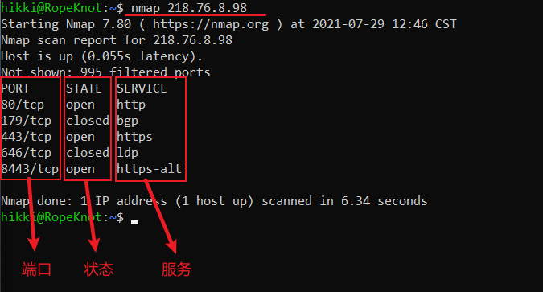
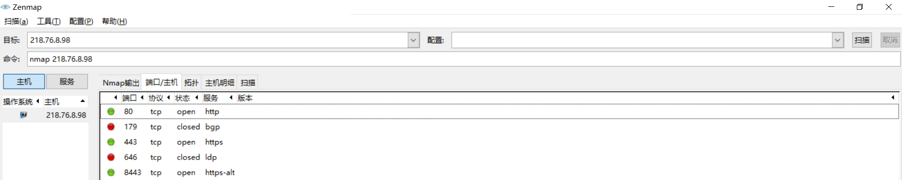
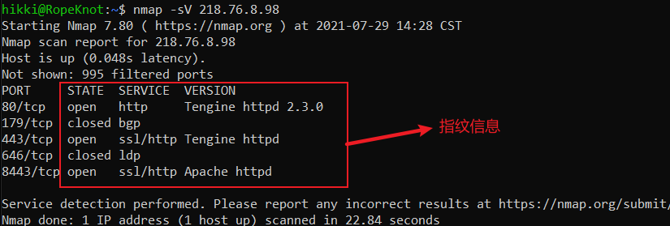
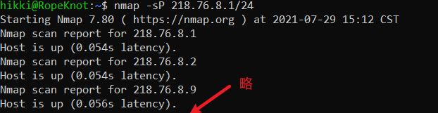

# Nmap基础

### 一、概念

> Nmap：网络映射器，用于网络的安全审计与网络探索

### 二、查看帮助

查看Nmap自带的帮助信息：`nmap -h`

### 三、使用Nmap列举远程机器开放端口

1. 原理：安装Nmap的机器向远程机器发送ICMP Echo Request来探测目标主机存活性，并根据返回的数据包得到远程机器的信息
2. 命令行语法：`nmap[参数] IP`~（IP也可以使用域名替代，此条注释将不再出现于后文）~

3. 使用Zenmap【次笔记中仅例举此一次】：（若不可输入，可打开【配置-新的配置或命令】，再关闭即可）

   > 1. 在目标一栏输入IP或域名
   > 2. 在命令一栏添加或删除参数
   > 3. 点击端口与主机
   >
   > 

4. 参数说明：

   > * 若使用的是域名，则Nmap会自动使用DNS获取IP地址。我们可以通过添加`--dns-servers DNS服务器IP`来==指定DNS服务器==[^注1]
   >
   >   [^注1]: 谷歌的DNS服务器：`8.8.8.8`
   >
   > * 对已知主机存活或防火墙开启的机器，使用`-Pn`参数来==停止探测之前的ICMP请求==，以达到不触发防火墙安全机制
   >
   > * 在不输入任何参数的情况下，Nmap默认扫描所有端口（0~65535），为了满足特定的需要，我们可以使用`-p m-n`来==指定探测端口范围为[m, n]之间的所有端口==

5. 端口状态说明：

   > * open：端口处于开放状态
   > * closed：端口处于关闭状态
   > * filterd：端口处于过滤状态，无法收到返回的prode状态
   > * unfilterd：端口收到返回的prode，但是无法确认是否被过滤
   > * opend/unfilterd：表示端口处于开放或者未过滤状态
   > * closed/unfiltered：表达端口处于关闭或未过滤状态

### 四、Nmap识别目标机器上的指纹服务

1. 服务指纹信息：服务端口号、服务名称和版本

2. 原理：Nmap通过向目标主机发送多个UDP和TCP数据包并分析其响应来进行操作系统指纹识别工作

3. 命令行语法：`nmap -sV IP`

   

4. 使用侵略性的探测【方案一】：`nmap -A -v -T4 IP`[^注2]

   > Note：
   >
   > `-A`：侵略性探测，即操作系统识别、端口识别、指纹识别
   >
   > `-v`：即时输出探测的进度
   >
   > `-T4`：探测速度的设置（T0~T5，数字越大越快）

5. 使用侵略性探测【方案二】：`nmap -sC -sV -O IP`~（与方案一结果相同）~[^注2]

   > Note：
   >
   > `-sC`：使用Nmap脚本进行探测
   >
   > `-sV`：探测目标机器上的服务信息
   >
   > `-O`：探测目标机器上的操作系统信息

   [^注2]: 需要探测目标主机的操作系统参数，需要使用root用户

### 五、使用Nmap发现局域网当中的存活主机

1. 使用手动探测的方式判断主机是否存活：`ping ip`

2. CIDR（Classless Inter-Domian Routing）：无类别域间路由可以快速表示一个网络

   > 比如：172.16.1.1/24 表示 172.16.1.1 - 17.16.1.255 之间的所有主机IP地址

3. Nmap主机发现：对该网络当中的所有主机进行ping扫描，探测主机存活性

   `nmap -sP CIDR`

   

   `nmap -sn CIDR`~（与上一条命令结果相同）~

4. Nmap主机发现，并保存扫描结果至文件：`nmap -sn CIDR -oX result.xml`

### 六、使用Nmap进行端口探测

1. 对单一端口进行探测

   `nmap -p端口号 IP`

2. 对多个端口进行探测

   `nmap -p端口1, 端口2 IP`

3. 对某个范围的端口进行探测

   `nmap -p1-100 IP`：对1到100端口进行探测

4. 对所有端口进行探测

   `nmap -p- IP`

5. 按照指定协议进行探测

   `nmap -p T:25 U:53 IP`：对TCP25号端口、UDP53号端口

6. 按照协议名进行探测

   `nmap -p 协议名 IP`（可以在协议名中使用通配符，通过名称范围扫描）

7. 对注册在nmap中的端口进行探测

   `nmap -p [1-1000]IP`：扫描1~1000之间注册在nmap中的端口

### 七、NSE脚本的使用

1. NSE的介绍：Namp Script Engine（Nmap脚本引擎），内置很多可以用来扫描的、针对特定任务的脚本。通过NSE可以不断扩展Nmap的扫描策略，加强Nmap的功能

2. NSE脚本路径

   > Windows下，脚本存储在Nmap安装路径下的script文件夹下
   >
   > Linux下，脚本存储在/usr/share/nmap/script/下

3. NSE的使用：`namp --script 脚本名称 IP`（在目录下打开命令行窗口）

   > 1. 探测web服务的title信息：`namp --script http-title IP`
   > 2. 探测http服务的http头：`nmap --script http-headers IP`
   > 3. 使用漏洞分类脚本对目标进行探测：`nmap -sV --script vuln IP`
   > 4. 使用发现和版本信息分类进行探测：`nmap -sV --script="version,discovery" IP`

   #TODO	Nmap的使用P7看不下去了 根本看不懂 要用的时候再去看吧
