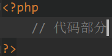
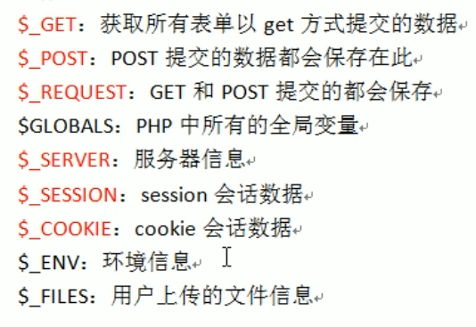
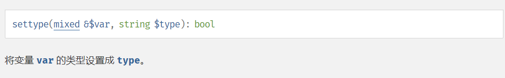
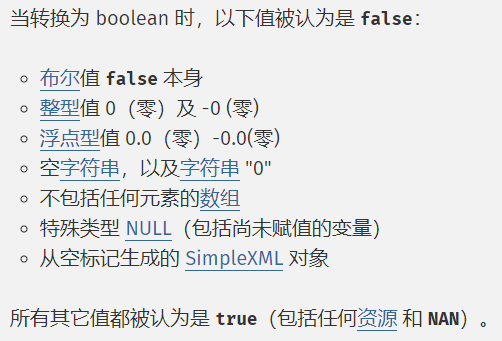
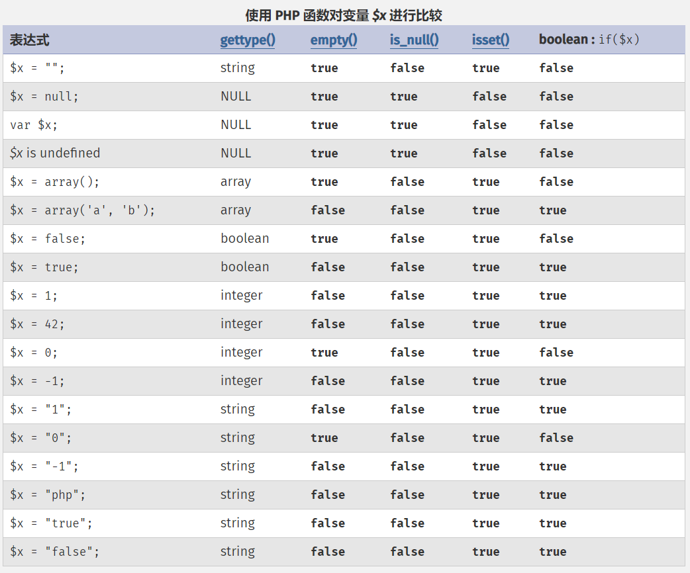
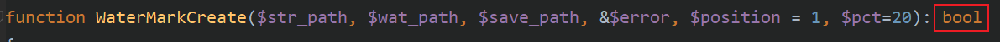

# PHP基础笔记

### 一、简单概念

1. PHP的介绍：PHP是一种运行在服务器端的脚本语言，可以嵌入到HTML中

2. PHP的代码标记：[^注1]

3. PHP的语句分隔符：分号（;)

   [^注1]:在纯PHP文件中一般不会写入**?>**，而若是要嵌入到HTML文件中，则必须添加**?>**。

---

### 二、变量

1. 变量的命名规则：变量名必须以$开头
2. 预定义变量：系统自动定义的变量，都是数组：

3. 可变变量：可以试用一个变量**$a**保存另一个变量**$b**的变量名，则有**$$a** ==**$b**

4. 变量传值：值传递和引用传递

   （1）值传递：

   ~~~php
   <?php
       $a = 1;
   	$b = $a; // 在数据段中重新开辟了一个地址，里面存放与$a指向的地址相同的值，将$b指向这个新开辟的地址
   	$b = 2;
   	echo $a,$b; // 1 2 
   ~~~

   （2）引用传递

   ~~~php
   <?php
       $a = 1;
   	$b = &$a; // 将$b指向$a指向的数据段中的地址
   	$b = 2;
   	echo $a,$b; // 2 2 
   ~~~

   

5. 内存四区

>栈区
>
>堆区
>
>数据段
>
>代码段

6. 代码执行流程

>1. 代码装载：从脚本文件中读取代码，进行编译，将编译的结果（字节码）存放到代码段中
>2. 代码执行：从代码段中逐行读取代码，同时将变量保存的数据存储到数据段中，将数据段中数据对应的地址，存储到栈区中存储的变量名中
>3. 脚本执行结束：系统会回收所有的数据（栈区、代码段）

---

### 三、常量

1. 定义（在定义时必须赋值）

   （1）使用define( )函数定义

   ~~~php
   <?php
    	define('PI',3.14)
   ~~~

   （2）使用const关键字定义

   ~~~php
   <?php
       const PI = 3.14
   ~~~

2. 常量的命名规则：通常使用大写字母且前端没有$符号，且可以使用特殊符号[^注2]

[^注2]:若使用了特殊符号则必须使用constant( )函数获取它保存的值

3. 常用的系统普通常量：系统帮助用户定义的常量

>~~~test
>PHP_VERSION：PHP版本号
>
>PHP_INT_SIZE：PHP中整型所占的字节数
>
>PHP_INT_MAX：PHP中整型所能表示的最大值
>~~~

4. 常用的系统魔术常量：系统帮助用户定义的常量，常量值会根据环境的变化而变化，但是用户不能改变

>~~~test 
>__DIR__：当前执行脚本在所在电脑上的绝对位置（不带有自身文件名）
>
>__FILE__：当前执行脚本在所在电脑上的绝对路径（带有自身文件名）
>
>__LINE__：当前变量所在行数
>
>__NAMESPACE__：当前所属的命名空间
>
>__CLASS__：当前所属的类
>
>__METHOD__：当前所属的方法
>~~~

---

### 四、数据类型

1. PHP是一种弱类型语言，其变量本身没有类型。所以说PHP中的数据类型是指数据本身的类型。
2. PHP中的八种数据类型 —— 三大类八小类

> * 简单数据类型：
>
> 1. 整型（int）：4个字节存储，表示整数类型
>
> 2. 浮点型（float/double）：8个字节存储，表示小数类型或者int类型存不下的整数类型[^注3]
>
>    [^注3]:int型在存储了超过自身最大大小的数据之后会自动转化为float类型，且会损失精度
>
> 3. 字符串型（string）：系统根据其长度自动分配空间，使用引号包含
>
> 4. 布尔类型（bool）：ture 和 false
>
> * 复合数据类型
>
> 1. 对象类型（object）：存放对象
> 2. 数组类型（array）：一次性存放多个数据
>
> * 特殊数据类型
>
> 1. 资源类型（resource）：存放资源数据（PHP外部数据，如：数据库、文件）
> 2. 空类型（NULL）：不能运算

3. 类型转换

> 1. 强制转换的规则：在变量前增加一个括号，然后在里面写上对应的类型（对数据复制的内容进行转换，不会改变原有数据的类型）
> 2. settype( )函数：会更改原有的数据类型
>
> 

>其它类型转布尔类型：
>
>
>
>其它类型转数值：
>
>1. 布尔true为1，false为0
>2. 字符串转数值的特性：
>   * 以字母开头的字符串永远为0
>   * 以数字开头的字符串，取到碰到数字以外的字符为止（可以包含一个小数点，但不能同时包含两个）

4. 类型判断

>1. 使用类型判断的一系列函数**is_类型名**( )，来判断类型，得到的是布尔类型
>2. 使用gettype( )函数，得到该类型对应的字符串

5. 进制

在使用int类型的数据时，可以使用二进制、八进制、十进制、十六进制表示。[^注4]

>二进制（bin）：0b + 二进制数
>
>八进制（oct）：0 + 八进制数
>
>十进制（dec）：十进制数
>
>十六进制（hex）：0x + 十六进制数

[^注4]:在使用echo函数输出时，都会以10进制输出

 >进制转换函数举例：
 >
 >二进制转十进制：bindec( )
 >
 >十进制转十六进制：dechex( )

6. 科学计数法

> float + e + int ：表示float * 10 ^ (int)

7. 变量比较表

> empty( )：用于判断变量存储的值是否为空
>
> is_null( ) 和 isset( )：用于判断变量本身是否存在

---

### 五、运算符

* 赋值运算符（`=`）：在内存中开辟一个位置存储符号右边的值，并将这个开辟的内存地址赋值给符号左侧的变量
* 算数运算符：`+`、`-`、`*`、`/`、`%`[^注5]

[^注5]:除法和取模运算的除数不能为0，且取模运算的对象必须为两个int类型数据

* 比较运算符：`>`、`>=`、`<` 、`<=`、`==`、`!=`、`===` 、`!==`

>`==`与`!=`：比较左边和右边的数据大小（如：123 == '123' 为true）
>
>`===`与`!==`：比较左边和右边的数据大小和数据类型（如：123 === '123'为false）

* 逻辑运算符：`&&`、`||`、`!`

> A && B;    =>  若A为真，则执行B操作
>
> A || B;      => 若A为假，则执行B操作
>
> （注：表达式A、B 必须有返回值）

* 连接运算符：`.`、`.=`

> `.`：拼接两个字符串
>
> `.=`：相当于将拼接后的字符串赋值给左边的字符串

* 错误抑制符：`@`

> 在PHP中，有一些错误可以提前预知，但是这些错误可能无法避免，但是又不希望报错给用户看，这可以使用错误抑制符处理，一般在生产环境中使用

* 三目运算符：即C中的`?:语句`
* 自操作运算符：`++`、`--`
* 位运算符：`&`、`|`、`~`、`^`、`<<`、`>>`

> `<<`：按位左移，相当于乘以2
>
> `>>`：按位右移，相当于不会出现小数的除以2

* **运算符的优先级**

[参考文档]([PHP: 运算符优先级 - Manual](https://www.php.net/manual/zh/language.operators.precedence.php))

---

### 六、流程控制

* 分支结构

  * if-else语句
  * switch-case语句

* 循环结构

  * for循环

  * while循环

  * do-while循环

  * foreach循环（处理数组）

    ~~~php
    <?php
        foreach($arr as [$key => ]$value){
            // 循环第i次执行，相当于将索引数组中的第i个元素赋值给$key，将$arr[$key]赋值给$value
        }
    ~~~

    > foreach的实现原理：
    >
    > 1. foreach重置数组指针指向首元素
    > 2. 进入foreach循环，通过指针访问指向的元素，将下标取出放在`$key`中，将值取出放到`$value`中
    > 3. 指针后移
    > 4. 重复2和3，直到指针指向空

  * 循环控制：break，continue

* 流程控制替代语法

> ​    PHP本身是嵌入到HTML中的脚本语言，需要在HTML中写一些关于判断或循环的结构语法。在需要PHP与HTML混搭时，可以使用PHP的替代语法
>
> > 替代语法的规则：
> >
> > 将左大括号`{`替换为`:`
> >
> > 将右大括号`}`替换为`end + 起始标记;`
> >
> > （如：while(A){B}  会被替换为 while(A): B endwhile;）

---

### 七、文件包含

1. 文件包含的定义：在一个PHP脚本中，去将另外一个PHP文件包含进来，去合作完成一些事情

2. 文件包含的分类：

   >向上包含（索要）：使用被包含文件中的内容，实现代码共享，一般在文件的最开始进行包含
   >
   >向下包含（给予）：将自己的内容在被包含文件中使用，实现代码共享，一般在文件的末尾进行包含

3. 文件包含的作用：使用协作的方式让多个脚本共同完成一件事情

4. 文件包含的四种形式：

   > 1. include：包含文件，重复包含同一文件会执行多次并因为重复定义报错
   >
   > 2. include_once：包含文件，且系统会自动判断文件是否已经包含过，保证一个文件只会被包含一次4
   >
   >    > 若使用include包含的文件找不到，则会报warning
   >
   > 3. require：与include相同
   >
   > 4. require_once：与include_once相同
   >
   >    > 若使用requite包含的文件找不到，则会报error

   格式示例：include '被包含的文件名字' [^注6]

   [^注6]:如果使用这种方式（相对路径），必须保证被包含文件和当前文件在同一个目录下

5. 文件加载时，被包含文件时单独编译的。若是被包含文件出现错误，原文件只有在执行到文件包含语句时，才会报错。[^注7]

   [^注7]: 在PHP代码在编译完成后，才会执行语句。若是出现错误，则会直接报错，不会执行语句

~~~test
补充说明——
PHP代码的执行流程如下：
1. 读取代码文件（PHP程序）
2. 编译：将PHP代码转换为字节码（生成opcode）
3. 使用zendengine来解析opcode，按照字节码的进行逻辑运算
4. 将运算结果转化为对应的HTML代码
~~~

6. 文件加载的路径：使用绝对路径或相对路径都行、

> 嵌套包含时的路径问题：若使用`./`或`../`包含其它文件A的文件B被另一个文件C嵌套，则`./`或`../`代表的目录可能会发生改变，即将文件C的目录作为当前目录，而不是文件B的目录，若B与C的目录不同，则会导致找不到文件A而出错，此时，就要用到绝对路径

---

### 八、函数

1. 函数的定义方法

   > ~~~php
   > <? php
   >     function 函数名(参数){
   >     	函数体;
   > 	}
   > ~~~

2. 可以再代码的任意位置定义函数，然后再代码的任意位置执行函数：因为在编译的时候，已经将函数编译为字节码存放到内存中了，所以可以再任意位置执行函数。

3. 函数调用流程：

   > 1. 系统调用函数，会去内存中寻找该函数，判断函数是否存在
   > 2. 系统会在栈区开辟内存空间运行函数
   > 3. 系统会查看函数是否含有形参
   > 4. 系统会判断函数调用时是否含有实参
   > 5. 系统会将实参的值取出，赋值给形参，相当于给形参重新开辟了一段内存存储和实参相同的值（值传递）
   > 6. 执行函数体

4. 函数调用默认为值传递，但是也可以使用引用传递（让函数拿到的外部数据，能够在函数内部改变）

   >基本定义语法：
   >
   >~~~php
   ><? php
   >    function 函数名(&参数){
   >    	函数体;
   >	}
   >~~~

5. 返回值：使用return语句返回，且返回值可以是任意数据类型

6. 变量作用域：

   >1. 全局变量：用户在函数外部定义的变量，不允许在函数内部使用，生命周期直到脚本允许结束
   >2. 局部变量：用户在函数内部定义的变量，只允许在当前函数内部使用，生命周期直到函数执行结束
   >
   >3. 超全局变量：系统定义的变量，没有访问限定[^注8]
   >
   >[^注8]:系统会将所有的全局变量保存在超全局变量`$GLOBALS`中，可以在函数内部通过数组的方式使用超全局变量`$GLOBALS`访问局部变量

7. global关键字：在函数的内部和外部，对一个同名的变量使用同一块内存地址保存数据（函数内部使用）

   > * 若使用global关键字定义的变量在函数外部有同名变量，那么系统在函数内部使用global关键字定义的变量会直接指向函数外部同名变量指向的内存地址
   > * 若使用global关键字定义的变量在函数外部找不到同名变量，那么系统会自动在全局空间（即函数外部）定义一个与函数内部使用global关键字定义的变量指向同一个内存地址的同名变量

8. 静态变量：

   >1. 定义方法：使用static关键字定义
   >2. 作用：跨函数共享数据（同一个函数被多次调用，静态变量在函数结束后并不会被删除，而会在下一次调用时，将上次函数执行结束的静态变量直接赋值给该静态变量，而原有给静态变量赋值的语句将无效）
   >3. 原理：系统在编译时会自动为静态变量赋值，而函数在调用时，会自动跳过有static关键字的这一句代码
   >4. 使用场景：统计函数被调用的次数、为了统筹函数多次调用得到的不同结果

9. 可变函数：使用一个$变量保存函数名，则可以直接使用`$变量();`的方式调用函数，一般在回调函数中使用。[^注9]

   [^注9]:将一个函数A的函数名和一些参数传入给另一个函数B去使用，在函数B中，调用函数A进行一系列操作

10. 匿名函数：

    >1. 定义语法：
    >
    >  ~~~php
    >  <? php 
    >     $变量 = function(){
    >      	函数体
    >  	}; 
    >  ~~~
    >
    >2. 调用语法：
    >
    >  ~~~php
    >  <? php
    >      $变量();
    >  ~~~
    >
    >3. 函数内部的匿名函数在函数执行结束后不会被释放。若函数内部的匿名函数在使用函数的局部变量，则该局部变量也不会被释放，因为在函数内部还有对应的函数（匿名函数）在引用，即形成了一个闭包，为了让我们在特定的环境下使用内部函数不会出错。
    >4. 变量保存匿名函数，本质上是得到了一个闭包对象(closure)。
    
11. 函数的返回类型：可加可不加

    > 

---

### 九、伪类型

1. 伪类形：PHP中不存在的类型，是为了方便我们查看PHP操作手册而存在的

2. 分类：

   > * mixed：混合（任意）类型，只要是PHP中规定的类型即可
   >
   > * number：数值类型，即整型或浮点型

---

### 十、字符串

1. 定义方式：

   > 1. 使用引号（单双皆可）定义：适用于比较短（不超过一行）的字符串
   >
   >    > * 单引号字符串中能识别的转义字符只有`\'`
   >    >
   >    > * 双引号字符串中不能识别的转义字符只有`\'`，因为没必要
   >    >
   >    > * 双引号中因为能够区分变量和`\$`字符，所以能够识别变量，而单引号不行。但是若$后的字符不是变量名，系统会报错。为了避免这种情况发生，我们一般给变量使用专业标识符进行区分。[^注10]
   >    >
   >    > [^注10]:专业标识符就是给变量加上一组大括号，如：{$a}
   >
   > 2. heredoc结构化定义：定义没有双引号的双引号字符串
   >
   >    ~~~php
   >    <?php
   >        $str = <<<EOD
   >        	字符串内容
   >    EOD;
   >    ~~~
   >
   > 3. nowdoc结构化定义：定义没有单引号的单引号字符串
   >
   >    ~~~php
   >    <?php
   >        $str = <<<'EOD'
   >        	字符串内容
   >    EOD;
   >    ~~~
   >
   >    > 结构化定义语法：
   >    >
   >    > 1. EOD代表边界符
   >    > 2. 在上边界符的后面不能有任何代码，包括注释
   >    > 3. 下边界符必须写在最左边顶格写，同时下边界符后面只能跟分号，不能跟其它任何东西
   >    > 4. 在两个边界符之间，所有的代码都将看作字符串本身，包括注释

2. 字符串长度：

   > 基本函数：`strlen()`，使用`strlen()`会返回字符串的字节数，它争对ASCII交换码，此时一个中文会占3个字节
   >
   > 若需要使用多字节字符串长度处理函数，则要加载PHP中的mbstring扩展（mb：multi bytes）
   >
   > > 1. 在php.ini中找到`extension = php_mbstring.dll`，开启扩展
   > >
   > > 2. 重启apache
   > >
   > > 3. 使用`mb_strlen()`函数即可
   > >
   > >    > mb_strlen(string `$str`, string `$encoding` = mb_internal_encoding()): [mixed]
   > >    >
   > >    > `$str`：为待处理的字符串
   > >    >
   > >    > `$encoding`：为字符集，默认为'ASCII'。处理中文使用 'utf-8' ，此时一个中文长度

3. 字符串相关函数

   > 1. 转换函数
   >    * `implode(分隔符, 数组)`：将数组中的元素使用分隔符连接为一个字符串，若不指定分隔符，则不含分隔符
   >    * `explode(分隔符, 目标字符串)`：将字符串按照指定的分隔符进行分割，得到数组
   >    * `str_split(字符串，字符长度)`：按照指定长度拆分字符串得到数组
   > 2. 截取函数
   >    * `trim(字符串, 待过滤的字符)`：去除字符串首尾待过滤的字符，默认为空格，可以设定多个待过滤的字符
   >    * `ltrim(字符串, 待过滤的字符)`：去除字符串开头的待过滤的字符，默认为空格，可以设定多个待过滤的字符
   >    * `rtrim(字符串, 待过滤的字符)`：去除字符串末尾的待过滤的字符，默认为空格，可以设定多个待过滤的字符
   >    * `substr(字符串, 起始位置, 长度)`：返回字符串对应的子串
   >    * `strstr(字符串，字串开始字符)`：从字串开始字符第一次出现的位置开始截取到最末尾（可以用来取后缀名）
   > 3. 大小写转换函数
   >    * `strtolower(字符串)`：将字符串全部转换为小写
   >    * `strtoupper(字符串)`：将字符串全部转换为大写
   >    * `ucfirst(字符串)`：将字符串首字符转换为大写，若首字符不是字母，则不做操作
   > 4. 查找函数
   >    * `strpos(字符串，查找的字符[，起始位置])`：查找该字符串首次出现的位置
   >    * `strrpos(字符串，查找的字符[，起始位置])`：查找该字符串最后一次出现的位置
   > 5. 替换函数
   >    * `str_replace(子串, 子串的替换值, 母串)`：将目标字符串中部分字符串进行替换
   > 6. 格式化函数
   >    * `printf(字符串)/sprintf(字符串)`：格式化输出 —— 与C语言相同
   > 7. 其它函数
   >    * `str_repeat(字符串，重复次数)`：重复某个字符串，不会修改原字符串
   >    * `str_suffle(字符串)`：打乱字符串

---

### 十一、数组

1. 定义语法：

   > 1. 使用array关键字定义
   >
   >    > $变量 = array(元素1, 元素2, 元素3, …);
   >
   > 2. 使用中括号包裹数据
   >
   >    > $变量 = [元素1, 元素2, 元素3, …];
   >
   > 3. 隐形定义数组
   >
   >    > $变量[下标] = 数据;
   >    >
   >    > 若下标不指定且数组为空，则默认从0开始。若在前面已经给该数组的某些元素赋过值，则下标不指定，默认从已赋值的下标最大者+1开始。

2. 数组下标的特点：

   > 1. 数组的下标可以为整数或者字符串：
   >
   >    > 如果数组的下标都是整数，则为索引数组
   >    >
   >    > 如果数组的下标都是字符串，则为关联数组
   >    >
   >    > 如果数组的下标既有整数，又有字符串，则为混合数组
   >
   > 2. 数组元素的顺序以放入的顺序为主，与下标无关
   >
   > 3. 数字下标的自增长特性：从0开始自动增长，如果中间手动出现较大的下标，那么后面默认的自增长下标从最大的下标+1开始
   >
   > 4. 特殊值下标的自动转换：
   >
   >    > arr[false] => arr[0]
   >    >
   >    > arr[true] => arr[1]
   >    >
   >    > arr[NULL] => arr[""]
   >
   > 5. PHP中的数组类型没有限制，且数组长度没有限制

3. 数组的存储位置是在堆区，会被分配为一块连续的内存

4. 多维数组：数组中的元素就是数组，且PHP中的数组没有维度限制，但是一般不超过三维

5. 异形数组：数组中的元素既有数组，又有数值，一般不使用，了解即可

6. 数组的遍历方法：

   >* 使用foreach循环遍历一维数组（若为二维数组，使用foreach遍历外层数组，使用下标访问内层数组）
   >
   >* 使用for循环遍历索引数组：使用`count($arr)`得到数组长度
   >
   >* while配合each和list遍历数组（**注：each函数已经被废弃，此方法了解即可**）
   >
   >  > `each()`：获取当前指针指向元素的下标和值，并将其作为一个含有4个元素的数组输出，并将指针后移。
   >  >
   >  > > 4个元素的数组为：
   >  > >
   >  > > arr( [0] => 下标值, [1] => 元素值, ["key"]=> 下标值, ["value"]=> 元素值 )
   >  >
   >  > `list()`：list(`$var1`, `$var2`, …) = `$arr`，将`$arr`数组中的元素按照下标从0递增的顺序批量赋值给( )中的变量，( )中的第一个变量对应`$arr[0]`，第二个变量对应`$arr[1]`。
   >
   >  >~~~php
   >  ><?php
   >  >	while(list($key, $value) = each($arr)){
   >  >        // 函数体
   >  >    }
   >  >~~~

7. 数组排序函数，会更改原数组：

   > 1. `sort()`：按照键值顺序排序（下标会重排）
   > 2. `rsort()`：按照键值逆序排序（下标会重排）
   > 3. `asort()`：按照键值顺序排序（下标与值的对应关系不会改变）
   > 4. `ksort()`：按照键名顺序排序（下标与值的对应关系不会改变）
   > 5. `krsort()`：按照键名逆序排序（下标与值的对应关系不会改变）
   > 6. `shuffle()`：随机打乱数组元素（下标会重排）

8. 数组指针函数：

   > 1. `reset()`：重置指针，将指针指向数组首元素
   >
   > 2. `end()`：重置指针，将指针指向数组尾元素
   >
   > 3. `next()`：将指针下移，返回下一个元素的值
   >
   > 4. `prev()`：将指针上移，返回上一个元素的值[^注11]
   >
   >    [^注11]: 当使用`next()`和`prev()`将指针移出数组范围时，不能再通过`next()`和`prev()`将指针移回数组范围，只能使用指针重置函数`reset()`和`end()`将指针重置 ↩
   >
   > 5. `current()`：获取当前指针指向的元素值
   >
   > 6. `key()`：获取当前指针指向的下标值
   
9. 数组相关函数：

   > 1. `count()`：统计数组中元素的数量
   > 2. `array_push()`：向数组末尾加入元素（入栈）
   > 3. `array_pop()`：从数组末尾取出元素（出栈）
   > 4. `array_shift()`：从数组开头取出元素
   > 5. `array_unshift()`：向数组开头加入元素
   > 6. `array_reverse()`：翻转数组
   > 7. `in_array(查找的值, 数组)`：判断元素在数组中是否存在
   > 8. `array_keys()`：返回一个数组的所有下标（索引数组）
   > 9. `array_values()`：返回一个数组的所有值（索引数组）

---

### 十二、错误处理

1. 定义：错误处理是指系统（或用户）在对某些代码进行执行的时候，发现有错误，就会通过错误处理的形式告知程序员

2. 错误分类：

   > 1. 语法错误：用户书写的代码不符合PHP的语法规范，会导致编译不通过，代码不会执行（Parse Error）
   > 2. 运行时错误：代码编译通过，但是在执行过程中会出现一些条件不满足而导致的错误（Runtime Error）
   > 3. 逻辑错误：在编写代码时不够规范，导致程序在执行时得不到想要的结果

3. 错误代号：（所有看到的错误代码在PHP中都被定义成了系统常量，可以直接使用）

   >1. 系统错误：
   >   * E_PARSE：编译错误，不会通过编译
   >   * E_ERROR：致命错误，会导致代码不能继续执行，会在错误的位置处停下
   >   * E_WARNING：警告错误，不会影响代码执行，但是可能得到意想不到的结果
   >   * E_NOTICE：通知错误，不会影响代码执行
   >2. 用户错误：用户在自定义错误除法时，会使用到的错误代号
   >   * E_USER_ERROR：致命错误，会导致代码不能继续执行，会在错误的位置处停下
   >   * E_USER_WARNING：警告错误，不会影响代码执行，但是可能得到意想不到的结果
   >   * E_USER_NOTICE：通知错误，不会影响代码执行
   >3. 其它：
   >   * E_ALL：代表着所有的错误，通常在错误控制时使用，建议用于开发环境

   > 注：所有的错误常量（代号），都由一个字节存储，每一种错误对应一个位。在错误控制时，一般使用位操作。
   >
   > 示例：
   >
   > 1. 排除通知级别：E_ALL & ~E_NOTICE
   > 2. 只要警告和通知：E_WARNING | E_NOTICE

4. 错误触发

   > 1. 程序运行触发：系统自动触发，针对语法错误和运行时错误
   >
   > 2. 人为触发：知道某些逻辑可能会出错，从而使用对应的判断代码来触发相应的错误提示
   >
   >    > 使用到的函数：`trigger_error(string $error_msg, int $error_type = E_USER_NOTICE): bool`

5. 错误设置

   > * 错误显示设置
   >
   >   1. 更改PHP配置文件（php.ini）
   >
   >      > display_errors：更改是否显示错误
   >      >
   >      > error_reporting：显示什么级别的错误
   >
   >   2. 可以在运行的php脚本中设置
   >
   >      > error_reporing( )：设置错误显示级别
   >      >
   >      > ini_set(配置文件中的配置项, 配置的值)：使用函数修改php配置文件 [^注12]
   >
   >      [^注12]:在脚本文件中配置的配置项级别比配置文件中的级别要高
   >
   > * 错误日志设置：在生产环境中，一般不显示错误给用户，但又希望捕捉到错误让后台程序员去修改，则需要把错误保存到日志文件中，这就需要设置php.ini文件，或在脚本中修改配置(ini_set)。
   >
   >   > 1. 开启日志功能：log_errors = On
   >   > 2. 指定路径：error_log = 日志的保存路径	

6. 自定义错误处理

   > * 最简单的错误处理：使用`trigger_errors()`函数，但是该函数不会阻止系统报错
   >
   > * PHP系统中提供了一种用户处理错误的机制：用户在自定义错误处理函数后，将该函数增加到操作系统的错误处理句柄中，然后系统在发现错误后，会执行用户定义的错误函数。实现的方式就是使用`set_error_handler()`错误处理函数
   >
   >   > `set_error_handler()` 具体使用方法：[详见PHP手册]([PHP: set_error_handler - Manual](https://www.php.net/manual/zh/function.set-error-handler.php))
   >   >
   >   > 示例：
   >   >
   >   > ~~~php
   >   > <?php
   >   >     // 自定义错误处理机制
   >   > 
   >   >     // 自定义错误处理函数
   >   >     /*
   >   >      * @param1：$errno表示系统提供的错误代码，如：E_ALL、E_NOTICE等
   >   >      * @param2：$errstr表示错误提示信息
   >   >      * @param3：以上两个参数为必要设定的参数，其它参数可以没有
   >   >     */
   >   >     function my_error($errno, $errstr, $errfile, $errline){
   >   >         // error_reporting()：若不加参数，表示获取当前系统设定的所有错误处理级别
   >   >         if(!error_reporting()&$errno){  // 若遇到的错误不在系统要求显示的错误级别之中
   >   >             return false;
   >   >         }
   >   >         switch ($errno){
   >   >             case E_ERROR:
   >   >             case E_USER_ERROR:
   >   >                 echo "Fatal error in file $errfile on $errline  ";
   >   >                 echo "Error info : $errstr  ";
   >   >                 break;
   >   >             case E_WARNING:
   >   >             case E_USER_WARNING:
   >   >                 echo "Warning in file $errfile on $errline  ";
   >   >                 echo "Error info : $errstr  ";
   >   >                 break;
   >   >             case E_NOTICE:
   >   >             case E_USER_NOTICE:
   >   >                 echo "Notice in file $errfile on $errline  ";
   >   >                 echo "Error info : $errstr  ";
   >   >                 break;
   >   >         }
   >   >         return  true;
   >   >     }
   >   > 
   >   >     // 修改错误机制
   >   >     set_error_handler('my_error');
   >   > ~~~

---

### 十三、常用的系统函数

1. 有关输出的函数

   * `print()`：输出格式化字符串
   * `print_r()`：以易于理解的方式打印变量，一般用来打印数组

2. 有关时间的函数

   * `date()`：按照对应的格式打印时间戳（若不给定时间戳，则打印当前时间）
   * `time()`：获取当前时间的时间戳
   * `microtime()`：获取当前时间的微秒级别的时间戳
   * `strtotime()`：将任意英文格式的字符串转化为时间戳

3. 有关数学的函数

   * `max()`：返回最大值
   * `min()`：返回最小值
   * `rand()`：指定区间得到一个随机整数
   * `mt_rand()`：与`rand()`一样，但效率更高
   * `round()`：四舍五入
   * `ceil()`：向上取整
   * `floor()`：向下取整
   * `pow()`：乘方
   * `abs()`：绝对值
   * `sqrt()`：开平方根

4. 有关函数的函数

   * `function_exists()`：判断指定的函数名字是否在内存中存在
   * `func_get_arg()`：在自定义函数中去获取指定数值对应的参数，可以理解为指定的参数为所有参数数组的下标（从0开始）
   * `func_get_args()`：在自定义函数中获取所有的参数（数组），下标从0开始
   * `func_num_args()`：在自定义函数中获取参数的数量[^注13]

   [^注13]:`func_get_args()`和`func_num_args()`统计的是调用函数时对应的实参，而不是形参
   [^ 注11]: 

5. 处理脚本让浏览器按照指定字符集解析的方法：

   ~~~php
   <?php
       header('Content-type:text/html;charset=utf-8');
   ~~~

   
