# PHP进阶笔记

### 一、表单传值

1. 概念：浏览器将用户输入的表单数据提交给后台的服务器语言

2. 表单传值的方式

   > * GET传值
   >
   >   1. form表单：`<form method = "get">表单元素</form>`
   >   2. a标签：`<a href="含有数据信息的连接">`
   >   3. location对象的href属性：``
   >   4. location对象的assign方法：``
   >
   > * POST传值
   >
   >   `<form method = "post">表单元素</form>`[^注1]
   >
   >   [^注1]:表单元素必须要有name属性才会被服务器接收

   >POST和GET传值方式的区别：
   >
   >1. GET传输的数据主要用来获取服务器资源，不会改变服务器上资源的内容；POST传输的数据主要用来在服务器上写数据，将会改变服务器上资源的内容
   >
   >2. POST方式必须使用form表单，而GET方式可以使用form表单或URL
   >
   >3. GET传输数据在URL中对外可见[^注2]，而POST不可见
   >
   > [^注2]:GET传值的最终内容会在浏览器的地址栏上显示：`?数据名1=数据值1&数据名2=数据值2&…`
   >
   >4. GET传输数据大小限制为2K，而POST理论上无大小限制（事实上是浏览器限制，而不是PHP限制）
   >
   >5. GET通常传输数值或字符串，而POST可以提交复杂数据（二进制等）

3. PHP接收数据的方式

   > **使用PHP预定义的超全局数组**
   >
   > 表单元素的”name“值作为数组的下标，而value属性的值，就是数组元素的值
   >
   > * `$_GET`方式：接收GET方式提交的数据
   >
   > * `$_POST`方式：接收POST方式提交的数据
   >
   > * `$_REQUEST`方式：接收GET或POST方式提交的数据
   >
   >   > 实质：将`$_GET`和`$_POST`合并存储到一个数组中
   >   >
   >   > 如果`$_GET`和`$_POST`中出现同名下标，则`$_POST`会覆盖`$_GET`（也可以在php.ini中配置）

4. 表单传值的复选框处理

   > * 复选框：将一类内容以同名的方式传递给后台，数据库存储通常是以一个字段存储。其特点为选中了才会提交
   >
   > ---
   >
   > **HTML处理**
   >
   > * 冲突：
   >
   >   1. 在浏览器端，checkbox的name属性无论是什么都会被浏览器提交
   >   2. 在PHP中`$_GET`和`$_POST`会对同名name属性进行覆盖
   >
   >   这就导致了复选框选中多组数据而后台只能保存最后提交的一组
   >
   > * 解决办法：在checkbox的name属性中，在原本名字的结尾加上`[]`
   >
   >   > 原理：
   >   >
   >   > 1. 浏览器不识别`[]`，不认为有特殊性
   >   > 2. PHP识别`[]`，会将浏览器传来的数据作为数组存储
   >
   > * 实例：
   >
   >   ~~~mysql
   >   <form action="01_checkbox.php" method="post">
   >       <input type="checkbox" name="hobby[]" value="basketball">basketball
   >       <input type="checkbox" name="hobby[]" value="football">football
   >       <input type="checkbox" name="hobby[]" value="tennis">tennis
   >       <input type="submit" value="submit" name="btn">
   >   </form>
   >   ~~~
   >
   > ---
   >
   > **PHP处理**
   >
   > * 单选按钮（radio）
   >
   >   PHP拿到数据之后，按要求进行处理（将拿到的value值与要存储到数据库中的值做一个映射）后，直接存储到数据表即可
   >
   > * 多选按钮（checkbox）
   >
   >   PHP将拿到一个数组，因为数据表不能存储数组。则我们可以使用`implode()`函数将数组转换为指定格式的字符串，再将字符串存储到数据表
   >
   >   > implode([string `$glue` = '', ]array `$pieces`):string  
   >   >
   >   > => 将数组按照指定分隔符转换为字符串
   >   >
   >   > `$glue`：表示分隔符，默认为空		`$pieces`：表示待分隔的数组
   >
   >   从数据库拿到数据后，可以使用`explode()`函数将字符串转化为数组
   >
   >   > explode(string `$separator`, string `$string`[, int `$limit` = `PHP_INT_MAX`] ): array
   >   >
   >   > =>将字符串按照指定分隔符转换为数组
   >   >
   >   > `$separator`：表示分隔符		`$string`：表示字符串		
   >   >
   >   > `$limit` ：表示数组元素的个数，若按照分隔符分隔超过该个数，则数组的最后一个元素将包含之后未添加的所有数据
   >
   > * 其它数据
   >
   >   若没有同名数据提交，则按照单选按钮步骤操作即可。若出现同名提交，则按照多选按钮操作即可。
   >
   >   一般都不会有憨憨闲着无聊使用重名的name属性
   >
   > > 若用户没有选择按钮，则浏览器将不会提交任何数据。所以要在使用`$_GET`和`$_POST`时，判断数据是否存在。

### 二、文件上传

#### ①：单文件上传

1. 原理：文件从用户本地电脑通过传输方式（Web表单）保存到服务器所在电脑的指定目录下

2. 流程：

   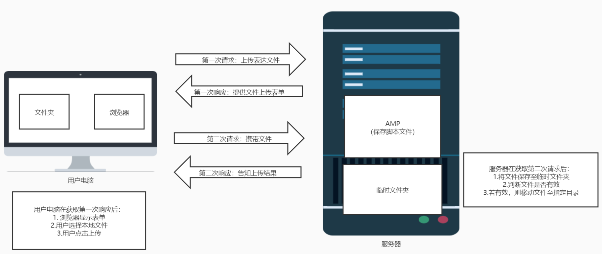

3. 表单的写法：

   > * form标签
   >
   > 1. method属性：表单的提交方式必须为POST
   >
   > 2. enctype属性：规定在发送到服务器之前应该如何对表单数据进行编码
   >
   >    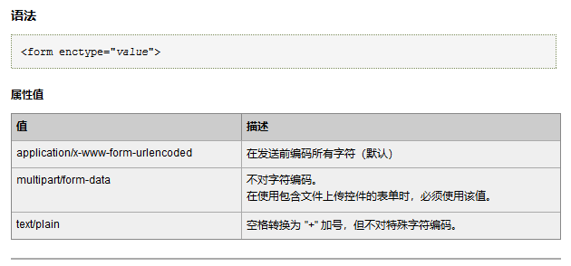
   >
   > 3. action属性：处理上传的脚本文件
   >
   > * input标签
   >
   > 1. type属性：值为`file`，表示文件上传
   > 2. name属性：必要

   > 实例：
   >
   > ~~~html
   >   <form method="POST" enctype="multipart/form-data" action="02_FileUpload.php">
   >     <input type="file" name="image" />
   >     <input type="submit" name="btn" value="submit"/>
   >   </form>
   > ~~~

4. PHP中的文件处理

   >1. 使用`$_FILES`访问文件信息：`$_FILES[按钮的name属性值][元素名]`
   >
   >   > 下图为`var_dump($_FILES);`的结果：
   >   >
   >   > 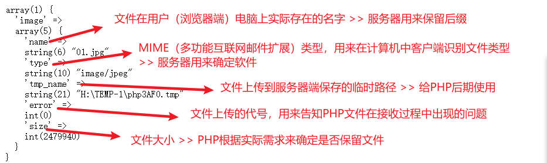
   >   >
   >   > [error元素说明]([PHP: 错误信息说明 - Manual](https://www.php.net/manual/zh/features.file-upload.errors.php))
   >
   >2. 文件处理：移动临时文件到指定目标位置
   >
   >   > 1. 判断是否为上传的文件
   >   >
   >   >    > `bool is_uploaded_file(string $filename)` ： 判断文件是否是通过 HTTP POST 上传的
   >   >    >
   >   >    > `$filename`变量：通过`$_FILES['按钮name属性值']['tmp_name']`
   >   >
   >   > 2. 移动文件
   >   >
   >   >    > `bool move_uploaded_file(string $filename, string $destination)`：将上传文件移动到新位置
   >   >    >
   >   >    > `$filename`：上传的文件的文件名，即`$_FILES['按钮name属性值']['tmp_name']`
   >   >    >
   >   >    > `$destination`：新文件路径+文件名，可以使用`新路径.$_FILES['按钮name属性值']['name']`
   >
   >3. 实例：
   >
   >   ~~~php
   >   <?php
   >       header('Content-type:text/html;charset=utf-8');
   >       // 表单上传时文件的name属性为image
   >       $file = $_FILES['image'];
   >       if(is_uploaded_file($file['tmp_name'])){
   >           // 移动文件
   >           if(move_uploaded_file($file['tmp_name'],'D:/Desktop/Update/'.$file['name'])){
   >               echo '文件保存成功！';
   >           }else{
   >               echo '文件保存失败！';
   >           }
   >       }else{
   >           echo '文件上传失败！';
   >       }
   >   ~~~

#### ②：多文件上传

> * 同名文件上传
>
>   1. 业务范围：上传的文件针对同一个事物
>
>   2. 表单设计：使用同名的文件（文件名后统一添加`[]`）批量上传
>
>   3. 数据的获取：将得到一个二维数组 —— `文件名[5][文件数量]`
>
>      > 二维数组是由5个一维数组组成：`文件名[name][]`、`文件名[type][]`、`文件名[tmp_name][]`、`文件名[error][]`、`文件名[size][]`
>      >
>      > 且其中每一个一维数组的大小都等于文件数量，其保存数据的顺序为文件上传的顺序
>
>   4. 处理方式：
>
>      > 此时遍历`$_FILES`没有意义，只能得到一个二维数组；应该遍历二维数组中的5个一维数组获取一维数组中下标相同的数据（即代表同一个文件的数据），也就是说需要重新创建一个二维数组，使得数组中的每一个一维数组保留每一个文件的全部信息。
>      >
>      > 实例：
>      >
>      > ~~~php
>      > <?php
>      > 
>      > header('Content-type:text/html;charset=utf-8');
>      > // 表单上传时文件的name属性为image
>      > // 若$_FILES['image'][任意属性]存在，则代表获取到了文件；若$_FILES['image'][任意属性]是数组，则代表是同名的批量上传
>      > if(isset($_FILES['image']['name']) && is_array($_FILES['image']['name'])){
>      >     // 构造新的二维数组
>      >     $images[] = array();
>      >     // 为新的二维数组赋值
>      >     foreach ($_FILES['image']['name'] as $key => $value){
>      >         // 通过遍历原有的任意一个属性数组，在循环内部为新的二维数组赋值，使每一轮循环，新的二维数组得到一个元素的所有数据
>      >         $images[] = array(
>      >             'name' => $value,
>      >             'tmp_name' => $_FILES['image']['tmp_name'][$key],
>      >             'type' => $_FILES['image']['type'][$key],
>      >             'error' => $_FILES['image']['error'][$key],
>      >             'size' => $_FILES['image']['size'][$key]
>      >         );
>      >     }
>      >     // 遍历新创建的数组来处理上传的文件
>      >     foreach($images as $file){
>      >         if(is_uploaded_file($file['tmp_name'])){
>      >             // 移动文件
>      >             if(move_uploaded_file($file['tmp_name'],'D:/Desktop/Update/'.$file['name']))		{
>      >                 echo '文件保存成功！';
>      >             }else{
>      >                 echo '文件保存失败！';
>      >             }
>      >         }else{
>      >             echo '文件上传失败！';
>      >         }
>      >     }
>      > }
>      > ~~~
>
> * 不同名文件上传
>
>   1. 业务范围：上传的文件针对多个不同的事物
>
>   2. 表单设计：使用不同名文件批量上传
>
>   3. 数据的获取：将得到与上传文件数相等的一维数组，且每个数组的大小为5，对应五个属性
>
>   4. 处理方式：
>
>      > *  如果确定表单中所有提交的文件名字：按照`$_FILES[文件名]`将数据取出，再判断和移动即可
>      >
>      > * 如果不确定表单中提交文件的数量：使用foreach遍历`$_FILES`数组，逐个取出来实现文件上传
>      >
>      >   实例：
>      >
>      >   ~~~php
>      >   foreach($_FILES as $file){
>      >       if(is_uploaded_file($file['tmp_name'])){
>      >       	// 移动文件
>      >           if(move_uploaded_file($file['tmp_name'],'D:/Desktop/Update/'.$file['name']))		{
>      >               echo '文件保存成功！';
>      >           }else{
>      >               echo '文件保存失败！';
>      >       	}
>      >       }else{
>      >           echo '文件上传失败！';
>      >       }
>      >   }
>      >   ~~~
>      >
>      >   

#### ③、单文件上传函数封装

> * 函数实例：
>
> ~~~php
> <?php
>     header('Content-type:text/html;charset=utf-8');
>     // 封装PHP单文件上传函数
>     /*
>      * 实现单文件上传
>      * @param1 array $file, 包含需要上传的文件信息：一个array[5]：name、tmp_name、error、size、type
>      * @param2 array $allow_type, 允许上传的MIME类型
>      * @param3 string $path, 存储的路径
>      * @param4 string &$error, 如果出现错误，返回错误信息
>      * @param5 array $allow_format = array(), 允许上传的文件格式（后缀）数组，若array()为空，则表示任意格式的文件都允许上传
>      * @param6 int $max_size = 2e6, 允许上传的文件大小最大值
>     */
>     function upload_single($file, $allow_type, $path, &$error, $allow_format = array(), $max_size = 2e6){
>         /* 判断文件是否有效 */
>         if(!is_array($file) || !isset($file['error'])){
>             // 文件无效
>             $error = '不是一个有效的上传文件！';
>             return false;
>         }
>         /* 判断文件上传过程是否出错 */
>         switch ($file['error']){
>             case 1:
>             case 2:
>                 $error = '文件超出服务器允许大小！'; // 该错误是上传的文件超过了服务器允许的最大上传大小
>                 return false;
>             case 3:
>                 $error = '文件上传时丢包！';
>                 return false;
>             case 4:
>                 $error = '没有选择要上传的文件！';
>                 return false;
>             case 6:
>             case 7:
>                 $error = '文件保存失败！';
>                 return false;
>         }
>         /* 判断文件存储路径是否有效 */
>         if(!is_dir($path)){
>             // 路径不存在
>             $error = '文件存储路径不存在！';
>             return false;
>         }
>         /* 判断MIME类型是否符合要求 */
>         if(!in_array($file['type'], $allow_type)){
>             // 文件类型不再允许上传的文件类型数组中
>             $error = '当前文件类型不允许上传！';
>             return false;
>         }
>         /* 判断后缀名是否符合要求 */
>         // 取出后缀
>         $ext = ltrim(strrchr($file['name'], '.'), '.');
>         if(!in_array($ext, $allow_format) && !empty($allow_format)){
>             // 后缀名不再允许上传的后缀数组中
>             $error = '当前文件格式不允许上传！';
>             return false;
>         }
>         /* 判断文件大小是否满足业务需求 */
>         if($file['size'] > $max_size){
>             // 文件过大
>             $error = '当前文件超出文件规定的最大大小'.($max_size/1000).'kb!';
>             return false;
>         }
>         /* 所有限制条件判断完毕，将文件移动到指定目录 */
>         /* 构造文件名字：类型_年月日.随机字符串.$ext */
>         $fullname = strstr($file['type'],'/',true).date('_Y-m-d');
>         // 构造随机字符串
>         for($i = 0; $i < 4; $i++){
>             $fullname.=chr(mt_rand(65,90));
>         }
>         $fullname.='.'.$ext;
>         if(!is_uploaded_file($file['tmp_name'])){
>             // 如果不是上传的文件
>             $error = '文件上传出现错误，获取的文件不是上传文件！';
>             return false;
>         }
>         if(move_uploaded_file($file['tmp_name'], $path.'/'.$fullname)){
>             return $fullname;
>         }else{
>             // 移动失败
>             $error = '文件上传失败';
>             return false;
>         }
>     }
> ~~~
>
> * Note：
>
> > 1. 第38行：`bool is_dir($str)` => 判断给定的文件名是否为一个目录
> >
> > 2. 第44行：`bool in_array($待搜索的值, $数组[, $strict])` => 判断某个值是否存在于数组之中
> >
> >    
> >
> > 3. 第51行：`string ltrim($str[, $char])` => 删除字符串开头的指定字符，若不指定，则默认为空白字符
> >
> > 4. 第51行：`string strrchr($str[, $mixed])` 
> >
> >    => 在字符串中查找第二个参数最后一次出现的位置，返回这个位置到字符串末尾的子串（子串以$mixed开头）
> >
> > 5. 第65行：`string strstr(string $haystack, mixed $needle[, bool $before_needle=FALSE])`
> >
> >    => 返回haystack字符串从needle第一次出现的位置开始到haystack结尾的字符串
> >
> >    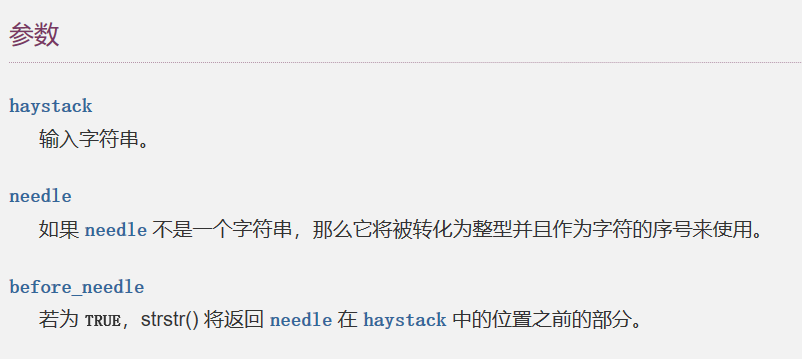
> >
> > 6. 第68行：`mt_rand()` => 性能更好的随机整数生成函数
> >
> > 7. 第68行：`chr()` => 根据整数返回字符（ASCII标准）
>
> * 文件名字说明：
>
>   因为考虑到文件同名问题，和中文文件名出现乱码的问题，我们可以将文件名按照一个统一的标准来规定
>
>   一般认为，可以使用**类型_年月日.随机字符串.后缀名**的形式设定

### 三、Mysql扩展

1. 概念：PHP针对Mysql数据库操作提供的扩展 —— 允许PHP当作Mysql的一个客户端连接服务器进行操作

2. 连库的基本操作

   > * 连接数据库服务器：
   >
   >   `mysqli $link = mysqli_connect(string $hostname, string $username, string $password);`
   >
   >   `$link`：返回的一个代表到 MySQL 服务器的连接的对象，可通过`if($link)`判断数据库是否连接成功
   >
   >   `$hostname`：规定主机名或 IP 地址，如：'localhost'
   >
   > * 设置字符集：`bool mysqli_set_charset(mysqli $connection, string $charset);`
   >
   >   `$connection`：为之前得到的`$link` 变量
   >
   > * 选择数据库：`bool mysqli_select_db(mysqli $connection, string $dbname);`
   >
   > * 关闭数据库：`bool mysqli_close(mysqli $connection);`

3. 执行写入（增删改）操作

   > 通过insert、delete、update指令向指定表插入数据
   >
   > 通过`mysqli_query()`函数执行这些指令
   >
   > > `mixed mysqli_query(mysqli $link , string $query[, int $resultmode = MYSQLI_STORE_RESULT]);`
   > >
   > > `$query`：要执行的 SQL 语句
   > >
   > > `$resultmode`：可选参数，用来修改函数的行为。可以是下列值的任意一个——
   > >
   > > * `MYSQLI_STORE_RESULT`：默认值
   > > * `MYSQLI_USE_RESULT`：如果需要查询大量数据，使用这个
   > >
   > > > 关于函数的返回值：
   > > >
   > > > * 函数执行失败时会返回 FALSE（SQL指令出现语法错误）[^注3]
   > > >
   > > >   [^注3]:若是SQL指令在执行层面上出错（如找不到某个符合条件的数据）则函数不会返回FALSE
   > > >
   > > >   > 错误判定
   > > >   >
   > > >   > ~~~php
   > > >   > $res = mysqli_query($link, $sql);
   > > >   > if(!$res){
   > > >   >     echo 'SQL指令执行出错，错误编号为：'.mysql_errno().' ';
   > > >   >     echo 'SQL指令执行出错，错误信息是：'.mysql_error().' ';
   > > >   >     exit();
   > > >   > }
   > > >   > ~~~
   > > >
   > > > * 而通过 mysqli_query() 成功执行 SELECT、SHOW、DESCRIBE 或 EXPLAIN 查询时则会返回一个 mysqli_==result 对象==
   > > >
   > > > * 其他查询执行成功则返回 TRUE

4. 查询操作

   > 1. 执行查询语句
   >
   >    > 通过select、show、desc指令查询表中数据
   >    >
   >    > 通过`mysqli_query()`函数执行这些指令，`mysqli_query()`会返回一个 mysqli_==result 对象==，得到一个结果集
   >
   > 2. 获取结果集行数
   >
   >    > `int mysqli_num_rows(result)`：返回结果集中行的数量
   >
   > 3. 解析结果集：将PHP不能解析的结果集转换为PHP能够解析的数据格式
   >
   >    > 原理：在结果集中，存在一个结果集指针（类似数组指针）。按照结果集指针所在的位置==获取对应的一条记录（得到一个数组），同时指针后移==，循环遍历，直到指针移除结果集。[^注4]
   >    >
   >    > [^注4]: 执行一次函数得到的结果：返回指针指向的记录数组，然后指针后移
   >    >
   >    > * 从结果集中获取一行作为关联数组：表单名字作为数组下标，元素值作为数组值，函数执行完成后，指针后移
   >    >
   >    >   `array mysqli_fetch_assoc(result);`
   >    >
   >    > * 从结果集中获取一行作为索引数组：从0开始自动获取索引，元素值作为数组值，函数执行完成后，指针后移
   >    >
   >    >   `array mysqli_fetch_row(result);`
   >    >
   >    > * 获取索引数组或是关联数组：
   >    >
   >    >   `mysqli_fetch_array(result[, result_type]);`
   >    >
   >    >   `result_type`：用来决定获取的数组类型
   >    >
   >    >   > - MYSQLI_ASSOC：获取关联数组
   >    >   > - MYSQLI_NUM：获取索引数组
   >    >   > - MYSQLI_BOTH：（默认）同时获取关联数组和索引数组

5. MySQL扩展中其它的函数介绍

   > **有关字段信息**
   >
   > * `int mysql_num_fields(result)` ：返回结果集中字段（列）的数量
   >
   > * `string mysql_field_name(result, field_index);`：返回指定字段索引的字段名[^注5]
   >
   >   [^注5]: MySQL的索引从0开始
   >
   > **有关出错信息**[^注6]
   >
   > [^注6]:在`mysqli_query()`返回FALSE的时候进行错误信息反馈时使用
   >
   > * `string mysql_error()`：返回上一个 MySQL 操作产生的文本错误信息 
   > * `string mysql_errno()`：返回上一个 MySQL 操作中的错误信息的数字编码 
   >
   > **有关插入信息**
   >
   > * `int mysql_insert_id()`：返回上一步insert语句产生的AUTO_INCREMENT的ID号，如果没有设置自增长的值，则返回0

### 四、HTTP协议

1. 概念：

   > 1. HTTP协议，即超文本传输协议。是一种详细规定了浏览器与万维网（WWW）服务器之间互相通信的规则，通过因特网传送万维网文档的数据传送协议。
   >
   > 2. WWW简介：是基于客户机/服务器的方式的信息发现技术与超文本技术的综合。WWW服务器通过HTML把信息组织成为图文并茂的超文本，利用链接实现站点的跳转
   >
   > 3. 统一资源定位符（URL简介）
   >
   >    > 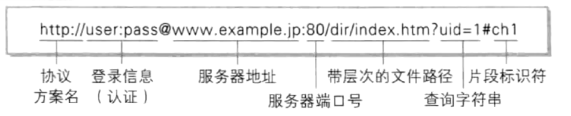
   >    >
   >    > 必须要存在的部分：协议方案名+服务器地址[^注7]
   >    >
   >    > HTTP协议默认的端口为80端口
   >    >
   >    > HTTPS协议默认的端口为443端口
   >    >
   >    > [^注7]:在使用浏览器访问网站时，输入服务器地址即可，是因为浏览器会自动帮助我们添加协议方案名

2. 特点

   > 1. 客户/服务器模式：客户端（浏览器）/ 服务器
   > 2. 简单快速：协议简单，请求服务只需传送请求方法和路径，使得HTTP服务器的程序规模小，因而通信速度快
   > 3. 灵活：传输数据时不限定数据的格式（MIME类型）
   > 4. 无连接：每次连接只处理一个请求，完成后断开连接
   > 5. 无状态：服务器对浏览器没有记忆能力

3. 分类

   > HTTP请求协议：浏览器向服务器发起请求时要遵循的协议
   >
   > HTTP响应协议：服务器向浏览器发起响应时要遵循的协议

4. HTTP请求

   > 
   >
   > 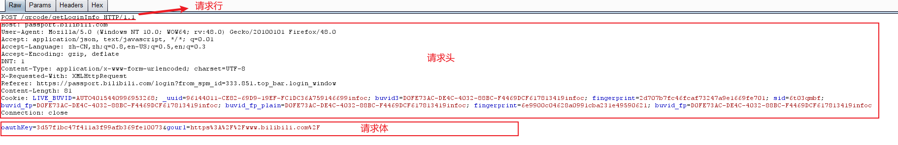
   >
   > * 请求行
   >
   >   1. 基本格式：`请求方式 资源路径 协议版本号`
   >
   >   2. 举例：`GET /index.php HTTP/1.1`
   >
   > * 请求头
   >
   >   1. 内容：各项协议的内容，具体的协议内容不会每次都使用全部
   >
   >   2. 基本格式：每条协议单独占一行，且在请求头的最后会留一个空行
   >
   >   3. 常见的内容介绍：
   >
   >      > Host：请求的主机地址（必须）
   >      >
   >      > Accept：当前请求能够接收服务器返回的MIME类型
   >      >
   >      > Accpet-Language：接收的语言
   >      >
   >      > User-Agent：浏览器所在电脑的信息
   >
   > * 请求体
   >
   >   1. 内容：请求的数据
   >   2. 说明：只有POST请求才会有请求体，GET请求所有的数据会在URL之后，即在请求行的字段路径上体现
   >   3. 基本格式：`资源名字=资源值&资源名字=资源值&…`

5. HTTP响应

   > 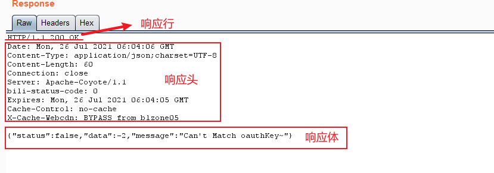
   >
   > * 响应行
   >
   >   1. 基本格式：`协议版本 状态码 状态信息`
   >
   >   2. 常见的`状态码 状态信息`：
   >
   >      > `200 OK`：成功
   >      >
   >      > `403 Forbidden`：没有权限访问
   >      >
   >      > `404 Not Found`：未找到页面
   >      >
   >      > `500 Server Internal Error`：服务器内部错误
   >
   > * 响应头
   >
   >   1. 内容：具体的协议内容
   >
   >   2. 基本格式：每条协议单独占一行，且在响应头的最后会留一个空行
   >
   >   3. 常见内容介绍
   >
   >      > Date：具体的时间日期
   >      >
   >      > Last-Modified：文件的最后修改时间
   >      >
   >      > Server：服务器信息
   >      >
   >      > Content-Length：响应体的字节数
   >      >
   >      > Content-Type：数据格式
   >
   > * 响应体
   >
   >   内容：实际上服务器给浏览器的内容

6. 通过PHP修改HTTP响应（响应头）

   > 1. 原理：PHP中针对HTTP响应做了底层设计，可以通过函数`header`来实现修改HTTP响应头
   >
   > 2. 注意事项：
   >
   >    > header设置响应头之前不要有任何输出，否则，系统就会认为响应体已经开始。但如果配置了服务器缓存则不会报错，但是需要将header设置在任何输出之前。
   >
   > 3. 常见的设置协议项
   >
   >    > * `Content-type`：内容类型
   >    >
   >    >   ==实例（设置字符集）==：`header('Content-type:text/html;charset=utf-8');`
   >    >
   >    > * `Location`：立即重定向（立即跳转链接，不解析之后的响应头和响应体）
   >    >
   >    >   实例：`header('Location:test.php');`
   >    >
   >    > * `Refresh`：延迟重定向（解析之后的响应头和响应体，延迟指定的时间后跳转链接）
   >    >
   >    >   实例：`header('Refresh:3;url=test.php');`（3秒后跳转test.php）
   >    >
   >    > * `Content-disposition`：将响应体的数据当作文件下载
   >    >
   >    >   实例：`header('Content-disposition:attachment;filename=test.jpg');`（将响应体数据当作jpg文件下载）

7. 通过PHP模拟HTTP请求

   > 1. 原理：PHP可以通过模拟HTTP协议发起HTTP请求，需要使用到的工具是Curl库
   >
   > > 前提条件：HTTP协议的客户端/服务端模式，使HTTP协议不局限于一定要浏览器访问
   > >
   > > 实现条件：在一台PHP服务器中存在一个PHP脚本，可以利用Curl技术模拟HTTP请求发送给另一台服务器。而浏览器可以触发这个PHP脚本，实现让PHP脚本模拟请求和接收另一台服务器传回的数据[^注8]
   > >
   > > [^注8]:PHP脚本接收服务器传回数据时，会将其响应头作为字符串保存。故若出现乱码问题，应该在PHP脚本中重新设置修改HTTP响应头，以便浏览器显示PHP脚本输出的数据
   >
   > 1. Curl库的使用
   >
   >    > 1. 在php.ini文件中开启扩展
   >    >
   >    >    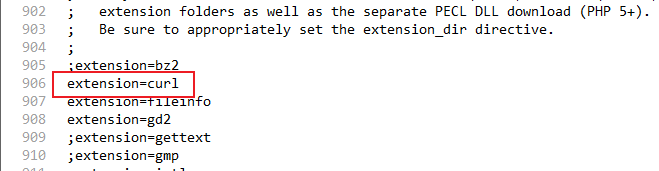
   >    >
   >    > 2. 使用Curl库模拟HTTP请求
   >    >
   >    >    > 1. 建立连接：激活Curl的连接功能，返回一个资源
   >    >    >
   >    >    >    `resource curl_init();`
   >    >    >
   >    >    > 2.  设定连接选项：
   >    >    >
   >    >    >    `bool curl_setopt(resource $ch, int $option, mixed $value);`
   >    >    >
   >    >    >    > 常用的`$option`参数
   >    >    >    >
   >    >    >    > > * CURLOPT_URL：值为string类型
   >    >    >    > >
   >    >    >    > >   设置连接对象
   >    >    >    > >
   >    >    >    > > * CURLOPT_RETURNTRANSFER：值为bool类型
   >    >    >    > >
   >    >    >    > >   是否将服务器执行的结果（响应）以文件流的形式返回给请求界面（PHP脚本）
   >    >    >    > >
   >    >    >    > > * CURLOPT_POST：值为bool类型
   >    >    >    > >
   >    >    >    > >   是否采用POST方式发起请求（默认为GET）
   >    >    >    > >
   >    >    >    > > * CURLOPT_POSTFIELDS：
   >    >    >    > >
   >    >    >    > >   值为字符串【'name=value&name=value'】或数组【array('name' => 'value', 'name' => 'value')】
   >    >    >    > >
   >    >    >    > >   传输POST提交的数据
   >    >    >    > >
   >    >    >    > > * CURLOPT_HEADER：值为bool类型
   >    >    >    > >
   >    >    >    > >   是否得到响应的header信息（响应头），默认为不获取
   >    >    >
   >    >    > 3. 执行选项：向服务器发起请求，得到服务器返回内容
   >    >    >
   >    >    >    `mixed curl_exec(resource $ch);`
   >    >    >
   >    >    > 4. 关闭连接：必须要做，因为浏览器关闭并不会阻止脚本运行
   >    >    >
   >    >    >    `void curl_close(resource $ch);`

### 五、文件编程

1. 概念：利用PHP针对文件（文件夹）进行增删改查操作

2. 文件夹：是一类特殊的文件，专门用来存放文件

   > 在任何文件夹下都会由一个`.`文件夹（代表当前文件夹）和一个`..`文件夹（代表上一级文件夹）

   文件：用来存放数据内容

3. 路径名 = 路径 + 资源名（文件名）~若是当前文件夹下的资源，可省略路径（./）~

   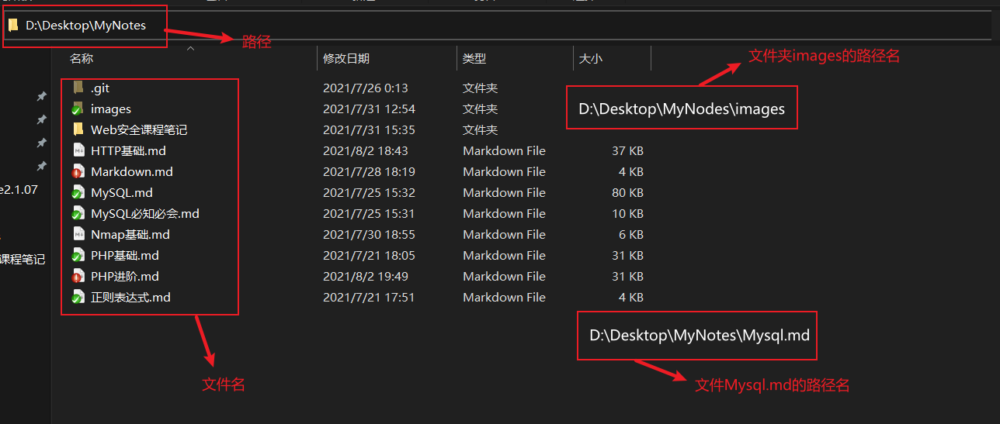

4. 目录操作

   > 1. 核心目录操作：操作文件夹
   >
   >    > 1. 创建目录结构：`bool mkDir(路径名);`
   >    >
   >    >    注：路径可以是绝对路径或是相对路径，路径的最后是文件夹名称；若只给了名称，则是在当前路径下创建目录
   >    >
   >    >    一般在创建的时候会添加错误抑制符`@`，并用一个变量获取返回值，判断是否执行成功
   >    >
   >    > 2. 删除目录结构：`bool rmDir(路径名);`
   >    >
   >    >    一般在删除的时候会添加错误抑制符`@`，并用一个变量获取返回值，判断是否执行成功
   >    >
   >    > 3. 读取目录：将文件夹（路径）按照资源方式打开
   >    >
   >    >    > `openDir(路径名)`：打开文件夹，返回一个路径资源，包含指定目录下的所有文件
   >    >    >
   >    >    > `readDir(路径资源)`：从资源中读取指针所在的文件名字，然后使指针下移，直到文件移出资源
   >    >    >
   >    >    > 使用readDir循环遍历资源，方可实现遍历操作
   >    >    >
   >    >    > `closeDir(路径资源)`：关闭资源
   >
   > 2. 其它目录操作：
   >
   >    > * `dirName(路径名)`：返回文件所在的路径
   >    > * `realPath(路径名)`：参数若为一个文件的路径名，则返回false；若为一个目录的路径名，则返回这个路径名
   >    > * `is_dir(路径名)`：判断该路径名是否为一个目录的路径名，返回bool类型
   >    > * `scandir(路径)`：遍历这个路径下的所有文件，以数组的形式返回，相当于`openDir()→readDir()→closeDir()`
   >    > * `dir(目录的路径名)`：返回 Directory 类的实例
   >
   > 3. 目录操作实战：递归遍历目录
   >
   >    > 指定一个目录，将其下的所有文件和目录以及目录中的所有文件和目录都输出出来
   >    >
   >    > ~~~php
   >    > <?php
   >    >     // 递归遍历文件夹
   >    >     header('Content-type:text/html;charset=utf-8');
   >    >     // 递归函数
   >    >     function my_scandir($dir){
   >    >         // 安全判定
   >    >         if(!is_dir($dir)){return flase;}
   >    >         $files = scandir($dir);
   >    >         foreach ($files as $file) {
   >    >             if($file == '.' || $file == '..') continue;
   >    >             // 构造路径
   >    >             $file_dir = $dir.'/'.$file;
   >    >             // 输出
   >    >             echo $file_dir.' ';
   >    >             // 判断递归条件
   >    >             if(is_dir($file_dir)){
   >    >                 my_scandir($file_dir);
   >    >             }
   >    >         }
   >    >     }
   >    >     // 测试函数
   >    >     $dir = 'D:\Desktop\网安工具';
   >    >     my_scandir($dir);
   >    > ~~~
   >

5. 文件操作

   > 1. PHP5常见的文件操作：
   >
   >    > 1. `file_get_contents(文件路径名)`：获取指定文件的所有内容，并以字符串的方式返回
   >    >
   >    >    > 如果文件不存在，则返回false，但是最好做安全处理（@）
   >    >
   >    > 2. `file_put_contents(文件路径名, 内容)`：将指定内容写入到指定文件内
   >    >
   >    >    > 如果当前路径下不存在指定文件，函数会自动创建；如果路径不存在，不会创建路径
   >    >    >
   >    >    > 返回值为内容的字节数
   >
   > 2. PHP4常见的文件操作：以资源的形式处理
   >
   >    > 1. `fopen(文件路径, 打开模式)`：打开一个文件资源，返回值为一个资源类型
   >    >
   >    >    > 打开模式：
   >    >    >
   >    >    > 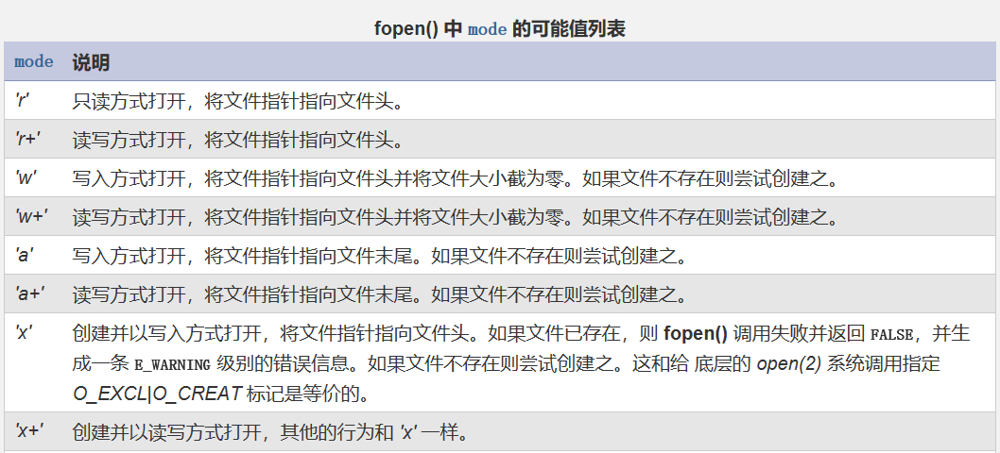
   >    >
   >    > 2. `fread(资源, 长度)`：从打开的资源中读取指定长度的内容
   >    >
   >    >    > 读取资源的位置依赖于文件资源指针
   >    >
   >    > 3. `fwrite(资源, 内容)`：向打开的资源中写入指定的内容
   >    >
   >    >    > 写入资源的位置依赖于文件资源指针
   >    >
   >    > 4. `fclose(资源)`：关闭文件资源
   >
   > 3. 其它文件操作函数
   >
   >    > * `is_file(路径名)`：判断是否为文件
   >    > * `filesize(文件路径名)`：获取文件大小
   >    > * `file_exists(路径名)`：判断是否为文件或目录
   >    > * `unlink(文件路径名)`：取消文件名字与磁盘地址的连接，即删除文件
   >    > * `filetime(文件路径名)`：获取文件最后一次修改的时间
   >    > * `fseek(文件路径名, 指针位置)`：设定`fopen`打开的文件的指针位置
   >    > * `fgetc(文件路径名)`：一次获取一个字符
   >    > * `fgets(文件路径名)`：一次获取一个字符串（默认读取一行）
   >    > * `file(文件路径名)`：读取整个文件，按行读取，返回一个数组
   >    > * `feof(文件路径名)`：判断文件指针是否达到结束位置

6. 文件下载：从服务器将文件通过HTTP协议传输到浏览器，但是浏览器不解析，而是将它保存为相应的文件

   > * 使用HTML的a标签进行下载：`<a href="互联网绝对路径">点击下载</a>`
   >
   >   弊端：
   >
   >   > 1. a标签能够下载的资源类型有限：浏览器只有发现该文件解析不了才会下载
   >   > 2. a标签下载文件的存储路径会直接显示出来，不安全
   >
   > * PHP下载：读取文件内容，以文件流的形式传递给服务器：在响应头中告知浏览器不要解析，然后激活下载框实现下载
   >
   >   步骤：
   >
   >   > 1. 指定浏览器解析字符集：
   >   >
   >   >    ~~~php
   >   >    header('Content-type:text/html;charset=utf-8');
   >   >    ~~~
   >   >
   >   > 2. 设定响应头：`header()`
   >   >
   >   >    > * 设定文件类型：`Content-type()`
   >   >    >
   >   >    >   > 常见的媒体类型：
   >   >    >   >
   >   >    >   > * 文本文件：text/html, text/plain, text/css, …
   >   >    >   > * 图片文件：image/jpeg, image/gif, application/xml,  …
   >   >    >   > * 视频文件：video/mpeg, video/quicktime, …
   >   >    >   > * 应用程序使用的二进制文件：application/octet-stream（八进制文件流）, application/zip, …
   >   >    >
   >   >    > * 设定返回文件的计算方式：`Accpet-ranges:bytes`
   >   >    >
   >   >    > * 设定下载提示：`Content-disposition:attachment;filename='文件名字'`（attachment：附件）
   >   >    >
   >   >    >   > 
   >   >    >
   >   >    > * 设定文件大小：`Accpet-length:文件大小（字节）`（使用`filesize()`获取文件大小）
   >   >
   >   > 3. 读取并输出文件
   >   >
   >   >    > * 小文件
   >   >    >
   >   >    >   ~~~php
   >   >    >   echo file_get_contents($file);
   >   >    >   ~~~
   >   >    >
   >   >    > * 大文件（或带宽不够）
   >   >    >
   >   >    >   ~~~php
   >   >    >   $f = @fopen($file,'r') or die();
   >   >    >   while($row = fread($f,1024)){
   >   >    >       echo $row;
   >   >    >   }
   >   >    >   fclose($f);
   >   >    >   ~~~

### 六、会话技术

1. 会话技术：从用户打开一个浏览器，访问一个web站点，在这个站点点击多个超链接，访问服务器多个web资源，然后关闭浏览器。这整个过程被称为一个会话

2. 分类：

   > * Cookie技术：从服务器取出一段cookie值存储在浏览器中，每次连接时，使用这个cookie字段来向服务器证明身份
   >
   >   > 一个网站的Cookie数量大小限制：20个/4K
   >   >
   >   > Cookie的数据类型限制：数值和字符串
   >
   > * Session技术：将用户数据保存到服务器端，每次用户访问Web站点时（使用cookie），Web站点就可以访问对于的session信息返回给用户
   >

3. Cookie技术：实现跨脚本共享数据

   > 1. 原理：详见[HTTP基础](./HTTP基础)
   >
   > 2. 设置Cookie：`Setcookie(名字, 值[, 生命周期, 作用范围, 有效域名]);`
   >
   >    > 使用`Setcookie`函数后，浏览器如果访问了该PHP文件，就会自动将设置的Cookie值保存到本地
   >
   > 3. 读取Cookie：`$_COOKIE`
   >
   >    > 如果浏览器曾存储了在同一个网站上的Cookie值，则再次访问的时候，可以利用$_COOKIE读取到存储cookie的数组
   >
   > 4. Cookie生命周期：COOKIE在浏览器生存时间，通过此可以判定浏览器在下一次访问网站时，是否可以携带对应的Cookie
   >
   >    > * 在不设定生命周期的情况下，COOKIE的生存时间默认至浏览器关闭时结束
   >    >
   >    > * 可以通过Setcookie的第三个参数设定Cookie的生命周期：时间戳
   >    >
   >    >   > 一般使用`time() + Cookie的规定持续时间（单位：秒）`
   >    >
   >    > * Cookie的删除方法：服务器不可能删除浏览器上的数据，只能通过设定Cookie的生命周期来让浏览器自动删除Cookie
   >    >
   >    >   >  方案一：清空内容 → `Setcookie(名字, "");`
   >    >   >
   >    >   > 方案二：设定时间戳过期 → `Setcookie(名字, 值, 1);`  // 时间设定比`time()`小就行，0代表浏览器关闭
   >
   > 5. Cookie作用范围：上层文件夹中设定的Cookie可以在下层文件夹中访问，而下层文件夹中设定的Cookie不能在上层文件夹中访问
   >
   >    > 设定Cookie的作用范围为网站根目录即可：设定Setcookie的第四个参数为`'/'`
   >
   > 6. Cookie跨子域：在Setcookie的有效域名参数不设定的情况下，默认Cookie只支持设定Cookie的PHP文件其域名下的文件访问；而若是设定了Setcookie的有效域名参数，则该Cookie支持设定参数这个域名与其子域名下所有PHP文件的访问
   >
   > 7. Cookie保存数组数据：Cookie本身不支持存储数组，可以利用浏览器和PHP的差异伪装数组
   >
   >    > 1. 原理：浏览器不识别中括号，而PHP识别
   >    > 2. 设置的形式：`Setcookie('名字[下标]', 值);`
   >    > 3. 读取的形式：`$_COOKIE['名字'][下标]`
   >
   >    注意：下标必须有，因为必须让浏览器知道存储的值是不同的数据，而如果下标都不存在，浏览器只会将其当作同一个Cookie来存储
   >

4. SESSION技术：实现跨脚本共享数据（相较于Cookie，SESSION更安全）

   > 1. 原理：
   >
   >    > 1. PHP碰到`session_start()`时开启session会话，会自动检测sessionID
   >    >
   >    >    > 如果Cookie存在，则使用现成的sessionID
   >    >    >
   >    >    > 如果Cookie不存在，则会创建一个sessionID，并通过响应头以cookie的形式保存到浏览器上
   >    >    >
   >    >    > `header(Setcookie(sessionid, sessionID值));`
   >    >
   >    > 2. 初始化超全局变量`$_SESSION`为一个空数组
   >    >
   >    > 3. PHP通过sessionID去指定位置（session文件存储位置）匹配对应的文件
   >    >
   >    >    > 如果存在该文件：读取文件内容，进行反序列化（将字符串变为数组），将数据存储到`$_SESSION`中
   >    >    >
   >    >    > 如果不存在该文件：创建一个以sessionID命名的文件
   >    >
   >    > 4. 脚本执行结束后，会将`$_SESSION`中保存的所有数据序列化（变为字符串）存储到sessionID对应的文件中
   >
   > 2. 操作：
   >
   >    > 1. 开启SESSION（使用必须要开启）：`session_start();` → `$_SESSION`由此定义
   >    > 2. 设置SESSION：为`$_SESSION`赋值 → `$_SESSION[下标] = 值;`
   >    > 3. 读取SESSION：直接访问`$_SESSION`数组即可
   >    > 4. 删除部分数据：`unset($_SESSION[下标]);`
   >    > 5. 删除全部数据：`$_SESSION = array();`
   >
   > 3. 销毁session文件：执行`session_destory();`函数即可销毁当前使用的session
   >
   >    > 在PHPsessionID生命周期结束后，并不会销毁session文件
   >
   > 4. 配置：
   >
   >    > * session.name：session名字，保存到Cookie中对应的session名字
   >    > * session.auto_start：自动开启session，默认是关闭的
   >    > * session.save_handler：session数据的保存方式，默认是文件形式（file）
   >    > * session.save_path：session文件的默认存储位置（默认为操作系统临时文件区，不安全）
   >    > * session.cookie_lifetime：PHPsessionID在浏览器端对应的生命周期，默认为浏览器关闭
   >    > * session.cookie_path：sessionID在浏览器存储后该Cookie的作用范围，默认为根目录
   >    > * session.cookie_domain：Cookie跨子域，默认为只允许当前域名访问
   >    >
   >    > > 配置方式：
   >    > >
   >    > > 1. 在php.ini中配置
   >    > > 2. 在脚本中配置：通过`@ini_set('配置项', '值')`函数对项目进行配置
   >    >
   >    > > session的垃圾回收机制：
   >    > >
   >    > > 在会话结束后，产生的session文件并不会被删除，这就导致了会产生大量的僵尸文件
   >    > >
   >    > > 所以我们需要一套垃圾回收机制 —— 给session文件指定回收周期，根据session文件的最后更改时间与其回收周期判定，如果过期则删除session文件。
   >    > >
   >    > > 1. 在任意一次开启session后，都会尝试读取session文件
   >    > > 2. 在读取session文件后，有几率（配置文件配置）触发机制 —— 对所有的session文件进行回收判定
   >    >
   >    > * session.gc_maxlifetime：回收时间
   >    > * session.gc_probability：回收判定触发几率的分子
   >    > * session.gc_divisor：回收判定触发几率的分母
   >
   > 5. 平时用的很少但是面试可能会被问到的坑爹知识点：
   >
   >    > * 禁用Cookie后不能使用SESSION的原因：SESSION技术需要使用Cookie技术来保存SessionID，从而使PHP能够在跨脚本的时候，得到相同的SessionID，从而访问同一个Session文件
   >    >
   >    >   > 在禁用Cookie后，若使用`session_start()`不会获取到原本保存在Cookie中的SessionID，而是会产生一个新的SessionID
   >    >
   >    > * 如何实现无Cookie使用SESSION？
   >    >
   >    >   >  让脚本在使用`session_start()`之前拿到另一个脚本的SessionID
   >    >
   >    >   实现方案：
   >    >
   >    >   > 方案一：手动操作
   >    >   >
   >    >   > 利用PHP中已有的session函数：`session_id`和`session_name`来获得和设置SessionID和名字
   >    >   >
   >    >   > 1. 在Session保存数据的脚本中获取SessionID和名字（在`session_start()`之后）
   >    >   >
   >    >   >    ~~~php
   >    >   >    <? php
   >    >   >        session_start();
   >    >   >    
   >    >   >    	$id = session_id();
   >    >   >    	$name = session_name();	// 在php.ini中session.name配置
   >    >   >    ~~~
   >    >   >
   >    >   > 2. 想办法传递数据给另一个脚本：表单传值
   >    >   >
   >    >   >    ~~~php
   >    >   >    	/* 续 */
   >    >   >        echo "<a href='target.php?{$name}={$id}>click</a>"
   >    >   >    ~~~
   >    >   >
   >    >   > 3. 在需要使用到session的脚本（target.php）中接收数据
   >    >   >
   >    >   >    ~~~php
   >    >   >    <? php
   >    >   >        $name = session_name();
   >    >   >    	$id = $_GET[$id];
   >    >   >    	            
   >    >   >    	session_id($id);
   >    >   >    ~~~
   >    >   >
   >    >   > ---
   >    >   >
   >    >   > 方案二：可以利用SESSION中已经提供的解决方案自动操作（配置）
   >    >   >
   >    >   > 1. SESSION配置默认只允许使用Cookie保存SessionID：use_only_cookies
   >    >   >
   >    >   >    > 关闭配置：use_only_cookies = 0
   >    >   >
   >    >   > 2. SESSION配置默认关闭了其它能够传送数据的方式，只保留了Cookie：use_only_cookies
   >    >   >
   >    >   >    > 开启其它方式：use_trans_sid = 1
   >    >   >

### 七、GD图像处理

1. GD库的引入与介绍：

   > 1. GD库的概念：Graphic Device，图像处理扩展（外部提供的API），允许PHP在脚本中使用对应的函数来实现某些图像制作功能
   >
   >    > API：就是外部提供的应用接口，已经准备好了一套处理某些功能的机制，用户只需要按照指定的数据要求，调用指定的函数或方法（类）就可以实现某个功能
   >
   > 2. GD库的引入：开启php.ini中的对应扩展 —— `extension=php_gd2.dll`

2. GD库的基本处理技术：

   > * 创建画布资源，返回一个画布资源
   >
   >   * `imagecreate(宽,高);`：创建一个空白画布
   >   * `imagecreatetruecolor(宽,高);`：创建一个真彩画布，背景是黑色的（无色的），需要填充
   >
   >   * `imagecreatefromjpeg(图片路径);`：打开一个jpeg格式的图片资源
   >   * `imagecreatefromgif(图片路径);`：打开一个gif格式的图片资源，但是PHP中无法实现动态
   >   * `imagecreatefrompng(图片路径);`：打开一个png格式的图片资源
   >
   > * 操作画布资源，第一个参数为指定的画布资源
   >
   >   * `$color = imagecolorallocate($image, $red, $green, $blue);`：为一幅图像分配颜色，返回一个颜色句柄
   >
   >     > 在真彩画布中，分配的颜色不会自动给画布资源上色，而是用来后续操作图片时指定着色的
   >     >
   >     > 在空白画布中，第一个分配的颜色将被自动着色
   >
   >   * 填充区域：给指定位置填充指定的颜色，类似于，为一个封闭区域着色
   >
   >     `imagefill($image, $x, $y, $color);`： `$x`与`$y`为指定区域内的任意一点
   >
   >   * 绘制直线：`imageline($image, $x1, $y1, $x2, $y2, $color);`：(x1,y1) → (x2,y2)
   >
   >   * 绘制矩形：`imagerectangle($image, $x1, $y1, $x2, $y2, $color);`：(x1,y1) → (x2,y2)为对角线
   >
   >   * 绘制圆弧：`imagearc($image, $cx, $cy, $w, $h, $s, $e, $color);`
   >
   >     > **imagearc()** 以 `cx`，`cy`为中心在 `image` 所代表的图像中画一个椭圆弧。`w` 和 `h` 分别指定了椭圆的宽度和高度，起始和结束点以`s` 和 `e` 参数以角度指定。0°位于三点钟位置，以顺时针方向绘画。 
   >
   >   * 绘制文字：
   >
   >     > `imagestring($image, $size, $x, $y, $text, $color);`：用来绘制ASCII码对应的字符
   >     >
   >     > ---
   >     >
   >     > `imagettftext($image, $size, $angle, $x, $y, $color, $fontfile, $text);`：可以绘制任意的字符
   >     >
   >     > > `$size`：字体的尺寸； `$angle` ：字体旋转的角度；`$fontfile`：指定字体路径（ttf文件）
   >     > >
   >     > > 【Windows下的ttf文件（字体文件）保存在C:\Windows\Fonts下】
   >
   > * 输出画布资源
   >
   >   * `imagejpeg($image, $filename);`
   >   * `imagepng($image, $filename);`
   >   * `imagegif($image, $filename);`
   >
   >   > 若指定了对应的保存路径，则保存到本地；若没有指定，则通过HTML输出给浏览器，且必须修改响应头（image）
   >
   >   > 细节一：若图片输出出错，需要注释掉输出图片的代码（`imagexxx`）再查看问题所在
   >   >
   >   > 细节二：在图片输出之前，不能输出任何数据，空格空行也不行
   >
   > * 销毁画布资源：`imagedestory($image);`
   >
   > * 获取图片信息：
   >
   >   > * 获取图片的宽度：`imagesx($image);`
   >   >
   >   > * 获取图片的高度：`imagesy($image);`
   >   >
   >   > * 获取图片的信息，将把信息作为数组返回：`getimagesize($filename)` （参数为文件路径）
   >   >
   >   >   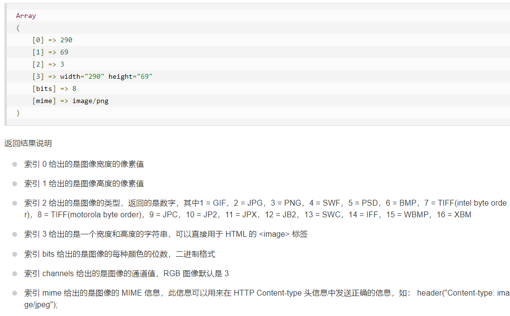
   >   
   > * 重采样拷贝部分图像并调整大小：
   >
   >   `imagecopyresampled($dst_image, $src_image, $dst_x, $dst_y, $src_x, $src_y, $dst_w, $dst_h, $src_w, $src_h);`
   >
   >   dst：目标图（缩略图中的缩小的源图）	src：源图
   >
   >   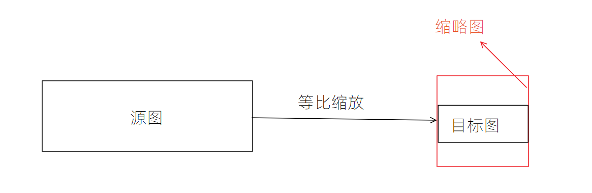
   >
   > * 拷贝并合并图像的一部分：
   >
   >   `imagecopymerge($dst_image, $src_image, $dst_x, $dst_y, $src_x, $src_y, $src_w, $src_h, $pct);`
   >
   >   pct：透明度
   
3. GD库处理应用案例：验证码（CAPTCHA）

   > 1. 验证码的验证：服务器随机得到一串验证码，并把它存放的图片中，保证计算机不能从图片中识别出验证码。然后发送给客户端让用户进行识别并将结果提交，服务器再根据用户的提交与服务器生成的验证码进行对比，正确则验证成功
   >
   > 2. 实例：
   >
   >    ~~~php
   >    <?php
   >    // 创建图片资源
   >    $img = imagecreatetruecolor(220,60);
   >       
   >    // 设置背景色
   >    $bg_color = imagecolorallocate($img,mt_rand(0,150),mt_rand(0,150),mt_rand(0,150));
   >    imagefill($img,0,0,$bg_color);
   >       
   >    // 获取验证码内容
   >    $str = '0123456789abcdefghijklmnopqrstuvwxyz';
   >    for($i = 0; $i < 4; $i++){
   >        $str_text[$i] = $str[mt_rand(0,35)];
   >    }
   >       
   >    // 获取验证码颜色
   >    for($i = 0; $i < 4; $i++){
   >        $str_color[$i] = imagecolorallocate($img,mt_rand(0,255),mt_rand(0,255),mt_rand(0,255));
   >    }
   >       
   >    // 干扰：线
   >    for($i = 0; $i < 20; $i++){
   >        $lines_color = imagecolorallocate($img, mt_rand(0,255),mt_rand(0,255),mt_rand(0,255));
   >        imageline($img, mt_rand(0,220), mt_rand(0,60), mt_rand(0,220), mt_rand(0,60), $lines_color);
   >    }
   >       
   >    // 写入内容
   >    $str_font = 'D:\Desktop\PHP\font\consola.ttf';
   >    imagettftext($img,mt_rand(25,35),mt_rand(-45,45),10, mt_rand(25,35),$str_color[0],$str_font,$str_text[0]);
   >    imagettftext($img,mt_rand(25,35),mt_rand(-45,45),60, mt_rand(25,35),$str_color[1],$str_font,$str_text[1]);
   >    imagettftext($img,mt_rand(25,35),mt_rand(-45,45),110, mt_rand(25,35),$str_color[2],$str_font,$str_text[2]);
   >    imagettftext($img,mt_rand(25,35),mt_rand(-45,45),160, mt_rand(25,35),$str_color[3],$str_font,$str_text[3]);
   >       
   >    // 干扰：点
   >    for($i = 0; $i < 75; $i++){
   >        $dots_color = imagecolorallocate($img, mt_rand(150,255),mt_rand(150,255),mt_rand(150,255));
   >        imagestring($img, mt_rand(1,5), mt_rand(0,220), mt_rand(0,60), '*', $dots_color);
   >    }
   >       
   >    // 输出资源
   >    header('Content-type:image/png');
   >    imagepng($img);
   >       
   >    // 销毁资源
   >    imagedestroy($img);
   >    ~~~
   
4. GD库处理应用案例：缩略图

   > 1. 缩略图：利用原图得到一个较小的图
   >
   > 2. 原理：将原图打开，然后放到另外一张较小的图片资源中，最后进行保存即可
   >
   > 3. 步骤：实现固定宽高的缩略图（可能会变形失真）
   >
   >    > 1. 得到一张原图资源
   >    > 2. 得到一个缩略图资源（较小）
   >    > 3. 图片采样复制：利用GD中的`imagecopyresamepled`函数
   >    > 4. 保存缩略图
   >    > 5. 销毁所有资源
   >    >
   >    > ~~~php
   >    > <?php
   >    > //! 制作一个固定比例的缩略图
   >    > $src_image = '..\image\kali.jpg';
   >    > $src = imagecreatefromjpeg($src_image);
   >    > 
   >    > // 制作缩略图100*100
   >    > $dst = imagecreatetruecolor(100,100);
   >    > 
   >    > // 采样复制
   >    > imagecopyresampled($dst, $src, 0,0,0,0,100,100,imagesx($src),imagesy($src));
   >    > 
   >    > // 保存缩略图
   >    > header('Content-type:image/png');
   >    > imagepng($dst);
   >    > imagepng($dst,'..\image\thumb_kali_01.png');
   >    > 
   >    > // 销毁资源
   >    > imagedestroy($src);
   >    > imagedestroy($dst);
   >    > ~~~
   >
   > 4. 步骤：实现等比缩放固定宽高比的缩略图（原图采样，目标图等比例缩小）
   >
   >    > 1. 计算缩略图宽高比
   >    >
   >    > 2. 计算原图宽高比
   >    >
   >    > 3. 比较缩略图的宽高比与原图宽高比
   >    >
   >    >    * 如果缩略图的宽高比大于原图宽高比，将缩略图用目标图的高尽可能填满：计算出目标图的宽
   >    >
   >    >      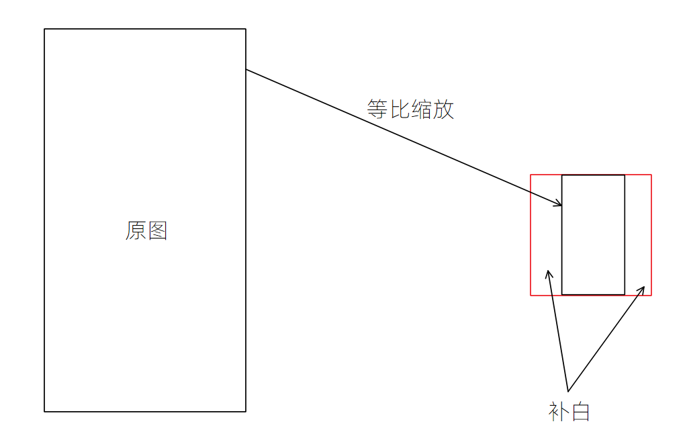
   >    >
   >    >    * 如果缩略图的宽高比小于原图宽高比，将缩略图中用目标图的宽尽可能填满：计算出目标图的高
   >    >
   >    >      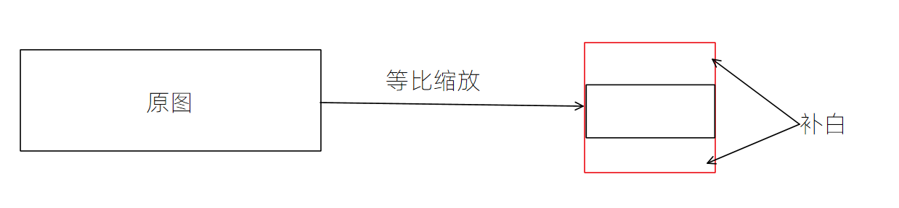
   >    >
   >    > 4. 将图片放置到缩略图中间，即调整目标图的x，y坐标
   >    >
   >    > ~~~php
   >    > <?php
   >    > //! 制作一个等比例的缩略图
   >    > $src_image = '..\image\kali.jpg';
   >    > // 获取图片信息
   >    > $src_info = getimagesize($src_image);
   >    > $src = imagecreatefromjpeg($src_image);
   >    > 
   >    > // 制作缩略图100*100
   >    > $dst = imagecreatetruecolor(100,100);
   >    > $dst_color = imagecolorallocate($dst,255,255,255);
   >    > imagefill($dst,0,0,$dst_color);
   >    > 
   >    > // 比较缩略图与原图的宽高比
   >    > $dst_ratio = 100 / 100;
   >    > $src_ratio = $src_info[0] / $src_info[1];
   >    > $dst_x = $dst_y = 0;
   >    > if($dst_ratio >= $src_ratio){
   >    >     // 缩略图宽高比大于原图宽高图，用原图的高填满缩略图的高，并计算出目标图存放到缩略图中的位置
   >    >     $dst_h = 100;
   >    >     $dst_w = floor($dst_h * $src_ratio);
   >    >     $dst_x = floor((100 - $dst_w) / 2);
   >    > }else{
   >    >     $dst_w = 100;
   >    >     $dst_h = floor($dst_w / $src_ratio);
   >    >     $dst_y = floor((100 - $dst_h) / 2);
   >    > }
   >    > 
   >    > // 采样复制
   >    > imagecopyresampled($dst, $src, $dst_x,$dst_y,0,0,$dst_w,$dst_h,$src_info[0],$src_info[1]);
   >    > 
   >    > // 保存缩略图
   >    > header('Content-type:image/png');
   >    > imagepng($dst);
   >    > imagepng($dst,'..\image\thumb_kali_02.png');
   >    > 
   >    > // 销毁资源
   >    > imagedestroy($src);
   >    > imagedestroy($dst);
   >    > ~~~

5. GD库处理应用案例：水印图（watermark）

   使用`imagecopymerge`函数制作水印图

   > 实例：封装一个水印图制作函数
   >
   > ~~~php
   > <?php
   > // 封装水印图制作函数
   > /*
   >  * @param1 string $str_path         -- 原图路径
   >  * @param2 string $wat_path         -- 水印标记路径
   >  * @param3 string $save_path        -- 水印图存储路径
   >  * @param4 string &$error           -- 记录错误信息的变量
   >  * @param5 int $position = 1        -- 水印加载的位置，默认为左上角，从1到9，代表3*行数+列数
   >  * @param6 int pct = 20             -- 透明度，默认为20
   > */
   > function WaterMarkCreate($str_path, $wat_path, $save_path, &$error, $position = 1, $pct=20):bool
   > {
   >     /* 验证水印标记和原图是否存在 */
   >     if(!is_file($str_path)){
   >         $error = '原图不存在！';
   >         return false;
   >     }
   >     if(!is_file($wat_path)){
   >         $error = '水印标记不存在！';
   >         return false;
   >     }
   > 
   >     /* 验证保存路径是否正确 */
   >     if(!is_dir($save_path)){
   >         $error = '保存路径不正确！';
   >         return false;
   >     }
   > 
   >     /* 获取原图和水印标记的信息 */
   >     $src_info = getimagesize($str_path);
   >     $wat_info = getimagesize($wat_path);
   > 
   >     /* 通过mime类型得到要打开类型的函数 */
   >     $allow = array(
   >         'image/jpeg' => 'jpeg',
   >         'image/jpg' => 'jpg',
   >         'image/gif' => 'gif',
   >         'image/png' => 'png',
   >         'image/pjpeg' => 'jpeg'
   >     );// 定义一个数组来通过MIME类型获取相应数据
   >     // 判断原图和水印标记数据类型是否正确（白名单）
   >     if(!array_key_exists($src_info['mime'],$allow)){
   >         $error = '原图文件类型不正确';
   >         return false;
   >     }
   >     if(!array_key_exists($wat_info['mime'],$allow)){
   >         $error = '水印标记文件类型不正确';
   >         return false;
   >     }
   >     // 组合函数名字
   >     $src_open = 'imagecreatefrom'.$allow[$src_info['mime']];
   >     $wat_open = 'imagecreatefrom'.$allow[$wat_info['mime']];
   >     $src_save = 'image'.$allow[$src_info['mime']];
   > 
   >     /* 打开图片资源 */
   >     $src_image = $src_open($str_path);
   >     $wat_image = $wat_open($wat_path);
   > 
   >     /* 合并图片资源，产生水印 */
   >     $add_x = floor(($src_info[0] - $wat_info[0])/2);
   >     $add_y = floor(($src_info[1] - $wat_info[1])/2);
   >     $dst_x = $add_x * ($position % 3 - 1);
   >     $dst_y = $add_y * floor($position / 3);
   >     // 合并图片资源
   >     if(imagecopymerge($src_image,$wat_image,$dst_x,$dst_y,0,0,$wat_info[0],$wat_info[1],$pct)){
   >         // 保存水印图片
   >         header('Content-type:'.$src_info['mime']);
   >         $src_save($src_image);
   >         $filename = 'wartermark_'.trim(strrchr($str_path,'/'),'/');
   >         $src_save($src_image,$save_path.'/'.$filename);
   >         return true;
   >     }else{
   >         $error = '水印图合并失败';
   >         return false;
   >     }
   > }
   > 
   > // 测试
   > if(WaterMarkCreate('../image/kali.jpg','../image/watermark.png','../image',$error)){
   >     echo ' 水印图制作完成';
   > }else{
   >     echo ' '.$error;
   > }
   > ~~~

