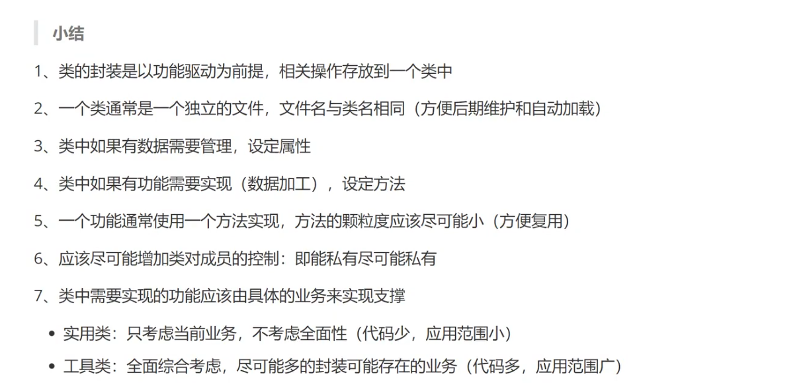
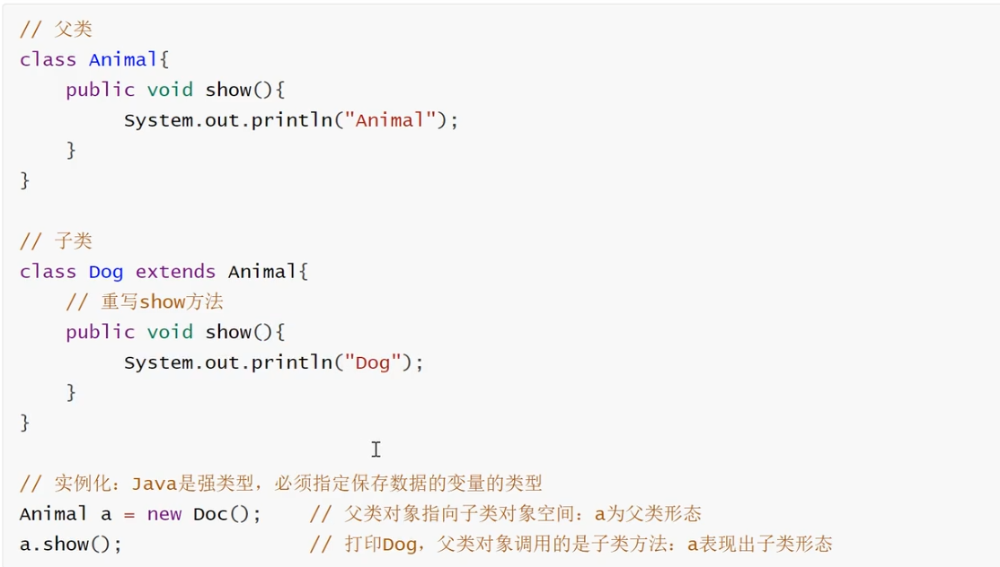
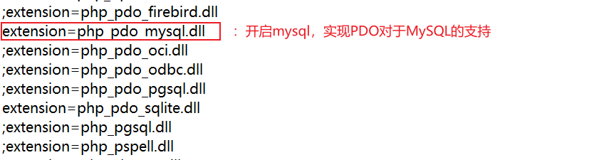
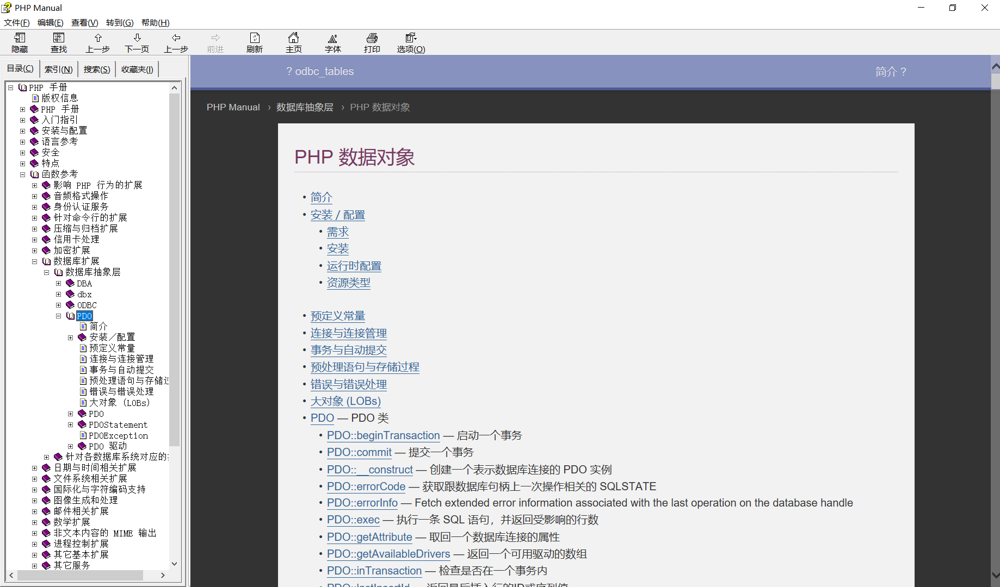
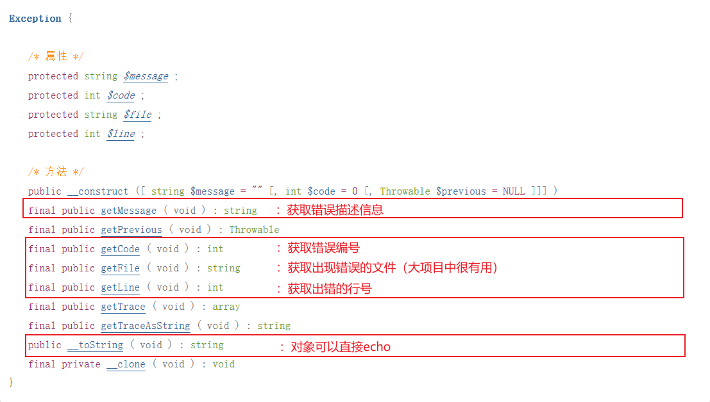

# 面向对象基础

## 一、面向对象编程思想

1. 面向过程编程：通过**函数编程**的方式将要解决的问题拆分为具体的步骤，然后按规定好的顺序**调用函数**解决问题

   ~~~php
   # 购买商品
   function buy($goods, $num){
       echo '买了'.$num.'件'.$goods;
       return;
   }
   # 调用输出函数
   buy('西瓜',10);
   ~~~

2. 面向对象编程（OOP）：通过**操作对象**的方式解决问题，而任何动作的执行或者数据都属于对象

   > 我的理解：面向对象就是在面向过程的基础上将其变量和函数再进行一次封装（赋予对象），明确其主体

   ~~~php
   # 定义一个消费者类
   class Buyer{
       # 拥有一个购买方法
       function buy($goods, $num){
           echo '买了'.$num.'件'.$goods;
       	return;
       }
   }
   # 确定具体的对象
   $Alice = new Buyer(); 	# 使用类定义一个对象Alice
   $Alice->buy('西瓜',10);  # Alice买了是西瓜，调用输出函数
   ~~~
   
   

---

## 二、面向对象的基础语法

### ⑴ - 面向对象关键字的说明

* **类：class**，是具有相同特性的事物的集合，例如：人类
* **对象：object**，符合某一种类的具体个体，也被称为实例（instance），例如：Alice是人类，其中Alice就是对象
* **实例化：new**，类产生对象的过程
* **类成员：member**，指类结构中的所有内容，即类的特性
  * **方法：method**，在类class结构中创建的函数，也被称为成员函数或成员方法
  * **属性：property**，在类class结构中创建的变量，也被称为成员变量
  * **类常量：const**，在类class结构中创建的常量（使用const关键字定义）

### ⑵ - 面向对象简单技术实现

~~~php
<? php
    // 定义类
    class 类名{
    	# 此处定义类成员
	}
	// 实例化对象，$object为一个对象
	$object = new 类名(); # new 类型(); 称作实例化
~~~

> 类名的命名规则一般使用大驼峰命名法

### ⑶ - 类成员

1. 概念：直接定义在类结构{ }中的一级成员，即方法中使用的变量不算类成员

2. 类成员的定义：

   ~~~php
   class 类名{
       # 类常量（可以定义多个）
       const 常量名 = 值;		// 常量名的前面不需要加$符号且一般全部大写，且常量必须在定义时赋值
       # 类属性（可以定义多个）
       public $属性名[ = 值];	// 可以声明也可以声明的同时赋值
       # 类方法（可以定义多个）
       [public] function 方法名([参数列表]){
           // 方法体 + 返回值
       }
   }
   ~~~

3. 类成员的访问：（使用`->`）

   ~~~php
   # 实例化
   $object = new 类名();				 // 访问前应该实例化
   # 属性访问（注：属性名前不需要添加$符号）
   $object->新增属性名 = 新增属性值;		// 增（一般不做使用）
   unset($object->待删除属性名);		  // 删（一般不做使用）
   $object->属性名 = 新值;			   // 改
   # 方法访问
   $object->方法名(实参列表);			 // 方法不能新增
   # 类常量属于类，一般不使用对象进行访问；方法和属性属于对象，所以可以直接通过对象访问
   # 类常量访问详见范围解析操作符
   ~~~

4. Note：类结构的{ }中，只允许定义类成员，不允许执行其它操作（如：判断，输出，调用函数），但是这些操作可以写在类方法中

### ⑷ - 访问修饰限定符

1. 概念：用在属性或方法前的修饰关键字，用来控制属性或者方法的访问位置

2. 分类：

   > * public：公有，类内和类外都可以访问
   > * [protected](#protected)：受保护，只允许在该类内部与其子类**内部**访问（给不允许外部访问但允许子类内部访问的成员添加该属性）
   > * private：私有，只允许在该类**内部**访问

3. Note：属性必须要有访问修饰限定符，而方法可以没有（因为默认为public）

### ⑸ - 类内部对象--$this

1. 概念：`$this`，是**方法内部**内置的一个对象，会自动指向调用该方法的对象（来访者的对象）

2. Note：

   > 1. `$this`存在于方法内部，所以它可以访问任意修饰限定符的类成员
   > 2. 私有成员可以通过`$​this`在外部调用类方法进行访问
   > 3. 在类方法内部访问类对象也需要通过对象才能访问，所以必须通过`$this`才能访问
   
3. `$this`、class和new之间的关系

   > * class是定义类结构，属于非执行段代码，会在编译阶段就会被加载到内存中的代码段
   >
   > * new是实例化对象，在使用时会先判定内存中的代码段中class代码段是否存在
   >
   >   > * 若不存在，则会报错
   >   > * 若存在，则会将类的内部属性部分赋值一份，然后在堆区开辟一块内存空间，将属性放到里面，同时还会存储一个指针指向类在内存中的存储空间
   >
   >   > 对象的访问：
   >   >
   >   > * 若对象访问属性：即会访问之前通过new在堆区中开辟的空间
   >   > * 若对象访问方法：则会通过之前通过new在堆区中开辟的空间中存储的指针找到类空间中的方法，然后在栈区中开辟运行
   >
   > * `$this`是系统在方法中内置的对象，在调用方法时，系统会自动找到调用方法的对象保存的堆区地址，将其赋值给`$this`

### ⑹- 面向对象的开发规范

1. 属性的初始化：如果不是类具有的共性，通常不对属性进行赋值。一般属性的初始化会在实例化后完成，也有的属性在操作过程中被初始化
2. 访问修饰限定符的选择：设定好的类成员不会被外部用到时，使用`private`或`protected`；或是一定会被外部访问，则使用`public`。属性通常使用`private`居多，且原则是尽可能的增强类对成员的控制（尽可能多的使用`private`或`protected`）。

### ⑺  - 构造方法

1. 魔术方法：达到某种条件后会自动被触发，不需要手动调用（但可以手动调用）的方法。其方法名的开头通常带有双下划线

2. 构造方法（`__construct`）：是一种类结构特有的魔术方法，**在对象实例化的时候会被自动调用**，通常是为了实现对象所需资源的初始化，可以设定形参，在实例化对象的时候传入，再通过形参给类对象赋值 —— `new 类名(实参列表);`

3. 步骤：

   > 1. 如果类中有数据需要进行初始化，且每个对象的该数据各不相同，则需要使用构造方法
   > 2. 在有需要的情况下，使用形参接收外部传来的实参
   > 3. 在构造方法内部利用内部对象`$this`和形参对需要初始化的数据进行赋值（也可以执行其它操作）
   > 4. 在实例化对象时，若构造函数使用了形参，必须传入实参列表进行初始化

4. 示例：

   ~~~php
   <?php
   # 构造方法的使用
       
   class Saler{
       # 属性
       public $count;
       private $money;
       public function __construct($count,$money){
       	# 其它操作
       	echo __CLASS__;
       	# 初始化
       	$this->count = $count;
       	$this->money = $money;
   	}
   }
   	
   # 实例化
   $s1 = new Saler(10,10);
   $s2 = new Saler(20,100);
   ~~~
   
5. 私有化构造方法意味着不再允许外部实例化对象

### ⑻ - 析构方法

1. 析构方法（`__destruct`）：是一种类结构特有的魔术方法，**在对象被销毁的时候会被自动调用**。但是手动调用析构方法并不会销毁对象

2. 对象被销毁的场景：

   > 1. 对象无变量指向：将原指向对象的变量赋予了其它值
   > 2. 对象被主动销毁：unset释放对象变量
   > 3. 脚本执行结束：自动释放资源（会释放所有资源，一般较少使用析构方法）

3. 通常PHP脚本周期一般不长，所以一般不会使用析构方法释放资源，因为脚本结束会自动回收所有资源，所以PHP中很少使用到析构方法

### ⑼ - 对象传值

1. 概念：对象传值就是将保存变量的对象赋值给另一个变量

2. 实质：在PHP中对象的传值实际上是**引用传递**，传值后，两个变量指向同一个对象的内存地址，即对象的传值并不会实例化一个新的对象，无论如何赋值，只会存在一个对象

3. 示例：

   ~~~php
   <?php
       class Saler{}
   	$s1 = new Saler();
   	$s2 = $s1;	# 则$s1与$s2指向同一片内存区域，只有一个对象
   ~~~

### ⑽ - 范围解析操作符

1. 概念：范围解析操作符【`::`】，是专门用于**类实现类成员操作**的，可以实现类直接访问类成员，而不需要对象

2. 访问方式：

   > \> `类名::类成员`		  【这种访问方式可以访问类常量】
   >
   > \> `$对象名::类成员`	【返回解析操作符兼容对象：会找到对象所属的类进行访问】

3. 我们规定类常量属于类，所以一般不会通过对象访问（可以，但不要使用）

4. 访问类常量时可以不存在对象

### ⑾ - 静态成员

1. 概念：静态成员就是使用`static`关键字修饰的类成员，表示该成员**使用类访问**，而不是使用对象访问

2. 种类：静态属性与静态方法

3. 访问：使用范围解析操作符访问，通过`类名::类成员`的方式访问。也都可以使用对象与`::`访问【但不要用】，且不可以使用`->`访问静态属性，但是可以通过使用`->`访问静态方法

4. 定义：在普通属性或方法的访问修饰限定符与其名称之间添加`static`关键字，即可将其定义为静态成员

5. 示例：

   ~~~php
   <?php
   class Saler{
       // 类属性
       public $money = 0;
       public static $count = 0;    # 静态属性
       // 方法
       public showCount(){
           echo Saler::$count;
       }
       public static showClass(){
           echo __CLASS__;
       }
   }
   // 静态属性的访问
   echo Saler::$count;
   // 静态方法的访问
   Saler::showClass();
   ~~~

6. Note：

   > 1. 因为静态方法需要使用类访问，而不能使用对象访问，故在其中不能使用`$this`
   > 2. 静态成员也会受访问修饰限定符的限定，使用protect或private的成员不能被在类外访问
   > 3. 普通属性存放在对象的堆区中，而静态属性存放在类的堆区中，所以静态属性不能通过对象访问
   > 4. 静态方法和非静态方法都存放在类结构中（内存中的代码段），所以静态方法可以使用对象访问
   > 5. 静态成员访问效率比非静态高，能用静态就使用静态
   > 6. ==静态成员就是给类访问的，非静态成员就是给对象来访问的，不要闲着无聊不按规矩来访问，就算结果正确也不规范==

### ⑿ - self关键字

1. 功能：**在类的内部代替类名**，一般配合范围解析操作符`::`来访问静态成员和类常量

2. 作用：保护类内部结构的完整性和一致性，保证在修改类名的时候，不会改动类的内部结构

3. 特殊作用：当构造方法私有化之后，使用self关键字实例化对象

   ~~~php
   <?php
       class Saler(){
       	private static $count = 1;
       	// 静态方法
       	private static function showCount(){
               echo self::$count;	# 使用self代替类名访问静态属性
           }
       	// 私有化构造方法：即不再允许外部实例化对象
       	private function __construct(){}
       	# 提供一个静态方法：实现对象的实例化
       	public static function getInstance(){
               return new self();	# 使用self代替类名进行实例化
           }
   	}
   	// 示例化对象
   	# 使用$s = new Saler();会报错
   	$s = Saler::getInstance();	# 获取实例
   ~~~

### ⒀ - 类的加载

1. 在开发过程中，我们在通常会单独使用一个文件定义类，在这个文件中（也是.php文件），不会就只有类的定义而不存在类的使用

   

2. 类的加载：类的访问必须保证类在内存中已经存在，所以需要在使用类之前，将类所在的PHP文件加载到内存

3. 加载方式的分类：

   > * 手动加载：使用`include`函数将包含类的文件引入内存，适用于小型项目
   >
   >   ~~~php
   >   if(!class_exists('类名')){
   >       # 若内存中不存在这个类：加载
   >       include_once '类名.php';
   >   }
   >   ~~~
   >
   >   > `class_exists()`：检查类是否已定义
   >
   > * 自动加载（应用较多）：提前定义好类结构和位置，写好引入类文件的代码，在系统需要类而内存中不存在的时候想办法让写好的加载类的代码执行，即自动加载就是自动运行提前写好的加载类的代码

4. 自动加载的实现方式

   > 1. 使用魔术函数`__autoload()`：尝试加载未定义的类，系统在实例化类的时候会自动调用（PHP7.x之后较少使用）
   >
   >    ~~~php
   >    function __autoload($classname){
   >        # 类的加载语句，其中$classname代表类名
   >    }
   >    ~~~
   >
   > 2. 通过自定义函数来实现类的加载，再通过`spl_autoload_register`[^注1]注册到自动加载机制（使用较多的是这种方式）
   >
   >    ~~~php
   >    # 自定义类的加载函数
   >    function 自定义函数名($classname){
   >        # 类的加载语句
   >    }
   >    # 注册自动加载
   >    spl_autoload_register('自定义函数名');
   >    ~~~
   >
   >    ---
   >
   >    自定义加载函数实例：假设要加载的PHP类文件在当前目录下的a目录或者b目录中的任意一个
   >
   >    ~~~php
   >    # 创建自定义函数
   >    function my_autoload($classname){
   >        // 判断PHP类文件是否在a文件夹下存在
   >        $a_file = './a/'.$classname.'.php';
   >        if(!file_exists($a_file)){
   >            include_once $a_file;
   >            return true;
   >        }
   >        // 判断PHP类文件是否在b文件夹下存在
   >        $b_file = './b/'.$classname.'.php';
   >        if(!file_exists($b_file)){
   >            include_once $b_file;
   >            return true;
   >        }
   >    }
   >    # 将自定义函数注册到自动加载机制中，让自动加载能够执行
   >    spl_autoload_register('my_autoload');
   >    /*** Note:也可以注册多个函数实现在不同的文件夹下查找PHP类文件进行加载 ***/
   >    ~~~

5. 为了实现自动加载，我们需要遵守的规范：

   > 1. 类名与PHP类文件名一致
   > 2. 应该通过处理的业务将PHP类文件分类放好

6. 类的加载步骤：

   > 1. 定义类文件：一个类一个文件，且文件中只有类的定义代码。定义完成后，将它分类放好
   > 2. 确定加载类型，写好加载代码：一般使用自定义函数加载
   > 3. 在明确类能能够通过自动加载载入内存后，可以直接使用类

### ⒁ - 对象克隆

1. 概念：克隆对象是通过已有对象复制出一个相同的新对象，但是这两个对象的内存地址不同并非同一个对象

2. 魔术方法`__clone`的介绍：**克隆出一个新对象后，新对象会自动调用魔术方法`__clone`**。若私有化魔术方法`__clone`，相当于不允许外部克隆；若需要在克隆之后对新对象进行操作，则需要在`__clone`中设定好对新对象的处理

3. 步骤：

   > 1. 定义类时考虑对象是否允许被克隆，以及允许克隆后是否需要针对克隆对象做操作（使用魔术方法`__clone`设定）
   > 2. 实例化对象并保存到变量
   > 3. 当需要从已有对象复制出一个新对象时，使用`clone`产生新对象 —— `$new = clone $old;`
   > 4. 克隆产生的新对象会自动调用魔术方法`__clone`，没有则不会调用

4. Note：

   > 1. 私有化魔术方法`__clone`会禁止外部对象克隆
   > 2. 在克隆出新对象之后，如果在类中定义了魔术方法`__clone` ，则新对象会自动调用这个

### ⒂ - 实操：封装数据库操作类

1. 概念：封装使用mysqli扩展语句实现对数据库的操作，即对mysqli语句进行二次加工

2. 步骤：

   > 1. 确认要封装的业务，基于mysqli的数据库底层实现，完成数据库操作的基本诉求
   >
   >    * 简化初始化操作
   >    * 在操作时实现错误处理
   >    * 实现数据操作 —— 增删改查
   >
   >    > 对数据库结构一般不做处理：因为这些东西通常会在项目初期被搭建好，一般只有在项目迁移的时候才会被使用
   >
   > 2. 明确封装类的作用：
   >
   >    > 1. 一个方法做一件事情
   >    > 2. 方法只负责执行，不对结果做任何处理
   >    > 3. 封装的所有操作不应该是固定的内容，应该将内容动态化
   >
   > 3. 明确封装类的属性和方法：
   >
   >    > 使用属性保留的数据：数据需要跨方法或是对外提供支持
   >    >
   >    > * 数据库操作的相关数据：主机地址、端口、用户名、密码、数据库名字、字符集
   >    > * 数据库的连接资源（跨方法）：连接资源（就是所有mysqli相关函数的第一个参数）
   >    > * 错误信息（对外提供支持）：错误信息、错误编号
   >
   >    > 数据操作需要封装的方法：
   >    >
   >    > * 初始化：使用构造方法初始化类的属性
   >    > * 初始化数据库资源：数据库连接认证、字符集的设置、数据库的选择
   >    > * 封装一个SQL指令语法检查方法：在每次执行指令之前调用该方法判断，并做好错误处理
   >    > * 写操作：实现增、删、改指令的执行，若成功，则返回受影响的行数
   >    > * 自增长ID的获取：因为此业务较为复杂，所以单独使用一个方法实现
   >    > * 读操作：单记录获取或多记录获取
   >
   > 4. 明确类的控制（私有与公有）
   
3. 小结：怎么去封装一个类

   > 

---

## 三、面向对象的高级语法

### ① - 面向对象的三大特性

* 面向对象是一种编程思想，其本质是以建立模型体现出来的抽象思维过程和面向对象的方法。模型是用来反应现实世界中事物特征的
* 面向对象的三大特性：封装、继承、多态，它们是指导面向对象编程的核心思想

---

#### Ⅰ- 封装

1. 概念：封装就是将数据和对数据的操作捆绑到一起，形成对外界的隐蔽，同时对外提供可以操作的接口

2. 解释：封装就是对实体对象抽象形成类的过程

   > 数据：成员属性和类常量
   >
   > 数据的操作：类方法
   >
   > 捆绑：使用类结构将类成员封装起来，成为一个整体
   >
   > 可以操作的接口：public方法

3. 目的：让使用者知道类的作用，但不清楚类的实现，使类负责处理业务逻辑，对象只要调用实现

---

#### Ⅱ - 继承

1. 概念：继承是指子类合法拥有父类的权限

2. 使用场景：子类被父类包含（如：女人属于人类，则女人是人类的子类）

3. 本质：子类可以直接使用父类已经存在的数据和数据操作

4. 机制：PHP中使用extends关键字表示继承

5. 步骤：

   > 1. 创建一个父类（基类）：是一个较为抽象的类，其属性和方法都是比较大众的
   > 2. 创建一个子类（派生类）：子类必须被父类包含，在创建时需要明确其父类
   > 3. 在实例化子类时，子类对象可以直接访问子类不存在而父类存在的属性和方法

6. 操作：

   ~~~php
   # 父类
   class human{}					# 人类
   # 子类
   class man extends human{}		# 男人，继承人类
   class woman extends human{}		# 女人，继承人类
   class dog{}
   ~~~

7. 目的：实现代码复用，且允许在子类中进行扩展，增加父类不存在的功能

---

#### Ⅲ - 多态

1. 概念：多态性是指相同的操作或者函数、过程可作用于不同的对象上从而得到不同的结果

2. 触发条件：需要发生**类的继承**，同时出现**方法的重写**，即子类拥有在父类中重名的方法。且在实例化子类的时候存储的对象为父类对象（因此需要强类型语言，==PHP不能实现==[^注2]），从而实现父类对象调用子类方法

3. 举例：

   > 使用java这样的强类型语言实现：
   >
   > 
   >
   > ---
   >
   > PHP模拟实现多态
   >
   > ~~~php
   > # 父类
   > class Animal{
   > 	# 统一调用被重写方法
   >     public static function show(Animal $obj){	
   >         // 限定传入数据的类型，而不是限定变量类型，强制传入数据的对象拥有Animal对象的属性
   >         $obj->dispaly();	// 对动态对象调用方法
   >     }
   > 	# 父类方法 - 该方法被重写
   >     public function display(){
   >         echo 'Animal';
   >     }
   > }
   > # 子类1
   > class Cat extends Animal{
   >     // 重写父类方法
   >     public function display(){
   >         echo 'cat';
   >     }
   > }
   > # 子类2
   > class Dog extends Animal{
   >     // 重写父类方法
   >     public function display(){
   >         echo 'dog';
   >     }
   > }
   > # 父类方法的统一调用：传入不同的对象，但拥有Animal对象的属性
   > Animal::show(new Cat());	// 输出cat
   > Animal::show(new Dog());	// 输出dog
   > ~~~

---

### ② - PHP继承

#### Ⅰ - 相关概念

1. 核心价值：子类通过继承访问父类的成员
2. 步骤：先抽象出父类，再根据需求确定子类
3. 目标：使父类包含子类，子类属于父类
4. 本质：对象继承属性和方法

#### Ⅱ - 有限继承

子类在继承父类的成员时，并非继承所有内容，而是继承部分内容 ——

* 子类可以继承父类的所有**公有成员、受保护的成员和私有属性**（可以继承但不能在子类中访问），**唯独私有方法不能继承**

* 私有成员的访问只有在所属类中设定公有或受保护的方法来进行访问，但一般不会这么做

* 静态成员也遵循继承的规则 —— `子类::父类的中允许访问的成员`

* 父类的构造方法和析构方法会被子类继承，若父类的构造方法和析构方法都被私有化，则其子类的该方法也会被私有化

   所以为了避免麻烦，一般不会在父类中设置构造方法；或者所有子类都会使用父类统一的构造方法

> 我的理解：其实可以理解为私有成员都会被子类继承，但是不能在子类内部访问。

#### Ⅲ - 重写

* 重写（override）：子类中定义与父类重名的成员

  > 属性：父类的公有和受保护的属性将被覆盖（但一般不会这么做，因为直接赋值即可）
  >
  > 方法：会同时存在（一般使用重写都是重写父类的方法），且优先权会比父类更好
  >
  > 【属性覆盖的区别可以使用查看实例化对象看出】

* 子类对于成员的控制权不能高于父类（控制权：private > protect > public）
* 子类重写的方法参数要与父类保持一致，但是父类的私有方法不会被继承，不存在重写概念，想咋写就咋写
* 静态成员也可以被重写，但是静态属性因为存在于类，所以不能被覆盖
* 成员被重写后，访问的都是子类的成员

#### Ⅳ - parent关键字

1. 作用：访问父类被**重写的方法、静态属性、类常量**，而被覆盖的成员将不适用这个方法
2. 用法：`parent::父类`
3. 使用场景：子类在使用父类构造方法的基础上还需要进行操作，就可以重写一个构造方法，并在这个构造方法中包含父类的构造方法

#### Ⅴ - PHP继承特性

* PHP只能单继承，只有一个父类（即`class Baby extends Dad,Mom{}`这种写法是错误的）

  > 想要继承多个类，只能使用链式继承

* PHP继承中，只有私有方法不能被继承

* PHP允许继承父类中的构造方法和析构方法

#### Ⅵ - 静态延迟绑定

1. 作用：在类内部用代表类本身的关键字部分不是在类编译时固定好，而是当方法被访问时动态的选择来访者所属的类

   > 在需要访问的成员是静态成员或者类常量时——
   >
   > self：self关键字定义时在哪个类的内部，就会代表那个类
   >
   > static：static会代表调用它的那个类

2. 说明：静态延迟绑定利用static代替self的内部访问，需要使用到静态成员的重写

3. 举例：

   ~~~php
   <?php
   # 父类
   class Human{
   	public static $name = 'Human'; # 静态成员
       public static function showName(){
           # 静态绑定
           echo self::$name,' ';
           # 静态延迟绑定
           echo static::$name,' ';
       }
   }
   # 子类
   class Man{
       # 重写父类静态属性
       public static $name = 'Man';
   }
   # 结果
   Man::showName();	
   /*
   Human	:self关键字定义时在哪个类的内部，就会代表那个类
   Man		:static会代表调用它的那个类
   */
   ~~~

4. 原理：

   > 在编译时，使用静态绑定的成员会被直接固定；而静态延迟绑定会被赋予一个未知值
   >
   > 在执行代码时，静态延迟绑定会被赋予调用它的类

#### Ⅶ - 最终类Final

1. 定义：最终类使用final关键字修饰类名，表示该类不能被继承

2. 功能：最终类表示类已经到了最后，不能再被当作其它类的父类，只能直接实例化使用。

3. 作用：有效控制继承链。

4. final关键字：

   > 修饰类：表示该类为最终类
   >
   > ~~~php
   > final class Man{}
   > ~~~
   >
   > 修饰方法：表示该方法不能被重写
   >
   > ~~~php
   > class Human{
   >     final public function hello(){
   >         echo 'hello';
   >     }
   > }
   > class Woman extends Human{
   >     # 此方法将会报错
   >     public function hello(){
   >         echo 'hi';
   >     }
   > }
   > ~~~
   >
   > Note：final类中不需要使用final修饰方法

#### Ⅷ - 抽象类Abstract

1. 定义：抽象类使用abstract关键字修饰类名，表示该类只能被继承，不能被实例化

2. 功能：抽象类是用来规范下属类的基本结构的，本身不可以被实例化，只能被继承。但是抽象类可以拥有其他类应该有的任何成员

3. 说明：抽象类要么被抽象类继承，要么在被实体类继承且实体类要实现抽象类中的抽象方法

4. 作用：项目管理者为了确保开发的统一性，规范上层架构，让所有的实现类都继承抽象类

5. final关键字：

   > 修饰类：表示该类为抽象类
   >
   > ~~~php
   > abstract class Human{}
   > $m = new Human(); # 将会报错
   > ~~~
   >
   > 抽象方法：表示该方法不能有方法体，而且抽象方法只能在抽象类中使用，且抽象方法不能为private
   >
   > ~~~php
   > abstract class Human{
   >     # 方法体为空的普通方法
   >     public function hello(){}
   >     # 抽象方法
   >     public abstract function hi();
   > }
   > # 使用抽象类继承抽象类 —— 增加更多的业务规范
   > abstract class NiceGay extends Human{
   >     # 可以继续增加新的抽象方法和普通方法
   > }
   > # 使用实体类继承抽象方法
   > class Man extends Human{
   >     # 实体化抽象方法，此处可以看作重写，必须遵守重写的规则
   >     public function hi(){
   >         echo 'hi';
   >     }
   > }
   > ~~~

6. Note：

   > 1. 抽象类中的成员一般不会使用私有成员
   >
   > 2. 抽象类一般运用于大型项目的初始代码

#### Ⅸ - 总结

1. 继承是面向对象思想中实现代码复用最重要的一种机制
2. 继承是允许扩展的：子类可以根据自己的需求进行修改，拥有很低的运维成本
3. PHP有自己独特的继承特点：单继承（一个类只能继承一个父类）
4. 高级类：最终类（保护结构）、抽象类（保证开发一致性）

---

### ③ - trait代码复用

#### Ⅰ - 概念

**Trait**（引入）：为了像PHP这种单继承语言而设计的，使面向对象变得纯粹，摆脱为了复用而继承的困境，从而让不同类型的类都能拥有的公共成员的这样一种代码复用机制

> 因为继承之间应该拥有相似性，但是有些类并不符合这个条件，但是却有部分成员功能一致。为了实现代码的复用，就需要增加公共类，但这样一个公共类除了实现代码复用本身没有意义，不符合纯粹的面向对象思想
>
> 简单来说就是不同的类中存在公共代码，但这些代码很难构成一个类，为了实现代码的复用，将它们抽离出来，封装为一个trait
>
> ---
>
> 遇到这样的情况，就可以提供公共代码，然后让具有共性的类引入（Trait）

1. trait的定义：结构类似于类，但没有常量，且自身不能被实例化

~~~php
trait 名字{
    # 属性（包含静态）
    # 方法（包含静态、抽象方法）
}
~~~

2. trait的引入：一个类可以引入多个trait，从而可以使用trait中的内容

~~~php
class 类名{
    use trait_name_01, trait_name_02;
}
~~~

#### Ⅱ - trait同名问题

1. trait同名：在同一个类里引入**不同的trait中**出现属性同名不同值的问题或方法同名问题

2. 方法同名的解决方案 

   > 1. 不允许同名出现，确定一个能用的方法
   >
   >    ~~~php
   >    use trait名1,trait名2,…{
   >        trait名1::重名方法名 insteadof trait名2;  # 允许使用trait名1::重名方法名，而trait名2::重名方法名废弃
   >    }
   >    ~~~
   >
   > 2. 不允许同名出现，先确定一个能用的方法，让另一个方法使用别名替代
   >
   >    ~~~php
   >    use trait名1,trait名2,…{
   >        trait名1::重名方法名 insteadof trait名2;  # 允许使用trait名1::重名方法名
   >        trait名2::重名方法名 as 别名; 	# 给trait名2::重名方法名，使用trait名2::别名即可完成操作
   >    }
   >    ~~~
   >
   > 3. 原理：方案一相当于将<u>trait名1::重名方法名</u>的优先级提高，而方案二相当于给<u>trait名2::重名方法名</u>复制了一份并重命名，其实两种方案中的<u>trait名2::重名方法名</u>都没有被改变

3. 属性同名：没有解决方案，直接报致命错误不接受反驳，只能在trait中改名

4. Note：一般都不会出现同名问题，但一旦出现方法的同名，我们一般不会修改trait中的方法，而是执行解决方案；而属性同名就只能修改trait中的代码

#### Ⅲ - trait的控制权

1. 概念：trait在引入类之后，可以根据实际需求修改trait中对应方法的控制权（只针对引入类）

2. 改变权限的方法：

   > 1. 使用as关键字直接修改权限
   >
   >    ~~~php
   >    trait trait名字{
   >        protected function 方法名(){}
   >    }
   >    class 类名{
   >        use trait名字{
   >            方法名 as 访问修饰限定符;
   >        }
   >    }
   >    ~~~
   >
   > ---
   >
   > 2. trati中允许通过修改方法的别名来实现权限的改变
   >
   >    ~~~php
   >    trait trait名字{
   >        protected function 方法名(){}
   >    }
   >    class 类名{
   >        use trait名字{
   >            方法名 as 访问修饰限定符 别名; # 该访问修饰限定符只针对别名，不会影响原有的方法名
   >        }
   >    }
   >    ~~~

#### Ⅳ - trait优先级

> **子类 > trait > 父类**

优先级高的会覆盖优先级低的方法，相当于重写

若trait中想要访问父类方法：可以直接通过parent访问到父类的方法

若子类中存在同名方法：子类中可以直接通过parent访问到父类的方法，也可以利用别名访问trait中的方法

#### Ⅴ - 总结

* trait可以拥有除类常量之外的所有类中的成员
* trait本质是为了给其它类提供公共代码的
* trait中较少保存属性，而大多保存方法
* 优先级：**子类 > trait > 父类**

---

### ④ - 接口

#### Ⅰ - 概念

* 接口（interface），与类类似，专门用来规范一些共性类必须实现的方法

  【我的理解：相当于预先定义了一个模板，只需要往里面填写内容即可】

  * 接口不是类，但是与类有类似的结构
  * 接口不能被实例化，类可以实现接口

* 使用规范：

  ~~~php
  interface 接口名字{}				# 定义接口
  class 类名 interface 接口名字{}	   # 实现接口 
  ~~~

* 接口是用来规范项目体系，提供一些必须的行为规范的
* 接口会使得开发项目变得不那么灵活，应该选择性地使用接口
  * 小型项目：接口会使得PHP的灵活性受阻，所以较少使用接口
  * 大型项目：接口的增加会很好的规范团队的协作，所以较多地使用接口

#### Ⅱ - 接口成员

1. 接口成员：就是在接口内部定义的成员

2. 接口成员只能由两类 —— 

   * 接口常量：const

     > 接口常量不能被重写

   * **公有的**接口方法：普通方法或静态方法

     > **接口方法都是抽象方法**，不需要使用abstract关键字；且实体类实现接口必须实现所有的接口方法，抽象类则不做要求
     >
     > 实现接口方法不能降低其权限，只能为public

#### Ⅲ - 接口继承

1. 接口继承：接口可以被接口继承，且可以一次性继承多个接口的继承（接口的继承不是单继承）

2. 目的：

   > 1. 为了实现接口的成员扩展，丰富接口内容
   > 2. 为了形成完整的接口体系，让不同级别的类实现不同级别的接口

3. 演示：

   ~~~php
   interface A{}	# 顶级接口
   interface B{}	# 顶级接口
   # 接口继承
   interface C extends A,B{}	# 子接口
   ~~~

4. 说明：接口在大型项目中，通常是抽象类实现接口，增加必要成员，再按照实际业务需求去继承抽象类

---

### ⑤ - 重载

#### Ⅰ - 概念

* 重载（overload）：指在一个类中可以出现多个同名方法，但要求彼此之间的参数和类型不一样

  > 传统重载的示例：
  >
  > ~~~java
  > class Person{
  >     public String drink(String taste){
  >         return 'good:' + taste;
  >     }
  >     public Void drink(int number){
  >         System.out.println('喝了'+number+'口');
  >     }
  > }
  > // 实例化
  > Person p = new Person();
  > String res = p.drink('nice');	// 调用第一个方法
  > p.drink(1);						// 调用第二个方法
  > ~~~

* 传统重载在PHP中并不适用：因为PHP不支持同名方法，也不区分数据类型，所以PHP不支持传统重载

* PHP中的重载：当某些不允许操作发生时，会自动调用的一种内部机制（相关的魔术方法），来实现错误处理

  * 属性重载：属性不存在或权限不够访问时触发
  * 方法重载：方法不存在或权限不够访问时触发

  所有PHP的重载都需要开发者事先设定好实现的魔术方法

* 本质：针对错误使用的处理方案，即容错处理

#### Ⅱ - 属性重载

1. PHP属性重载：当对象访问不存在的或者权限不够的属性时，自动触发魔术方法，而不让代码出错，即添加容错处理

2. 属性重载的魔术方法：

   * \_\_get(属性名)：**访问**不存在或权限不够的属性时触发
   * \_\_set(属性名, 属性值)：**设置**不存在或权限不够的属性时触发
   * \_\_isset(属性名)：**判断**不存在或权限不够的属性时触发
   * \_\_unset(属性名)：**删除**不存在或权限不够的属性时触发
   * __tostring(属性名)：当对象被当作普通数据echo的时候，对象是复合类型，不能通过echo输出

3. 实例：

   ~~~php
   class Gay{
       private $age = 18;
       private $money = 10000;
       public $name = 'GayBoy';
       # 读取重载
       public function __get($key){
           // 可以设定一个允许访问的私有属性列表
           $allow = array('age','money');
           // 判断读取的属性是否在列表内
           if(in_array($key,$allow)){
               return $this->$key;	// 在内部查找运行访问的私有属性的值，并输出
           }
           return false;
       }
       # 写入重载
       public function __set($key, $value){
           // 可以设定一个允许赋值的私有属性列表
           $allow = array('age','money');
           // 判断读取的属性是否在列表内
           if(in_array($key,$allow)){
               return $this->$key = $value;	// 在内部查找运行访问的私有属性的值，赋值并输出
           }
           return false;
       }
       # 判定是否存在重载
       public function __isset($key){
           // 内部判定
           return isset($this->$key);
       }
       # 删除重载
       public function __unset($key){
           // 内部删除
           unset($this->$key);
       }
       # 对象重载
       public function __tostring(){
           return __METHOD__;		// __METHOD__:返回类的方法名
       }
   }
   ~~~

4. 使用场景：一般情况下系统内部使用的类如果不是特殊情况不会用到属性重载，如果是将类提供给外界使用，那么应该增加重载机制防止出错

#### Ⅲ - 方法重载

1. PHP方法重载：对象或类访问不存在或者权限不够的方法时，自动触发的魔术方法让代码不出错（容错处理）

2. 方法重载需要使用到的魔术方法：

   * __call(方法名, 方法参数列表)：调用不存在或者权限不够的方法时触发
   * __callStatic(方法名, 方法参数列表)：调用不存在或者权限不够的静态方法时触发

3. 实例：

   ~~~php
   class Gay{
       private function show()
       {
           echo __METHOD__, ' ';
       }
   
       private static function staticShow()
       {
           echo __METHOD__, '<bt>';
       }
   
       # 普通方法重载
       public function __call($name, $args)
       {
           // 允许访问列表
           $allow = array('show');
           if (in_array($name, $allow)) {
               return $this->$name(implode($args, ','));    // 将外部传来的参数数组使用【,】分隔传入
           } else {
               return false;
           }
       }
   
       # 静态方法重载
       public static function __callstatic($name, $args)
       {
           // 允许访问列表
           $allow = array('staticShow');
           if (in_array($name, $allow)) {
               return self::$name(implode($args, ','));
           } else {
               return false;
           }
       }
   }
   ~~~

4. 使用场景：为了实现一种对错误的优雅处理

### ⑥ - 对象遍历

#### Ⅰ - 对象的简单遍历

1. 概念：将对象中的所有属性以键值对的方式去除并访问

2. 对象遍历遵循访问修饰符的限定：即类外只能遍历所有的公有属性（在类外只能遍历出公有属性）

3. 语法：

   ~~~php
   foreach(对象变量 as [属性名变量 => ]属性值变量){
       # 属性名变量代表取出的每个属性的名字
       # 属性值变量代表取出的每个属性的值
   }
   ~~~

4. foreach的执行步骤：

   > 1. 初始化目标：将对象指针指向第一个属性
   > 2. 判定指针是否有效：若有效则进行下一步，无效就终止执行
   > 3. 取出当前指针的元素下标：赋值给属性名变量
   > 4. 取出当前指针的元素值：赋值给属性值变量
   > 5. 将指针指向下一个，然后执行第2步

#### Ⅱ - Iterator迭代器

1. 概念：Iterator迭代器是PHP内置的一种能够修改foreach内部允许机制的**接口**

2. 说明：Iterator迭代器内置了5个抽象方法，实现迭代器的类必须实现5个抽象方法。在实现了Iterator迭代器的类的对象在进行foreach的时候，将不会按照原有foreach的机制执行，而是调用迭代器的5个方法

   ~~~php
   interface Iterator所使用的接口{
       public function rewind();	# 初始化目标
       public function valid();	# 判断指针是否有效
       public function key();		# 获取指针指向的元素下标
       public function current();	# 获取指针指向的元素值
       public function next();		# 指针下移
   }
   ~~~

3. 原理：改变foreach内部的5个方式，实现有开发者自定义控制

4. 知识回顾：

   ~~~test
   current(array &$array) : mixed		=> 返回当前数组指针指向的元素值
   key( array $array) : mixed			=> 返回当前数组指针指向的索引值
   next( array &$array) : mixed		=> 后移数组指针
   reset( array &$array) : mixed		=> 将数组指针指向第一个元素的地址
   ~~~

5. 实例：

   ~~~php
   <?php
   # Iterator迭代器
   class Person implements Iterator{
       private $info = [
           'name' => 'hikki',
           'age' => 18,
           'gender' => 1,
           'height' => 179,
           'weight' => 63.2
       ];
       # 实现5个方法
       public function current()
       {
           return current($this->info);
       }
       public function key()
       {
           return key($this->info);
       }
       public function next()
       {
           next($this->info);
       }
       public function rewind()
       {
           reset($this->info);
       }
       public function valid(): bool
       {
           return isset($this->info[key($this->info)]);    // 测试该指针指向的元素是否存在
       }
   }
   # 实例化
   $hikki = new Person();
   foreach ($hikki as $key => $value) {
       echo $key.' : '.$value.' ';
   }
   ~~~

#### Ⅲ - 生成器

1. 概念：生成器（Generator），它提供了一种更容易的方法来实现简单的对象迭代，是一种默认实现了Iterator接口的类

2. 特点：**暂停循环执行逻辑**，等到使用到的时候才触发循环再次执行

   ~~~php
   for($i = 0; $i < 10000; $i++){
       yield $i;	// 暂停循环执行，直到yield的代码（$i）再次被使用，就会继续循环
   }
   ~~~

   > 在循环遍历中，yield关键字代表暂停代码继续循环，直到yield代码被使用

3. 生成器对象遍历：使用yield后，函数会返回一个Generator对象，此时就可以针对对象进行遍历

4. 使用场景：

   > 1. 需要使用大规模数据产生（数组或对象，一般针对数组）
   > 2. 数据产生后需要进行遍历
   > 3. 为了节省内存的使用

5. 实例：获取表格中的数据并打印输出

   ~~~php
   <?php
   // 使用生成器获取表中的所有记录，然后使用表格输出
   // 使用#标记的为传统的使用数组保存值的方法
   $connect = @mysqli_connect('localhost', 'root', '121726', 'mydatabase', '3306') or die('数据库连接失败！');
   mysqli_set_charset($connect, 'utf8') or die('字符集设置失败！');
   
   // 使用生成器获取表中记录
   function query($connect, $sql)
   {
       $res = mysqli_query($connect, $sql);
       # $list = [];
       while ($row = mysqli_fetch_assoc($res)) {
           # $list[] = $row;
           yield $row;     //! 如果这里不使用生成器，而是使用数组保存，则会消耗大量内存
       }
       # return $list;
   }
   
   // 遍历输出
   $list = query($connect, 'select * from runoob_tbl');  // 调用函数获取记录
   echo '<table border=1>';
   foreach ($list as $value) {
       echo <<<EOD
           <tr>
               <td>{$value['runoob_id']}</td>
               <td>{$value['runoob_title']}</td>
               <td>{$value['runoob_author']}</td>
               <td>{$value['submission_date']}</td>
           </tr>
   EOD;
   }
   echo '</table>';
   ~~~

---

## 四、设计模式

**设计模式**：Design partten，是软件开发人员在软件开发过程中面临的**一类问题的解决方案**，是众多软件开发人员经过相当长的时间试错总结出来的，可以帮助我们快速地解决一类问题

设计模式有23种之多，而PHP种通常只用两种设计模式

* 单例模式
* 工厂模式

设计模式的使用往往会有额外的开发难度和花费额外的开发时间，因此需要根据项目需求来选择

---

### ① - 单例模式

1. 介绍：单例模式（singleton），是一种类的设计方案，拥有**最多只会产生一个对象**的设计思想

2. 特点：单例模式的类只能在一次运行中产生一个对象

3. 作用：保证资源的唯一性

4. 解决方案：==三私一公==

   > * 私有化构造方法：不让外部产生多个对象
   > * 私有化克隆方法：不允许对象被克隆
   > * 公有化静态方法：能够允许进入到类的内部产生一个对象
   > * 私有化静态属性：保存产生对象的属性

5. 示例：

   ~~~php
   <?php
   
   # 单例模式
   
   # 创建类
   class Singleton
   {
       // 可以添加任意的私有化静态属性保存对象的数据
       # 私有化构造方法
       private function __construct()
       {
           // 没有初始化需求的话初始化方法可以为空
       }
   
       // 增加一个私有化静态属性：保存已经产生的对象
       private static $obj = NULL;
   
       # 公有化一个静态方法：产生对象返回给外部调用者
       public static function getInstance()
       {
           if (!self::$obj instanceof self) {
               // 没有产生对象，进入if语句块中
               self::$obj = new self();
           }
           return self::$obj;
       }
   
       # 私有化拷贝方法
       private function __clone()
       {
       }
   }
   ~~~

---

### ② - 工厂模式

1. 介绍：工厂模式就是指像工厂一样流水线生产对象，由一个地方生产对象，其他位置就不需要额外实例化对象，简单来说就是一种**按需生产对象的模式**

2. 作用：

   > 1. 可以方便隐藏真实的类结构，因此更加安全
   > 2. 方便后期代码统一维护（更名）

3. 说明：工厂模式一般会在大型项目中使用，会增加开发量（复杂的工厂模式会有很多不同的工厂），但是便于后期维护

4. 步骤：

   > 1. 创建不同的类
   > 2. 创建生产对象的工厂类（不一定唯一），提供产生对象的静态方法
   > 3. 调用工厂类产生对象

5. 示例：

   ~~~php
   <?php
   # 工厂模式
   
   # 1. 产生一批类，要求具有相似性
   class Man
   {
       public function display()
       {
           echo 'Hello,Man! ';
       }
   }
   
   class Woman
   {
       public function display()
       {
           echo 'Hello,Woman! ';
       }
   }
   
   class Ladyboy
   {
       public function display()
       {
           echo 'Hello,Ladyboy! ';
       }
   }
   
   # 2. 产生工厂类
   class HumanFactory
   {
       // 两种方法使用一种即可
       # 提供产生对象的静态方法
       public static function getInstance($classname)
       {
           // 安全控制
           if (!class_exists($classname)) return false;
           return new $classname();    // 返回产生的对象
       }
   
       # 更便于用户调用的静态方法：m、w、l分别代表man、woman、ladyboy
       public static function getInstanceByFlag($flag = 'm')
       {
           switch ($flag) {
               case 'm':
                   return new Man();
               case 'w':
                   return new Woman();
               case 'l':
                   return new Ladyboy();
               default:
                   return null;
           }
       }
   }
   
   # 实例化
   
   $m = HumanFactory::getInstance('Man');
   $m->display();
   $w = HumanFactory::getInstanceByFlag('w');
   $w->display();
   ~~~

---

## 五、命名空间

###   ① - 概念

**命名空间**：namespace，指人为的将内存进行**分隔**，让不同内存区域的同名结构共存，从而解决在大型项目中可能出现的重名结构问题

* 在PHP中，同一脚本运行周期内不允许出现同名的常量、函数、类（接口）

* 命名空间可以通过给各类命名**增加路径**实现不同名字**本质不同**，从而允许同名存在

  > 可以理解为电脑存储的磁盘文件中，统一目录下不允许出现同名文件，但是同名文件可以在不同的路径下出现

* 命名空间的出现是为了解决同名问题

* 命名空间的本质是在内存中进行逻辑划分，让相同的名字分到不同的区域，从而实现**不同名**

### ② - 基础

1. 定义语法：使用namespace定义空间

   ~~~php
   namespace 命名空间名字;
   ~~~

   > 规则：
   >
   > 1. 必须定义在所有代码之前，命名空间的前面除了注释不能有任何内容，命名空间后可以写任意内容，包括其它的命名空间。
   > 2. 命名空间会规范之后代码中出现的命名空间元素，即结构性内容【常量、函数、类（接口）】，而只有命名空间元素才会受空间限制，其它元素可以任意使用。
   > 3. 若命名空间内出现了文件包含语句，并不会改变命名空间的状态。想要访问被包含文件中的结构性内容，根据被包含文件空间的形式来实现

2. 使用场景：当使用的结构性内容可能与其它开发者冲突（同名）时

3. 命名空间命名规则：与变量命名规则一致，一般使用下划线法

4. 作用：能够在同一个脚本中创建同名结构

5. 示例：

   ~~~php
   namespace space1;  # 后续所有的结构性内容都属于space1
   const PI = 3;
   function display(){
       echo __NAMESAPCE__,' ';
   }
   class Human{}
   
   namespace space2;	# 新建第二个命名空间，space1到此结束，后续所有的结构性内容都属于space2
   const PI = 3.14;
   function display(){
       echo __NAMESAPCE__,' ';
   }
   class Human{}
   ~~~

   > 以上代码是为了演示一个脚本中可以定义多个命名空间，但是一般一个脚本中只会定义一个命名空间

### ③ - 命名空间的子空间

1. 概念：subspace，在已有空间上再进行内部空间的划分，让每一个小空间独立起来

2. 实质：路径的分层

3. 创建：使用`\`分隔

   > * 利用已有空间创建
   >
   >   ~~~php
   >   namespace father;
   >   namespace father\son;
   >   ~~~
   >
   > * 直接创建子空间：
   >
   >   ~~~php
   >   # 脚本第一行
   >   namespace mother\daughter;		# 子空间的创建不一定需要创建上级空间
   >   ~~~
   >
   >   > 项目中一个脚本中通常只定义一个空间，所以定义子空间一般直接创建

4. 子空间理论上可以创建无限层，但一般不会超过3层

### ④ - 命名空间的访问

1. 概念：访问不同空间里的结构元素（空间内非结构元素会自动执行，不需要访问）

2. 访问方式：

   > * 非限定名称：直接访问元素名，系统自动匹配**当前空间**
   >
   >   ~~~php
   >   namespace space1;
   >   function display(){}
   >   namespace space2;
   >   function display(){}
   >   # 非限定名称访问
   >   display();		// 访问当前命名空间内(space2)的display函数
   >   ~~~
   >
   > * 限定名称：带空间名称，且为基于当前空间的子空间（相对路径，找到当前路径下向下的空间），相当于省略了`.\`
   >
   >   ~~~php
   >   namespace space1;
   >   function display(){}
   >   namespace space2\space1;
   >   function display(){}
   >   namespace space2\space2;
   >   function display(){}
   >   namespace space2;
   >   # 限定名称访问
   >   space1\display();	// 访问当前命名空间(space2)的space1子空间中的display函数
   >   ~~~
   >
   > * 完全限定名称：从全局空间（根目录，使用`\`代替）开始访问（绝对路径）
   >
   >   ~~~php
   >   namespace space1;
   >   function display(){}
   >   namespace space2\space1;
   >   function display(){}
   >   namespace space2\space2;
   >   function display(){}
   >   \space2\space1\display();	// 访问\space2\space1中的display()函数
   >   ~~~

3. 在实际开发中，我们会对项目进行深度封装处理，尽量让开发者使用非限定名称访问（效率较高）

### ⑤ - 全局空间

1. 概念：空间元素在没有定义任何空间的情况下所属的空间，也是所有定义的空间的顶级空间

2. 说明：

   > * 所有空间都是从全局空间中分离出来的
   > * 所有不指定空间的元素本质都属于全局空间
   > * 所有系统函数都在全局空间之内
   > * 在其它空间内访问全局空间的空间元素，使用完全限定空间名称访问

3. 非限定名称访问逻辑：

   > * 首先先在自己系统内部查找是否存在
   >
   >   * 存在：直接使用
   >
   >   * 不存在：分类处理
   >
   >     > * 系统常量、系统函数：会自动去全局空间中查找，且一定能找到
   >     > * 系统类：报错，所以需要使用完全限定名称访问（需要包含全局空间才能使用）

### ⑥ - 命名空间的应用

* 命名空间分层一般是文件夹进行分层（建议使用与文件夹名同名的空间名）

* 文件夹的分层时根据业务的需求和项目开发所选的复杂程度来设计

  > 包含时建议使用绝对路径，因为`./` 和`../`都会因为嵌套包含而产生错误

* 使用步骤：

  > 1. 确定项目开发复杂程度
  > 2. 实现文件分层管理布局
  > 3. 针对文件分层进行命名空间的使用（一个文件只属于一个空间）

* 实例：

  

* Note：

  > 1. 空间的实际应用是以文件为单位定义空间的
  > 2. 空间的划分是按业务的对应脚本进行划分的
  > 3. 文件的包含和空间的包含没有联系，二者是独立的：文件包含是在加载文件时，而空间包含是在进入内存后
  > 4. 空间应用通常是采用非限定名称（自己空间内）和完全限定名称（其它空间）访问，实际上，我们建议将完全限定名称转换成非限定名称

### ⑦ - 命名空间的引入

1. 概念：将另一个空间的元素引入到当前空间来

2. 作用：减少复杂的完全限定名称，而使用非完全限定名称，减少使用时的复杂度

3. 语法：使用`use`关键字

   > 元素关键字：class（默认）| function | const
   >
   > 元素路径：绝对路径从根目录开始，`\`可以省略
   >
   > 单个元素的引入：`use[ 元素关键字] 元素路径[as 别名];  `
   >
   > 多个元素的引入：`use[ 元素关键字1] 元素路径1[as 别名1],[ 元素关键字2] 元素路径2[as 别名2], …;`
   >
   > 引入空间（将该空间的末级空间作为当前空间的子空间）：`use 空间路径;`	

4. Note：

   > 1. 引入类的时候不需要元素关键字
   > 2. 引入空间后，需要使用限定名称访问，所以一般较少使用

### ⑧ - 总结

1. 命名空间namespace不是PHP特有的，而是很多编程语言都有的用来解决结构同时的方案
2. 命名空间一般只针对某个具体的结构（类和函数，较少针对常量）
3. 命名空间的存在会让元素的访问变得不那么直接，所以我们需要选择合适的方式来调用
   * 非限定名称访问
   * 限定名称访问
   * 完全限定名称访问
4. 成熟的大中型项目都会使用命名空间，命名空间的命名规范通常与项目的文件名同名
   * 方便后期内部加工处理：根据空间来选择文件所在路径（自动加载）
   * 方便维护：可以很容易地利用空间来找到文件进行维护

---

## 六、PDO

### ① - PDO介绍

1. PDO：PHP Data Object，是一种纯面向对象的数据库操作扩展
   * PDO在PHP5以后的版本增加，是目前通用的PHP操作数据库的扩展
   * PDO能够支持多种数据库操作，其中包括MySQL
2. PDO是一种纯面向多对象的操作，有三个类：
   * PDO类：用于初始化和SQL的执行
   * PDOStatement类：用于结果解析
   * PDOException类：用于异常处理

### ② - PDO扩展

1. PDO扩展：PDO提供了一套帮助用户实现多数据库操作的统一接口，属于扩展加载。通过使用PDO，开发人员不需要额外自定义数据库对应的操作类，从而简化开发过程

2. PDO扩展的开启：需要开启针对数据库产品的对应扩展

   

   > 重启服务器后，通过phpinfo( )查看是否启用成功
   >
   > 

### ③ - PDO操作

#### Ⅰ - PDO手册查询

#### Ⅱ - PDO类的常用方法

* `PDO::__construct()`：实例化PDO对象，实现连接认证、数据库选择、字符集设置
* `PDO::exec($sql)`：执行一个写操作SQL指令，返回受影响的行数
* `PDO::query($sql)`：执行一个读操作SQL指令，返回一个PDOStatement类对象（后者进行数据解析操作）
* `PDO::errorCode()`和`PDO::errorInfo()`：获取上次错误的信息（错误码和错误描述数组）

#### Ⅲ - PDO实例化对象

**构造方法**：`PDO::__constuct(string $dsn [, string $username [, string $password [, array $driver_options ]]])`

参数：

`$dsn`：是一个数据库基本信息字符串，格式如下：`'mysql:host=127.0.0.1;port=3306;charset=utf8;dbname=myDB'`

`$username`：用户名

`$password`：密码

`$driver_options`：[PDO属性数值](https://www.runoob.com/php/php-pdo-constants.html)，一般不做设置

---

1. **实际使用PDO的时候基本上都会使用二次封装**，因为PDO的操作很多本身不够完善
2. PDO封装构造方法本质就是增加一个错误处理机制（若初始化失败，函数会返回false）
3. 实例化之后，PDO对象（一般使用`$pdo`命名）没有任何属性

#### Ⅳ - PDO的写操作

**写操作**：利用PDO的`PDO::exec($sql)`方法，实现对数据库的增删改操作

---

1. PDO类可以独立完成写操作，不需要其它两个工具类
2. PDO封装写操作本质就是增加一个SQL错误处理
3. 写操作中的插入操作需要单独封装，因为需要用到自增长ID，此时需要使用`$pdo->lastInsertId()`获取

#### Ⅴ - PDO的查询操作

**查询操作**：利用PDO的`PDO::query($sql)`方法，从数据库获取相应数据，然后利用PDOStatement类的方法对数据进行加工变成PHP可以识别的格式

---

1. `PDO::query($sql)`方法并不能直接解析结果，如果操作成功，则返回一个PDOStatement对象；如果操作失败，返回false

2. PDOStatement类方法：

   > `PDOStatement::fecth()`：获取一条记录，返回一个索引为结果集列名和以0开始的列号的数组，详见[官方文档](https://www.php.net/manual/zh/pdostatement.fetch)
   >
   > `PDOStatement::fecth(PDO::FETCH_ASSOC)`：返回一个索引为结果集列名的数组
   >
   > `PDOStatement::fecthAll()`：获取全部记录，返回一个索引为结果集列名和以0开始的列号的数组，详见[官方文档](https://www.php.net/manual/zh/pdostatement.fetchall)
   >
   > `PDOStatement::fecthAll(PDO::FETCH_ASSOC)`：返回一个索引为结果集列名的数组

#### Ⅵ - PDO的事务功能

**事务操作**：利用PDO类的方法实现事务操作

---

* `PDO::beginTransaction()`：开启事务

* `PDO::exec()`：执行事务（写操作）

* `PDO::rollBack()`：回滚所有事务

* `PDO::commit()`：成功提交所有事物

* 回滚点机制PDO没有方法可以直接实现，所以需要我们自行封装设置回滚点的函数（因为回滚点可能设置失败）

  ~~~php
  # 设置回滚点函数
  function savepoint($pdo,$name){
      $sql = 'savepoint {$name}';
      $res = $pdo->exec($sql);
      return $res === false ? false : true;
  }
  ~~~

#### Ⅶ - PDO的预处理

**预处理**：是POD封装的一套特定的方法，在方法中做了一些优化操作，使得开发人员能够更加便捷的使用预处理

---

**PDO预处理机制**

1. 参数处理：可以使用原占位符`?`，也可以使用PDO占位符`:名字`，让开发者查看更清晰

2. 方法介绍：

   > * `PDO::prepare()`：发送预处理指令，只需要提供执行的指令即可，不需要prepare名字from。成功会得到一个PDOStatement对象；失败则得到一个false（或者异常错误）
   > * `PDOStatement::bindParam($parameter, &$variable)`：绑定预处理所需要的参数，只能绑定变量（引用传递）
   > * `PDOStatement::bindValue($parameter, $value)`：绑定预处理所需要的参数，可以绑定值或变量（值传递）
   > * `PDOStatement::execute()`：执行预处理，成功返回true，失败返回false

3. 实例：

   ~~~php
   # 连接数据库
   $pdo = new('mysql:host=localhost;port=3306;dbname=myDB','admin','admin') or die('数据库连接失败');
   # 构造预处理指令
   $pre_sql = 'select * from t_40 where id = :id'; # 占位符：使用:id代替?
   # 发送预处理指令
   $stmt = $pdo->prepare($pre_sql);
   if(!$stmt) die('预处理指令出错');
   # 给占位符绑定数据
   $stmt->bindValue(':id',1);	// 也可以通过绑定变量，使用bindValue或bindParam
   # 执行预处理
   $res = $stmt->execute();
   if($res === false) die('预处理执行失败');	// 若是查询预处理，应继续进行PDOStatement::fecth()操作查询结果
   ~~~

4. 数据绑定的方法：

   > 1. 在发送预处理指令后，直接通过execute传参
   >
   >    ~~~php
   >    # 发送预处理指令
   >    $pre_sql = 'select * from t_40 where id = :id';
   >    $stmt = $pdo->prepare($pre_sql);
   >    # 执行预处理
   >    $res = $stmt->execute(array(':id'=>10));
   >    ~~~
   >
   > 2. 使用`PDOStatement::bindParam($parameter, &$variable)`引用传递
   >
   >    ~~~PHP
   >    # 发送预处理指令
   >    $pre_sql = 'select * from t_40 where id = :id';
   >    $stmt = $pdo->prepare($pre_sql);
   >    # 给占位符绑定数据
   >    $id = 10;
   >    $stmt->bindParam(':id',$id);
   >    $id++;
   >    # 执行预处理
   >    $res = $stmt->execute();	// 将会查询id=11的数据
   >    ~~~
   >
   >    > 一般使用于循环来变化获取结果
   >
   > 3. 使用`PDOStatement::bindValue($parameter, $value)`值传递
   >
   >    ~~~php
   >    # 发送预处理指令
   >    $pre_sql = 'select * from t_40 where id = :id';
   >    $stmt = $pdo->prepare($pre_sql);
   >    # 给占位符绑定数据
   >    $id = 10;
   >    $stmt->bindValue(':id',$id);
   >    $id++;
   >    # 执行预处理
   >    $res = $stmt->execute();	// 将会查询id=10的数据
   >    ~~~

### ④ - PDO的异常

#### Ⅰ - PHP异常机制

**异常机制**：Exception，是面向对象中一种错误捕捉机制

* 用来捕捉一些执行层面的问题（语法问题会在编译的时候出现，开发时可以避免）

* 异常机制允许开发者主动地去处理错误，而不是被动地处理错误

* 异常机制是面向对象语言中一种处理错误的常见方式，而PHP提供了一套成熟的异常处理机制：Exception类

  * PHP**默认**的是警告模式：即出错后立即报错给用户

  * PHP想要使用异常机制：需要触发异常机制，设置set_error_handler回调函数

    > `set_error_handler` — 设置用户自定义的错误处理函数

* 异常处理语法：在catch中主动处理异常，优雅地给用户提示结果

  ~~~php
  // 捕获异常
  try{
      # 可能出现异常的代码
  }catch(Exception 异常对象){
      # 主动处理异常（错误信息在异常中）
  }
  
  // 主动抛出异常
  throw new Exception();	# 不同的异常可以有不同的类
  ~~~

  > 若try中的代码出现错误，会执行catch中的异常处理语句。处理完成之后，try中的代码将不再被执行，转而执行之后的代码（异常处理只能控制try内的代码，不能控制try-catch之外的代码）

* 异常处理的步骤：

  1. 确定使用异常进行错误处理：设置异常处理解决方案
  2. 确定异常可能出现的种类，明确要使用的异常类
  3. 明确有可能出现的错误代码（必要时主动抛出异常）：使用try将代码块包裹
  4. 捕获异常，在catch内部处理异常，在catch中获取抛出的异常对象

* 实例：

  ~~~php
  <?php
  # 使用错误处理函数抛出异常
  set_error_handler(
  	function(){
          throw new Exception('错误！');
      }
  );
  # 对可能出现异常的代码使用try{}包裹
  try{
      $res = $a / $b;
  }catch(Exception $e){
      # 错误处理机制
      die('出错了…');
  }
  ~~~

* Exception类的介绍

  

* 用例：

  ~~~php
  try{
      # 可能出错的代码
  }catch(Exception $e){
      echo '代码运行错误！ ';
      echo '错误文件为：'.$e->getFile().' ';	
      echo '错误行号为：'.$e->getline().' ';		// 之前设定的抛出错误信息的位置
      echo '错误描述为：'.$e->getMessage();			// 即之前设置的抛出的错误信息
      die();
  }
  ~~~

#### Ⅱ - PDO的错误机制

**PDO的错误机制**：在PDO的使用过程中出现了错误（大多是SQL命令执行错误）的时候，PDO处理错误的方式

PDO中提供了三种错误机制，是通过PDO常量PDO::ATTR_ERRMODE来选择的

* PDO::ERRMODE_SLIENT：静默模式，出错了不处理（默认）

  ~~~php
  # 先实例化一个PDO类对象$pdo
  $pdo->exec('insert into myTable values()');						// 出现错误，但不会报错
  ~~~

* PDO::ERRMODE_WARNING：警告模式，出错了立马给出错误提示

  ~~~php
  # 先实例化一个PDO类对象$pdo
  $pdo->setAttribute(PDO::ATTR_ERRMODE,PDO::ERRMODE_WARNING);		// 设置处理模式为警告模式
  $pdo->exec('insert into myTable values()');						// 出现错误，系统直接报错
  ~~~

* PDO::ERRMODE_EXCEPTION：异常模式，出错了将错误交给异常PDOException对象

  ~~~php
  # 先实例化一个PDO类对象$pdo
  $pdo->setAttribute(PDO::ATTR_ERRMODE,PDO::ERRMODE_EXCEPTION);	// 设置处理模式为警告模式
  try{
  	$pdo->exec('insert into myTable values()');					// 出现错误，被系统捕捉
  }catch(PDOException $e){
      # 进入到异常处理
  }
  ~~~

  > PDOException继承自RuntimeException，RuntimeException继承自Exception，它们除了名字不同，其它相同

#### Ⅲ - PDOException异常处理

**PDOException**：是PDO从Exception继承的用于处理PDO错误的异常类

* 要使用PDOException，需要设置PDO的错误模式为异常模式

  > * 初始化PDO对象时，通过第四个参数设定
  >
  >   ~~~php
  >   $drivers = array(PDO::ATTR_ERRMODE => PDO::ERRMODE_EXCEPTION);
  >   $pdo = new PDO('mysql:host=localhost;port=3306;dbname=db_2','root','root',$drivers);
  >   ~~~
  >
  > * 初始化PDO对象后，通过`$pdo->setAttribute()`来修改错误模式
  >
  >   ~~~php
  >   $pdo->setAttribute(PDO::ATTR_ERRMODE,PDO::ERRMODE_EXCEPTION);
  >   ~~~

* 使用步骤：

  1. 确定使用PDO异常来处理错误

  2. 设置错误模式为异常模式

  3. 在可能出错的地方捕获异常，使用PDOException类来捕捉

     > 实例化的时候有可能出错，但是并没有设置错误模式，PDO考虑到了这点，可以在实例化PDO的阶段捕获异常
     >
     > ~~~php
     > $drivers = array(PDO::ATTR_ERRMODE => PDO::ERRMODE_EXCEPTION);
     > try{
     >     $pdo = new PDO('mysql:host=localhost;port=3306;dbname=db_2','root','root',$drivers);
     > }catch(PDOException $e){
     >     echo '数据库连接失败! ';
     >     echo '错误文件为：'.$e->getFile().' ';
     >     echo '错误行号为：'.$e->getLine().' ';
     >     echo '错误描述为：'.iconv('gbk','utf-8',$e->getMessage());	// PDO底层使用gbk字符集
     >     die();
     > }
     > ~~~

* PDOException一般实在SQL执行过程中出错，如果在其他代码执行过程中，业务逻辑不符合要求（代码本身没有问题），那么也可以使用`throw new PODExpection()`来实现抛出异常

~~~test
⒃⒄⒅⒆⒇
~~~

## --- 注释

[^注1]:spl_autoload_register : 注册给定的函数作为N __autoload 的实现
[^注2]:PHP是弱类型语言：不能限定变量的类型

