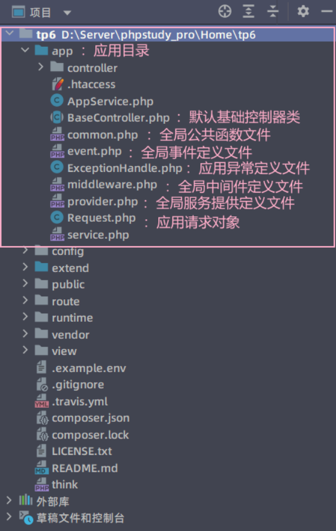
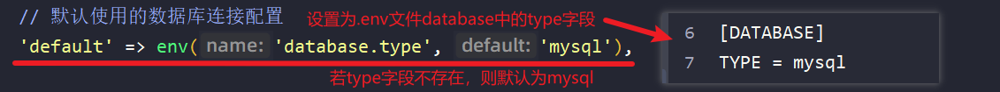
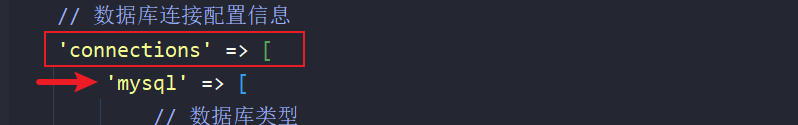
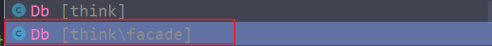
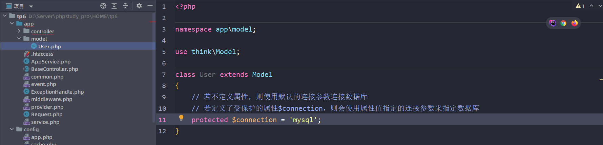

# ThinkPHP6.x框架

* ThinkPHP简称TP框架，是免费开源的、轻量级的、简单快速且敏捷的PHP框架

* 运行流程：

  > 1. 进入网站根目录，在cmd下输入命令`php think run`
  > 2. 在浏览器访问命令行给出的URL


---


### 一、开发规范与目录结构

* 目录和文件命名规范

  > 1. 目录名：**小写+下划线**
  > 2. 类库和函数文件：统一以**.php**为后缀
  > 3. 类的文件名以命名空间定义，并且命名空间的路径和类库文件所在路径一致
  > 4. 类、interface（接口）、trait（引入）文件名采用**大驼峰命名**，其它文件名采用**小写+下划线命名**
  > 5. 类名需要与文件名保持一致，采用**大驼峰命名**
  
* 函数和类、属性的命名规范

  > 1. 类名采用**大驼峰命名**
  > 2. 函数的命名采用**小写字母+下划线**
  > 3. 方法和属性的命名采用**小驼峰命名**

* 常量与配置参数的规范

  > 1. 常量和环境变量的命名采用**大写字母+下划线**
  > 2. 配置参数的命名采用**小写字母+下划线**

* 数据表和字段的规范

  > 采用**小写字母+下划线**命名

---

* 目录结构：

  

  > 1. app目录是应用目录，我们的开发会在此目录下进行
  > 2. 在目录结构上，我们确保对外访问的仅public目录


---


### 二、开启调试与配置文件

1. 开启调试模式：将`.example.env`文件重构为`.example`文件

   > 若调试模式开启后，不会出现调试面板，而是出现像`No input file specified.`这样的错误提示，修改public/.htaccess文件为
   >
   > ~~~text
   > <IfModule mod_rewrite.c>
   >   Options +FollowSymlinks -Multiviews
   >   RewriteEngine On
   > 
   >   RewriteCond %{REQUEST_FILENAME} !-d
   >   RewriteCond %{REQUEST_FILENAME} !-f
   >   RewriteRule ^(.*)$ index.php?/$1 [QSA,PT,L]
   > </IfModule>
   > ~~~

2. 配置文件位置：用于本地测试的.env文件、在根目录下的config文件夹下的文件

   > 在本地测试时，.env文件的优先级会高于config文件夹下的文件


---


### 三、URL解析

1. tp框架非常多的操作都是通过URL来实现的

2. 为了方便笔记，之后我们将`http://localhost:8082/tp6/public`和`http://127.0.0.1:8000/`使用`http://servername`代替

   > 我的本地文件是在8082端口

3. 单应用：`http://serverName/index.php/控制器/操作/参数/值…;`

   > index.php：是根目录下public/下的index.php（入口文件）
   >
   > > 该字段可以省略：需要设置URL重写（Apache设置文件）
   > >
   > > 1. 去掉LoadModule rewrite_module modules/mod_rewrite.so
   > > 2. 再将之后的两个AllowOverride None 将 None 设置为 All
   > >
   > > phpstudy设置过后，还是用不了
   >
   > 控制器：app目录下的controller控制器目录里的类文件（调用哪个控制器，就填那个控制器的文件名【不加后缀.php】）
   >
   > 操作：控制器类文件里的方法名
   >
   > 参数和值：就是方法形参键值对，参数为键，数值为值
   >
   > ---
   >
   > 如：`http://localhost:8082/tp6/public/index.php/test/sayHello/name/hikki`
   >
   > 相当于调用了controller控制器目录里的test类文件中的sayhello方法，并给$name传参'hikki'


---


### 四、控制器

#### ① - 控制器定义

1. 控制器：即controller，控制器文件默认存放在controller目录下

2. 改变系统默认的控制器文件存放位置，修改config下的route.php配置：

   

3. 在控制器文件中，若在类里面设置了index方法，在不添加操作的情况下，默认调用该方法

4. 若控制器文件中使用了大驼峰命名法让多个单词作为控制器名，在访问控制器的时候，可以在每个单词之间使用`_`分隔，也可以直接写（Windows下URL中不区分大小写）

#### ② - 渲染输出

1. 在控制器方法需要输出单个数据时，可以使用`return $value;`输出
2. 在控制器方法需要输出数组时，可以使用`return json($arr);` 输出
3. 在需要中断输出的时候，不推荐使用`die`、`exit`等PHP的中断输出函数，推荐使用助手函数`halt()`中断输出

#### ③ - 基础控制器

1. 基础控制器（BaseController）：提供控制器验证功能

2. 一般来说，创建控制器后，推荐继承基础控制器来获得更多的方法

   > `$this->app->getBasePath()`：获取实际路径
   >
   > `$this->request->action()`：获取当前方法名

#### ④ - 空控制器

1. 空控制器：在单应用模式下，我们可以给在controller目录下添加一个空控制器Error.php，在每次查找不到控制器报错时，将会默认使用此控制器定义的方法

2. ~~~php
   class Error{
       public funtion index(){
           // 用来提示报错信息
       }
   }
   ~~~

#### ⑤ - 多级控制器

​		多级控制器：在controller目录下创建新的控制器目录，可以在新创建的控制器目录下再创建控制器（相当于给控制器分组）。在使用时，通过`新控制器目录名.控制器名`的方式，访问新建目录下的控制器


---


### 五、数据库

#### ① - 连接数据库

1. ThinkPHP采用内置抽象层将不同的数据库操作进行封装处理，数据抽象层基于PDO模式，无需针对不同的数据库编写相应的代码

2. **配置**：本地连接配置`.env`文件；远程连接配置`config/database.php`文件

   > 但本质上还是使用`config/database.php`进行文件配置，因为在`config/database.php`文件中默认配置指向了`.env`文件

3. **连接**：

   1. `config/database.php`文件的中通过default字段配置默认连接的数据库

      

   2. `config/database.php`文件的中通过connection字段配置连接信息，可以配置多个连接信息便于相互切换

      

   3. 我们可以通过`Db::`来使用默认的数据库信息连接：

      

      也可以通过`Db::connect('连接名')`来指定某个数据库连接

   4. 使用模型进行连接：

      > 1. 模型的作用：直接和数据库打交道的类
      >
      > 2. 模型的创建：在app目录下创建一个model目录，并创建一个模型类（继承自Model）
      >
      >    
      >
      > 3. 模型的使用：使用`模型类名::`来代替`Db::connect('连接名')`进行连接

#### ② - 数据查询

1. 单数据查询：相当于`SELECT * FROM 表名 WHERE 字段名 = 字段值 LIMIT 1;`（必须指定where语句）

   `Db::table('表名')->where('字段名',字段值)->find()`：若没有查询到数据返回null

   `Db::table('表名')->where('字段名',字段值)->findOrFail()`：若没有查询到数据抛出异常

   `Db::table('表名')->where('字段名',字段值)->findOrEmpty()`：若没有查询到数据返回空数组`[]`

   `Db::getLastSql()`：得到最近一条SQL查询的原生语句

2. 数据集查询：返回多列数据的数据集对象，可以不指定where子句

   `Db::table('表名')[->where('字段名',字段值)]->select()`：若没有查询到数据返回空数组`[]`

   `Db::table('表名')[->where('字段名',字段值)]->selectOrFail()`：若没有查询到数据抛出异常
   
   `Db::table('表名')[->where('字段名',字段值)]->select()->toArray()`：将得到的数据集对象转化为数组
   
   > 使用name可以忽略表名的前缀（在数据库配置文件中配置了前缀的情况下）：
   >
   > ```php
   > class DataTest
   > {
   >     public function index(){
   >         $user = Db::table('tp_user')->select();
   >         // 使用name忽略前缀
   >         $user = Db::name('user')->select();
   >         dump($user);
   >     }
   > }
   > ```
   
3. 其它查询：

   > 1. 通过value方法，查询单个数据，若没有数据则返回null：`Db:name('表名')->where('字段名',字段值)->value('要查询的字段名')`
   >
   > 2. 通过colunm方法，查询指定列的数据，没有数据则返回空数组：`Db:name('表名')->column('字段名')`
   >
   >    > 该列的数据为键值对，数据既为键，又为值
   >
   > 3. 同2，但是指定字段作为键值对的键（索引）：`Db:name('表名')->column('字段名', '索引字段名')`

4. 高级输出：大幅度减少处理海量数据的内存开销。

   > 1. 使用chuck方法分批处理数据：指定每次查询的数据量
   >
   >    ~~~php
   >    Db::name('表名')->chunk(100,function($datas){	   # 100为单次查询的数据量，$datas为查询出的数据
   >    	foreach($datas as $data) {					# datas为单词查询出的数据
   >            dump($data);
   >        }
   >    });
   >    ~~~
   >
   > 2. 利用PHP生成器特性，每次只读一行数据
   >
   >    ~~~php
   >    $cursor = Db.name('表名')->cursor();			# 定义游标
   >    foreach ($cursor as $data){
   >        dump($data);
   >    }
   >    ~~~


