# Burp基础使用

### 一、Burp的简介

1. Burp是一种集成化的渗透测试工具
2. 工作方式：拦截代理
3. 代理服务器：既是服务器又是客户机的中间程序

### 二、Burp模块简介

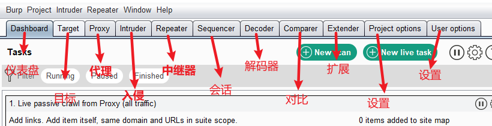

> * Dashboard（仪表盘）：用于显示Burp的工作信息
> * Target（目标）：显示目标目录结构
> * **Proxy（代理）**：拦截HTTP/HTTPS的代理服务器，允许拦截、查看、修改两个方向的数据流（请求和响应）
> * **Intruder（入侵）**：可高度定制的对web程序进行自动化攻击的模块
> * **Repeater（中继器）**：一个靠手动操作来触发单独的HTTP请求，并分析应用程序响应的工具
> * Sequencer（解码器）：对数据进行智能解码编码的工具
> * Compare（对比）：对通过一些相关的请求和响应得到两项数据进行一个可视化的对比，显示差异
> * Extender（差异）：加载Burp的扩展
> * Project options / User options：对Burp进行设置

### 三、Proxy模块详解

* 图示

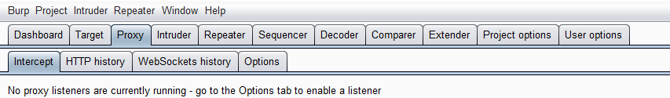

---

* Intercept模块：用于修改显示HTTP请求及响应的内容，并可将拦截的HTTP请求发送至其它模块进行处理

  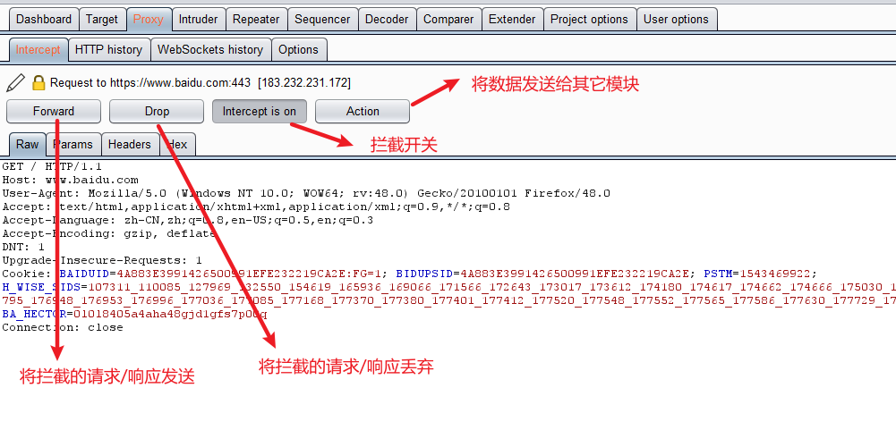

  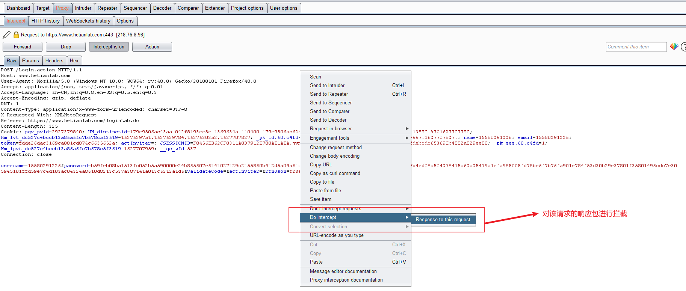

  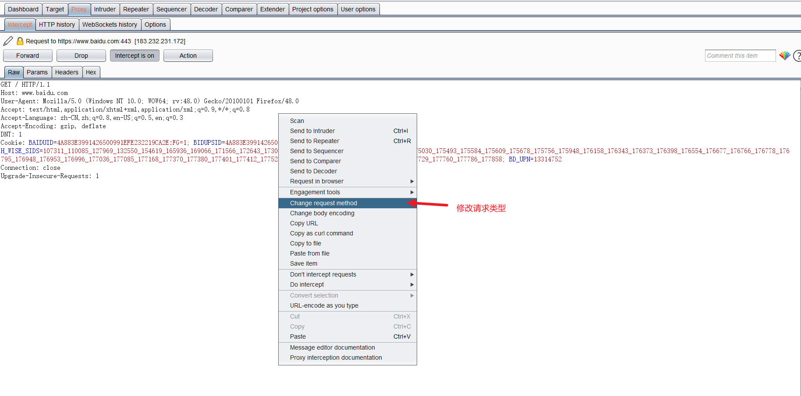

* HTTP history模块：记录经过代理服务器的请求（没有开启拦截功能也会有记录）

  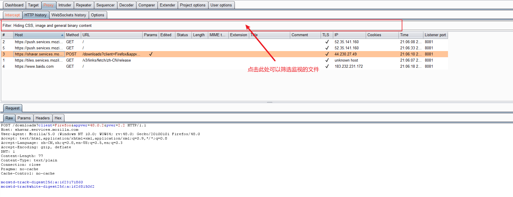

* Options模块：可在这个模块里配置浏览器代理的信息

  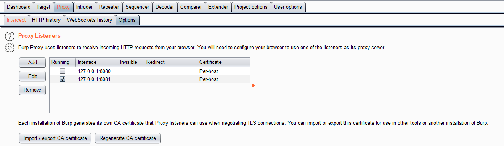

### 四、Intruder模块详解

* 图示

  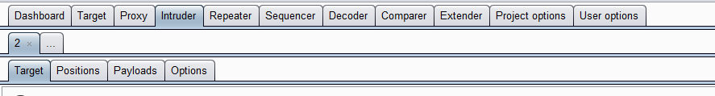

---

* Target模块：用于配置目标服务器进行攻击的详细信息，一般不手动配置。从Proxy模块中导入到Intruder模块，Burp会自动配置

  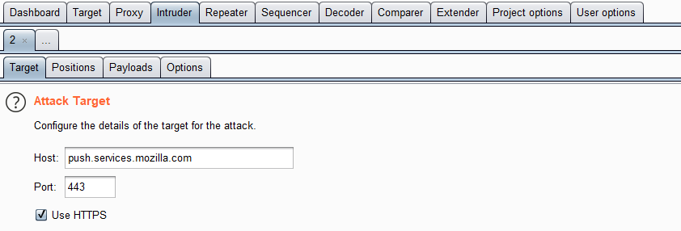

* Positions：配置爆破的插入点和攻击模式

  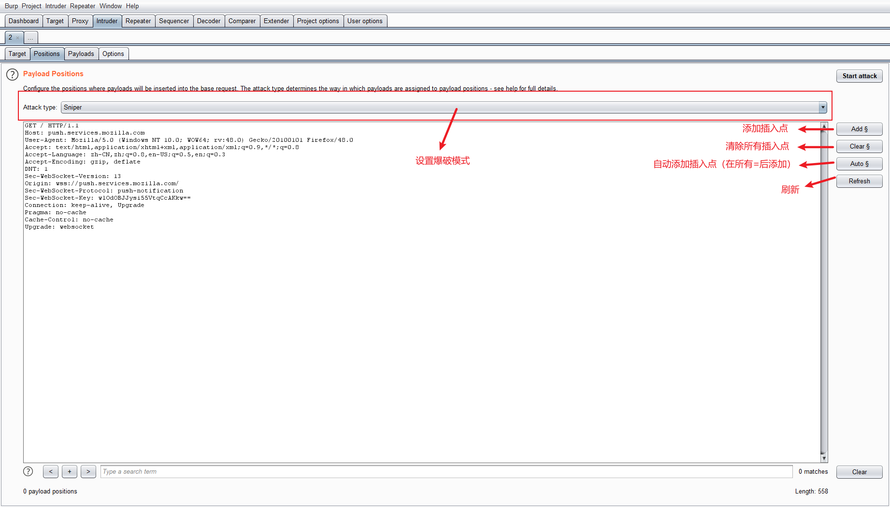

  > 爆破模式介绍：
  >
  > 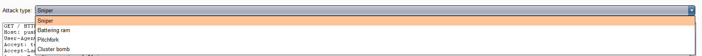
  >
  > * Sniper（狙击手模式）：对所有变量使用同一个字典，求字典与自身的笛卡尔积
  > * Battering ram（攻城锤模式）：对所有变量使用同一个字典，遍历字典一遍，且对所有变量赋予相同的值
  > * Pitchfork（草叉模式）：每一个变量对应一个字典，所有字典指针同时递增，爆破的次数取决于变量少的字典
  > * Cluster bornb（集束炸弹模式）：每一个变量对应一个字典，求所有字典的笛卡尔积

* Payloads：配置Positions设置的标记位字典

  > 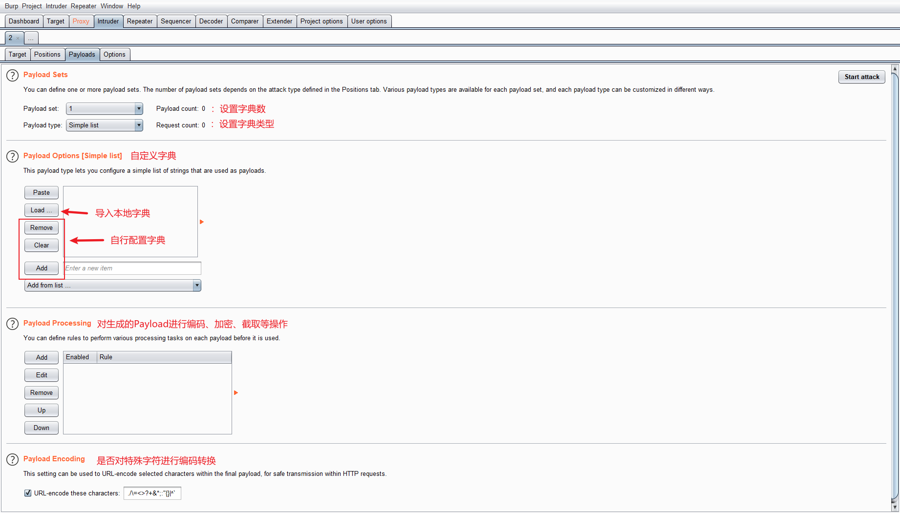
  >
  > * Payload Sets 与 Payload Options 模块：
  >
  >   * Simple list（简单字典，帮助我们逐个定义字典元素，一般在导入外部字典时使用）
  >
  >     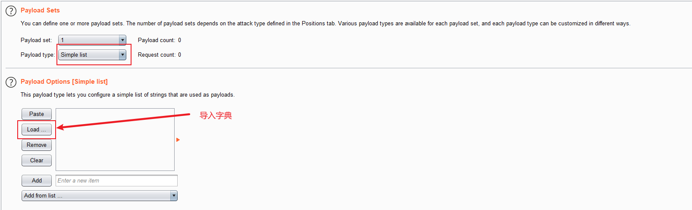
  >
  >   * Custom iterator（自定义迭代器，帮助我们逐位自定义字典）
  >
  >     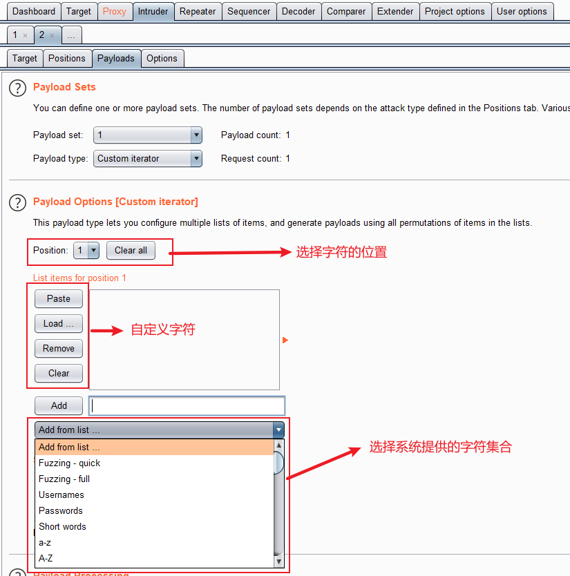
  >
  > * Payload Processing 模块：Burp利用该模块设置的加密方式对利用字典产生的字符串进行加密[^注]
  >
  >   [^注]:一般密码如果有加密，加密方式都是MD5
  >
  >   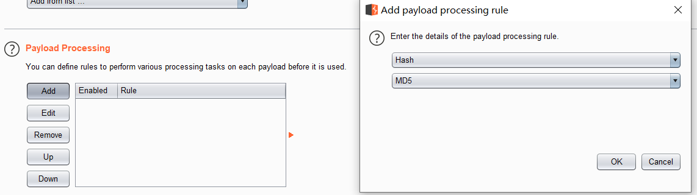

### 五、Repeater模块不详解

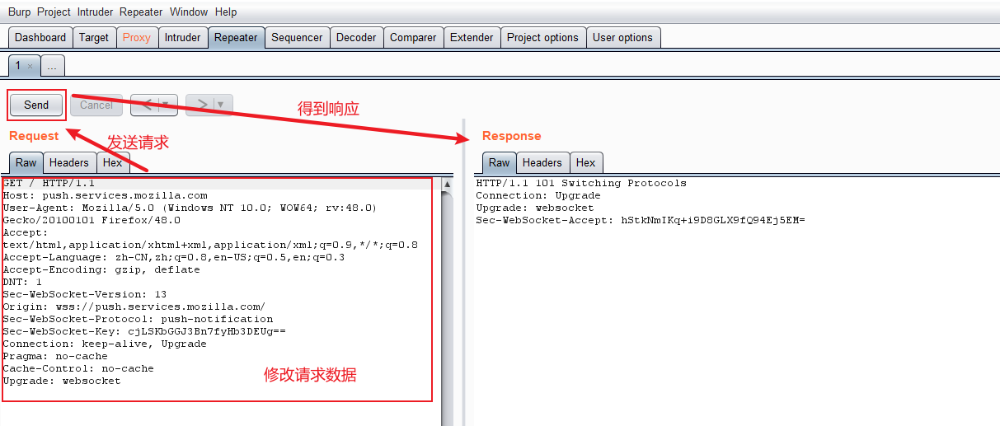

### 六、Decoder模块详解

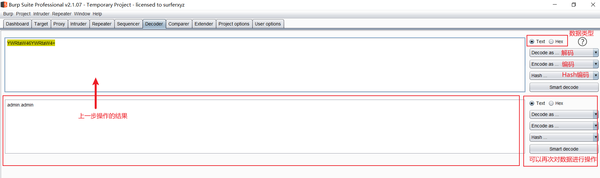

### 七、Burp Collaborator client

1. 功能与原理：[Burp Collaborator 使用总结_发哥微课堂-CSDN博客](https://blog.csdn.net/fageweiketang/article/details/89073662)

2. 使用方法：

   > 1. 开启：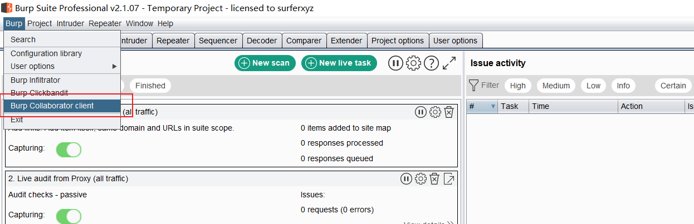
   >
   > 2. 使用：SSRF无回显漏洞
   >
   >    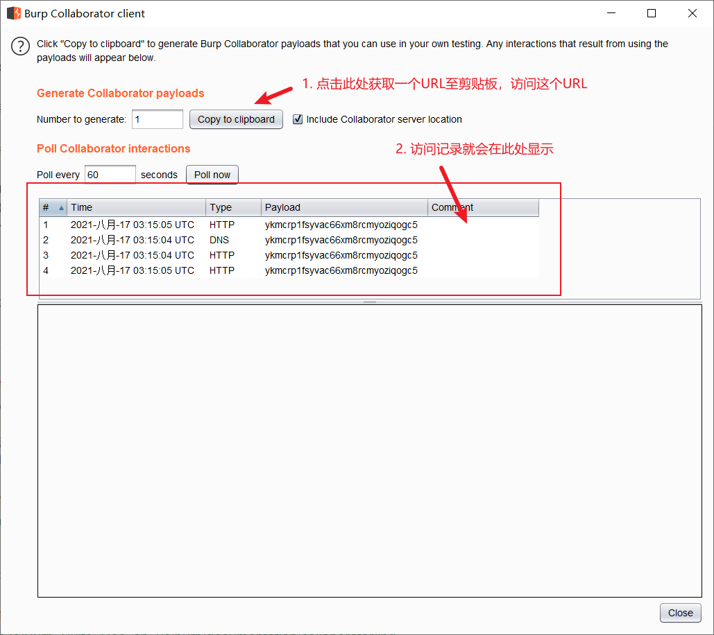

### 八、保存经过burp的流量至文件中

【Project options】→【Misc】→【Logging】

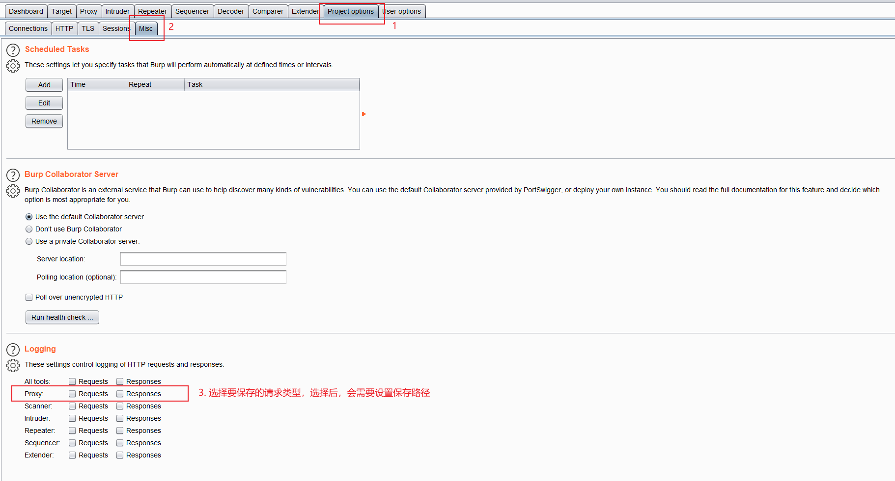

