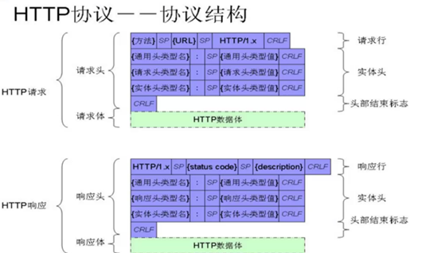
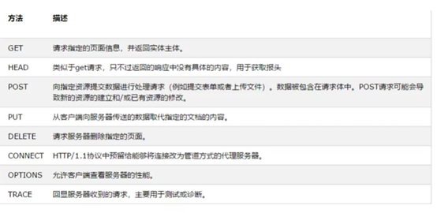
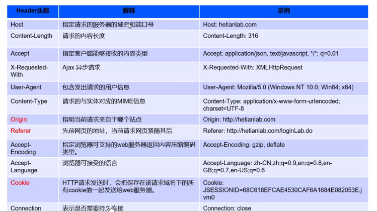
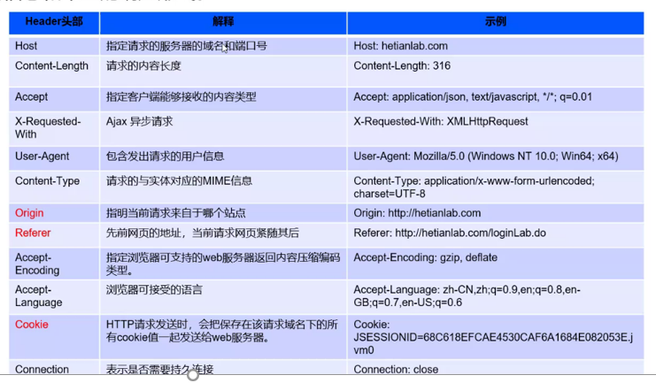
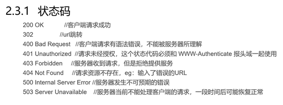

# HTTP协议的介绍

### 一、HTTP的工作过程

> 域名解析 → 三次握手 → 发起HTTP请求 → 响应HTTP请求并得到HTML代码 → 浏览器解析HTML代码 → 浏览器对页面进行渲染呈现给用户

### 二、HTTP协议架构

### 三、HTTP请求

1. 请求方法：

2. 请求头部：

   > 补充重点：
   >
   > `X-Forwarded-For`：为了让服务器获取访问用户的真实IP（部署代理服务器并不能绕开探查）
   >
   > [X-Forwarded-For的一些理解(1)_zyhmz的博客-CSDN博客](https://blog.csdn.net/zyhmz/article/details/82505344?ops_request_misc=%7B%22request%5Fid%22%3A%22162739100416780261921030%22%2C%22scm%22%3A%2220140713.130102334..%22%7D&request_id=162739100416780261921030&biz_id=0&utm_medium=distribute.pc_search_result.none-task-blog-2~all~sobaiduend~default-1-82505344.first_rank_v2_pc_rank_v29&utm_term=x-forwarded-for&spm=1018.2226.3001.4187)

3. 请求体：

   > GET方法的请求体附加在URL里面
   >
   > POST方法的请求体在空行之后

### 四、HTTP响应

1. 响应头部

   

2. 状态码

   

### 五、Cookie与Session

1. Cookie

   > * 简介：Cookie是一种发送到客户浏览器的文本串句柄，并保存在客户机硬盘上，可以用来在某个WEB站点会话间持久的保持数据
   >
   > * 分类：
   >
   >   > 内存cookie：由浏览器维护，保存在内存中，浏览器关闭后就消失了
   >   >
   >   > 硬盘cookie：保存在硬盘中，存在的时间是长期的
   >
   > * 原理：
   >
   >   1. 服务器首次接收客户端信息时，会在响应报文的首部字段保存一个名为Set-Cookie的数据
   >   2. 客户端收到响应后，会保存Cookie的值到本地。下次再次发起请求时，会自动在报文中加入Cookie的值
   >
   >   3. 服务器收到客户端发送过来的Cookie后，回去对比服务器上的记录，从而得到之前的状态信息

2. Session

   > * 简介：Session是一种服务器端的机制，Session对象用来存储特定用户会话所需的信息
   > * 位置：Session由服务器端生成，保存在服务器的内存、缓存、硬盘或数据库之中
   > * 原理：
   >   1. 服务器首次接收客户端信息时，如果服务器启用了Session，会为该用户创建一个SESSION，并生成一个与此SESSION有关的SESSION ID，这个SESSION ID是一串唯一的、不容易找到规律的字符串。这个SESSION ID会被Set-Cookie保存并返回客户端
   >   2. 在服务器得到Cookie值时，就可以通过对比SESSION ID来识别客户端

3. Cookie和Session的区别

   > 1. 存放位置不同：Cookie保存在客户端；Session保存在服务器
   > 2. 存取方式（内容）不同：Cookie只能保存ASCII字符串，其它特殊字符需要编码；Session中能够存储任意类型的数据
   > 3. 安全性不同：Cookie对客户端是可见的，存在安全风险；而Session对客户端是透明的，不存在泄露敏感信息的风险

---

> 这节课的笔记就是图一乐，真要看内容还得去看[HTTP基础.md](../HTTP基础.md)

