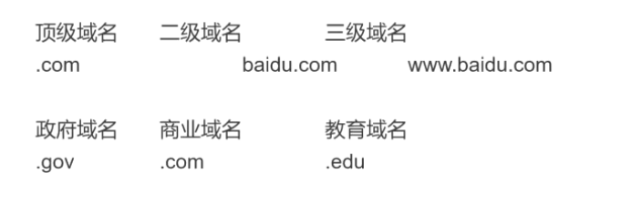
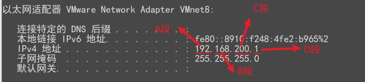
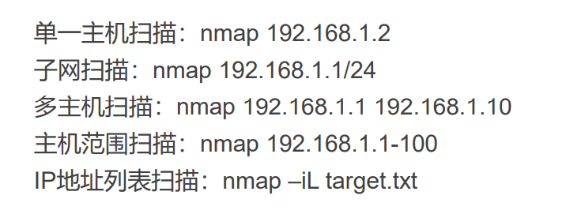
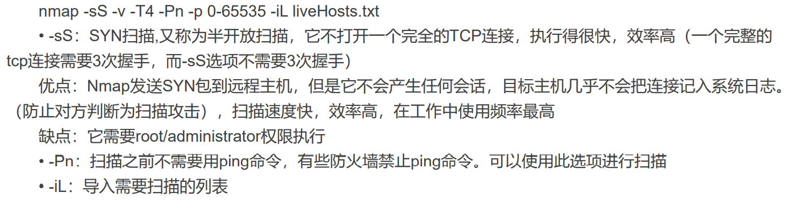
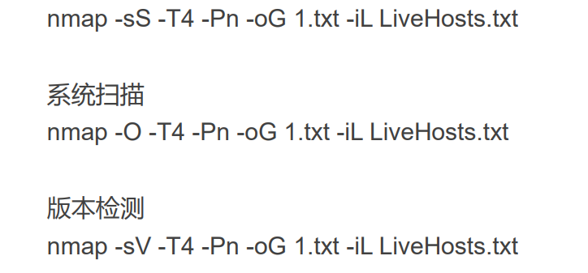
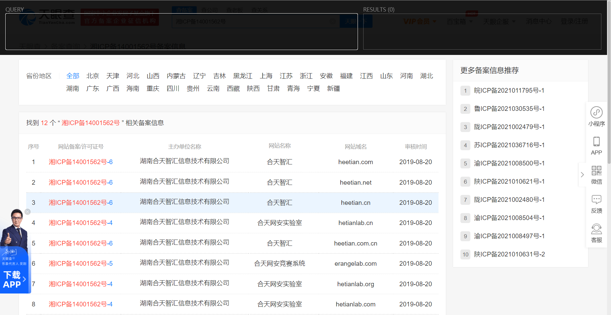
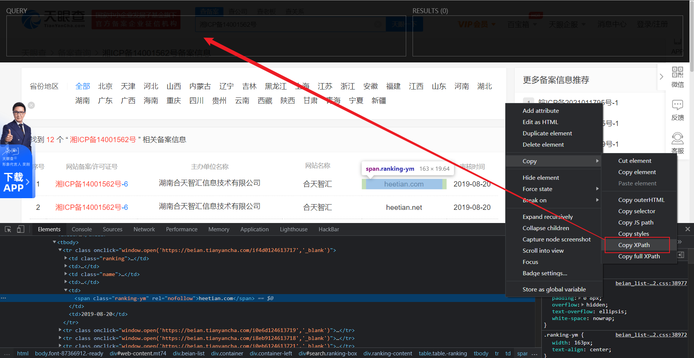
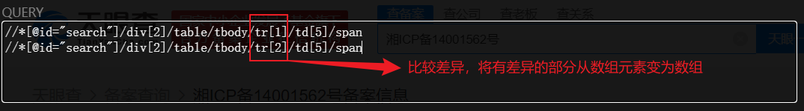
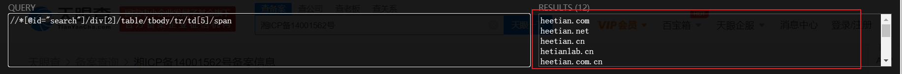
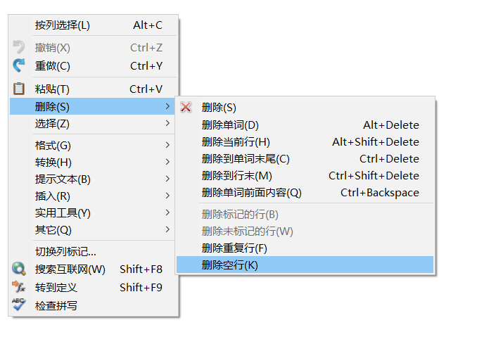

# 信息收集

### 一、信息收集简介

1. 概念：信息收集是指通过各种方式获取所需要的信息，帮助我们进行后序的渗透过程。信息收集包含但不限于资产收集。

2. 需要收集的信息种类：

   > **服务器信息**：端口、服务、真实的IP
   >
   > **网站信息**：网站架构（即操作系统、中间件、数据库、编程语言）、指纹信息、WAF、敏感目录、敏感文件、源码、旁站、C段
   >
   > **域名信息**：whois、备案信息、子域名
   >
   > **管理员信息**：姓名、职务、生日、联系电话、邮件地址

### 二、域名信息的收集

1. 基础概念：

   > **域名**：一串用点分隔的名字组成的internet上某一台计算机或计算机组的名称，用于在数据传输时标记计算机的电子方位
   >
   > 1. 域名分类：
   >
   >    
   >
   >    > * 二级域名：在国际顶级域名下，它是指域名注册人的网上名称；在国家级域名下，它是表示注册企业类别的符号（就像第二行的域名）
   >    >
   >    >   > 国际顶级域名：www.baidu.com
   >    >   >
   >    >   > 国家级域名：www.gov.cn
   >    >
   >    > * 二级域名是顶级域名的子域名；三级域名是二级域名的子域名
   >
   > **DNS**：域名系统，是互联网的一项服务，它是将域名和IP地址互相映射的一个分布式数据库

2. 通过域名收集子域名的案例

   > 如：要收集www.baidu.com（门户网站）的信息，则需要收集baidu.com的子域名

3. 通过域名收集子域名的方式（以搜索baidu.com为例）

   > 1. 通过备案信息查询：
   >
   >    [工商部备案管理系统]([ICP/IP地址/域名信息备案管理系统 (miit.gov.cn)](https://beian.miit.gov.cn/#/Integrated/recordQuery))
   >
   >    [站长之家-备案查询]([ICP备案查询 - 站长工具 (chinaz.com)](http://icp.chinaz.com/))
   >
   > 2. 直接通过[google hacking语法](https://blog.csdn.net/qq_36119192/article/details/84029809)搜索：
   >
   >    > Google hacking语法举例：
   >    >
   >    > `intitle:关键字`：查找网站标题包含关键字的网站
   >    >
   >    > `inurl:关键字`：查找网址中包含关键字的网站			
   >    >
   >    > >  `inurl:login` || `inurl:admin`，查找登录页面
   >    >
   >    > `site:子域名`：**查找指定子域名的网站**
   >    >
   >    > `filetype:文件类型`：查找指定文件类型的文件
   >    >
   >    > > 注意，谷歌黑客语法可以叠加使用，使用空格分隔即可
   >
   > 3. 通过网络安全空间搜索引擎搜索：
   >
   >    [FOFA]([网络空间测绘，网络空间安全搜索引擎，网络空间搜索引擎，安全态势感知 - FOFA网络空间测绘系统](https://fofa.so/))：`domain="baidu.com"`
   >
   >    [钟馗之眼]([首页 - 网络空间测绘,网络安全,漏洞分析,动态测绘,钟馗之眼,时空测绘,赛博测绘 - ZoomEye("钟馗之眼")网络空间搜索引擎](https://www.zoomeye.org/))：`site:"baidu.com"`
   >
   >    > 搜索语法举例：
   >    >
   >    > app:服务器类型
   >    >
   >    > ver:服务器版本
   >    >
   >    > OS:操作系统
   >    >
   >    > port:端口号
   >    >
   >    > site:子域名
   >    >
   >    > country:国家
   >    >
   >    > > 搜索语法可以叠加使用，使用`+`分隔
   >
   >    [SHODAN（沙旦）](https://www.shodan.io/)：`hostname:baidu.com`
   >
   > 4. 通过js文件发现子域名：
   >
   >    [JSFinder]([Threezh1/JSFinder: JSFinder is a tool for quickly extracting URLs and subdomains from JS files on a website. (github.com)](https://github.com/ThreeZh1/JSFinder))
   >
   > 5. 使用OneForAll
   >
   >    [OneForAll]([shmilylty/OneForAll: OneForAll是一款功能强大的子域收集工具 (github.com)](https://github.com/shmilylty/OneForAll))

### 三、IP信息收集

1. 域名查询IP的方式

    [站长之家-域名查IP]([IP/IPv6查询，服务器地址查询 - 站长工具 (chinaz.com)](http://ip.tool.chinaz.com/))
    
2. 查询同C段IP

    > 
    >
    > 同C段是指：A段、B段、C段均相同，如：（192.168.200.1~192.168.200.254）
    >
    > 查询方法：使用Python脚本-[Cwebscanner](https://github.com/se55i0n/Cwebscanner)

### 四、端口信息收集

1. [端口介绍]([史上最全网络端口号大全，网络工程师必备！_TianYao-CSDN博客](https://blog.csdn.net/weixin_42767604/article/details/109500369?ops_request_misc=%7B%22request%5Fid%22%3A%22162748882516780357220457%22%2C%22scm%22%3A%2220140713.130102334..%22%7D&request_id=162748882516780357220457&biz_id=0&utm_medium=distribute.pc_search_result.none-task-blog-2~all~top_click~default-2-109500369.first_rank_v2_pc_rank_v29&utm_term=端口&spm=1018.2226.3001.4187))

   > 80：http的默认端口
   >
   > 443：https的默认端口
   >
   > 3306：MySQL数据库的端口
   >
   > 3398：Windows远程连接的端口

2. Namp扫描端口信息：使用kali虚拟机

   > 基础用法：
   >
   > 
   >
   > 存活主机探测：
   >
   > `nmap -sP 192.168.1.1/24`
   >
   > 扫描全部端口：
   >
   > 
   >
   > 扫描常用端口的服务信息
   >
   > 
   >
   > 【具体使用方法详见：[Nmap基础.md](../Nmap基础.md)】

### 五、网站CMS指纹识别

1. CMS：快速搭建网站的内容管理系统，可以实现快速二次开发的Web应用框架

   >  在中国使用CMS搭建的网站占80%

2. 识别方法：使用御剑WEB指纹识别系统扫描

### 六、信息收集提升

1. 信息收集是web渗透（通过web程序漏洞获取shell权限）中最重要的一环，原则是收集到的信息越多越好

2. 步骤：

   > 1. 通过**站长工具**查询目标域名的**备案号**
   >
   >    > 注意：查到的备案号为【湘ICP备14001562号-4】的形式，应该去掉后面的编号，变为【湘ICP备14001562号】
   >
   > 2. 通过备案号查询该公司在网站上的其它域名：通过备案号到**天眼查**查询备案信息，再通过[Xpath](#Xpath)将数据提取出，取出的数据就是该公司在网站上的**其它主域名**
   >
   > 3. 使用像**subDomainsBrute**、OneForAll等**子域名挖掘脚本或工具**通过主域名查询它的**子域名与IP**
   >
   >    > 工具在【网安工具/子域名收集】目录下
   >
   >    或者使用[**Censys**](https://censys.io/certificates)通过证书透明度项目收集主域名的子域名，再通过[Xpath](#Xpath)将数据提取出
   >
   > 4. 根据子域名IP的结果整理**C段**：使用脚本Cwebscanner或**Kscan**
   >
   >    > Kscan使用举例：
   >    >
   >    > ~~~shell
   >    > kscan.exe -t 120.39.135.0/24 -o result.txt
   >    > # 扫描C段为120.39.135的所有IP，将结果输出到result.txt
   >    > ~~~
   >
   > 5. 另类信息收集：参考[这里](#this)
   >
   >    > 工具在【网安工具/网站信息收集】目录下
   >
   > 6. 将收集到的所有子域名进行跑目录操作，找后台、敏感信息目录、备份文件(.bac)：
   >
   >    > 敏感文件：（.mdb | .excel | .word | .zip | .rar），.git文件，.svn文件，.DB_store文件，WEB-INF/web.xml
   >
   >    > 工具在【网安工具/网站信息收集】目录下：御剑、dirsearch、7kbscan 

**---Xpath的使用**

1. 打开插件

   

2. 查看网页源码复制所需要查询网页元素的信息，粘贴到插件右侧的QUERY输入框内

   

3. 获取另一条需要批量获取的网页元素，粘贴到插件右侧的QUERY输入框内

   

4. 完成后，即可在右侧RESULTS中全选获取信息

   

5. 获取信息后，会出现一些空行的情况，我们可以使用EditPlus5文本编辑器

   

   