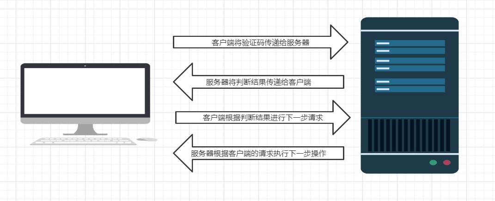
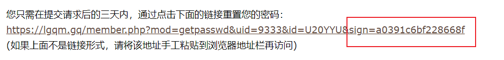
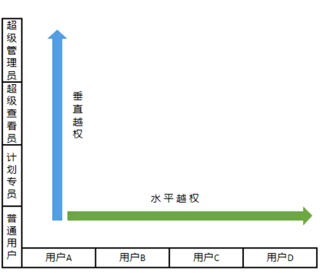

# 逻辑漏洞

### 一、业务逻辑漏洞概述

1. 业务逻辑：不同的项目有不同的功能，不同的功能需要不同的实现，实现这些核心功能的代码就叫业务逻辑

2. 业务逻辑漏洞：由于程序的逻辑不严谨或者太复杂，导致一些逻辑分支不能正常处理或是处理发生错误

3. 常见的逻辑漏洞：

   /image-20210730103936143.png)

4. 挖掘步骤：

   > 1. 确定业务流程：正常走一遍流程，抓包
   > 2. 寻找流程中可以被操控的环节：找可能存在漏洞的地方
   > 3. 分析可被操控环节中可能产生的逻辑问题：分析找到的可能存在的漏洞类型
   > 4. 尝试修改参数触发逻辑问题：修改一些参数，查看是否能够触发漏洞

### 二、URL跳转漏洞

1. URL跳转的概述：浏览器在拿到301或302状态码后会自动跳转到一个新的URL地址，这个地址可以从响应头的Location首部获取

   ~~~php
   <?php 
   $url = $_GET['url']; 	 // 捕获GET方法存储在链接中的存储URL的变量	
   Header("Location:$url"); // 通过修改响应头Location的值实现URL跳转
   ?>
   ~~~

2. URL跳转漏洞：服务端未对传入的url变量进行检查和控制，可能导致可以通过修改链接的部分参数构造一个恶意网址，诱导用户跳转到恶意网站。

3. 漏洞的危害：简单来说就是可以构造一个与正常链接一样的钓鱼链接，通过社工的方式钓鱼

4. 漏洞产生的位置：sso登录、验证跳转…

5. 实战中一般通过GET方法捕获到的常用的变量名，即$_GET['变量名']

   > `redirect`、`redirect_to`、`redirect_url`、`url`、` jump`、`jump_to`、`target`、`to`、`link`、`linkto`、`domain`

6. 绕过技巧（从`www.baidu.com`跳转至`www.xxx.me`）

   > 利用问号绕过限制：待跳转的链接在?之前
   >
   > url=https://www.xxx.me?www.baidu.com
   >
   > 利用@绕过限制：待跳转的链接在@之后
   >
   > url=https://www.baidu.com@www.xxx.me
   >
   > 利用斜杠反斜杠绕过限制：将要跳转的链接放到www.xxx.me中的子目录www.baidu.com下
   >
   > url=https:www.xxx.me/www.baidu.com
   >
   > 利用子域名绕过限制：较少使用，因为要先购买一个与目标站点相似的域名（www.baidu.com.xxx.com）
   >
   > http://www.baidu.com.xxx.com

7. 修复、防御方法：

   校验传入的跳转url参数值，判断是否为预期域名

### 三、短信、邮箱轰炸漏洞

1. 短信、邮箱轰炸漏洞：网站在对信息发送的次数、时间没有做限制，或者只在前端做了限制。导致可以通过重复地发包使短信/邮件无限制地发送

2. 漏洞产生的位置：会员账号注册功能，忘记密码找回功能、绑定收集邮箱功能、以及一系列需要手机验证码的功能

3. 测试方法：

   > * 较为简单的方法：1. 抓包；2. 重复发送
   >
   >   不想手动点击发包，也可以利用burp的Intruder模块
   >
   >   > 1. 在Positions页面不配置变量
   >   > 2. 在Payloads-Payload Sets-Payload type中选取Null payloads（空字典），再在Payload Options中选择Continue indefinitely（无限制爆破），再进行爆破即可

4. 绕过方法：（原理：改变数据包）

   > 1. 通过在电话、邮箱等信息后面加空格
   > 2. 尝试对某个参数进行多次叠加
   > 3. 通过修改邮箱中字母的大小写
   > 4. 修改某些调用的接口参数
   >
   > 【提供一个请求体示例：/image-20210730151100075.png)】

5. 修复方式：

   > 1. 通过配置后台短信服务功能，设置对同一个手机号码，发送次数不超过3~5次，并设置发送的时间间隔
   > 2. 通过编写前台代码，加上验证码的功能，并限制发送的时间间隔

### 四、任意密码修改漏洞

1. 任意密码修改漏洞：网站在对密码进行修改时，未对修改密码的凭证做严格的限制，导致可以被绕过进行任意密码的修改。

2. 漏洞的表现：

   > * 验证码不失效：在找回或修改密码时，获取的验证码缺少时间限制
   >
   >   绕过方法：可以通过爆破找到验证码
   >
   > * 验证凭证回传：在点击获取验证码后，验证码被存储在响应报文中，方便验证码的比对
   >
   >   绕过方法：抓取返回包
   >
   > * 验证凭证未绑定：在重置或修改密码时，仅对验证码进行了判定，而未对手机号进行判定
   >
   >   绕过方法：利用账号A获取验证码，在输入验证码的请求包中将账号A的数据修改为账号B，从而达到修改账号B数据的目的
   >
   > * 验证码本地判断：服务器将是否验证通过的信息利用响应报文传递给客户端，客户端再根据响应报文的值，进行下一步操作
   >
   >   
   >
   >   绕过方法：修改服务器的响应报文（可以先进行一遍正常操作，然后截取正常操作的报文修改返回错误信息的报文），欺骗客户端验证成功
   >
   > * 验证步骤跳过：对修改密码的步骤，没有做校验，导致可以直接输入最终修改密码的网址，直接跳转至该页面，然后修改密码达到重置密码的目的。
   >
   >   > 如（自己编的示例）：
   >   >
   >   > https://www.hetianlab.com/forgetpwd.html ：找回密码界面
   >   >
   >   > https://www.hetianlab.com/?checkcode=1234.html：验证界面
   >   >
   >   > https://www.hetianlab.com/setpwd.html：修改密码界面
   >   >
   >   > 绕过方法：
   >   >
   >   > 先访问https://www.hetianlab.com/forgetpwd.html ，然后直接访问https://www.hetianlab.com/setpwd.html
   >
   > * 验证凭证可预测：使用邮件接收重置密码的链接时，一般都会带有一个token用于判断链接是否被修改国。如果token可以预测，那么攻击者可以通过构造链接来重置任意的用户密码
   >
   >   > 如：
   >   >
   >   > 常见的能破解的Token：
   >   >
   >   > 1. 基于时间戳生成的Token
   >   > 2. 基于递增序号生成的Token
   >   > 3. 基于关键字段生成的Token
   >   > 4. Token有规律
   >   >
   >   > 绕过方法：通过伪造链接可以重置任意用户的密码
   >
   > * 同时向多个账号发送凭证：通过修改发送验证码的请求包，使服务器向多个账号发送凭证
   >
   >   绕过方法：修改请求包，在手机号之后使用`&`间隔多个手机号，通过添加的手机号上的验证码来修改原有请求账户的密码
   >

### 五、任意用户登录漏洞

1. 任意用户登录漏洞：逻辑错误导致可以登录任意账户。撞库获得用户名（手机号或邮箱），通过验证码登录，抓包修改验证码的手机号/邮箱，然后使用该验证码能使撞库的用户登录，即产生漏洞

2. 漏洞的表现：

   > 1. 修改返回包可以登录：同[验证码本地判断](#01)
   >
   >    绕过方法：登录任意用户 → 抓包 → 修改包的内容 → 登录成功
   >
   > 2. 系统默认弱口令：在系统搭建的时候，设置了默认口令，可以使用这种口令登录任意的账户（常见于学校、公司、国企）
   >
   > 3. Cookie混淆：在登录时使用cookie中的某一个字段（最常见的时userid字段）来进行判断登录的角色
   >
   >    绕过方法：正常登录 → 抓取响应报文 → 修改这个字段 → 登录其它用户

### 六、越权漏洞

1. 越权漏洞：由于设计上的缺陷导致用户可以越权操作

2. 漏洞成因：开发人员在对数据进行增删改查时，对客户端的请求过于相信，导致遗漏的权限的判定

3. 漏洞分类：

   > 水平越权（权限不变，身份改变）：可以操作同一层次权限的账号，以及访问到这些账号的敏感信息[^注1]
   >
   > 垂直越权（身份不变，权限改变）：使用低权限的账号执行高权限账号的操作

4. 漏洞的绕过方法：抓包，通过修改或替换报文中的信息（一般是ID），查看是否能够实现越权操作

5. 修复方式：

   > 1. 完善用户权限体系：要知道哪些数据用户可以操作，哪些数据用户不能操作
   > 2. 鉴权：服务端对请求的数据和当前用户身份做校验
   > 3. 在报文中，不直接使用对象的实名或关键字
   > 4. 对于可控参数进行严格的检查和过滤

### 七、支付逻辑漏洞

1. 支付逻辑漏洞：在支付关键步骤的报文中（POST请求），直接传递需要支付的金额和数量。而这种金额后端没有进行校验，在传递过程中，也没有进行签名，导致支付的金额和数量可以随意篡改提交

2. 漏洞的表现

   > 在订单生成后，直接修改报文中的支付金额、优惠力度、购买数量或支付状态，若能进入支付页面，则说明漏洞存在
   >
   > * 修改数量：使用一件的价格购买多件；在使用平台代币支付时，修改数量为负数，增加资金
   > * 修改价格：直接修改金额；使用低价商品的价格购买高价商品
   > * 修改优惠力度：替换优惠券id，使低价时使用满减优惠券
   > * 修改支付状态：修改支付后的返回包，使用支付成功的返回包替换支付失败的返回包

3. 修复方式：

   >1. 后端检查订单的每一个值，包括支付状态
   >2. 校验价格、数量参数
   >3. 与第三方支付平台检查，实际支付的金额是否与订单金额一致
   >4. 若给用户退款，需使用原路，原订单退回
   >5. MD5加密、解密、数字签名及验证
   >6. 金额超过指定值，进行人工审核

[^注1]: 敏感信息：手机号，姓名，住址，充值记录，撤单记录，提现记录，注单记录等等

