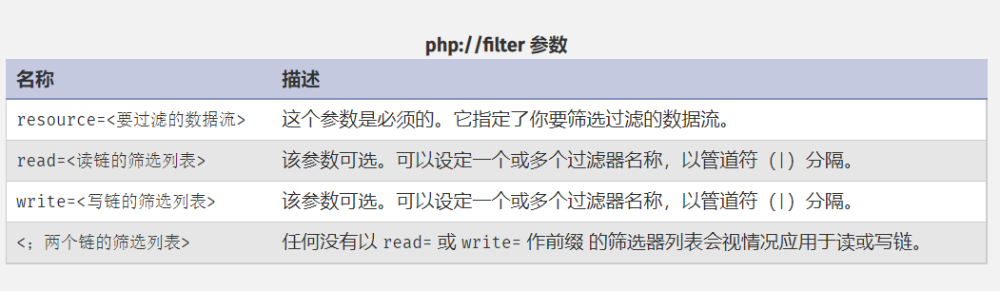

# 文件包含漏洞

### 一、概述

1. 文件包含：开发人员重复调用一个函数写入一个文件，对该文件进行包含。其目的是为了减少代码冗余度，保证网站整体风格的统一，一般应用于网站导航栏、底部footer栏等。

2. 示例：

   ~~~php
   <? php
       $filename = $_GET('file');
   	include($filename);
   ?>
   ~~~

3. 文件包含漏洞：文件包含函数加载的参数没有经过过滤或严格定义，可以被用户控制，包含其它恶意文件，导致了执行非预期代码

4. [PHP文件包含](../PHP基础)第七章

### 二、文件包含漏洞基础

1. Windows敏感文件：

   ~~~test
   C:\boot.ini										-- 查看系统版本
   C:\windows\system32\inetsrv\MetaBase.xml		-- iis配置文件
   C:\windows\repair\same							-- 存储windows系统初次安装密码
   C:\ProgramFiles\mysql\my.ini					-- mysql配置信息
   C:\ProgramFiles\mysql\data\mysql\user.MYD		-- mysql的root密码
   C:\windows\php.ini								-- php配置信息
   ~~~

2. Linux敏感文件：

   ~~~test
   /etc/passwd											-- 账户信息
   /etc/shadow											-- 账户密码文件
   /etc/apache2/apache2.conf							-- Apache2默认配置文件
   /etc/apache2/sites-available/000-default.conf		-- 虚拟网站配置
   /etc/php/5.6/apache2/php.ini						-- php相关配置
   /etc/httpd/conf/httpd.conf							-- apache配置信息
   /etc/my.conf										-- mysql配置文件
   ~~~

3. 文件包含分类：

   > 本地文件包含：被包含文件存储在本地服务器上
   >
   > 远程文件包含：被包含文件存储在第三方服务器上
   >
   > > 远程文件包含需要打开php.ini中的allow_url_fopen和allow_url_incluede配置（很鸡肋，一般不会开启此配置）

4. 文件包含漏洞： PHP文件包含漏洞的产生原因是在通过PHP的函数引入文件时，由于传入的文件名没有经过合理的校验，从而操作了预想之外的文件 ，就可能导致意外的文件泄露甚至恶意的代码注入。

5. 文件包含漏洞的位置：URL中的相应的参数

6. 文件包含漏洞的危害：

   > 1. 泄露敏感信息
   > 2. 获取服务器权限：只要被包含的文件符合php语法，无关该文件的后缀类型，都会当作php代码执行。这就导致了我们可以上传任意类型的webshell

### 三、文件包含漏洞利用

1. 包含日志文件

   > Windows中日志文件的位置：Apache安装路径\logs\access.log
   >
   > Linux中日志文件的位置（一般因为权限问题不可访问）：/var/log/apache2/access.log

   > 步骤：
   >
   > 1. 通过访问写入Webshell的URL的方式（因为编码问题最好在请求包中修改），将Webshell自动上传至日志文件中
   >
   >    ~~~http
   >    GET <?php phpinfo();?> HTTP/1.1
   >    Host: www.baidu.com
   >    User-Agent: Mozilla/5.0 (Windows NT 10.0; WOW64; rv:48.0) Gecko/20100101 Firefox/48.0
   >    Accept: */*
   >    Accept-Language: zh-CN,zh;q=0.8,en-US;q=0.5,en;q=0.3
   >    Accept-Encoding: gzip, deflate
   >    DNT: 1
   >    is_referer: https://www.baidu.com/
   >    is_xhr: 1
   >    X-Requested-With: XMLHttpRequest
   >    Referer: https://www.baidu.com/s?ie=utf-8&f=8&rsv_bp=1&rsv_idx=1&tn=baidu&wd=test&fenlei=256&rsv_pq=ed5b95c400000e55&rsv_t=fe67Ecvc7o3d7I54U4Yxk8eBkQi%2BIjKe37kj1E4Osj5zrgLlYqeQ60ImY6Q&rqlang=cn&rsv_dl=tb&rsv_enter=0&rsv_sug3=11&rsv_btype=i&inputT=28917&rsv_sug4=28917
   >    Cookie: BAIDUID=4A883E3991426500991EFE232219CA2E:FG=1; BIDUPSID=4A883E3991426500991EFE232219CA2E; PSTM=1543469922; H_WISE_SIDS=107311_110085_127969_132550_154619_165936_169066_171566_172643_173017_173612_174180_174617_174662_174666_175030_175493_175584_175609_175678_175756_175948_176158_176343_176373_176398_176554_176677_176766_176778_176795_176948_176953_176996_177036_177085_177168_177370_177380_177401_177412_177520_177548_177552_177565_177586_177630_177729_177760_177786_177858; BD_UPN=13314752; BD_HOME=1; H_PS_PSSID=34399_34335_34369_31254_34377_33848_34072_34092_26350_34422_34390; BA_HECTOR=04aha52g002ka52l961ghe9n20r; WWW_ST=1628907265145
   >    Connection: close
   >    ~~~
   >
   > 2. 通过文件包含漏洞访问日志文件

2. PHP伪协议的利用：参考了[大佬的博客](https://segmentfault.com/a/1190000018991087)

   > 1. `file://` 协议[^双非]：用于访问所访问服务器的**本地**计算机中的文件，且不受`allow_url_fopen`与`allow_url_include`的影响
   >
   >    > 格式：`file://` + 文件路径
   >
   > 2. `http://` 协议：访问 HTTP(s) 网址，用于**远程文件包含**
   >
   >    > 格式：`http://` + 网址
   >
   > 3. `php://filter`协议[^双非]：是一种元封装器， 设计用于数据流打开时的筛选过滤应用，通常用做**读取源码**，进行代码审计
   >
   >    > 
   >    >
   >    > ---
   >    >
   >    > [过滤器](https://www.php.net/manual/zh/filters.convert.php)的介绍：
   >    >
   >    > | 字符串过滤器      | 作用                                        |
   >    > | ----------------- | ------------------------------------------- |
   >    > | string.rot13      | 等同于`str_rot13()`，rot13变换              |
   >    > | string.toupper    | 等同于`strtoupper()`，转大写字母            |
   >    > | string.tolower    | 等同于`strtolower()`，转小写字母            |
   >    > | string.strip_tags | 等同于`strip_tags()`，去除html、PHP语言标签 |
   >    >
   >    > | 转换过滤器                                                   | 作用                                                        |
   >    > | ------------------------------------------------------------ | ----------------------------------------------------------- |
   >    > | convert.base64-encode  convert.base64-decode              | 等同于`base64_encode()`和`base64_decode()`的base64编码&解码 |
   >    > | convert.quoted-printable-encode  convert.quoted-printable-decode | quoted-printable 字符串与 8-bit 字符串编码解码              |
   >    > | convert.iconv                                                | 实现任意两种编码之间的转换                                  |
   >    >
   >    > | 压缩过滤器                         | 作用                                                         |
   >    > | ---------------------------------- | ------------------------------------------------------------ |
   >    > | zlib.deflate  zlib.inflate      | 在本地文件系统中创建 gzip 兼容文件的方法，但不产生命令行工具如 gzip的头和尾信息。只是压缩和解压数据流中的有效载荷部分。 |
   >    > | bzip2.compress bzip2.decompress | 同上，在本地文件系统中创建 bz2 兼容文件的方法。              |
   >    >
   >    > | 加密过滤器 | 作用                   |
   >    > | ---------- | ---------------------- |
   >    > | mcrypt.*   | libmcrypt 对称加密算法 |
   >    > | mdecrypt.* | libmcrypt 对称解密算法 |
   >
   >    示例：`php://filter/read=convert.base64-encode/resource=include.php`→获取include.php的源码的base64编码
   >
   >    > 进行编码是因为如果直接读取，会导致特殊字符的显示不全
   >
   > 4. `zip://`协议 [^双非]：上传被压缩的webshell（zip类型）到网上时，利用zip伪协议直接访问压包内部的文件
   >
   >    > 格式：`zip://压缩文件绝对路径%23子文件名`（%23是`#`的URL编码）
   >
   > 5. `phar://`协议[^双非]：作用类似于zip://协议，但是支持相对路径
   >
   >    > 格式：`phar://压缩文件路径/子文件名`

3. 文件包含漏洞的修复：

   > 1. 尽量不使用动态包含，一般情况了 `allow_url_fopen` 与 `allow_url_include` 都设置为关闭
   > 2. 对可以包含的文件进行限制：使用白名单的方式，或者设置包含的目录（`open_basedir`）
   > 3. 严格检查用户输入，参数中不允许出现`../`之类的目录跳转符
   > 4. 关键的过滤步骤在服务端执行（防止利用浏览器禁止JavaScript来绕过过滤）
   
4. 若网站在文件包含时，自动添加了包含文件的后缀，就不能单纯的使用修改后缀名来绕过了。但是可以通过`phar://`协议和对WebShell进行打包来绕过

   > 如：我们需要对shell.php进行上传
   >
   > * 普通情况下，我们可以直接修改webshell的后缀名为jpg等白名单内的后缀进行上传，再利用文件包含漏洞，包含shell.jpg，就可以将shell.jpg的内容当作PHP代码执行
   >
   > * 在网站会自动添加后缀后，如果再进行上述方法，包含的文件将变成shell.jpg.php，服务器将因为找不到该文件而报错。这时候，我们需要将shell.php压缩为shell.zip文件，在修改zip文件的后缀为jpg，上传修改后缀的压缩文件。再利用`phar://`协议直接访问压包内的内容，并省略shell.php的后缀.php不输入，即可完成shell.php的访问
   >
   >   > `http://139.9.198.30:8084/source/include2.php?file=phar://../upload/WebShell.png/Shell`
   >   >
   >   > 其中WebShell.png为修改过后缀名的压包，Shell为WebShell的名称（不带后缀）

[^双非]: allow_url_fopen ：on/off  allow_url_include：on/off 【即没有配置的限制】
