# 中间件安全

### 一、中间件的介绍

1. 概念：中间件（Middleware），又称中阶层，是一类提供系统软件和应用软件之间连接、便于软件各部分之间沟通的软件，是的应用软件可以借助其在不同的技术架构之间共享信息和资源。中间件位于客户机服务器的操作系统之上，管理着计算资源和网络通信

2. 通俗理解：相当于一个代理服务器

3. 常见的中间件：weblogoic、webshere、tomcat、apache、jetty、jboss、nginx等

   > weblogic：默认端口7001
   >
   > 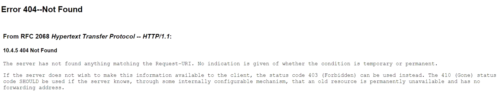
   >
   > ---
   >
   > jboss：默认端口为8080
   >
   > 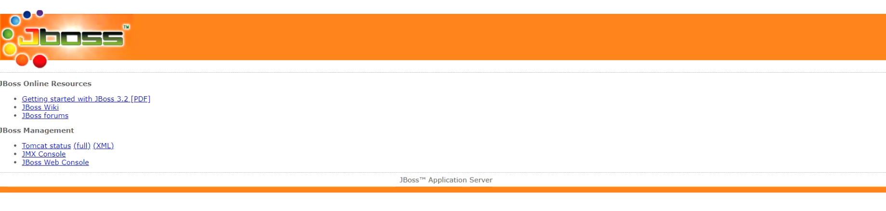
   >
   > ---
   >
   > tomcat：默认端口为8080
   >
   > 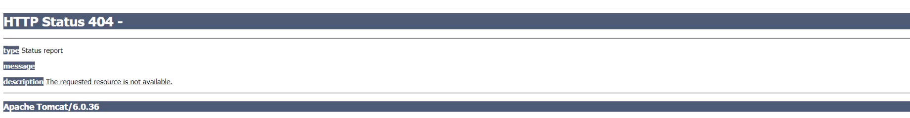

### 二、war包

1. 概念：war包是Sun公司提出的一种web应用程序格式，简单来说war包就是javaweb程序的压缩包，并且其中的文件按照一定的目录结构进行组织。其中，一般含有html和jsp文件、配置文件等一个项目的所有内容。
2. 将打包好的war包放到中间件中的web目录，就会自己解压运行
3. war包的制作：将Webshell使用zip压缩，再修改后缀名为war

### 三、Jboss后台部署war包getshell

1. [Jboss](#jboss)：是一个管理EJB的容器和服务器的WEB容器，一般于Tomcat或Jetty绑定使用。简单来说，Jboss是专门用来跑Java EE程序的。

2. Jboss的管理后台登录界面：

   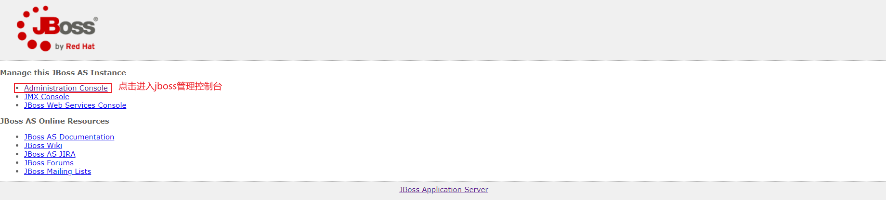

3. Jboss的默认账号和密码：admin | admin

   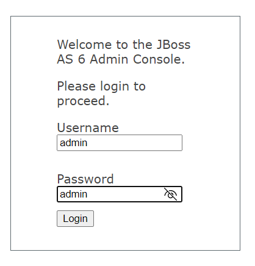

4. 制作war包：将jsp马（可以直接使用冰蝎）添加到zip压缩文件，然后将压缩文件的zip后缀修改为war

5. 上传war包：

   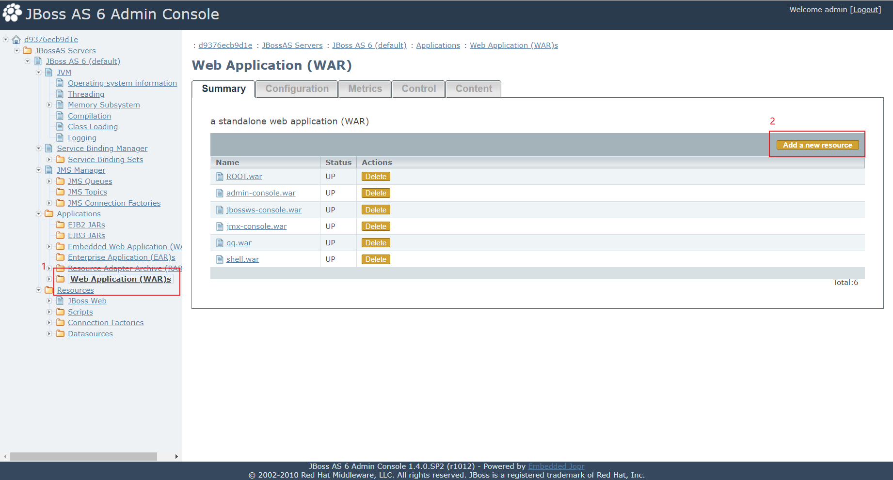

   ---

   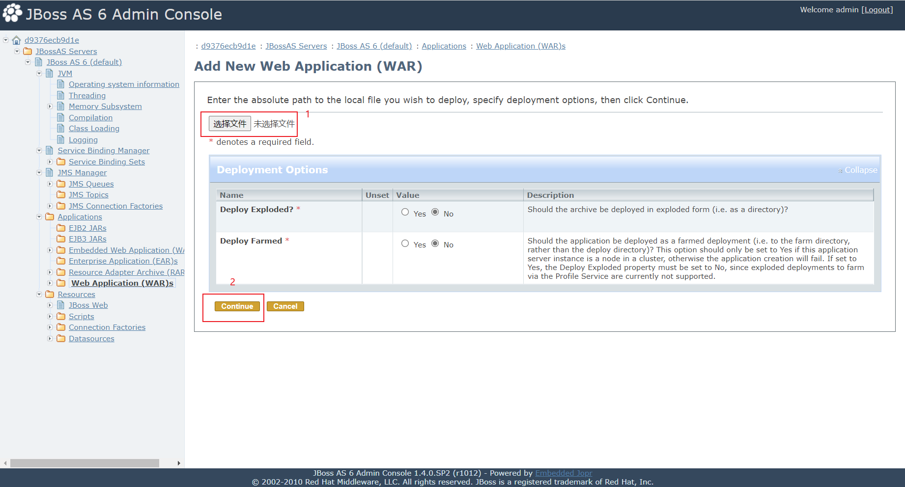

   ---

   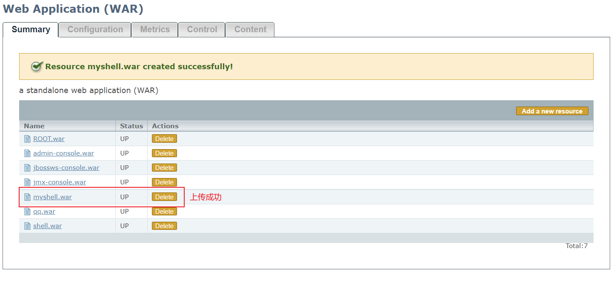

6. getshell的路径：`网站ip:端口/war包名/shell.jsp`，可以通过冰蝎getshell，然后使用反弹shell执行命令

### 四、Tomcat部署war包getshsell

1. [tomcat](#tomcat)后台管理登录页面：

   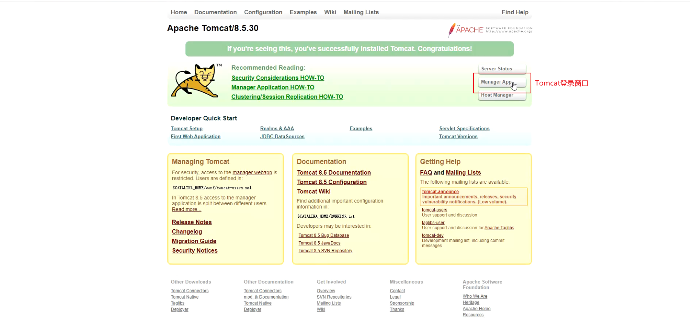

   或者直接访问根目录下的manager/html进行登录

   ---

   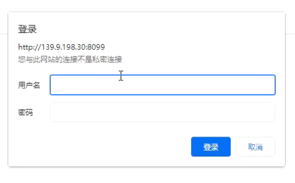

   若tomcat的版本小于6.0，可以使用burp进行抓包爆破登录

   > 弱口令 —— 
   >
   > 用户名：admin、tomcat、manager
   >
   > 密码：admin、123456、tomcat、manager、admin123
   >
   > ---
   >
   > 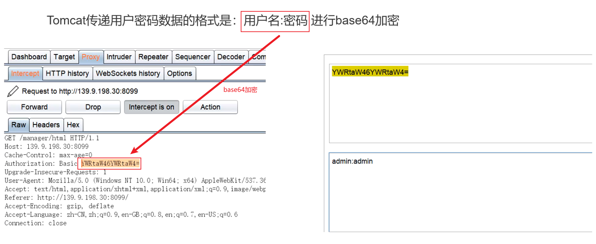
   >
   > 使用自定义迭代器【Custom iterator】进行爆破
   >
   > 注意：在爆破时应对密码进行base64的加密，并不对密码进行url的处理

2. 上传war包（使用jsp的webshell）

   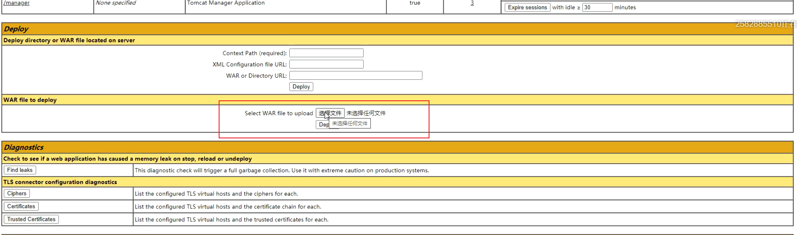

3. getshell的路径：`网站ip:端口/war包名/shell.jsp`，可以通过冰蝎getshell，然后使用反弹shell执行命令

### 五、web中间件的解析漏洞

1. 查看网站中间件的类型：Network → Name → Response Header → server

   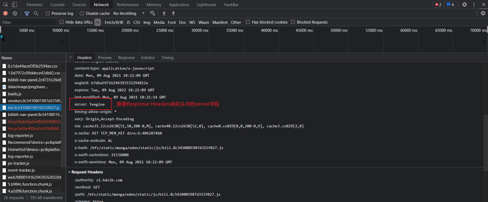

2. IIS6.0的解析漏洞：可以利用文件上传绕过

   > 目录解析：以`*.asp`命名的文件夹里的文件都将会被当成ASP文件执行
   >
   > 文件解析：像`*.asp;.jpg`这种畸形文件名，在`;`后面的内容会直接被忽略，也就是说会被当成`*.asp`文件执行
   >
   > > `*.asp`| `*.asa` | `*.cer` | `*.cdx`：这四种后缀的文件都会被当作asp文件解析

3. IIS7/7.5的解析漏洞：可以利用文件上传绕过

   > 文件解析：在一个文件路径后面加上`/xx.php`会将目标文件当作php文件解析（如：`filepath/01.jpg/01.php`会将`01.jpg`当作php文件解析）

4. Nginx配置不当造成的解析漏洞：可以利用文件上传绕过

   > 文件解析：在任意文件后面加上`/.php`后缀，可将其解析为php文件

### 六、Weblogic中间件的相关漏洞

1. [Weblogic](#weblogic)：是一个Oracle出品的一个基于JAVAEE架构的中间件

2. 默认的端口为7001端口

3. 漏洞主要影响版本：10.3.6.0 | 12.1.3.0 | 12.2.1.1 | 12.2.1.2 | 12.2.1.3 | 14.1.1.0

4. 漏洞扫描工具：[WeblogicScan](https://github.com/rabbitmask/WeblogicScan)

   > 在target文件中存放需要扫描的目标：`IP:端口号`
   >
   > 命令：`python3 WeblogicScan.py -f target.txt`
   >
   > 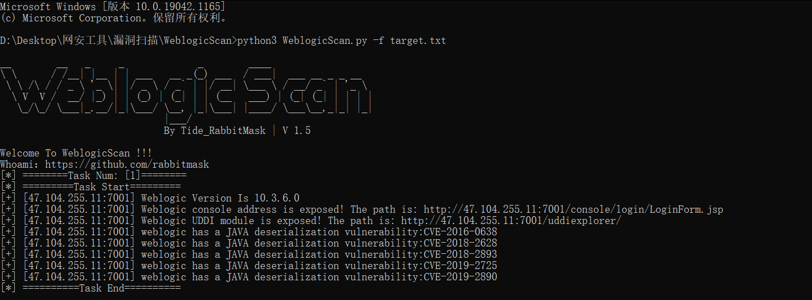

5. 扫描结果的验证：使用验证工具，放在WeblogicScan文件夹内

   > 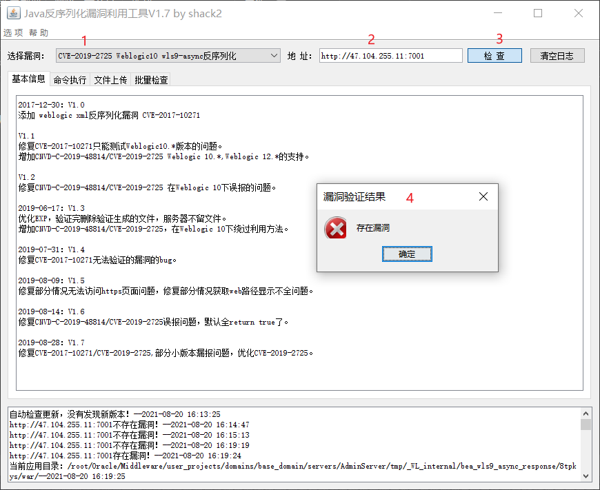
   >
   > ---
   >
   > 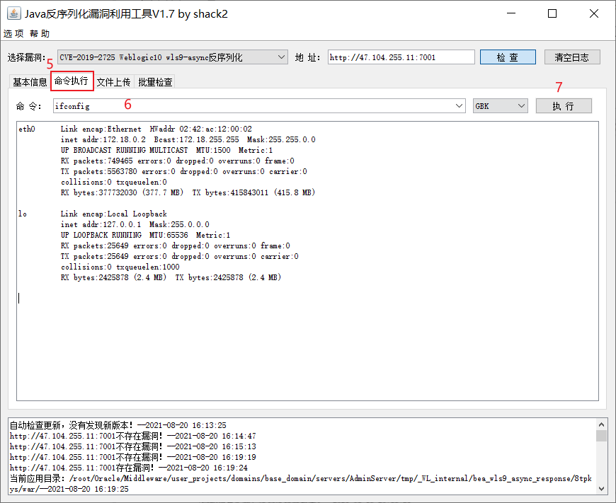
