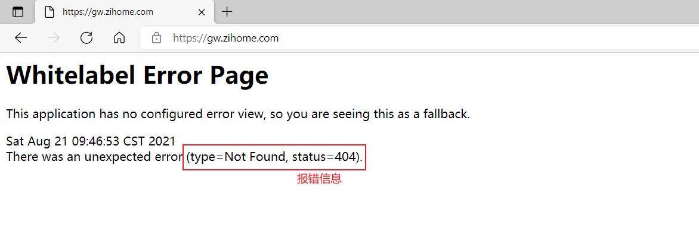
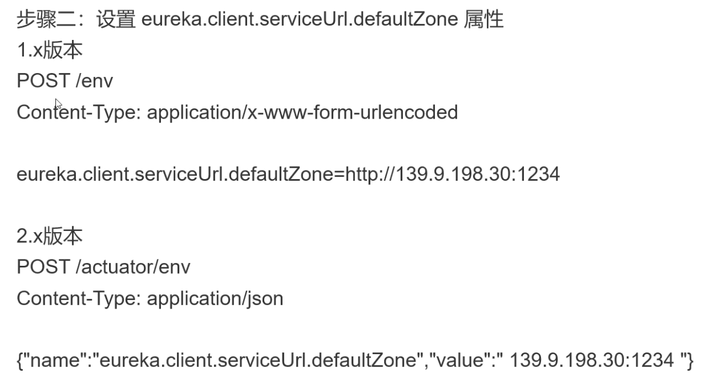
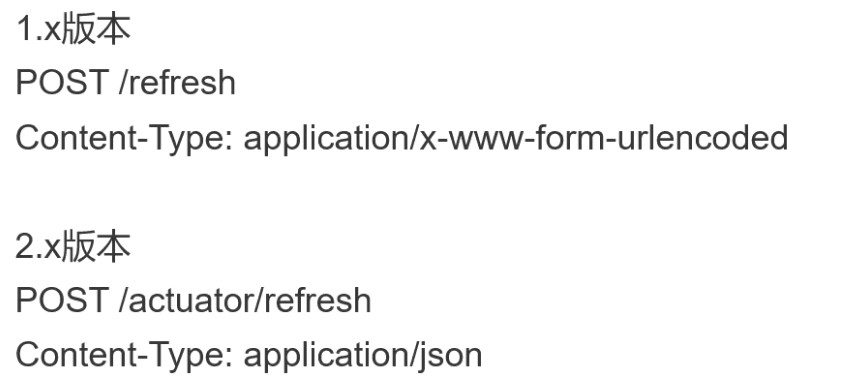
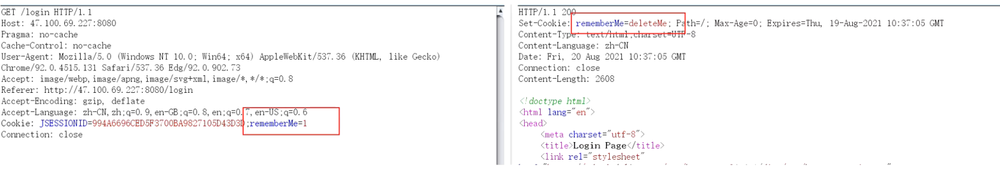
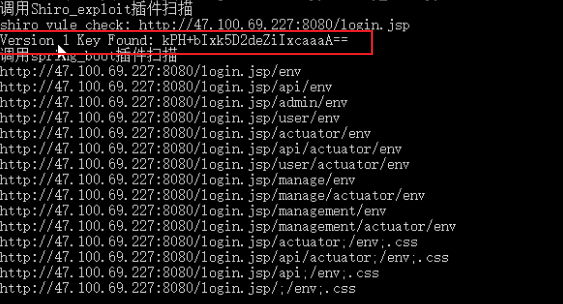
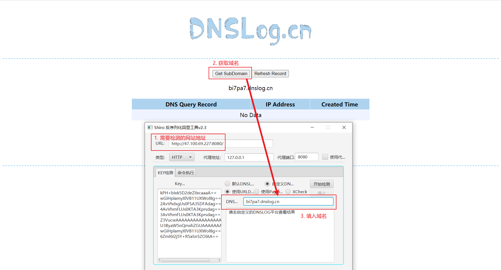
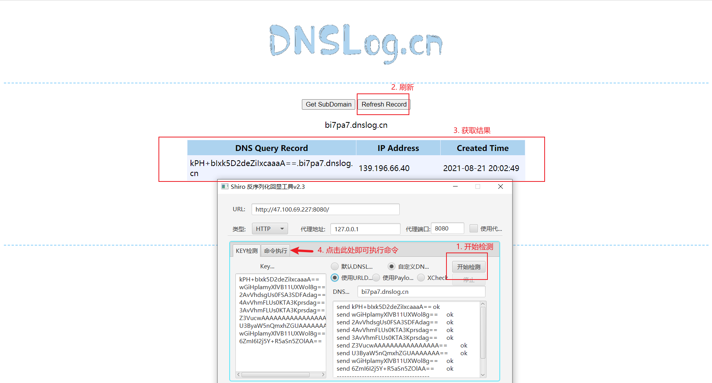
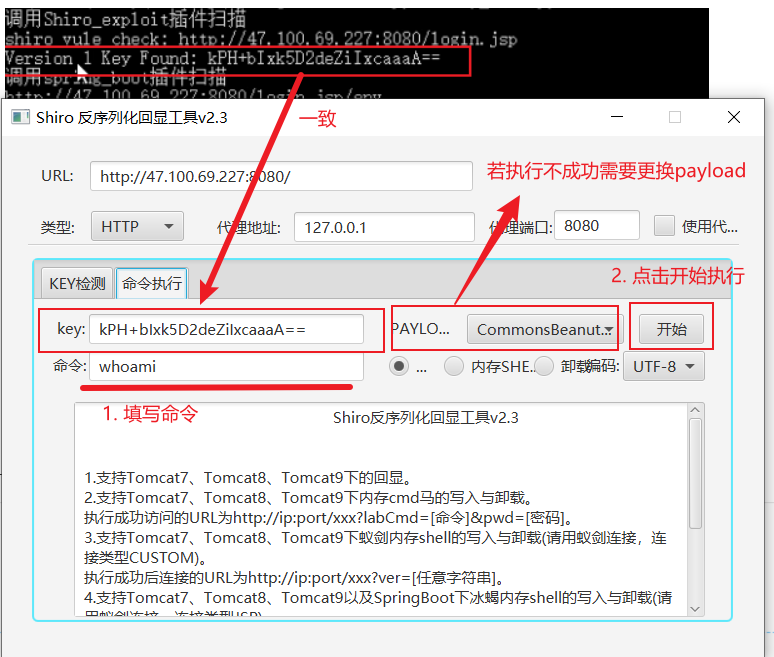

# SpringBoot未授权getshell

### 一、SpringBoot介绍

1. Spring Boot是简化新Spring应用的搭建及开发的由Pivotal团队提供的全新框架，而Spring框架是一个开源的J2EE应用程序框架

2. Actuator是SpringBoot自带的监控功能的组件，可以帮助实现对程序内部运行情况的监控，如：监控状况、Bean加载情况、环境变量、日志信息、线程信息等

3. SpringBoot网站特征：

   

### 二、SpringBoot的端点信息

1.  端点就是SpringBoot通过web或者jmx的方式向外部暴露应用的信息

2. 概览：

   | 端点            | 作用                                                         |
   | --------------- | ------------------------------------------------------------ |
   | /autoconfig     | 提供了一份自动配置报告，记录自动配置条件通过与否             |
   | /configprops    | 描述配置属性（包含默认值）如何注入Bean                       |
   | /beans          | 描述应用程序上下文里全部的Bean，以及它们的关系               |
   | /dump           | 获取线程活动的快照                                           |
   | **/env**        | **获取全部环境属性**                                         |
   | /env{name}      | 根据名称获取特定的环境属性值                                 |
   | /health         | 报告应用程序的健康指标，由HealthIndicator的实现类提供        |
   | /info           | 获取应用程序的定值信息，由info开头的属性提供                 |
   | /mappings       | 描述全部的URI路径，以及它们和控制器（包含Actuator端点）的映射关系 |
   | /metrics        | 报告各种应用程序度量信息，比如内存用量和HTTP请求计数         |
   | /metrics/{name} | 报告指定名称的应用程序度量值                                 |
   | /shutdown       | 关闭应用程序，要求endpoint.shutdown.enabled设置为true（默认为false） |
   | **/trace**      | **提供基本的HTTP请求跟踪信息（时间戳、HTTP头等）**           |

3. 使用：`http://ip:port/端点`

   > **/env**端点的位置变更
   >
   > 1.x版本：`http://ip:port/env`
   >
   > 2.x版本：`http://ip:port/actuator/env`

### 三、利用漏洞进行Getshall

1. 原理：利用xstream反序列化导致的命令执行漏洞

2. 前提：

   > 1. 可以POST请求目标位置的/env接口设置属性
   >
   >    > 可直接访问env端点，不报404的错误
   >
   > 2. 可以POST请求目标网站的/refresh接口刷新配置（存在spring-boot-starter-actuator依赖）
   >
   >    > 可直接访问refresh端点，不报404的错误
   >
   > 3. 目标是用的eureka-client < 1.8.7（包含着spring-cloud-starter-netfilx-eureka-client依赖中）
   >
   > 4. 目标可以请求攻击者的HTTP服务器（请求可出外网）

3. 利用：

   > 1. 使用扫描工具扫描网站，找出env和refresh端点都开启的网站
   >
   > 2. 架设恶意的XStream payload的网站，使用exploit.py脚本，修改它的参数（readme文件），并使用python3运行，标本运行后，将会在指定的端口开启服务
   >
   > 3. 使用env端点设置eureka.client.serviceUTL.defaultZone属性：浏览器访问`http://ip:port/env`并抓包，再修改请求方法，最后将请求体的数据放入并发送即可：请求体数据对应运行架设恶意的XStream payload的网站的服务器与其开启服务的端口
   >
   >    
   >
   > 4. 使用refresh端点刷新配置：浏览器访问`http://ip:port/refresh`并抓包，再修改请求方法发送即可
   >
   >    

---

# Shiro发现到getshell

### 一、Shiro介绍

* Apache Shiro是一款开源安全框架，提供身份验证、授权、密码学和会话管理。（一般使用于登录的页面中）

* Apache Shiro 1.2.4及以前版本中，加密的用户信息序列化后存储在名为remember-me的Cookie中，攻击者可以使用Shiro的默认密钥伪造用户Cookie，触发Java反序列化漏洞，进而实现getshell

* Shiro框架的判断：

  在请求头中cookie字段后追加一个`rememberMe=1`的字段，然后看响应头是否有`set-Cookie:rememberMe=deleteMe;`的字段，如果有，则可以判断是shiro框架（remember：记住密码的选项）

  

### 二、利用漏洞进行getshell

1. 获取密钥：使用my_scan.py脚本

   > 1. 先将要扫描的端口放到一个txt文档中，假设为01.txt
   >
   > 2. 执行命令：`python My_scan.py -T web -f 01.txt `
   >
   >    
   >
   > 3. 获取密钥成功

2. 使用ShiroScan工具检测和利用漏洞，配合[DNSLog](http://dnslog.cn/)使用

   > 
   >
   > ---
   >
   > 
   >
   > ---
   >
   > 
   >
   > > 两个工具探测出来的密钥，一般都会一致；不一致就用能用的就行

