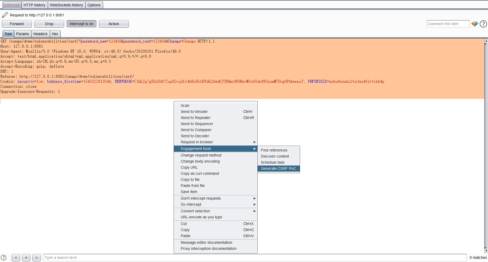
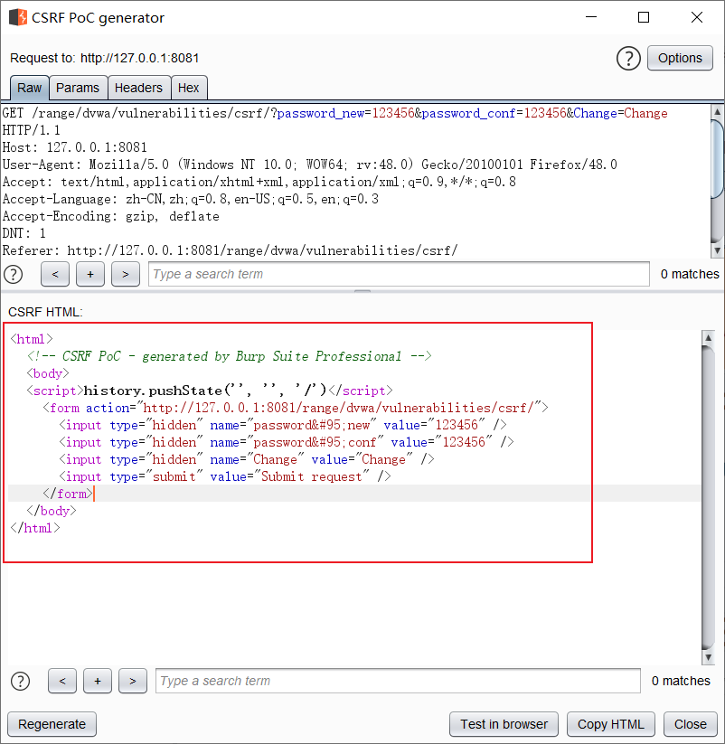
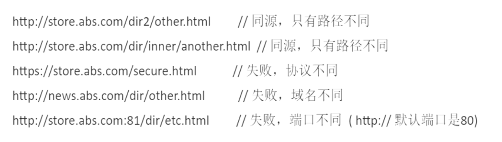
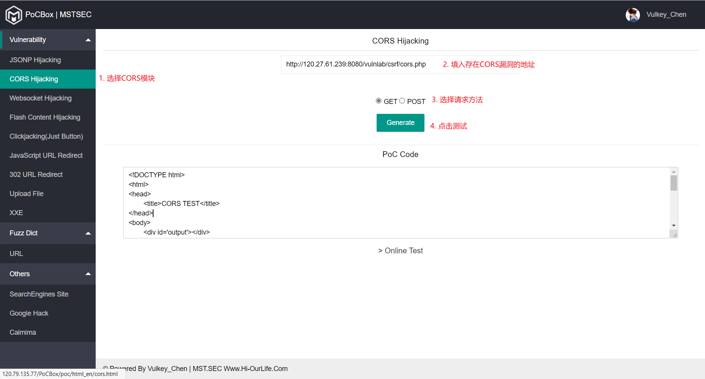
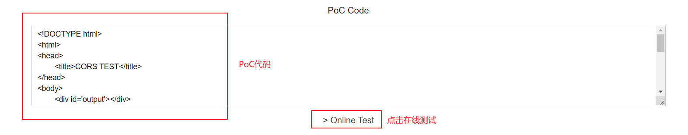
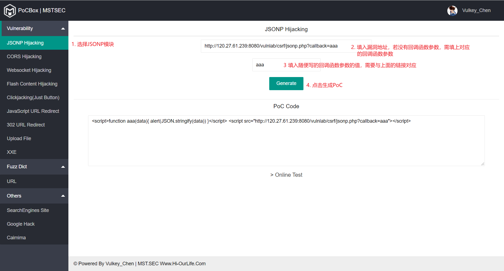
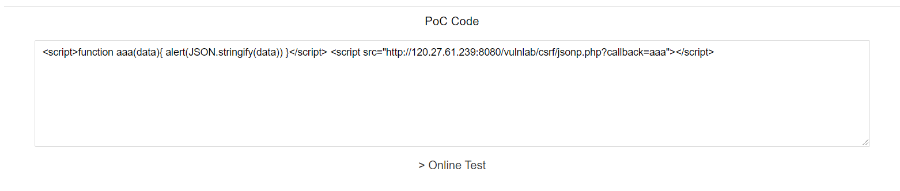

# CSRF漏洞

### 一、CSRF漏洞简介

1. 定义：CSRF（Cross-Site Request Forgery），跨站请求伪造，是一种挟制用户在当前**已登录的Web应用程序上执行非本意的操作**的攻击方法（只针对已登录用户的攻击）

2. 原理：利用浏览器保存的cookie在用户不知情的情况下，发送构造好的csrf脚本或者包含csrf脚本的链接去执行一些用户本身不想执行的操作

3. 攻击步骤：

   > 1. 用户登录受信任网站A，并保存cookie至本地
   > 2. 用户在不登出网站A的情况下，访问危险网站B
   > 3. 网站B中执行危险代码
   > 4. 利用用户本地保存的cookie在网站A上执行操作

4. 构造攻击流程：

   > 1. 登录存在漏洞的网站
   >
   >    > 存在漏洞：没有对链接的来源和完整性进行严格的验证
   >
   > 2. 抓取网站的请求包
   >
   > 3. 构造一个带有请求的链接
   >
   > 4. 然后让其它已登录用户点击该链接，执行操作

### 二、CSRF攻击

1. 定义：

   > 基于操作的CSRF：增删改操作
   >
   > 基于文件读取的CSRF：JSNOP、CORS、Flash跨域劫持

2. 本质：在用户不知情的情况下去执行请求

3. 分类：

   > **GET型CSRF**
   >
   > 在恶意网站中添加``
   >
   > ---
   >
   > **POST型CSRF**
   >
   > 通过Burp辅助构造一个自动提交的表单，添加至恶意网站
   >
   > ---
   >
   > **链接型CSRF**
   >
   > 通过在恶意网站上的图片嵌入恶意链接，或者构造一个链接诱骗用户点击
   >
   > 如：`<a href="恶意链接"target="_blank">千万不要点！！！<a/>`

4. 利用Burp生成POC

   > 1. 抓取请求包，右击点击 Engagement tools → Generate CSRF PoC
   >
   >    
   >
   > 2. 将POC的数据复制出来，并根据具体需求修改
   >
   >    
   >
   > 3. 完善一下Burp生成的HTML代码，让表单自动提交
   >
   >    ~~~html
   >    <html>
   >      <!-- CSRF PoC - generated by Burp Suite Professional -->
   >      <body>
   >      
   >        <form action="http://127.0.0.1:8081/range/dvwa/vulnerabilities/csrf/">
   >          <!-- 可以根据需求求改input的value数据 -->
   >          <input type="hidden" name="password&#95;new" value="123456" />
   >          <input type="hidden" name="password&#95;conf" value="123456" />
   >          <input type="hidden" name="Change" value="Change" />
   >          <!-- <input type="submit" value="Submit request" /> 删掉bp自动生成的此行代码 -->
   >        </form>
   >        	<!-- 添加此行代码，自动提交表单 -->
   >      </body>
   >    </html>
   >    ~~~

5. CSRF漏洞寻找方法：

   > 1. 通过修改请求头中的Referer字段或者Cookie值，查看返回包是否会发生改变（请求失败）
   > 2. 通过修改参数Auth、CSRFtoken或token字段的值，查看返回包是否会发生改变（请求失败）

### 三、CSRF读取漏洞

1. 同源策略的介绍：

   > 1. 同源：路径、端口、协议均相同
   >
   >    
   >
   > 2. 同源策略：不同源的客户端脚本在没有明确授权的情况下，不能读取对方的资源。是一种防止恶意文件加载的安全功能
   >
   > 3. 使用跨域解决方案可以解决不同源无法请求资源的问题
   >
   >    > 跨域解决方案：**jsonp**、**cors**、postMessage
   >
   > 4. cors的介绍：
   >
   >    > 1. CORS，全称跨域资源共享，是一种ajax跨域请求资源的方式
   >    >
   >    > 2. 简单请求流程：支持CORS请求的浏览器一旦发现ajax请求跨域，会对请求做一些特殊处理，对于已经实现CORS接口的服务端，接受请求，并做出回应
   >    >
   >    >    ~~~text
   >    >    > 浏览器判断跨域为简单请求时候，会在Request Header中添加 Origin （协议 + 域名 + 端口）字段 ， 它表示我们的请求源，CORS服务端会将该字段作为跨源标志。
   >    >    > CORS接收到此次请求后 ， 首先会判断Origin是否在允许源（由服务端决定）范围之内，如果验证通过，服务端会在Response Header 添加如下字段——
   >    >    	必须字段：
   >    >    	Access-Control-Allow-Origin：表示服务端允许的请求源，*标识任何外域，多个源 , 分隔
   >    >    ---------------------------------------------------------------------------------------
   >    >    	可选字段
   >    >    [1]	Access-Control-Allow-Credentials：false 表示是否允许发送Cookie
   >    >        【在设置为true的同时，ajax请求设置withCredentials = true,浏览器的cookie就能发送到服务端】
   >    >       
   >    >    [2]	Access-Control-Allow-Method：运行的请求方法
   >    >       
   >    >    [3] Access-Control-Expose-Headers：调用getResponseHeader()方法时候，能从header中获取的参数
   >    >    ~~~
   >
   > 5. jsonp的介绍：
   >
   >    > 1. 原理：利用script标签中的src属性不受同源策略影响的属性，通过script标签加载数据的方式去获取数据当作JS代码来执行
   >    > 2. 注意：JSONP只支持GET方式的请求，不支持POST方式的请求
   >    > 3. 特性：script标签可以加载其它域下的js，我们可以利用这个特性从其它域下获取数据（JSON格式）

2. CORS的使用：

   > 1. 漏洞成因：CORS配置错误，允许任意源访问网站资源
   >
   > 2. 简单验证：在请求包中输入任意的origin字段，若返回包中的Access-Control-Allow-Origin与之对应，则说明存在漏洞
   >
   > 3. CORS漏洞的利用：
   >
   >    > 1. 明确目的：获取受害者信息（查看网站上的敏感信息）
   >    >
   >    > 2. 漏洞利用代码：
   >    >
   >    >    ~~~html
   >    >    <!DOCTYPE html>
   >    >    <html>
   >    >    <head>
   >    >    <title>CORS TEST</title>
   >    >    </head>
   >    >    <body>
   >    >    

   >    >     <!-- 下面这个src中填写存在cors漏洞的请求包中包含敏感数据的链接 -->
   >    >     
   >    >    
   >    >    </body>
   >    >    </html
   >    >    ~~~
   >    >
   >    > 3. 用户在登陆状态点击恶意网站执行漏洞利用代码之后，在url中对应服务器的日志文件中可以看到中招用户的敏感信息

3. jsonp的使用

   > 1. 利用条件：
   >
   >    > 1. 观察数据类型，查看是否接收json数据
   >    >
   >    > 2. 判断GET请求参数中是否包含像`callback`、`cb`、`jsonp`字样的参数用来调用回调函数
   >    >
   >    >    > JSON格式会直接作为js允许，想要操作数据必须使用回调函数
   >    >
   >    > 3. 判断是否能进行回调函数的调用
   >    >
   >    > 4. 查看json数据是否有敏感信息
   >
   > 2. 漏洞利用代码：
   >
   >    ~~~html
   >    <!DOCTYPE html>
   >    <html lang="en">
   >    <head>
   >    <meta charset="UTF-8">
   >    <title>JSONP EXP跨域测试</title>
   >    </head>
   >    <body onload="load()">
   >    
   >    
   >    </body>
   >    </html>
   >    ~~~
   >
   > 3. 用户在登陆状态点击恶意网站执行漏洞利用代码之后，在url中对应服务器的日志文件中可以看到中招用户的敏感信息

4. 工具[PoCBox](https://github.com/0verSp4ce/PoCBox)的使用

   > 1. CORS
   >
   >    
   >
   >    ---
   >
   >    在点击测试之后，可以复制PoC直接使用，也可以在线测试
   >
   >    
   >
   > 2. JSNOP
   >
   >    
   >
   >    ---
   >
   >    在点击测试之后，可以复制PoC直接使用，也可以在线测试
   >
   >    
