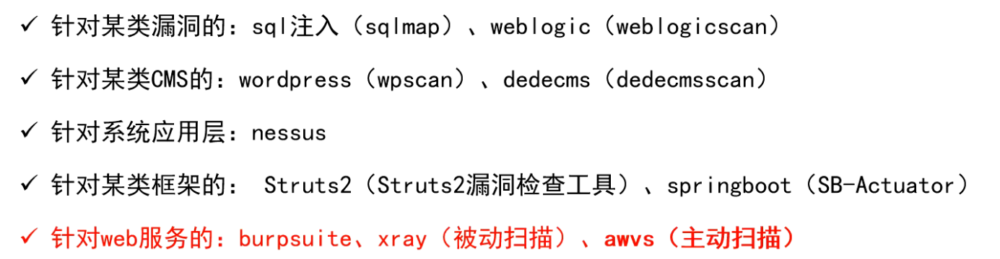
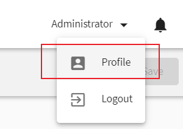
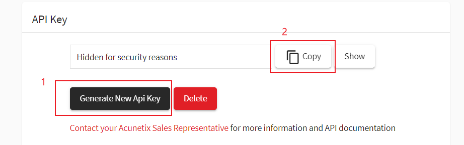
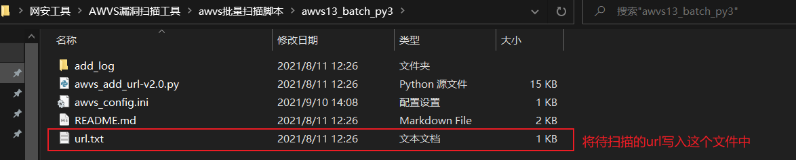
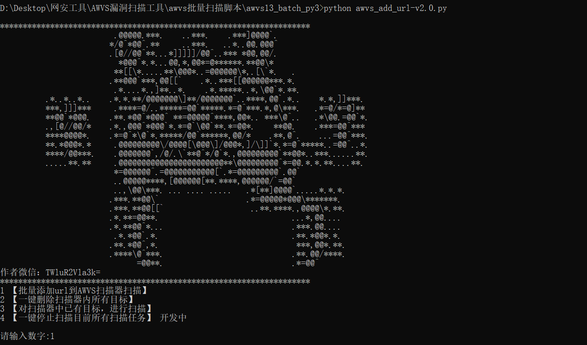
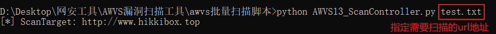

WEB扫描器

---

## -- 漏洞扫描工具

1. 漏洞扫描：指基于漏洞数据库，通过扫描等手段对指定的远程或者本地计算机系统的安全脆弱性进行检测，发现可利用漏洞的一种安全检测（渗透攻击）行为

2. 漏洞扫描工具：

   > 

3. 主动扫描： 输入某个URL，然后由扫描器中的爬虫模块爬取所有链接，对GET、POST等请求进行参数变形和污染，进行重放测试，然后依据返回信息中的状态码、数据大小、数据内容关键字等去判断该请求是否含有相应的漏洞

   被动扫描： 在进行手动测试的过程中，代理将流量转发给漏洞扫描器，然后再进行漏洞检测
   

### 一、自动化漏洞挖掘之awvs

1. awvs的功能：是一款知名的网络漏洞扫描工具，它通过网络爬虫测试网站的网络安全，检测流行的漏洞

2. 使用方法：

   > [awvs基础](../AWVS基础.md)

3. 使用awvs进行批量扫描：

   > 1. 获取API key：
   >
   >    
   >
   >    ---
   >
   >    下滑
   >
   >    
   >
   >    在脚本的配置文件中配置（只需要配置一次即可）
   >
   > 2. 使用配置完成的awvs13_batch_py3脚本扫描漏洞
   >
   >    > 1. 将待扫描的地址放入url.txt文件中
   >    >
   >    >    
   >    >
   >    > 2. 跑脚本，按照提示输入选项即可
   >    >
   >    >    
   >
   > 3. 使用配置完成的AWVS13_ScanController脚本进行扫描
   >
   >    > 

   

   

