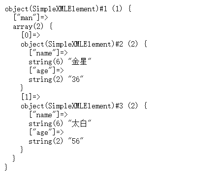
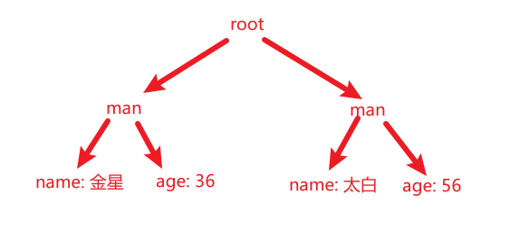

# XML基础

### 一、XML概述

1. 用途：

   > 1. **数据传输（主要）**
   > 2. 作为配置文件使用
   > 3. 储存数据，当作小型数据库使用

2. 作用：规范数据结构，使数据具有结构性，易读易处理

3. 定义：可扩展性标记语言，用来**传输和存储数据**，而不是展示数据

4. 特点：

   > 1. XML的标签必须自定义，但是标签名必须有含义，且必须为双标签
   > 2. XML是W3C推举的数据传输格式
   > 3. XML文件后缀名为.xml
   > 4. 所有的标签必须有一个根标签包裹所有的标签

5. 与HTML的区别：

   > 1. HTML用来展示数据，而XML用来传输和存储数据
   > 2. HTML有单标签和双标签，而XML只有双标签
   > 3. HTML的标签不能自定义，而XML标签只能自定义

### 二、XML的基本语法

#### ① - 语法规则：

> 1. XML必须有根节点（一般定义为root），必须有其它所有节点的父级节点
>
> 2. XML的头声明[可选]：可有可无，但建议书写
>
>    > ~~~xml
>    > <?xml version="1.0" encoding="utf-8" ?>
>    > <!-- xml头声明 备注版本号（一般为1.0）和编码 -->
>    > ~~~
>
> 3. XML的所有标签必须为双标签
>
> 4. 标签名大小写敏感
>
> 5. 标签不能交叉书写 —— 错误示范：`<a><b></a></b>`
>
> 6. XML中的注释与HTML中的注释一致：`<!-- 注释内容 -->`
>
> 7. 特殊字符使用实体标记转义：
>
>    | 实体标记 | 符号   | 特殊字符 |
>    | -------- | ------ | -------- |
>    | `&lt;`   | &lt;   | 小于     |
>    | `&gt;`   | &gt;   | 大于     |
>    | `&amp;`  | &amp;  | 和号     |
>    | `&apos;` | &apos; | 单引号   |
>    | `&quot`  | &quot; | 双引号   |
>

#### ② - 元素属性[可选]：

因为HTML不能自定义标签，所以属性是必须的。而XML中，可以自定义标签，就不存在所谓的额外信息，所以属性就是个鸡肋

> 1. 属性的作用：表示标签自身的一些额外信息
> 2. 位置：`<标签名 属性名="属性值"></标签名>`
> 3. 一个标签可以有多个属性
> 4. 属性命名规则：数字字母下划线，下划线不打头
> 5. 在解析XML数据时，属性会带来额外的解析代码，会多消耗资源

#### ③ - CDATA区域：

用于处理存在大量特殊符号的数据

> 1. 格式：`<![CDATA[数据内容]]>`
> 2. CDATA区域里的数据将不做解析，就是使用特殊符号不会报错
> 3. **特殊字符较少出现时，使用实体替换；而较多时使用CDATA**

### 三、使用PHP解析XML文档

> 在PHP5.0版本以后，提供一个SimplePHP类库，专门用于实现对XML文档的解析操作

1. XML解析方式：

   对于PHP来说，XML代码就是一段字符串。而使用`simplexml_load_file()`读取XML文件可以获得一个对象。

   ​																			 使用`simplexml_load_string()`读取XML内容可以获得一个对象。

   ~~~xml
   <!-- XML文件 -->
   <?xml version="1.0" encoding="utf-8" ?>
   <root>
       <man>
           <name>金星</name>
           <age>36</age>
       </man>
       <man>
           <name>太白</name>
           <age>56</age>
       </man>
   </root>
   ~~~

   ---

   ~~~php
   # 使用PHP读取XML代码得到一个对象
   <?php
       $x = simplexml_load_file('http://www.hikkibox.com/test.xml');
   	// 等价于：$x = simplexml_load_string(file_get_contents('http://www.hikkibox.com/test.xml'))
   	echo "<pre>";
   	var_dump($x);
   ~~~

   

   > 1. PHP将XML结点以属性的形式存放
   > 2. 内容如果有多条，以数组形式存储
   > 3. 数组的值就是解析后结点名字和内容，以对象属性的形式存储

2. PHP的XML解析原理：

   将数据解析为DOM树，再通过DOM树解析为对象（同一层的结点重名会当作数组解析）

   

   > 步骤：
   >
   > 1. 读取XML文档到内存
   > 2. 形成DOM树（PHP生成的DOM树会将数据存放至叶子结点内），并均作为字符串存储
   > 3. 由DOM树生成对象并返回（根结点不会存储到对象内）

3. 遍历XML对象中的数据：使用for循环或foreach循环即可

4. 使用PHP给XML添加结点：

   使用获取到的XML对象的方法`addChild()`添加新结点，再使用XML对象的方法`asXML()`将数据保存至文件中

   > `addChild(name, value[, ns])`：向XML结点添加一个子元素，并返回一个代表新增子元素的对象
   >
   > ​		name：子元素名称		|		value：子元素值		|		ns：命名空间[可选]
   >
   > ---
   >
   > `asXML([file])`：以字符串的形式从XML对象返回XML文档
   >
   > ​		file：XML文档保存路径[可选]，若指定了该参数，则会把数据保存至文件而不是返回它

   ~~~php
   
   <?php
   $x = Simplexml_load_file('test.xml');
   # 创建节点man
   $man = $x->addChild('man');
   # 创建man的子节点并赋值
   $man->addChild('name','玉帝');
   $man->addChild('age','999');
   # 将新的XML数据添加至文件
   $x->asXML('./new.xml');
   ~~~

### 四、Xpath语言

1. 概述：Xptah是一门专门用来查找XML数据内容的一门语言，用来在XML中对元素即属性进行遍历

2. 语法：

   ~~~php
   <?php
       $x = simplexml_load_file('test.xml');
   	// xpath使用以/开始的绝对路径查找：返回一个数组，数组元素为对象
   	$d1 = $x->xpath('/root/man/name');
   	// xpath使用相对路径查找：查找所有的name元素
   	$d2 = $x->xpath('//name');
   	// 使用通配符，查询man下所有元素
   	$d3 = $x->xpath('//man/*');
   	// 加上条件判断：筛选出所有年龄小于120的
   	$d4 = $x->xpath('//man[age<120]');
   	// 筛选最后一个
   	$d5 = $x->xpath('//man[last()]');
   	// 筛选age中有new属性的元素
   	$d6 = $x->xpath('//man[@new]');
   	// 遍历元素
   	foreach($d as $v){
           echo $v,' ';
       }
   ~~~
