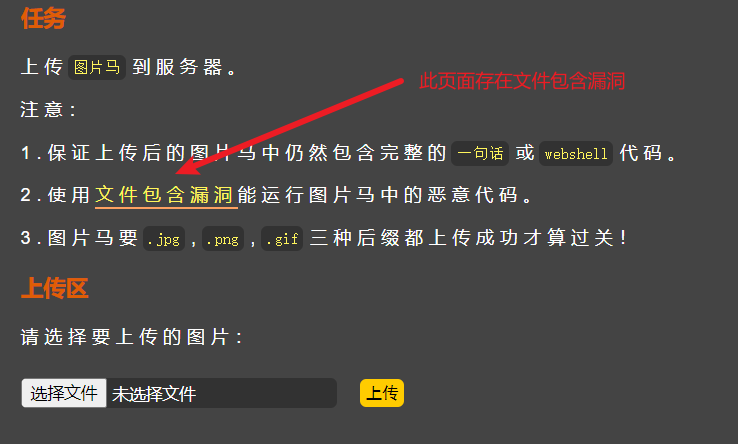
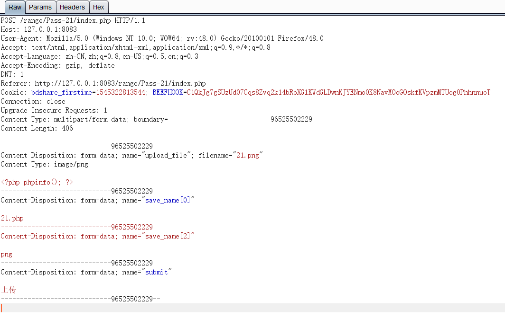

# upload-labs pass通关笔记

### Pass-01

```javascript
# ***Loophole***
function checkFile() {
    var file = document.getElementsByName('upload_file')[0].value;
    if (file == null || file == "") {
        alert("请选择要上传的文件!");
        return false;
    }
    //定义允许上传的文件类型
    var allow_ext = ".jpg|.png|.gif";
    //提取上传文件的类型
    var ext_name = file.substring(file.lastIndexOf("."));
    //判断上传文件类型是否允许上传
    if (allow_ext.indexOf(ext_name + "|") == -1) {
        var errMsg = "该文件不允许上传，请上传" + allow_ext + "类型的文件,当前文件类型为：" + ext_name;
        alert(errMsg);
        return false;
    }
}
```

> 前端JS判断：在浏览器关闭网页的JS权限即可绕过

---

### Pass-02

```php
$is_upload = false;
$msg = null;
if (isset($_POST['submit'])) {
    if (file_exists(UPLOAD_PATH)) {
        if (($_FILES['upload_file']['type'] == 'image/jpeg') || ($_FILES['upload_file']['type'] == 'image/png') || ($_FILES['upload_file']['type'] == 'image/gif')) {	# ***Loophole***
            if (move_uploaded_file($_FILES['upload_file']['tmp_name'], UPLOAD_PATH . '/' . $_FILES['upload_file']['name'])) {
                $img_path = UPLOAD_PATH . $_FILES['upload_file']['name'];
                $is_upload = true;

            }
        } else {
            $msg = '文件类型不正确，请重新上传！';
        }
    } else {
        $msg = UPLOAD_PATH.'文件夹不存在,请手工创建！';
    }
}
```

> MIME判断：使用BP修改请求包的MIME类型即可绕过

---

### Pass-03

```php
$is_upload = false;
$msg = null;
if (isset($_POST['submit'])) {
    if (file_exists(UPLOAD_PATH)) {
        # ***Loophole***
        $deny_ext = array('.asp','.aspx','.php','.jsp');
        $file_name = trim($_FILES['upload_file']['name']);
        $file_name = deldot($file_name);//删除文件名末尾的点
        $file_ext = strrchr($file_name, '.');
        $file_ext = strtolower($file_ext); //转换为小写
        $file_ext = str_ireplace('::$DATA', '', $file_ext);//去除字符串::$DATA
        $file_ext = trim($file_ext); //收尾去空

        if(!in_array($file_ext, $deny_ext)) {
            $temp_file = $_FILES['upload_file']['tmp_name'];
            $img_path = UPLOAD_PATH.'/'.date("YmdHis").rand(1000,9999).$file_ext;            
            if (move_uploaded_file($temp_file,$img_path)) {
                 $is_upload = true;
            } else {
                $msg = '上传出错！';
            }
        } else {
            $msg = '不允许上传.asp,.aspx,.php,.jsp后缀文件！';
        }
    } else {
        $msg = UPLOAD_PATH . '文件夹不存在,请手工创建！';
    }
}
```

> 黑名单种类缺少：尝试修改后缀名为`.phtml`绕过，若失败，则使用`.htaccess`绕过

---

### Pass-04

```php
$is_upload = false;
$msg = null;
if (isset($_POST['submit'])) {
    if (file_exists(UPLOAD_PATH)) {
        # ***Loophole***
        $deny_ext = array(".php",".php5",".php4",".php3",".php2",".php1",".html",".htm",".phtml",".pht",".pHp",".pHp5",".pHp4",".pHp3",".pHp2",".pHp1",".Html",".Htm",".pHtml",".jsp",".jspa",".jspx",".jsw",".jsv",".jspf",".jtml",".jSp",".jSpx",".jSpa",".jSw",".jSv",".jSpf",".jHtml",".asp",".aspx",".asa",".asax",".ascx",".ashx",".asmx",".cer",".aSp",".aSpx",".aSa",".aSax",".aScx",".aShx",".aSmx",".cEr",".sWf",".swf",".ini");
        $file_name = trim($_FILES['upload_file']['name']);
        $file_name = deldot($file_name);//删除文件名末尾的点
        $file_ext = strrchr($file_name, '.');
        $file_ext = strtolower($file_ext); //转换为小写
        $file_ext = str_ireplace('::$DATA', '', $file_ext);//去除字符串::$DATA
        $file_ext = trim($file_ext); //收尾去空

        if (!in_array($file_ext, $deny_ext)) {
            $temp_file = $_FILES['upload_file']['tmp_name'];
            $img_path = UPLOAD_PATH.'/'.$file_name;
            if (move_uploaded_file($temp_file, $img_path)) {
                $is_upload = true;
            } else {
                $msg = '上传出错！';
            }
        } else {
            $msg = '此文件不允许上传!';
        }
    } else {
        $msg = UPLOAD_PATH . '文件夹不存在,请手工创建！';
    }
}
```

> 黑名单种类缺少：使用`.htaccess`绕过

---

### Pass-05

```php
$is_upload = false;
$msg = null;
if (isset($_POST['submit'])) {
    if (file_exists(UPLOAD_PATH)) {
        # ***Loophole***
        $deny_ext = array(".php",".php5",".php4",".php3",".php2",".html",".htm",".phtml",".pht",".pHp",".pHp5",".pHp4",".pHp3",".pHp2",".Html",".Htm",".pHtml",".jsp",".jspa",".jspx",".jsw",".jsv",".jspf",".jtml",".jSp",".jSpx",".jSpa",".jSw",".jSv",".jSpf",".jHtml",".asp",".aspx",".asa",".asax",".ascx",".ashx",".asmx",".cer",".aSp",".aSpx",".aSa",".aSax",".aScx",".aShx",".aSmx",".cEr",".sWf",".swf",".htaccess");
        $file_name = trim($_FILES['upload_file']['name']);
        $file_name = deldot($file_name);//删除文件名末尾的点
        $file_ext = strrchr($file_name, '.');
        $file_ext = strtolower($file_ext); //转换为小写
        $file_ext = str_ireplace('::$DATA', '', $file_ext);//去除字符串::$DATA
        $file_ext = trim($file_ext); //首尾去空
        
        if (!in_array($file_ext, $deny_ext)) {
            $temp_file = $_FILES['upload_file']['tmp_name'];
            $img_path = UPLOAD_PATH.'/'.$file_name;
            if (move_uploaded_file($temp_file, $img_path)) {
                $is_upload = true;
            } else {
                $msg = '上传出错！';
            }
        } else {
            $msg = '此文件类型不允许上传！';
        }
    } else {
        $msg = UPLOAD_PATH . '文件夹不存在,请手工创建！';
    }
}
```

> 黑名单种类缺少：使用`.user.ini`绕过
>
> 参考文献:[.user.ini文件构成的PHP后门_weixin_33694172的博客-CSDN博客](https://blog.csdn.net/weixin_33694172/article/details/87981584)

---

### Pass-06

```php
$is_upload = false;
$msg = null;
if (isset($_POST['submit'])) {
    if (file_exists(UPLOAD_PATH)) {
        $deny_ext = array(".php",".php5",".php4",".php3",".php2",".html",".htm",".phtml",".pht",".pHp",".pHp5",".pHp4",".pHp3",".pHp2",".Html",".Htm",".pHtml",".jsp",".jspa",".jspx",".jsw",".jsv",".jspf",".jtml",".jSp",".jSpx",".jSpa",".jSw",".jSv",".jSpf",".jHtml",".asp",".aspx",".asa",".asax",".ascx",".ashx",".asmx",".cer",".aSp",".aSpx",".aSa",".aSax",".aScx",".aShx",".aSmx",".cEr",".sWf",".swf",".htaccess",".ini");
        $file_name = trim($_FILES['upload_file']['name']);
        $file_name = deldot($file_name);//删除文件名末尾的点
        $file_ext = strrchr($file_name, '.');
        # ***Loophole***
        $file_ext = str_ireplace('::$DATA', '', $file_ext);//去除字符串::$DATA
        $file_ext = trim($file_ext); //首尾去空

        if (!in_array($file_ext, $deny_ext)) {
            $temp_file = $_FILES['upload_file']['tmp_name'];
            $img_path = UPLOAD_PATH.'/'.date("YmdHis").rand(1000,9999).$file_ext;
            if (move_uploaded_file($temp_file, $img_path)) {
                $is_upload = true;
            } else {
                $msg = '上传出错！';
            }
        } else {
            $msg = '此文件类型不允许上传！';
        }
    } else {
        $msg = UPLOAD_PATH . '文件夹不存在,请手工创建！';
    }
}
```

> 缺少小写转换：使用大写后缀名绕过

---

### Pass-07

```php
$is_upload = false;
$msg = null;
if (isset($_POST['submit'])) {
    if (file_exists(UPLOAD_PATH)) {
        $deny_ext = array(".php",".php5",".php4",".php3",".php2",".html",".htm",".phtml",".pht",".pHp",".pHp5",".pHp4",".pHp3",".pHp2",".Html",".Htm",".pHtml",".jsp",".jspa",".jspx",".jsw",".jsv",".jspf",".jtml",".jSp",".jSpx",".jSpa",".jSw",".jSv",".jSpf",".jHtml",".asp",".aspx",".asa",".asax",".ascx",".ashx",".asmx",".cer",".aSp",".aSpx",".aSa",".aSax",".aScx",".aShx",".aSmx",".cEr",".sWf",".swf",".htaccess",".ini");
        $file_name = $_FILES['upload_file']['name'];
        $file_name = deldot($file_name);//删除文件名末尾的点
        $file_ext = strrchr($file_name, '.');
        $file_ext = strtolower($file_ext); //转换为小写
        $file_ext = str_ireplace('::$DATA', '', $file_ext);//去除字符串::$DATA
        # ***Loophole***
        
        if (!in_array($file_ext, $deny_ext)) {
            $temp_file = $_FILES['upload_file']['tmp_name'];
            $img_path = UPLOAD_PATH.'/'.date("YmdHis").rand(1000,9999).$file_ext;
            if (move_uploaded_file($temp_file,$img_path)) {
                $is_upload = true;
            } else {
                $msg = '上传出错！';
            }
        } else {
            $msg = '此文件不允许上传';
        }
    } else {
        $msg = UPLOAD_PATH . '文件夹不存在,请手工创建！';
    }
}
```

> 缺少空格的去除：使用空格绕过

---

### Pass-08

```php
$is_upload = false;
$msg = null;
if (isset($_POST['submit'])) {
    if (file_exists(UPLOAD_PATH)) {
        $deny_ext = array(".php",".php5",".php4",".php3",".php2",".html",".htm",".phtml",".pht",".pHp",".pHp5",".pHp4",".pHp3",".pHp2",".Html",".Htm",".pHtml",".jsp",".jspa",".jspx",".jsw",".jsv",".jspf",".jtml",".jSp",".jSpx",".jSpa",".jSw",".jSv",".jSpf",".jHtml",".asp",".aspx",".asa",".asax",".ascx",".ashx",".asmx",".cer",".aSp",".aSpx",".aSa",".aSax",".aScx",".aShx",".aSmx",".cEr",".sWf",".swf",".htaccess",".ini");
        $file_name = trim($_FILES['upload_file']['name']);
        # ***Loophole***
        $file_ext = strrchr($file_name, '.');
        $file_ext = strtolower($file_ext); //转换为小写
        $file_ext = str_ireplace('::$DATA', '', $file_ext);//去除字符串::$DATA
        $file_ext = trim($file_ext); //首尾去空
        
        if (!in_array($file_ext, $deny_ext)) {
            $temp_file = $_FILES['upload_file']['tmp_name'];
            $img_path = UPLOAD_PATH.'/'.$file_name;
            if (move_uploaded_file($temp_file, $img_path)) {
                $is_upload = true;
            } else {
                $msg = '上传出错！';
            }
        } else {
            $msg = '此文件类型不允许上传！';
        }
    } else {
        $msg = UPLOAD_PATH . '文件夹不存在,请手工创建！';
    }
}
```

> 缺少点的去除：使用`.`绕过

---

### Pass-09

```php
$is_upload = false;
$msg = null;
if (isset($_POST['submit'])) {
    if (file_exists(UPLOAD_PATH)) {
        $deny_ext = array(".php",".php5",".php4",".php3",".php2",".html",".htm",".phtml",".pht",".pHp",".pHp5",".pHp4",".pHp3",".pHp2",".Html",".Htm",".pHtml",".jsp",".jspa",".jspx",".jsw",".jsv",".jspf",".jtml",".jSp",".jSpx",".jSpa",".jSw",".jSv",".jSpf",".jHtml",".asp",".aspx",".asa",".asax",".ascx",".ashx",".asmx",".cer",".aSp",".aSpx",".aSa",".aSax",".aScx",".aShx",".aSmx",".cEr",".sWf",".swf",".htaccess",".ini");
        $file_name = trim($_FILES['upload_file']['name']);
        $file_name = deldot($file_name);//删除文件名末尾的点
        $file_ext = strrchr($file_name, '.');
        $file_ext = strtolower($file_ext); //转换为小写
        # ***Loophole***
        $file_ext = trim($file_ext); //首尾去空
        
        if (!in_array($file_ext, $deny_ext)) {
            $temp_file = $_FILES['upload_file']['tmp_name'];
            $img_path = UPLOAD_PATH.'/'.date("YmdHis").rand(1000,9999).$file_ext;
            if (move_uploaded_file($temp_file, $img_path)) {
                $is_upload = true;
            } else {
                $msg = '上传出错！';
            }
        } else {
            $msg = '此文件类型不允许上传！';
        }
    } else {
        $msg = UPLOAD_PATH . '文件夹不存在,请手工创建！';
    }
}
```

> 缺少`::$DATA`的去除：使用`::$DATA`绕过

---

### Pass-10

```php
$is_upload = false;
$msg = null;
if (isset($_POST['submit'])) {
    if (file_exists(UPLOAD_PATH)) {
        $deny_ext = array(".php",".php5",".php4",".php3",".php2",".html",".htm",".phtml",".pht",".pHp",".pHp5",".pHp4",".pHp3",".pHp2",".Html",".Htm",".pHtml",".jsp",".jspa",".jspx",".jsw",".jsv",".jspf",".jtml",".jSp",".jSpx",".jSpa",".jSw",".jSv",".jSpf",".jHtml",".asp",".aspx",".asa",".asax",".ascx",".ashx",".asmx",".cer",".aSp",".aSpx",".aSa",".aSax",".aScx",".aShx",".aSmx",".cEr",".sWf",".swf",".htaccess",".ini");
        # ***Loophole***
        $file_name = trim($_FILES['upload_file']['name']);
        $file_name = deldot($file_name);//删除文件名末尾的点
        $file_ext = strrchr($file_name, '.');
        $file_ext = strtolower($file_ext); //转换为小写
        $file_ext = str_ireplace('::$DATA', '', $file_ext);//去除字符串::$DATA
        $file_ext = trim($file_ext); //首尾去空
        
        if (!in_array($file_ext, $deny_ext)) {
            $temp_file = $_FILES['upload_file']['tmp_name'];
            $img_path = UPLOAD_PATH.'/'.$file_name;
            if (move_uploaded_file($temp_file, $img_path)) {
                $is_upload = true;
            } else {
                $msg = '上传出错！';
            }
        } else {
            $msg = '此文件类型不允许上传！';
        }
    } else {
        $msg = UPLOAD_PATH . '文件夹不存在,请手工创建！';
    }
}
```

> 过于死板的判定规则：使用`. .`绕过

---

### Pass-11

```php
$is_upload = false;
$msg = null;
if (isset($_POST['submit'])) {
    if (file_exists(UPLOAD_PATH)) {
        $deny_ext = array("php","php5","php4","php3","php2","html","htm","phtml","pht","jsp","jspa","jspx","jsw","jsv","jspf","jtml","asp","aspx","asa","asax","ascx","ashx","asmx","cer","swf","htaccess","ini");

        $file_name = trim($_FILES['upload_file']['name']);
        # ***Loophole***
        $file_name = str_ireplace($deny_ext,"", $file_name);
        $temp_file = $_FILES['upload_file']['tmp_name'];
        $img_path = UPLOAD_PATH.'/'.$file_name;        
        if (move_uploaded_file($temp_file, $img_path)) {
            $is_upload = true;
        } else {
            $msg = '上传出错！';
        }
    } else {
        $msg = UPLOAD_PATH . '文件夹不存在,请手工创建！';
    }
}
```

> 使用替空的方式取代报错：双写绕过

---

### Pass-12

```php
$is_upload = false;
$msg = null;
if(isset($_POST['submit'])){
    $ext_arr = array('jpg','png','gif');
    $file_ext = substr($_FILES['upload_file']['name'],strrpos($_FILES['upload_file']['name'],".")+1);
    if(in_array($file_ext,$ext_arr)){
        $temp_file = $_FILES['upload_file']['tmp_name'];
        # ***Loophole***
        $img_path = $_GET['save_path']."/".rand(10, 99).date("YmdHis").".".$file_ext;

        if(move_uploaded_file($temp_file,$img_path)){
            $is_upload = true;
        } else {
            $msg = '上传出错！';
        }
    } else{
        $msg = "只允许上传.jpg|.png|.gif类型文件！";
    }
}
```

> 使用白名单判断，且GET url路径可控：使用%00截断绕过

---

### Pass-13

```php
$is_upload = false;
$msg = null;
if(isset($_POST['submit'])){
    $ext_arr = array('jpg','png','gif');
    $file_ext = substr($_FILES['upload_file']['name'],strrpos($_FILES['upload_file']['name'],".")+1);
    if(in_array($file_ext,$ext_arr)){
        $temp_file = $_FILES['upload_file']['tmp_name'];
        # ***Loophole***
        $img_path = $_POST['save_path']."/".rand(10, 99).date("YmdHis").".".$file_ext;

        if(move_uploaded_file($temp_file,$img_path)){
            $is_upload = true;
        } else {
            $msg = "上传失败";
        }
    } else {
        $msg = "只允许上传.jpg|.png|.gif类型文件！";
    }
}
```

> 使用白名单判断，且POST路径可控：使用0x00截断绕过

---

### Pass-14

```php
function getReailFileType($filename){
    $file = fopen($filename, "rb");
    $bin = fread($file, 2); //只读2字节
    fclose($file);
    $strInfo = @unpack("C2chars", $bin);    
    $typeCode = intval($strInfo['chars1'].$strInfo['chars2']);    
    $fileType = '';    
    switch($typeCode){      
        case 255216:            
            $fileType = 'jpg';
            break;
        case 13780:            
            $fileType = 'png';
            break;        
        case 7173:            
            $fileType = 'gif';
            break;
        default:            
            $fileType = 'unknown';
        }    
        return $fileType;
}

$is_upload = false;
$msg = null;
if(isset($_POST['submit'])){
    $temp_file = $_FILES['upload_file']['tmp_name'];
    $file_type = getReailFileType($temp_file);

    if($file_type == 'unknown'){
        $msg = "文件未知，上传失败！";
    }else{
        $img_path = UPLOAD_PATH."/".rand(10, 99).date("YmdHis").".".$file_type;
        if(move_uploaded_file($temp_file,$img_path)){
            $is_upload = true;
        } else {
            $msg = "上传出错！";
        }
    }
}
```

> <span id='Pass-14'>解决方案：</span>
>
> 
>
> 上传符合规范的图片马，并利用文件包含漏洞解析图片马

---

### Pass-15

```php
function isImage($filename){
    $types = '.jpeg|.png|.gif';
    if(file_exists($filename)){
        $info = getimagesize($filename);
        $ext = image_type_to_extension($info[2]);
        if(stripos($types,$ext)>=0){
            return $ext;
        }else{
            return false;
        }
    }else{
        return false;
    }
}

$is_upload = false;
$msg = null;
if(isset($_POST['submit'])){
    $temp_file = $_FILES['upload_file']['tmp_name'];
    $res = isImage($temp_file);
    if(!$res){
        $msg = "文件未知，上传失败！";
    }else{
        $img_path = UPLOAD_PATH."/".rand(10, 99).date("YmdHis").$res;
        if(move_uploaded_file($temp_file,$img_path)){
            $is_upload = true;
        } else {
            $msg = "上传出错！";
        }
    }
}
```

> 同[Pass-14](#Pass-14)

---

### Pass-16

```php
function isImage($filename){
    //需要开启php_exif模块
    $image_type = exif_imagetype($filename);
    switch ($image_type) {
        case IMAGETYPE_GIF:
            return "gif";
            break;
        case IMAGETYPE_JPEG:
            return "jpg";
            break;
        case IMAGETYPE_PNG:
            return "png";
            break;    
        default:
            return false;
            break;
    }
}

$is_upload = false;
$msg = null;
if(isset($_POST['submit'])){
    $temp_file = $_FILES['upload_file']['tmp_name'];
    $res = isImage($temp_file);
    if(!$res){
        $msg = "文件未知，上传失败！";
    }else{
        $img_path = UPLOAD_PATH."/".rand(10, 99).date("YmdHis").".".$res;
        if(move_uploaded_file($temp_file,$img_path)){
            $is_upload = true;
        }
        else{
            $msg = "上传失败";
        }
    }
}
```

> 同[Pass-14](#Pass-14)，注意要打开php_exif模块

---

### Pass-17

```php
$is_upload = false;
$msg = null;
if (isset($_POST['submit'])){
    // 获得上传文件的基本信息，文件名，类型，大小，临时文件路径
    $filename = $_FILES['upload_file']['name'];
    $filetype = $_FILES['upload_file']['type'];
    $tmpname = $_FILES['upload_file']['tmp_name'];

    $target_path=UPLOAD_PATH.'/'.basename($filename);

    // 获得上传文件的扩展名
    $fileext= substr(strrchr($filename,"."),1);

    //判断文件后缀与类型，合法才进行上传操作
    if(($fileext == "jpg") && ($filetype=="image/jpeg")){
        if(move_uploaded_file($tmpname,$target_path)){
            //使用上传的图片生成新的图片
            $im = imagecreatefromjpeg($target_path);

            if($im == false){
                $msg = "该文件不是jpg格式的图片！";
                @unlink($target_path);
            }else{
                //给新图片指定文件名
                srand(time());
                $newfilename = strval(rand()).".jpg";
                //显示二次渲染后的图片（使用用户上传图片生成的新图片）
                $img_path = UPLOAD_PATH.'/'.$newfilename;
                imagejpeg($im,$img_path);
                @unlink($target_path);
                $is_upload = true;
            }
        } else {
            $msg = "上传出错！";
        }

    }else if(($fileext == "png") && ($filetype=="image/png")){
        if(move_uploaded_file($tmpname,$target_path)){
            //使用上传的图片生成新的图片
            $im = imagecreatefrompng($target_path);

            if($im == false){
                $msg = "该文件不是png格式的图片！";
                @unlink($target_path);
            }else{
                 //给新图片指定文件名
                srand(time());
                $newfilename = strval(rand()).".png";
                //显示二次渲染后的图片（使用用户上传图片生成的新图片）
                $img_path = UPLOAD_PATH.'/'.$newfilename;
                imagepng($im,$img_path);

                @unlink($target_path);
                $is_upload = true;               
            }
        } else {
            $msg = "上传出错！";
        }

    }else if(($fileext == "gif") && ($filetype=="image/gif")){
        if(move_uploaded_file($tmpname,$target_path)){
            //使用上传的图片生成新的图片
            $im = imagecreatefromgif($target_path);
            if($im == false){
                $msg = "该文件不是gif格式的图片！";
                @unlink($target_path);
            }else{
                //给新图片指定文件名
                srand(time());
                $newfilename = strval(rand()).".gif";
                //显示二次渲染后的图片（使用用户上传图片生成的新图片）
                $img_path = UPLOAD_PATH.'/'.$newfilename;
                imagegif($im,$img_path);

                @unlink($target_path);
                $is_upload = true;
            }
        } else {
            $msg = "上传出错！";
        }
    }else{
        $msg = "只允许上传后缀为.jpg|.png|.gif的图片文件！";
    }
}
```

> 参考文献：[upload-labs之pass 16详细分析 - 先知社区 (aliyun.com)](https://xz.aliyun.com/t/2657)
>
> 目前只会用gif文件，png和jpg文件通不过，QAQ

---

### Pass-18

```php
$is_upload = false;
$msg = null;

if(isset($_POST['submit'])){
    $ext_arr = array('jpg','png','gif');
    $file_name = $_FILES['upload_file']['name'];
    $temp_file = $_FILES['upload_file']['tmp_name'];
    $file_ext = substr($file_name,strrpos($file_name,".")+1);
    $upload_file = UPLOAD_PATH . '/' . $file_name;
	# ***Loophole***
    if(move_uploaded_file($temp_file, $upload_file)){
        if(in_array($file_ext,$ext_arr)){
             $img_path = UPLOAD_PATH . '/'. rand(10, 99).date("YmdHis").".".$file_ext;
             rename($upload_file, $img_path);
             $is_upload = true;
        }else{
            $msg = "只允许上传.jpg|.png|.gif类型文件！";
            unlink($upload_file);
        }
    }else{
        $msg = '上传出错！';
    }
}
```

> 先移动文件，再进行文件类型判断：使用条件竞争绕过

---

### Pass-19

```php
//index.php
$is_upload = false;
$msg = null;
if (isset($_POST['submit']))
{
    require_once("./myupload.php");
    $imgFileName =time();
    $u = new MyUpload($_FILES['upload_file']['name'], $_FILES['upload_file']['tmp_name'], $_FILES['upload_file']['size'],$imgFileName);
    $status_code = $u->upload(UPLOAD_PATH);
    switch ($status_code) {
        case 1:
            $is_upload = true;
            $img_path = $u->cls_upload_dir . $u->cls_file_rename_to;
            break;
        case 2:
            $msg = '文件已经被上传，但没有重命名。';
            break; 
        case -1:
            $msg = '这个文件不能上传到服务器的临时文件存储目录。';
            break; 
        case -2:
            $msg = '上传失败，上传目录不可写。';
            break; 
        case -3:
            $msg = '上传失败，无法上传该类型文件。';
            break; 
        case -4:
            $msg = '上传失败，上传的文件过大。';
            break; 
        case -5:
            $msg = '上传失败，服务器已经存在相同名称文件。';
            break; 
        case -6:
            $msg = '文件无法上传，文件不能复制到目标目录。';
            break;      
        default:
            $msg = '未知错误！';
            break;
    }
}

//myupload.php
class MyUpload{
......
......
...... 
  var $cls_arr_ext_accepted = array(
      ".doc", ".xls", ".txt", ".pdf", ".gif", ".jpg", ".zip", ".rar", ".7z",".ppt",
      ".html", ".xml", ".tiff", ".jpeg", ".png" );

......
......
......  
  /** upload()
   **
   ** Method to upload the file.
   ** This is the only method to call outside the class.
   ** @para String name of directory we upload to
   ** @returns void
  **/
  function upload( $dir ){
    
    $ret = $this->isUploadedFile();	
    
    if( $ret != 1 ){
      return $this->resultUpload( $ret );
    }

    $ret = $this->setDir( $dir );
    if( $ret != 1 ){
      return $this->resultUpload( $ret );
    }

    $ret = $this->checkExtension();
    if( $ret != 1 ){
      return $this->resultUpload( $ret );
    }

    $ret = $this->checkSize();
    if( $ret != 1 ){
      return $this->resultUpload( $ret );    
    }
    
    // if flag to check if the file exists is set to 1
    
    if( $this->cls_file_exists == 1 ){
      
      $ret = $this->checkFileExists();
      if( $ret != 1 ){
        return $this->resultUpload( $ret );    
      }
    }

    // if we are here, we are ready to move the file to destination

    $ret = $this->move();
    if( $ret != 1 ){
      return $this->resultUpload( $ret );    
    }

    // check if we need to rename the file

    if( $this->cls_rename_file == 1 ){
      $ret = $this->renameFile();
      if( $ret != 1 ){
        return $this->resultUpload( $ret );    
      }
    }
    
    // if we are here, everything worked as planned :)

    return $this->resultUpload( "SUCCESS" );
  
  }
......
......
...... 
};
```

> #TODO 这题代码审计有点困难，之后再来看

---

### Pass-20

```php
$is_upload = false;
$msg = null;
if (isset($_POST['submit'])) {
    if (file_exists(UPLOAD_PATH)) {
        $deny_ext = array("php","php5","php4","php3","php2","html","htm","phtml","pht","jsp","jspa","jspx","jsw","jsv","jspf","jtml","asp","aspx","asa","asax","ascx","ashx","asmx","cer","swf","htaccess");

        $file_name = $_POST['save_name'];# 获取POST传来的save_name属性值，将其作为文件名
        $file_ext = pathinfo($file_name,PATHINFO_EXTENSION);

        if(!in_array($file_ext,$deny_ext)) {
            $temp_file = $_FILES['upload_file']['tmp_name'];
            $img_path = UPLOAD_PATH . '/' .$file_name;
            # ***Loophole***
            if (move_uploaded_file($temp_file, $img_path)) { 
                $is_upload = true;
            }else{
                $msg = '上传出错！';
            }
        }else{
            $msg = '禁止保存为该类型文件！';
        }

    } else {
        $msg = UPLOAD_PATH . '文件夹不存在,请手工创建！';
    }
}
```

> 使用`file_exists()`获取后缀名：使用`/.`绕过，因为`move_uploaded_file()`会自动忽略掉文件末尾的`/.`，而使用`/.`会绕过黑名单检测（`pathinfo()`）

---

### Pass-21

```php
$is_upload = false;
$msg = null;
if(!empty($_FILES['upload_file'])){
    //检查MIME
    $allow_type = array('image/jpeg','image/png','image/gif');
    if(!in_array($_FILES['upload_file']['type'],$allow_type)){
        $msg = "禁止上传该类型文件!";
    }else{
        //检查文件名
        $file = empty($_POST['save_name']) ? $_FILES['upload_file']['name'] : $_POST['save_name'];
        # 如果$file不是一个数组，则使用.将其进行拆分
        if (!is_array($file)) {
            $file = explode('.', strtolower($file));
        }

        $ext = end($file);# 获取数组中的最后一个元素
        $allow_suffix = array('jpg','png','gif');
        if (!in_array($ext, $allow_suffix)) {
            $msg = "禁止上传该后缀文件!";
        }else{
            #利用数组的第一个元素和最后一个元素组合为$file_name
            $file_name = reset($file) . '.' . $file[count($file) - 1];
            $temp_file = $_FILES['upload_file']['tmp_name'];
            $img_path = UPLOAD_PATH . '/' .$file_name;
            if (move_uploaded_file($temp_file, $img_path)) {
                $msg = "文件上传成功！";
                $is_upload = true;
            } else {
                $msg = "文件上传失败！";
            }
        }
    }
}else{
    $msg = "请选择要上传的文件！";
}
```

> 利用`.`拆分而成的数组的最后一项判定后缀名，并利用数组的第一项和数组下标为数组元素个数减一的元素组成保存的文件名
>
> 所以我们可以自行构造数组，使数组的最后一项与数组元素个数减一的元素不一致，让数组的第一项和数组下标为数组元素个数减一的元素组成需要保存的文件名
>
> 例如：
>
> > 
> >
> > | save_name[0] |      | save_name[2] |
> > | ------------ | ---- | ------------ |
> > | 文件名.php   |      | jpg          |
> >
> > * 使save_name [2]作为数组的最后一项通过白名单判定
> > * 使save_name[0]与save_name[1]（空值）组合，变为需要保存的文件名→`文件名.php. `   
> >
> > 
