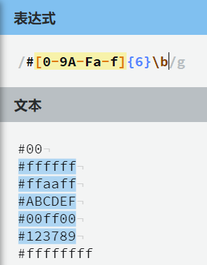
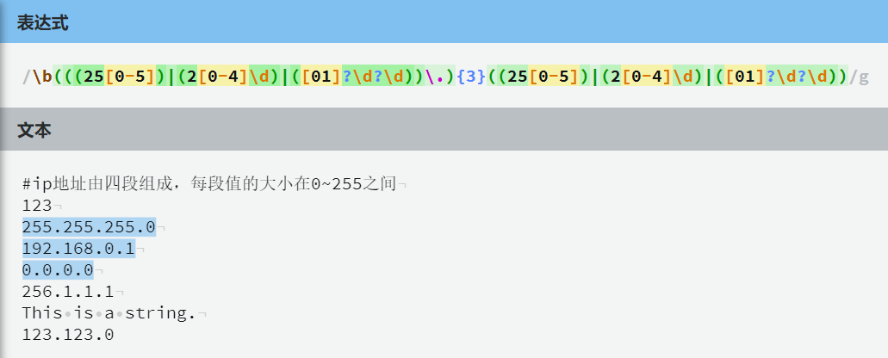

# 正则表达式

### 一、限定符

- `?`：代表前面一个字符可能出现 0 次或 1 次，即可有可无[^注1]

- `*`：代表前面一个字符可能出现 0 次或任意多次，相当于`{0,}`（默认为贪婪匹配，若使用`*?`默认为懒惰匹配）[^注2]

- `+`：代表前面一个字符出现 1 次以上，相当于`{1,}`（默认为贪婪匹配，若使用`+?`默认为懒惰匹配）

- `{}`：

  > {a}：表示前面一个字符出现 a 次
  >
  > {a,b}：表示前面一个字符出现的次数为 a 到 b 之间
  >
  > {a,}：表示前面一个字符出现 a 次以上

[^注1]: 若想要使用限定符匹配多个字符，而不仅仅是前面一个字符。则可以使用`()`将要匹配的多个字符包裹起来
[^注2]: 贪婪匹配：尽可能多地匹配字符；懒惰匹配：尽可能少地匹配字符

### 二、逻辑运算符

- `A|B`：或运算符，表示 A 或 B
- `^A`：表示 A 取反

### 三、字符组

- `[]`：字符组，允许匹配一组可能出现的字符

  > `[abc]`：表示待匹配的字符只能取自于 abc
  >
  > `[a-z]`：表示所有的小写字母[^注3]
  >
  > `[a-zA-Z]`：表示所有的字母
  >
  > `[a-zA-Z0-9]`：表示所有的字母与数字
  >
  > `[^a]`：表示除 a 外的所有字符

  [^注3]: `-`表示区间

### 四、元字符

- `\d`：数字字符，等同于`[0-9]`
- `\w`：单词字符，等同于`[0-9A-Za-z_]`
- `\s`：空白字符，表示空格、Tab 字符（制表符）和换行符
- `\D`：非数字字符，等同于`[^0-9]`
- `\W`：非单词字符，等用于`[^0-9A-Za-z_]`
- `\S`：非空白字符
- `\b`：匹配单词边界（如：`\bcode\b`相当于匹配完整的单词 code，而不是其它单词的子串）
- `.`：非换行符
- `^`：匹配行首（如：`^a`表示匹配行首为 a）
- `$`：匹配行尾（如：`a$`表示匹配行尾的 a）

### 五、特殊字符

- `\`表示转义字符，如果某个字符本身在正则表达式中有含义，则可以使用`\字符`的方式代替它字符本身

  > 示例：`-`表示区间，则`\-`表示短横线

### 六、分组

- 分组的作用是为了捕获数据

- `(表达式)`：捕获分组

- 在分组中我们可以使用逻辑或（`|`）来进行匹配

- `(?:表达式)`：非捕获分组，将不会捕获数据

- 分组的回溯引用

  > 我们可以使用`\数字`来获取之前捕获到的数据，第一次捕获的数据使用`\1`的引用，以此类推

### 七、环视（预搜索）

#### ①：正向先行断言

- `(?=表达式)`：表示所在位置的右侧必须能匹配表达式，且不会捕获到表达式内容

#### ②：反向先行断言

- `(?!表达式)`：表示所在位置的右侧必须不能匹配表达式，且不会捕获到表达式内容

#### ③：正向后行断言

- `(?<=表达式)`：表示所在位置的左侧必须能匹配表达式，且不会捕获到表达式内容

#### ④：反向后行断言

- `(?<!表达式)`：表示所在位置的左侧必须不能匹配表达式，且不会捕获到表达式内容

### 八、实例

> 匹配 RGB 值：
>
> ---
>
> 匹配 IP 地址：

### 九、教程

[教程连接 🔗（需翻墙）](https://github.com/ziishaned/learn-regex/tree/master/translations)

[PHP正则表达式](https://www.cnblogs.com/rxbook/p/10912829.html)

### 十、用法

在**JavaScript**或**PHP/PCRE**中，使用正则表达式的格式如下——

> /正则表达式语句/[正则标识]
>
> ---
>
> 正则标识的介绍：
>
> `i`：忽略大小写，让正则表达式对大小写不敏感
>
> `g`：全局搜索，保留上次匹配结果的位置，允许子序列从上次匹配的结果继续搜索。如果没有全局(`g`)标识, 后面的查询会返回相同的结果。
>
> `m`：当启用 multiline标识时，使用起始和结尾锚（**^** 和 **$**）会匹配到行首和行尾, 而不是整个字符串的头部和尾部。
>
> `u`：当启用Unicode标识时，你可以按`\x{FFFFF}`格式转义Unicode字符。
>
> `y`：只会从lastIndex位置开始匹配，且如果设置了全局标识(`g`）的话会被忽略。
>
> `s`：启用后点（`.`）会匹配任何字符，包括换行符

